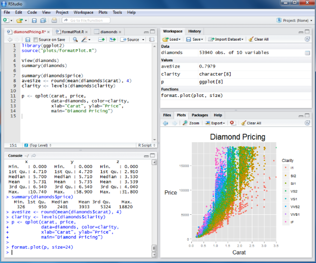
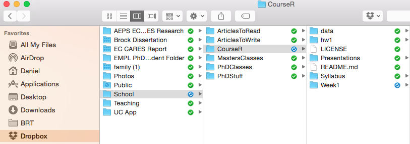
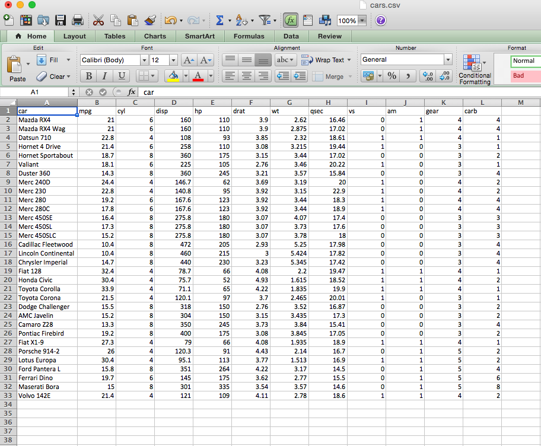
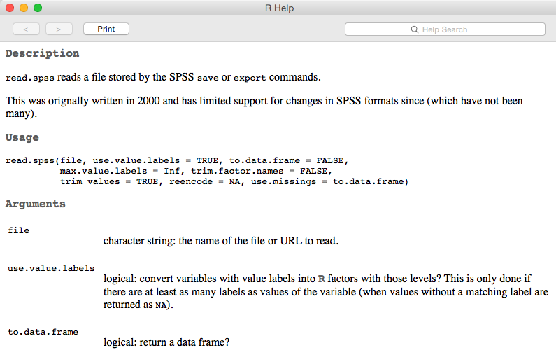

## Before we get started....
# Scheduling

```{r, echo = FALSE}
weeks <- paste("Week", seq(1, 3.5, .5))
w1 <- as.Date("10/02/15", format = "%m/%d/%y")
dates <- seq(w1, w1+(14*5), 14)

classes <- data.frame(Week = weeks, Date = dates, 
                      Time = rep("9-11 am", length(dates)))
knitr::kable(classes)
```
<br>
<span style="color:red" > Reschedule: 2015-11-27  </span>

--- &twocol
*** =left
## Welcome to R

```{r setup, include = FALSE}
# Note, this needs to be run manually before running slidify()
knitr::opts_knit$set(root.dir = "/Users/Daniel/Dropbox/Teaching/CourseR/")
```

```{r, echo = FALSE}
curve(x^3, from = -50, to = 50, lty = 3, col = "cadetblue3", lwd = 3,
	axes = FALSE, xlab = "Time", ylab = "Learning", 
	main = "The R Learning Curve (as I see it)")
axis(1, at = seq(-50, 50, 10),  labels = seq(0, 100, 10))
axis(2, at = seq(-1e5, 1e5, 2e4),  labels = seq(0, 101, 10))
```

*** =right
* Moving from SPSS to R is a substantial shift 
* It will take time to get used to a code-based interface 
* It will take time to shift the way you think about data 
* Be patient with yourself.

---- &twocol
## Overview of this course
*** =left
### Basic philosophy
* Part art, part science, part technical details
  - Analogy to songwriting: tools vs process
* The only way to **truly** become proficient at the art, is through doing.
  - you learn from me, I learn from you
* This course is about jumping into a whole new framework for the processing,
  analysis, and visualization of data. It's meant to be hard. It hopefully will
  also be rewarding.
* Mostly, this class is about a tool, R, rather than the art of data analysis

*** =right

<div align = "center">

</div>

----
## Course structure
* Weekly homeworks (graded on a completion basis)
* Daily 
	- first ~30 minutes: review previous week's homework
	- Lecture (with some interactive pieces)
  - Discuss next homework
	- Lab (work in small groups or individually to address a particular task)


---- &twocol
## Overview of Today

*** =left
* House cleaning
  + Text editors/R environments
  + *git* and *github*
* Very basics of R
  + The R environment
  + Object assignment
  + Vectors and matrices
  	  - subsetting
  + Directory management
  + Reading and writing data
  + Data frames
  	  - subsetting

*** =right
* Introduction to R Markdown
  + Text vs code chunks, headers, etc.
  + html vs PDF output
      - `knitr` and `knit2html`
  + Overview of homework

----- &twocol
## Logistics: Enviornment
Find an environment that works for you  

*** =left


*** =right



------
## Logistics: git
* Install *git*
  - https://git-scm.com/downloads
  - Optional: Install *git* GUI (might be easier, but 
    you're on your own here)


----
## Why git?

* Version control
    + "A system that records changes to a file or set of files over time so 
      that you can recall specific versions later"
    + Great for working on code collaboratively: track changes others have made
      (including who made the change), accept/reject them, etc. 
    + Also allows you to revert to previous versions if some small change has
      cascading deleterious effects.
    + "Check out" a repository, commit some changes, push it to the repository.

* All you'll ever need to know on *git* and then some: https://git-scm.com/book/en/v2


----
## A tiny bit of background on git
# Three states 
* Committed: data are safely stored in your *local* database 
* Modified: the file has been changed, but not committed 
* Staged: the modified file has been marked for commit


------
## Logistics: Course repository
* *github*  
  - https://github.com/DJAnderson07/CourseR
* clone the repository

<div align = "left">

</div>

----- &twocol
## Cloning without a GUI 
*** =left
* Open terminal or Windows Command prompt
* Change directory via `cd` (mac) or `CD` (windows) to where you want the course
  materials saved on your local hard drive
* Use `git  clone` to clone the repository

<div align = "center">

</div>
  
*** =right
`cd [directory]`

`git  clone`
<br>
https://github.com/DJAnderson07/CourseR.git




----
## Typical git process
* Navigate to the git folder using `cd` (or `CD`)
* Use `git status` to see if any changes have been made
* Use `git pull` to update your folder with all the recent changes

I will be sending emails periodically asking you to update the folders. For at 
  least the first first few times, I will also give explicit instructions to get
  your repository up to date.

<div align = "center">

</div>

----
## Let's do it!
Clone the course repository onto your local hard drive

```
cd PATH
git clone https://github.com/DJAnderson07/CourseR.git
```

------
## Finally... Onto R
R as a big calculator

```{r}
3 + 2
```

```{r}
(1/-(3/2)^2) / 2^-1/9
```


------ &twocol

*** =left

# Object Assignment

```{r}
a <- 3
b <- 2
a + b
a / (a + b)
```

*** =right

# Object re-assignment

```{r}
a <- 3
a
a <- 7
a
```

------ &twocol
## Object Assignment (continued)
*** =left
Objects can be of a variety of types, which we'll talk about 
  much more starting next week. But here are just a few

```{r}
string <- "Hello world!"
logical <- TRUE
double <- 3.2587021
Integer <- 6
```
*** =right
In this case, we can't exactly do arithimetic with all of these. 
  For example

```{r, error = TRUE}
string + double
```
But, these objects can be extremely useful in programming, as we
  will see.


------
## Playing a trick on Shawn
Object assignment can be helpful to play a trick on somebody (this is one I 
  actually did with our friend from Ohio).
  
```{r}
Ducks <- 2
Buckeyes <- 1
```
Then clear the console, so they can't see the code you've previously written.

------ bg:url(/Users/Daniel/Dropbox/Teaching/CourseR/Weeks/Week1/assets/img/fightingduck.jpg)

```{r}
Ducks > Buckeyes
Ducks < Buckeyes
Buckeyes > Ducks
```

---- &twocol
## R Environment

*** =left

# R functions
* Anything that carries out an operation in R is a function, even `+`. 
* Functions (outside of primitive functions) are preceded by `()`
    + e.g., `sum()`, `lm()`

*** =right

# Getting help
* `?` is your best friend 
    + e.g., `?lm` will tell you all the arguments for the `lm function
* Google is your other best friend
    + If the documentation from `?` is too confusing (often the case), try 
      google.
* Other good websites
    + http://stackoverflow.com
    + Resource list: 
          - http://www.ats.ucla.edu/stat/r/
    + Mailing lists: 
          - https://stat.ethz.ch/mailman/listinfo/r-help
    

---- &twocol
## R Packages
An R package is a suite of functions generally organized around a common theme.

*** =left

* Examples
    + `stringr`
        - Functions to make working with string variables more 
          simplistic and potentially efficient
    + `lme4`
        - Functions for Linear Mixed Effects Regression modeling 
    +  `ggplot2`
        - Wrapper functions for the base graphics to quickly produce complex 
          plots

*** =right

* As of this writing (09-30-2015), there are 7,239 packages available 
  through CRAN.
    + These can all be installed via `install.packages("packageName")`

* Countless other packages on github, personal websites, etc. Often come with 
  installation instructions.
    + My `r2Winsteps` package

* We will be using multiple packages throughout the course
* You will write your own (small) package by the end of the course

---- &twocol
## Vectors

# Two global rules for R: 

1. Anything that carries out an operation is a function, even `+`. 
2. Essentially every object in R can be reduced to a vector, or set of vectors.

*** =left

```{r}
is.vector(Ducks)
```
* The object `Ducks` is a vector, of length one
* So what is a vector?
  - essentially equivalent to the math definition
* <span style="color:blue" > A vector of dimension **n** is an ordered 
  collection of *n* elements, which are called components. </span>
  [math.com](http://www.math.com/tables/oddsends/vectordefs.htm)

*** =right
# Column Vector
$$
\begin{equation*}
 \qquad \begin{bmatrix}
    p_{1} \\\
    p_{2} \\\
    \vdots \\\
    p_{n}
  \end{bmatrix}
\end{equation*}
$$

# Row Vector

$$
\begin{equation*}
 \qquad \begin{bmatrix}
    p_{1} & p_{2} & \ldots & p_{n}
  \end{bmatrix}
\end{equation*}
$$

* Note that a vector of length one is typically referred to as a **scalar**

----
## Creating vectors
$$
\begin{equation*}
 \qquad \begin{bmatrix}
    1 & 2 & 3
  \end{bmatrix}
\end{equation*}
$$

```{r}
numVec <- c(1, 2, 3)
numVec
```

$$
\begin{equation*}
 \qquad \begin{bmatrix}
    A & B & C
  \end{bmatrix}
\end{equation*}
$$

```{r}
letVec <- c("A", "B", "C")
letVec
```
* `c()` function, which stands for **concatenate** or **combine**. 
* Perhaps the most common function in all of R

---- &twocol
## Matrices
*** =left
* Technically - a vector with a dimension attribute
* Conceptually - vectors of the same length bound together


$$
\begin{equation*}
  \textbf{M} = \qquad 
  \begin{bmatrix}
    p_{11} & p_{12} & \ldots
    & p_{1n} \\
    p_{21} & p_{22} & \ldots
    & p_{2n} \\
    \vdots & \vdots & \ddots
    & \vdots \\
    p_{m1} & p_{m2} & \ldots
    & p_{mn}
  \end{bmatrix}
\end{equation*}
$$


*** =right
* Matrices can be constructed by the conceptual method

```{r}
v1 <- c(10, 11, 12, 13)
v2 <- c(20, 21, 22, 23)
v3 <- c(30, 31, 32, 33)

mat <- matrix(c(v1, v2, v3), 
	nrow = 3, ncol = 4, byrow = TRUE)
mat
```

----
## More on constructing matrices

```{r, eval = FALSE}
?matrix
```


---- &twocol
## `byrow` or `bycol`?
*** =left

```{r}
matRow <- matrix(c(v1, v2, v3), 
	nrow = 3, ncol = 4, byrow = TRUE)
matRow
```
```{r}
matCol <- matrix(c(v1, v2, v3), 
	nrow = 3, ncol = 4, byrow = FALSE)
matCol
```
*** =right

```{r}
v1 <- c(10, 11, 12, 13)
v2 <- c(20, 21, 22, 23)
v3 <- c(30, 31, 32, 33)
```

---- &twocol
## One final note (for now)
*** =left
* Vectors can be entered directly into the matrix function, but they still need
  to be entered as a vector or group of vectors

```{r}
matRow <- matrix(c(
		c(10, 11, 12, 13), 
		c(20, 21, 22, 23),
		c(30, 31, 32, 33)
		), 
	nrow = 3, ncol = 4, byrow = TRUE)
matRow
```
*** =right

```{r}
matRow <- matrix(c(
                   10, 11, 12, 13, 
				   20, 21, 22, 23,
				   30, 31, 32, 33
					), 
	nrow = 3, ncol = 4, byrow = TRUE)
matRow
```
* Note again, the importance of the `byrow` argument

---- &twocol
## Check-in

*** =left

Which snippets of code will produce the matrix below

$$
\begin{equation*}
  \textbf{mat} = \qquad 
  \begin{bmatrix}
    23 & 41 & 18 & 27 \\
    16 & 11 & 72 & 29 \\
    18 & 51 & 32 & 63 \\
  \end{bmatrix}
\end{equation*}
$$

*** =right

```{r}
A <- matrix(c(
           23, 41, 18, 27, 
           16, 11, 72, 29,
           18, 51, 32, 63), 
  nrow = 3, ncol = 4)

B <- matrix(c(
           c(23, 41, 18, 27), 
           c(16, 11, 72, 29),
           c(18, 51, 32, 63)
           ), 
  nrow = 3, ncol = 4, byrow = TRUE)

C <- matrix(c(
          c(23, 16, 18), 
          c(41, 11, 51),
          c(18, 72, 32),
          c(27, 29, 63)
          ), 
  nrow = 3, ncol = 4)
```

----
## Your turn
Produce the following matrix and vector. 
$$
\begin{equation*}
  \textbf{m} = \qquad 
  \begin{bmatrix}
    67 & 11 & 10 \\
    44 & 22 & 33 \\
    39 & 94 & 85 \\
    49 & 6 & 12 \\
    22 & 86 & 61 \\
  \end{bmatrix}
\end{equation*}
$$

$$
\begin{equation*}
  \textbf{v} = \qquad 
  \begin{bmatrix}
    11 & 22 & 33 & 44 & 55 \\
  \end{bmatrix}
\end{equation*}
$$

<br>
Now add them together. What do you get?

<span style="color:gray" > (You can work with a partner) </span>

----
```{r}
c1 <- c(67, 44, 39, 49, 22)
c2 <- c(11, 22, 94, 6, 86)
c3 <- c(10, 33, 85, 12, 61)

m <- matrix(c(c1, c2, c3), ncol = 3)
v <- c(11, 22, 33, 44, 55)

v + m
```

----
## Before we get too far... A note on syntax
* Just like there are rules of writing, there are generally accepted guidelines
  for writing code to make it more readable. For example

```{r, eval = FALSE}
matRow <- matrix(c(
           10, 11, 12, 13, 
           20, 21, 22, 23,
           30, 31, 32, 33
          ), 
  nrow = 3, ncol = 4, byrow = TRUE)
```
Is more readable, and easy to understand than

```{r}
matRow<-matrix(c(10,11,12,13,20,21,22,23,30,31,32,33),nrow=3,ncol=4,byrow=TRUE)
```

----
## The grammar of syntax

* Proper spacing and indentation is *critical* for code to be easily 
  interpretable.
* After you get used to applying the rules, poorly formatted code is like nails
  on a chalkboard


----
## Style guide
**Please** review a style guide, and follow those protocols religiously

* I recommend starting with Wickham's http://adv-r.had.co.nz/Style.html 
    + It's short (will take < 20 minutes to go through)

* Will make both our lives easier


---- .segue
# Subsetting Vectors and Matrices

---- &twocol
## Subsetting vectors
*** =left

```{r}
v1 <- c(11, 12, 13, 14, 15,
	    16, 17, 18, 19, 20)
```
* Indexing
  - select the fifth element 

```{r}
v1[5]
```
* Exclude the fifth element

```{r}
v1[-5]
```

*** =right
* select the 7th - 10th elements

```{r}
sevenToTen <- 7:10
sevenToTen
v1[sevenToTen]
v1[7:10]
```
*** =right

---- 
## Subsetting vectors (continud)

```{r}
v1 <- c(11, 12, 13, 14, 15, 16, 17, 18, 19, 20)
```
* Logical
  - select elements greater than 13

```{r}
gt13 <- v1 > 13
gt13
v1[gt13]
```

---- &twocol
## Subsetting vectors (continud)

```{r}
v1 <- c(11, 12, 13, 14, 15, 16, 17, 18, 19, 20)
```
*** =left
* Logical
  - select odd elements

```{r}
odd <- seq(from = min(v1), 
           to = max(v1), 
           by = 2)
odd
```
Note that the above code assumes the lowest value is odd (i.e., this isn't 
  great code, but illustrates the principle)

*** =right

```{r}
select <- v1 %in% odd
select
v1[select]
```

---- &twocol
## Alternatives for selecting odd elements (indexing)

*** =left

```{r}
v1 <- c(11, 12, 13, 14, 15, 
        16, 17, 18, 19, 20)
```

* Odd by element location

```{r}
oddLoc <- seq(from = 1, 
              to = length(v1), 
              by = 2)
oddLoc
v1[oddLoc]
```

*** =right

```{r}
v1[c(TRUE, FALSE)]
```

The above code illustrates the principle of *recycling*, which we'll discuss 
  more in Week 3.

----
## Your turn

* Create the following vector

$$
\begin{equation*}
  \textbf{v} = \qquad 
  \begin{bmatrix}
    18 & 16 & 13 & 35 & 2 & 17 & 92 & 4 \\
  \end{bmatrix}
\end{equation*}
$$

Subset the vector by:
* Selecting the first 3 values
* Removing the last two values (somewhat tricky)
* Values greater than 15

----
```{r}
v <- c(18, 16, 13, 35, 2, 17, 92, 4)
```
Selecting the first 3 values

```{r}
v[1:3]
```

Removing the last two values

```{r, eval = FALSE}
v[-c(7:8)]
v[-7:-8]
```
```{r, echo = FALSE}
v[-c(7:8)]
```

Values greater than 15

```{r}
v[v > 15]
```


---- &twocol
## Subsetting Matrices

*** =left

```{r, echo = FALSE}
mat <- matrix(c(10, 11, 12, 13, 
				20, 21, 22, 23,
				30, 31, 32, 33
					), 
	nrow = 3, ncol = 4, byrow = TRUE)
```
* indexing
  - Matrices can be subset by using `[]` with the same conventions as 
    mathematical matrices, i.e.,
    `[row , column]`.

    *** 

$$
\begin{equation*}
  \textbf{mat} = \qquad 
  \begin{bmatrix}
    10 & 11 & 12 & 13 \\
    20 & 21 & 22 & 23 \\
    30 & 31 & 32 & 33 \\
  \end{bmatrix}
\end{equation*}
$$


*** =right

* Select the third element of the second column

```{r}
mat[3,2]
```

* Select the second element of the fourth column

```{r}
mat[2,4]
```

---- &twocol
## Subsetting Matrices (continued)
*** =left
#### Select an entire row: Leave the column indicator blank

* Select the entire second row

```{r}
mat[2, ]
```
$$
\begin{equation*}
  \textbf{mat} = \qquad 
  \begin{bmatrix}
    10 & 11 & 12 & 13 \\
    20 & 21 & 22 & 23 \\
    30 & 31 & 32 & 33 \\
  \end{bmatrix}
\end{equation*}
$$

*** =right
#### Select an entire column: Leave the row indicator blank

* Select the entire third column

```{r}
mat[ ,3]
```

---- &twocol
## Subsetting Matrices (continued)
*** =left
* The return from subsetting a matrix is a vector, which can also be
  subset.

```{r} 
column3 <- mat[ ,3]
column3
```
* select the second element of the new vector

```{r}
column3[2]
```
*** =right

* Alternatively

```{r}
mat[ ,3][2]
```
... which is the same as

```{r}
mat[2,3]
```

$$
\begin{equation*}
  \textbf{mat} = \qquad 
  \begin{bmatrix}
    10 & 11 & 12 & 13 \\
    20 & 21 & 22 & 23 \\
    30 & 31 & 32 & 33 \\
  \end{bmatrix}
\end{equation*}
$$


----
## Additional arguments

* You can avoid data being reduced to vectors by using the options `drop = FALSE`
  argument

```{r}
mat[ ,2, drop = FALSE]
```

* Use a vector to select multiple rows/columns

```{r}
col1_3 <- c(1,3)
mat[ ,col1_3]
```

---- &twocol
## Subsetting Matrices (continued)
### Logical

*** =left

```{r}
log1 <- mat > 13 & mat < 23
log1
mat[log1]
```
$$
\begin{equation*}
  \textbf{mat} = \qquad 
  \begin{bmatrix}
    10 & 11 & 12 & 13 \\
    20 & 21 & 22 & 23 \\
    30 & 31 & 32 & 33 \\
  \end{bmatrix}
\end{equation*}
$$

*** =right

```{r}
log2 <- (mat > 13 & mat < 23) | 
	 	(mat > 30 & mat < 33)
log2
mat[log2]
```
Note the odd order, because the subsetting is occuring by column, rather than
  row.

----
## Your Turn
Create the following matrix:

$$
\begin{equation*}
  \textbf{m} = \qquad 
  \begin{bmatrix}
    18 & 32 & 11 & 41 & 73 \\
    61 & 47 & 22 & 87 & 63 \\
    44 & 52 & 23 & 42 & 77 \\
    23 & 17 & 5 & 72 & 83 \\
  \end{bmatrix}
\end{equation*}
$$

Subset the mmatrix by:

* Selecting the third column
* Excluding the second column
* Selecting the third and fifth elements from the second row (somewhat tricky)
* Selecting values greater than 25
* Create a vector that is the sum of the first and fourth rows

----
```{r}
m <- matrix(c(
    18, 32, 11, 41, 73,
    61, 47, 22, 87, 63,
    44, 52, 23, 42, 77,
    23, 17, 5, 72, 83
    ), 
  byrow = TRUE, ncol = 5
)
```
Select the third column

```{r}
m[ ,3]
```

Exclude the second column

```{r}
m[ ,-2]
```

----

Select third and fifth elements from the second row

```{r}
m[2,c(3,5)]
```

Select values greater than 25

```{r}
m[m > 25]
```

Create a vector that is the sum of the first and fourth rows

```{r}
m[1, ] + m[4, ]
```


---- &twocol
## Data structures (very briefly)
*** =left
* Vectors
* Matrices
* Data frames
  - to be discussed momentarily
* others to be discussed later

*** =right
* All data stored in vectors and matrices must be of the same **type**
* Data frames are more flexible (more like what you would expect in SPSS). All
  data within a specific **column** must be the same type, but types can differ
  between columns (not true of matrices).
* All this will be discussed in much greater detail starting next week.

---- .segue

# Getting data into R 

----
## Directory Management

What is a working directory?
  * Exactly what it sounds like--the directory from which R will work
  * Read and write files from and to this directory

Identify current working directory

```{r}
getwd()
```

------ 
## Looking into a working directory

What's in this directory? Two ways to find out:
* Navigate to the directory and take a look.
<div align = "left">

</div>

* Have R look for you

```{r}
list.files()
```
The `list.files()` function shows what R "sees".

------
## Navigating your directory quickly
* Change directory from current location to a nested folder

```{r, eval = FALSE}
setwd("./nested/folders")
```
Here the `.` is essentially a fill-in for `getwd()`. 
* Navigate back one folder

```{r}
setwd("..")
```
* Navigate back two folders

```{r}
setwd("../..")
```

------
## Reading Data into R
To read data into R, you must tell R where the data are located by either 
  changing the working directory, or by providing the full path. For 
  example

```{r}
setwd("/Users/Daniel/Dropbox/Teaching/CourseR/data/")
d <- read.csv("cars.csv")
```  
is equivalent to
```{r}
d <- read.csv("/Users/Daniel/Dropbox/Teaching/CourseR/data/cars.csv")
```
Also note that the shortcuts for changing directories can be used here too, 
  which can often increase efficiency.

----
## My advice
* Set your working directory to where you want to save all your data files.
* Move the data you are working with to that file, or to a nearby folder 
  e.g.,

```{r, results = "hide"}
"(../raw)"
```

----
## What data can be read into R?
* R can read multiple data files
  - text files (csv, tab delimited, pipe delimited, etc)
  - web pages
  - SPSS, SAS, etc. (via the `foreign` or `memisc` packages)
  - Excel (I have not had great success here, and typically just convert it to 
    csv first)
  - relational and non-relational databases (I have no experience here, but I 
    know it is possible)
  - Directly entered data
* Simple text files are typically the most straightforward

<span style="color:green; font-weight:bold">
Fairly good blog post: </span>
http://www.r-bloggers.com/importing-data-into-r-from-different-sources/

----
## Diving deeper into reading data with R
```{r, eval = FALSE}
?read.table
```
<div align = "left">

</div>

---- &twocol
## Important Arguments
*** =left
* `file`
  - name of file, including extension, in quotes
  - e.g. `"cars.txt"`
* `header` 
  - `read.table` defaults to `FALSE`
  - `read.csv` and others default to `TRUE`

*** =right
* `sep` 
  - `read.table` defaults to `""`
  - `read.csv` defaults to `","`
  - `read.delim` defaults to tab delimiter `"\t"`

* Others
  - `na.strings`
  - `skip`
  - `comment.char`
  - `stringsAsFactors`


---- &twocol
## Examples
*** =left

* Although csv files open in Excel, they are actually just text files

*** =right


----
## Examples

```{r}
getwd()
cars <- read.csv("./data/cars.csv")
```
* Use `head()` `tail()` and `str()` to check that the data were read in properly

```{r}
head(cars)
```

----
```{r}
tail(cars)
```

---- 

```{r}
str(cars)
```

----
## Learn more with `summary()`

```{r}
summary(cars)
```

---- &twocol
## A more complicated example
*** =left
* No column names
* pipe-delimited
* `NA` coded as 999
* `read.csv()` won't work here

*** =right
<div align = "left">

</div>


----
* `read.table()`
* Explicit calls to 
  - `sep`, `na`, and `col.names`

```{r}
trees <- read.table("./data/trees.txt", sep = "|", na = "999", 
	col.names = c("Girth", "Height", "Volume"))
head(trees)
```
* Note that the column names are defined as a vector, via `c`.

---- 
## Last example: SPSS


----
```{r}
library(foreign)
violence <- read.spss("./data/USViolentActs.sav", to.data.frame = TRUE)
head(violence)
```

---- &twocol
## More on reading SPSS files

*** =left

* It's a hassle
* Support is limited (and no longer being developed)
* Warnings are (for now) ignorable
* `foreign` package
* `to.data.frame = TRUE` is vital
* `Hmisc` package may be a better alternative (I haven't explored it much, and 
  generally try to avoid SPSS files)

*** =right

```{r, eval = FALSE}
?read.spss
```


----
## Your turn
In the repository you cloned earlier in class, there is a folder called "data".
Read in the following files
* longley.csv
* attitude.txt

<span style="color:gray" > (You can work with a partner) </span>

----
The longley file is a csv, with headers, and can be read in pretty simply:

```{r}
longley <- read.csv("./data/longley.csv")
head(longley)
```

----
The attitude file is a bit more tricky. It's tab separated. We can use either
  `read.table()` or `read.delim()`.

```{r}
att <- read.table("./data/attitude.txt", sep = "\t")
att <- read.delim("./data/attitude.txt")
head(att)
```

----
## Subsetting data frames
* Data frames can be subset in numerous ways, including indexing equivalent to 
  matrices

```{r}
head(cars)
```
* Select the first 10 rows of the 3rd column

```{r}
cars[1:10,3]
```

----
## `str()` gives us a hint at an alternative subsetting method

```{r}
str(cars)
```


----
## Selecting columns by name
The `$` operator can also be used to select columns
* Select the `mpg` variable/column

```{r}
cars$mpg
```

* Select the `cyl` variable/column

```{r}
cars$cyl
```

---- &twocol
## A brief pause...Why so much focus on subsetting?
*** =left
* Used constantly in applied analysis work
	- analyze specific columns within a dataframe
	- explore differences in on a variable by a factor
	- restrict the data (analytic sample as a subset of the full raw sample)

* Examples

```{r}
# Frequency of cylinders
table(cars$cyl)
```
*** =right

```{r fig.width = 6, fig.height = 4.5}
# plot the relation between horse
# power and miles per gallon
plot(cars$hp, cars$mpg)
```
Not the prettiest plot (and we'll make them prettier soon), but the subsetting
  allows us to select the columns we want for the plot.

---- &twocol
## A few more subsetting notes
*** =left
* Names can also be used within the `[]`, as long as they are supplied as a 
  string
* Multiple columns can be selected in this manner if a vector of names is 
  supplied
  - vectors are returned if you are using the `row , column` notation with a 
    single variable and you do not specifiy `drop = FALSE`
  - data frame maintained if only the names are supplied


* The following two lines of code are equivalent

```{r, eval = FALSE}
cars[c("mpg","cyl")]
cars[ ,c("mpg","cyl")]
```
*** =right
* As are these

```{r, eval = FALSE}
cars["mpg"]
cars[ ,"mpg", drop = FALSE]
```
* However, these are not

```{r, eval = FALSE}
cars["mpg"]
cars[ ,"mpg"]
```

---- &twocol
## Example

*** =left

```{r}
cars["mpg"]
```

*** =right

```{r}
cars[ ,"mpg"]
```

----
## Logical subsetting can also be used with data frames

```{r}
mpg25up <- cars$mpg > 25
cars[mpg25up, ]
```

```{r}
cars[cars$mpg > 25 & cars$gear == 5, ]
```

----
## How do these logical subsets work?

```{r}
cars$mpg > 25
cars$mpg > 25 & cars$gear == 5
```

----
## Final note on subsetting 
* The `subset()` function can be very useful for subsetting vectors, matrices, 
  or data frames

```{r, eval = FALSE}
?subset
```

<div align = "center">

</div>


---- &twocol
## Examples of `subset`
* `x` = object to subset
* `subset` logical vector
* `select` optionally used to select columns

*** =left

```{r}
subset(cars, 
	subset = mpg > 25, 
	select = c("model", "mpg", "hp"))
```

*** =right

```{r}
subset(cars, hp > 220)
```

--- .segue
# A Brief Intro to R Markdown

<div align = "right">

</div>

----
## YAML Front Matter

```
---
title: Example Markdown document
author: Daniel Anderson
date: "2015-09-17"
---
```


* Three dashes before and after the YAML fields
* Case sensitive
* Many other fields are possible.
  + For example, you may want to include an `output:` argument (`pdf_document`,
    `html_document`, `word_document`). Must be specified as it is rendered, if
    not supplied.


---- &twocol
## Headings and Lists

*** =left

```
# Level 1
## Level 2 
### Level 3 (etc.)
```

```
* Unordered list
  - inset
    + inset more
  - etc.

1. Ordered list
  a. blah blah
2. More stuff
```

*** =right


---- &twocol
## Code chunks

Start a code chunk with \`\`\`{r}, then produce some r code, then close the 
  chunk with three additional back ticks \`\`\`.

*** =left


```{r}
a <- 3
b <- 5

a + b * (exp(a)/b)
```

You can show code without evaluating it, using `eval = FALSE`. 


*** =right

Alternatively, you can evaluate the code without displaying it, using `echo = 
  FALSE`.


```{r, echo = FALSE, fig.width = 6, fig.height = 4}
data(mtcars)
with(mtcars, plot(mpg, hp, 
  xlab = "Miles Per Gallon", 
  ylab = "Horsepower",
  main = "Relation between Miles Per Gallon and Horsepower"))
```

-----
## Inline code

A single back tick followed by `r` prooduces inline code to be evaluated.

<div align = "center">

</div>
<br>

This is an example of inline code, where I want to refer to the sum of `a` and
  `b`, which is `r a + b`.


----- &twocol
## Rendering the document

*** =left

Through a text editor (e.g., SublimeText)

```{r, eval = FALSE}
install.packages("rmarkdown")
library(rmarkdown)
setwd("dir/to/Rmd/doc")
render("ExampleRMarkdown.Rmd", 
  "html_document")
```

Note that the document type need not be specified if `output:` is supplied in 
  the YAML front matter. 

*** =right

Through RStudio


----
## Final Product

<div align = "left">

</div>


