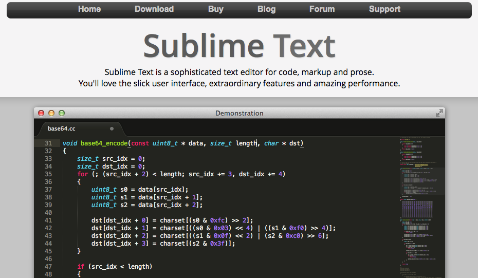
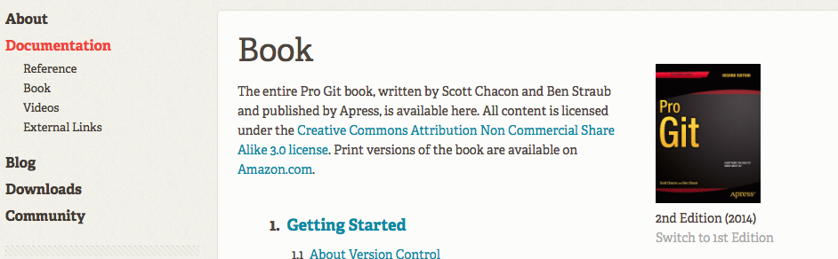
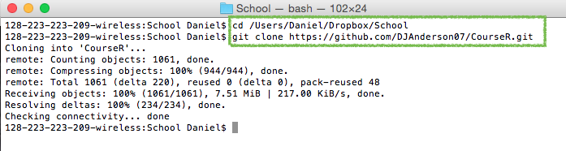
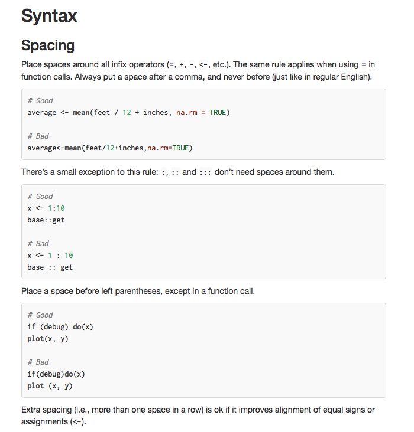

## Before we get started....
# Scheduling


|Week     |Date       |Time    |
|:--------|:----------|:-------|
|Week 1.1 |2015-10-02 |9-11 am |
|Week 1.2 |2015-10-16 |9-11 am |
|Week 2.1 |2015-10-30 |9-11 am |
|Week 2.2 |2015-11-13 |9-11 am |
|Week 3.1 |2015-11-27 |9-11 am |
|Week 3.2 |2015-12-11 |9-11 am |
<br>
<span style="color:red" > Reschedule: 2015-11-27  </span>

--- &twocol
*** =left
## Welcome to R


 

*** =right
* Moving from SPSS to R is a substantial shift 
* It will take time to get used to a code-based interface 
* It will take time to shift the way you think about data 
* Be patient with yourself.

---- &twocol
## Overview of this course
*** =left
### Basic philosophy
* Part art, part science, part technical details
  - Analogy to songwriting: tools vs process
* The only way to **truly** become proficient at the art, is through doing.
  - you learn from me, I learn from you
* This course is about jumping into a whole new framework for the processing,
  analysis, and visualization of data. We'll start from the foundation.
* It's meant to be hard. It hopefully will
  also be rewarding.
* Mostly, this class is about a tool, R

*** =right

<div align = "center">

</div>

----
## Course structure
* Weekly homeworks (graded on a completion basis)
* Daily 
	- first ~30 minutes: review previous week's homework
	- Lecture (with some interactive pieces)
  - Discuss next homework
	- Lab (work in small groups or individually to address a particular task)


---- &twocol
## Overview of Today

*** =left
* House cleaning
  + Text editors/R environments
  + *git* and *github*
* Very basics of R
  + The R environment
  + Object assignment
  + Vectors and matrices
  	  - subsetting
  + Directory management
  + Reading and writing data
  + Data frames
  	  - subsetting

*** =right
* Introduction to R Markdown
  + Text vs code chunks, headers, etc.
  + html vs PDF output
      - `knitr` and `knit2html`
  + Overview of homework

----- &twocol
## Logistics: Enviornment
Find an environment that works for you  

*** =left


*** =right


------
## Logistics: git
* Install *git*
  - https://git-scm.com/downloads
  - Optional: Install *git* GUI (might be easier, but 
    you're on your own here)


----
## Why git?

* Version control
    + "A system that records changes to a file or set of files over time so 
      that you can recall specific versions later"
    + Great for working on code collaboratively: track changes others have made
      (including who made the change), accept/reject them, etc. 
    + Also allows you to revert to previous versions if some small change has
      cascading deleterious effects.
    + "Check out" a repository, commit some changes, push it to the repository.

* All you'll ever need to know on *git* and then some: https://git-scm.com/book/en/v2



----
## A tiny bit of background on git
# Three states 
* Committed: data are safely stored in your *local* database 
* Modified: the file has been changed, but not committed 
* Staged: the modified file has been marked for commit


------
## Logistics: Course repository
* *github*  
  - https://github.com/DJAnderson07/CourseR
* clone the repository

<div align = "left">

</div>

----- &twocol
## Cloning without a GUI 
*** =left
* Open terminal or Windows Command prompt
* Change directory via `cd` (mac) or `CD` (windows) to where you want the course
  materials saved on your local hard drive
* Use `git  clone` to clone the repository

<div align = "center">

</div>
  
*** =right
`cd [directory]`

`git  clone`
<br>
https://github.com/DJAnderson07/CourseR.git




----
## Typical git process
* Navigate to the git folder using `cd` (or `CD`)
* Use `git status` to see if any changes have been made
* Use `git pull` to update your folder with all the recent changes

I will be sending emails periodically asking you to update the folders. For at 
  least the first first few times, I will also give explicit instructions to get
  your repository up to date.

<div align = "center">

</div>

----
## Let's do it!
Clone the course repository onto your local hard drive

```
cd PATH
git clone https://github.com/DJAnderson07/CourseR.git
```

------
## Finally... Onto R
R as a big calculator


```r
3 + 2
```

```
## [1] 5
```


```r
(1/-(3/2)^2) / 2^-1/9
```

```
## [1] -0.09876543
```


------ &twocol

*** =left

# Object Assignment


```r
a <- 3
b <- 2
a + b
```

```
## [1] 5
```

```r
a / (a + b)
```

```
## [1] 0.6
```

*** =right

# Object re-assignment


```r
a <- 3
a
```

```
## [1] 3
```

```r
a <- 7
a
```

```
## [1] 7
```

------ &twocol
## Object Assignment (continued)
*** =left
Objects can be of a variety of types, which we'll talk about 
  much more starting next week. But here are just a few


```r
string <- "Hello world!"
logical <- TRUE
double <- 3.2587021
Integer <- 6
```
*** =right
In this case, we can't exactly do arithimetic with all of these. 
  For example


```r
string + double
```

```
## Error in string + double: non-numeric argument to binary operator
```
But, these objects can be extremely useful in programming, as we
  will see.


------
## Playing a trick on Shawn
Object assignment can be helpful to play a trick on somebody (this is one I 
  actually did with our friend from Ohio).
  

```r
Ducks <- 2
Buckeyes <- 1
```
Then clear the console, so they can't see the code you've previously written.

------ bg:url(/Users/Daniel/Dropbox/Teaching/CourseR/Weeks/Week1/assets/img/fightingduck.jpg)


```r
Ducks > Buckeyes
```

```
## [1] TRUE
```

```r
Ducks < Buckeyes
```

```
## [1] FALSE
```

```r
Buckeyes > Ducks
```

```
## [1] FALSE
```

---- &twocol
## R Environment

*** =left

# R functions
* Anything that carries out an operation in R is a function, even `+`. 
* Functions (outside of primitive functions) are preceded by `()`
    + e.g., `sum()`, `lm()`

*** =right

# Getting help
* `?` is your best friend 
    + e.g., `?lm` will tell you all the arguments for the `lm function
* Google is your other best friend
    + If the documentation from `?` is too confusing (often the case), try 
      google.
* Other good websites
    + http://stackoverflow.com
    + Resource list: 
          - http://www.ats.ucla.edu/stat/r/
    + Mailing lists: 
          - https://stat.ethz.ch/mailman/listinfo/r-help
    

---- &twocol
## R Packages
An R package is a suite of functions generally organized around a common theme.

*** =left

* Examples
    + `stringr`
        - Functions to make working with string variables more 
          simplistic and potentially efficient
    + `lme4`
        - Functions for Linear Mixed Effects Regression modeling 
    +  `ggplot2`
        - Wrapper functions for the base graphics to quickly produce complex 
          plots

*** =right

* As of this writing (09-30-2015), there are 7,239 packages available 
  through CRAN.
    + These can all be installed via `install.packages("packageName")`

* Countless other packages on github, personal websites, etc. Often come with 
  installation instructions.
    + My `r2Winsteps` package

* We will be using multiple packages throughout the course
* You will write your own (small) package by the end of the course

---- &twocol
## Vectors

# Two global rules for R: 

1. Anything that carries out an operation is a function, even `+`. 
2. Essentially every object in R can be reduced to a vector, or set of vectors.

*** =left


```r
is.vector(Ducks)
```

```
## [1] TRUE
```
* The object `Ducks` is a vector, of length one
* So what is a vector?
  - essentially equivalent to the math definition
* <span style="color:blue" > A vector of dimension **n** is an ordered 
  collection of *n* elements, which are called components. </span>
  [math.com](http://www.math.com/tables/oddsends/vectordefs.htm)

*** =right
# Column Vector
$$
\begin{equation*}
 \qquad \begin{bmatrix}
    p_{1} \\\
    p_{2} \\\
    \vdots \\\
    p_{n}
  \end{bmatrix}
\end{equation*}
$$

# Row Vector

$$
\begin{equation*}
 \qquad \begin{bmatrix}
    p_{1} & p_{2} & \ldots & p_{n}
  \end{bmatrix}
\end{equation*}
$$

* Note that a vector of length one is typically referred to as a **scalar**

----
## Creating vectors
$$
\begin{equation*}
 \qquad \begin{bmatrix}
    1 & 2 & 3
  \end{bmatrix}
\end{equation*}
$$


```r
numVec <- c(1, 2, 3)
numVec
```

```
## [1] 1 2 3
```

$$
\begin{equation*}
 \qquad \begin{bmatrix}
    A & B & C
  \end{bmatrix}
\end{equation*}
$$


```r
letVec <- c("A", "B", "C")
letVec
```

```
## [1] "A" "B" "C"
```
* `c()` function, which stands for **concatenate** or **combine**. 
* Perhaps the most common function in all of R

---- &twocol
## Matrices
*** =left
* Technically - a vector with a dimension attribute
* Conceptually - vectors of the same length bound together


$$
\begin{equation*}
  \textbf{M} = \qquad 
  \begin{bmatrix}
    p_{11} & p_{12} & \ldots
    & p_{1n} \\
    p_{21} & p_{22} & \ldots
    & p_{2n} \\
    \vdots & \vdots & \ddots
    & \vdots \\
    p_{m1} & p_{m2} & \ldots
    & p_{mn}
  \end{bmatrix}
\end{equation*}
$$


*** =right
* Matrices can be constructed by the conceptual method


```r
v1 <- c(10, 11, 12, 13)
v2 <- c(20, 21, 22, 23)
v3 <- c(30, 31, 32, 33)

mat <- matrix(c(v1, v2, v3), 
	nrow = 3, ncol = 4, byrow = TRUE)
mat
```

```
##      [,1] [,2] [,3] [,4]
## [1,]   10   11   12   13
## [2,]   20   21   22   23
## [3,]   30   31   32   33
```

----
## More on constructing matrices


```r
?matrix
```


---- &twocol
## `byrow` or `bycol`?
*** =left


```r
matRow <- matrix(c(v1, v2, v3), 
	nrow = 3, ncol = 4, byrow = TRUE)
matRow
```

```
##      [,1] [,2] [,3] [,4]
## [1,]   10   11   12   13
## [2,]   20   21   22   23
## [3,]   30   31   32   33
```

```r
matCol <- matrix(c(v1, v2, v3), 
	nrow = 3, ncol = 4, byrow = FALSE)
matCol
```

```
##      [,1] [,2] [,3] [,4]
## [1,]   10   13   22   31
## [2,]   11   20   23   32
## [3,]   12   21   30   33
```
*** =right


```r
v1 <- c(10, 11, 12, 13)
v2 <- c(20, 21, 22, 23)
v3 <- c(30, 31, 32, 33)
```

---- &twocol
## One final note (for now)
*** =left
* Vectors can be entered directly into the matrix function, but they still need
  to be entered as a vector or group of vectors


```r
matRow <- matrix(c(
		c(10, 11, 12, 13), 
		c(20, 21, 22, 23),
		c(30, 31, 32, 33)
		), 
	nrow = 3, ncol = 4, byrow = TRUE)
matRow
```

```
##      [,1] [,2] [,3] [,4]
## [1,]   10   11   12   13
## [2,]   20   21   22   23
## [3,]   30   31   32   33
```
*** =right


```r
matRow <- matrix(c(
                   10, 11, 12, 13, 
				   20, 21, 22, 23,
				   30, 31, 32, 33
					), 
	nrow = 3, ncol = 4, byrow = TRUE)
matRow
```

```
##      [,1] [,2] [,3] [,4]
## [1,]   10   11   12   13
## [2,]   20   21   22   23
## [3,]   30   31   32   33
```
* Note again, the importance of the `byrow` argument

---- &twocol
## Check-in

*** =left

Which snippets of code will produce the matrix below

$$
\begin{equation*}
  \textbf{mat} = \qquad 
  \begin{bmatrix}
    23 & 41 & 18 & 27 \\
    16 & 11 & 72 & 29 \\
    18 & 51 & 32 & 63 \\
  \end{bmatrix}
\end{equation*}
$$

*** =right


```r
A <- matrix(c(
           23, 41, 18, 27, 
           16, 11, 72, 29,
           18, 51, 32, 63), 
  nrow = 3, ncol = 4)

B <- matrix(c(
           c(23, 41, 18, 27), 
           c(16, 11, 72, 29),
           c(18, 51, 32, 63)
           ), 
  nrow = 3, ncol = 4, byrow = TRUE)

C <- matrix(c(
          c(23, 16, 18), 
          c(41, 11, 51),
          c(18, 72, 32),
          c(27, 29, 63)
          ), 
  nrow = 3, ncol = 4)
```

----
## Your turn
Produce the following matrix and vector. 
$$
\begin{equation*}
  \textbf{m} = \qquad 
  \begin{bmatrix}
    67 & 11 & 10 \\
    44 & 22 & 33 \\
    39 & 94 & 85 \\
    49 & 6 & 12 \\
    22 & 86 & 61 \\
  \end{bmatrix}
\end{equation*}
$$

$$
\begin{equation*}
  \textbf{v} = \qquad 
  \begin{bmatrix}
    11 & 22 & 33 & 44 & 55 \\
  \end{bmatrix}
\end{equation*}
$$

<br>
Now add them together. What do you get?

<span style="color:gray" > (You can work with a partner) </span>

----

```r
c1 <- c(67, 44, 39, 49, 22)
c2 <- c(11, 22, 94, 6, 86)
c3 <- c(10, 33, 85, 12, 61)

m <- matrix(c(c1, c2, c3), ncol = 3)
v <- c(11, 22, 33, 44, 55)

v + m
```

```
##      [,1] [,2] [,3]
## [1,]   78   22   21
## [2,]   66   44   55
## [3,]   72  127  118
## [4,]   93   50   56
## [5,]   77  141  116
```

----
## Before we get too far... A note on syntax
* Just like there are rules of writing, there are generally accepted guidelines
  for writing code to make it more readable. For example


```r
matRow <- matrix(c(
           10, 11, 12, 13, 
           20, 21, 22, 23,
           30, 31, 32, 33
          ), 
  nrow = 3, ncol = 4, byrow = TRUE)
```
Is more readable, and easy to understand than


```r
matRow<-matrix(c(10,11,12,13,20,21,22,23,30,31,32,33),nrow=3,ncol=4,byrow=TRUE)
```

----
## The grammar of syntax

* Proper spacing and indentation is *critical* for code to be easily 
  interpretable.
* After you get used to applying the rules, poorly formatted code is like nails
  on a chalkboard


----
## Style guide
**Please** review a style guide, and follow those protocols religiously

* I recommend starting with Wickham's http://adv-r.had.co.nz/Style.html 
    + It's short (will take < 20 minutes to go through)

* Will make both our lives easier



---- .segue
# Subsetting Vectors and Matrices

---- &twocol
## Subsetting vectors
*** =left


```r
v1 <- c(11, 12, 13, 14, 15,
	    16, 17, 18, 19, 20)
```
* Indexing
  - select the fifth element 


```r
v1[5]
```

```
## [1] 15
```
* Exclude the fifth element


```r
v1[-5]
```

```
## [1] 11 12 13 14 16 17 18 19 20
```

*** =right
* select the 7th - 10th elements


```r
sevenToTen <- 7:10
sevenToTen
```

```
## [1]  7  8  9 10
```

```r
v1[sevenToTen]
```

```
## [1] 17 18 19 20
```

```r
v1[7:10]
```

```
## [1] 17 18 19 20
```
*** =right

---- 
## Subsetting vectors (continud)


```r
v1 <- c(11, 12, 13, 14, 15, 16, 17, 18, 19, 20)
```
* Logical
  - select elements greater than 13


```r
gt13 <- v1 > 13
gt13
```

```
##  [1] FALSE FALSE FALSE  TRUE  TRUE  TRUE  TRUE  TRUE  TRUE  TRUE
```

```r
v1[gt13]
```

```
## [1] 14 15 16 17 18 19 20
```

---- &twocol
## Subsetting vectors (continud)


```r
v1 <- c(11, 12, 13, 14, 15, 16, 17, 18, 19, 20)
```
*** =left
* Logical
  - select odd elements


```r
odd <- seq(from = min(v1), 
           to = max(v1), 
           by = 2)
odd
```

```
## [1] 11 13 15 17 19
```
Note that the above code assumes the lowest value is odd (i.e., this isn't 
  great code, but illustrates the principle)

*** =right


```r
select <- v1 %in% odd
select
```

```
##  [1]  TRUE FALSE  TRUE FALSE  TRUE FALSE  TRUE FALSE  TRUE FALSE
```

```r
v1[select]
```

```
## [1] 11 13 15 17 19
```

---- &twocol
## Alternatives for selecting odd elements (indexing)

*** =left


```r
v1 <- c(11, 12, 13, 14, 15, 
        16, 17, 18, 19, 20)
```

* Odd by element location


```r
oddLoc <- seq(from = 1, 
              to = length(v1), 
              by = 2)
oddLoc
```

```
## [1] 1 3 5 7 9
```

```r
v1[oddLoc]
```

```
## [1] 11 13 15 17 19
```

*** =right


```r
v1[c(TRUE, FALSE)]
```

```
## [1] 11 13 15 17 19
```

The above code illustrates the principle of *recycling*, which we'll discuss 
  more in Week 3.

----
## Your turn

* Create the following vector

$$
\begin{equation*}
  \textbf{v} = \qquad 
  \begin{bmatrix}
    18 & 16 & 13 & 35 & 2 & 17 & 92 & 4 \\
  \end{bmatrix}
\end{equation*}
$$

Subset the vector by:
* Selecting the first 3 values
* Removing the last two values (somewhat tricky)
* Values greater than 15

----

```r
v <- c(18, 16, 13, 35, 2, 17, 92, 4)
```
Selecting the first 3 values


```r
v[1:3]
```

```
## [1] 18 16 13
```

Removing the last two values


```r
v[-c(7:8)]
v[-7:-8]
```

```
## [1] 18 16 13 35  2 17
```

Values greater than 15


```r
v[v > 15]
```

```
## [1] 18 16 35 17 92
```


---- &twocol
## Subsetting Matrices

*** =left


* indexing
  - Matrices can be subset by using `[]` with the same conventions as 
    mathematical matrices, i.e.,
    `[row , column]`.

    *** 

$$
\begin{equation*}
  \textbf{mat} = \qquad 
  \begin{bmatrix}
    10 & 11 & 12 & 13 \\
    20 & 21 & 22 & 23 \\
    30 & 31 & 32 & 33 \\
  \end{bmatrix}
\end{equation*}
$$


*** =right

* Select the third element of the second column


```r
mat[3,2]
```

```
## [1] 31
```

* Select the second element of the fourth column


```r
mat[2,4]
```

```
## [1] 23
```

---- &twocol
## Subsetting Matrices (continued)
*** =left
#### Select an entire row: Leave the column indicator blank

* Select the entire second row


```r
mat[2, ]
```

```
## [1] 20 21 22 23
```
$$
\begin{equation*}
  \textbf{mat} = \qquad 
  \begin{bmatrix}
    10 & 11 & 12 & 13 \\
    20 & 21 & 22 & 23 \\
    30 & 31 & 32 & 33 \\
  \end{bmatrix}
\end{equation*}
$$

*** =right
#### Select an entire column: Leave the row indicator blank

* Select the entire third column


```r
mat[ ,3]
```

```
## [1] 12 22 32
```

---- &twocol
## Subsetting Matrices (continued)
*** =left
* The return from subsetting a matrix is a vector, which can also be
  subset.


```r
column3 <- mat[ ,3]
column3
```

```
## [1] 12 22 32
```
* select the second element of the new vector


```r
column3[2]
```

```
## [1] 22
```
*** =right

* Alternatively


```r
mat[ ,3][2]
```

```
## [1] 22
```
... which is the same as


```r
mat[2,3]
```

```
## [1] 22
```

$$
\begin{equation*}
  \textbf{mat} = \qquad 
  \begin{bmatrix}
    10 & 11 & 12 & 13 \\
    20 & 21 & 22 & 23 \\
    30 & 31 & 32 & 33 \\
  \end{bmatrix}
\end{equation*}
$$


----
## Additional arguments

* You can avoid data being reduced to vectors by using the options `drop = FALSE`
  argument


```r
mat[ ,2, drop = FALSE]
```

```
##      [,1]
## [1,]   11
## [2,]   21
## [3,]   31
```

* Use a vector to select multiple rows/columns


```r
col1_3 <- c(1,3)
mat[ ,col1_3]
```

```
##      [,1] [,2]
## [1,]   10   12
## [2,]   20   22
## [3,]   30   32
```

---- &twocol
## Subsetting Matrices (continued)
### Logical

*** =left


```r
log1 <- mat > 13 & mat < 23
log1
```

```
##       [,1]  [,2]  [,3]  [,4]
## [1,] FALSE FALSE FALSE FALSE
## [2,]  TRUE  TRUE  TRUE FALSE
## [3,] FALSE FALSE FALSE FALSE
```

```r
mat[log1]
```

```
## [1] 20 21 22
```
$$
\begin{equation*}
  \textbf{mat} = \qquad 
  \begin{bmatrix}
    10 & 11 & 12 & 13 \\
    20 & 21 & 22 & 23 \\
    30 & 31 & 32 & 33 \\
  \end{bmatrix}
\end{equation*}
$$

*** =right


```r
log2 <- (mat > 13 & mat < 23) | 
	 	(mat > 30 & mat < 33)
log2
```

```
##       [,1]  [,2]  [,3]  [,4]
## [1,] FALSE FALSE FALSE FALSE
## [2,]  TRUE  TRUE  TRUE FALSE
## [3,] FALSE  TRUE  TRUE FALSE
```

```r
mat[log2]
```

```
## [1] 20 21 31 22 32
```
Note the odd order, because the subsetting is occuring by column, rather than
  row.

----
## Your Turn
Create the following matrix:

$$
\begin{equation*}
  \textbf{m} = \qquad 
  \begin{bmatrix}
    18 & 32 & 11 & 41 & 73 \\
    61 & 47 & 22 & 87 & 63 \\
    44 & 52 & 23 & 42 & 77 \\
    23 & 17 & 5 & 72 & 83 \\
  \end{bmatrix}
\end{equation*}
$$

Subset the mmatrix by:

* Selecting the third column
* Excluding the second column
* Selecting the third and fifth elements from the second row (somewhat tricky)
* Selecting values greater than 25
* Create a vector that is the sum of the first and fourth rows

----

```r
m <- matrix(c(
    18, 32, 11, 41, 73,
    61, 47, 22, 87, 63,
    44, 52, 23, 42, 77,
    23, 17, 5, 72, 83
    ), 
  byrow = TRUE, ncol = 5
)
```
Select the third column


```r
m[ ,3]
```

```
## [1] 11 22 23  5
```

Exclude the second column


```r
m[ ,-2]
```

```
##      [,1] [,2] [,3] [,4]
## [1,]   18   11   41   73
## [2,]   61   22   87   63
## [3,]   44   23   42   77
## [4,]   23    5   72   83
```

----

Select third and fifth elements from the second row


```r
m[2,c(3,5)]
```

```
## [1] 22 63
```

Select values greater than 25


```r
m[m > 25]
```

```
##  [1] 61 44 32 47 52 41 87 42 72 73 63 77 83
```

Create a vector that is the sum of the first and fourth rows


```r
m[1, ] + m[4, ]
```

```
## [1]  41  49  16 113 156
```


---- &twocol
## Data structures (very briefly)
*** =left
* Vectors
* Matrices
* Data frames
  - to be discussed momentarily
* others to be discussed later

*** =right
* All data stored in vectors and matrices must be of the same **type**
* Data frames are more flexible (more like what you would expect in SPSS). All
  data within a specific **column** must be the same type, but types can differ
  between columns (not true of matrices).
* All this will be discussed in much greater detail starting next week.

----
## Lab
Start with the following matrix (which we created earlier)
$$
\begin{equation*}
  \textbf{m} = \qquad 
  \begin{bmatrix}
    18 & 32 & 11 & 41 & 73 \\
    61 & 47 & 22 & 87 & 63 \\
    44 & 52 & 23 & 42 & 77 \\
    23 & 17 & 5 & 72 & 83 \\
  \end{bmatrix}
\end{equation*}
$$

* Use three different methods to subset the matrix and obtain the following vector

$$
\begin{equation*}
  \textbf{v} = \qquad 
  \begin{bmatrix}
    52 & 42 & 77 \\
  \end{bmatrix}
\end{equation*}
$$
<br>
* First subset the matrix to get $\begin{bmatrix} 87 & 42 \end{bmatrix}$. Next, 
   create a new matrix using the following steps:
     + Drop the final column of matrix m
     + Add $\begin{bmatrix} 87 & 42 \end{bmatrix}$ to the second and fourth rows 
       (this will utilize recycling
   ). 

----
## Lab solutions: Question 1
A couple possible subsetting solutions 


```r
m[3, c(1,2,4,5)]
m[ ,c(1,2,4,5)][3, ]
m[3, m[3, ] > 40]
m[3, c(TRUE, TRUE, FALSE, TRUE, TRUE)]

m[3, ][ m[3, ] > 40 ]

subset(m, c(FALSE, FALSE, TRUE, FALSE), select = c(1,2,4,5))
```

----
## Lab solutions: Question 2
One possible method


```r
v <- m[c(2,3), 4]
v
```

```
## [1] 87 42
```

```r
m2 <- m[ ,-5]
m2[2, ] <-  v + m2[2, ]
m2[4, ] <-  v + m2[4, ]
m2
```

```
##      [,1] [,2] [,3] [,4]
## [1,]   18   32   11   41
## [2,]  148   89  109  129
## [3,]   44   52   23   42
## [4,]  110   59   92  114
```
