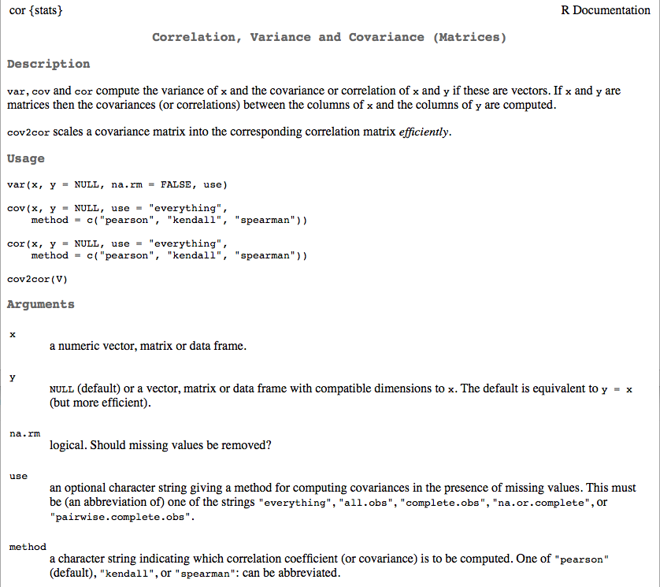
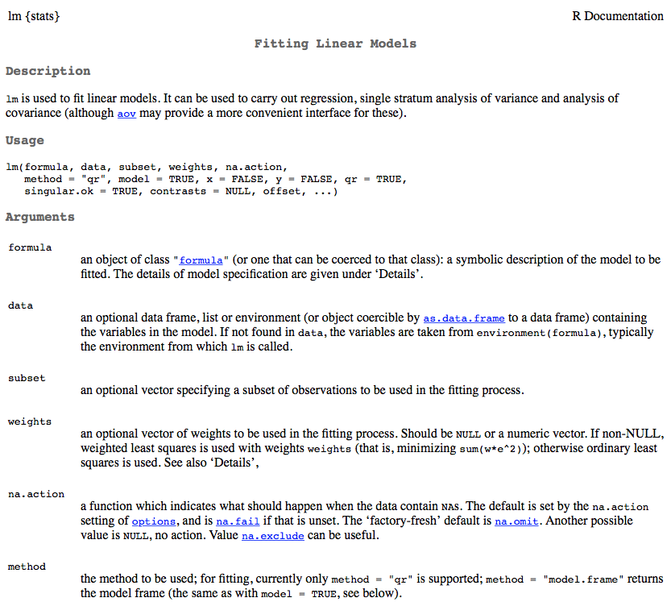
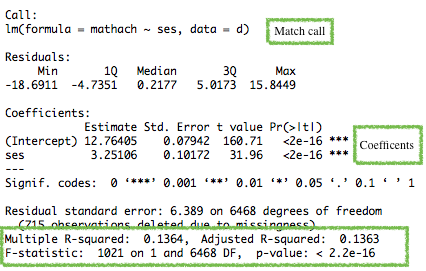

```{r setup, include = FALSE}
knitr::opts_knit$set(root.dir = "/Users/Daniel/Dropbox/Teaching/CourseR/")
```
## Agenda
Today is an effort to come up from the weeds a bit and walk through an applied
  example. Specifically we will
* Go through a complete (basic) example
  + process, plot, analyze, plot
* Look at correlations
* Explore linear regression modeling (very cursory)

# Readings
Gelman and Hill, Chapter 3

----
## Load Data
High School and Beyond

```{r}
library(foreign)
d <- read.spss("./data/HSB.sav", to.data.frame = TRUE)
head(d)
```

----
## About the HSB data

<span style="color:gray" > 
Our data file is a subsample from the 1982 High School and Beyond Survey and is 
  used extensively in Hierarchical Linear Models by Raudenbush and Bryk. The 
  data file, called hsb, consists of 7185 students nested in 160 schools. The 
  outcome variable of interest is the student-level (level 1) math achievement 
  score (mathach). The variable ses is the socio-economic status of a student 
  and therefore is at the student level. The variable meanses is the group-mean 
  centered version of ses and therefore is at the school level (level 2). The 
  variable sector is an indicator variable indicating if a school is public or 
  catholic and is therefore a school-level variable. There are 90 public schools 
  (sector=0) and 70 catholic schools (sector=1) in the sample.


Description from <br>
http://www.ats.ucla.edu/stat/hlm/seminars/hlm_mlm/608/mlm_hlm_seminar_v608.htm
 </span>


----
## Check out the data a bit

```{r}
summary(d)
```

----
## Evaluate the structure of the data

```{r}
str(d)
```

----
## What is this ses variable?
"a standardized scale constructed from variables measuring parental education,
occupation, and income" (http://www.upa.pdx.edu/IOA/newsom/mlrclass/ho_hsb.pdf)

<br>
So why doesn't it have a sd of 1?

```{r}
sd(d$ses)
```

Our dataset is a sample from the full dataset. So you can still interpret a 1
  unit change in the `ses` variable as a one standard deviation increase in the
  population.

----
## Evaluate `id`

```{r}
table(d$id) # Equivalent to SPSS Frequencies
```

---- &twocol
## Create new Student ID
*** =left
# Method 1
Use the rownames

```{r}
d$SID <- rownames(d)
head(d)
```
*** =right
# Method 2
Use some other arbitrary index

```{r}
d$SID <- seq(from = 1e2, 
	length.out = nrow(d), by = 8)
head(d)
```

----
## Rename `id` variable to `ScID`

```{r}
names(d)
names(d)[1] <- "ScID"
head(d)
```

----
## Reorder variables (house cleaning)

```{r}
d <- d[ ,c("SID", "ScID", "minority", "female", "ses", "mathach")]
head(d)
```
Alternatively, by index

```{r, eval = FALSE}
d <- d[ ,c(ncol(d), 1:(ncol(d) - 1))]
```
```{r}
c(ncol(d), 1:(ncol(d) - 1))
```

----
## Visualize relation among all variables

```{r}
pairs(d[ ,-c(1:2)])
```

----
## Get a better pairs plot
Look at the documentation for `pairs()` (then scroll down)

```{r, eval = FALSE}
?pairs
```


---- 
## Fancy pairs plot

# Run the functions from the documentation file

```{r}
panel.hist <- function(x, ...) {
    usr <- par("usr"); on.exit(par(usr))
    par(usr = c(usr[1:2], 0, 1.5) )
    h <- hist(x, plot = FALSE)
    breaks <- h$breaks; nB <- length(breaks)
    y <- h$counts; y <- y/max(y)
    rect(breaks[-nB], 0, breaks[-1], y, col = "cyan", ...)
}

panel.cor <- function(x, y, digits = 2, prefix = "", cex.cor, ...) {
    usr <- par("usr"); on.exit(par(usr))
    par(usr = c(0, 1, 0, 1))
    r <- abs(cor(x, y))
    txt <- format(c(r, 0.123456789), digits = digits)[1]
    txt <- paste0(prefix, txt)
    if(missing(cex.cor)) cex.cor <- 0.8/strwidth(txt)
    text(0.5, 0.5, txt, cex = cex.cor * r)
}
```

----

```{r}
pairs(d[ ,-c(1:2)], 
	lower.panel = panel.smooth, 
	diag.panel = panel.hist, 
	upper.panel = panel.cor)
```

---- .segue

# Exploring the relation between SES and Math Achievement


---- &twocol
## Individual Plots

*** =left

```{r, fig.width = 6, fig.height = 2.8}
hist(d$mathach)
hist(d$ses)
```

*** =right

```{r}
plot(d$ses, d$mathach)
```

---- &twocol
## Correlation

*** =left

Use the `cor()` function

```{r}
cor(d$ses, d$mathach)
```
<br>
And, as always, take a look at the documentation for `cor()`

*** =right


---- &twocol
## Missing data
For illustration purposes, lets randomly make some cases missing, and then try
  to estimate the relation between the variables again

*** =left
# Randomly 10% of assign cases to missing

```{r}
rand <- rbinom(length(d$ses), 1, .1)
head(rand)
head(rand == 1)
d$ses[rand == 1] <- NA
```
*** =right

```{r}
head(d)
```

---- &twocol
## Correlation

*** =left

```{r}
cor(d$ses, d$mathach)
```
This fails, because R doesn't know what to do with the missing data. Exclude
  those cases, and let's try again.

```{r}
temp <- na.omit(d)
head(temp)
```

*** =right

```{r}
cor(temp$ses, temp$mathach)
```
Alternatively, use the optional `use` argument

```{r}
cor(d$ses, d$mathach, 
	use = "complete.obs")
```

----
## Linear regression

```{r, eval = FALSE}
?lm
```


----
## Formula structure

```{r, eval = FALSE}
lm(outcome ~ predictor1 + predictor2 + predictorN)
```
Note that the above has an implicit intercept specification. It can be explicit 
  by

```{r, eval = FALSE}
lm(outcome ~ 1 + predictor1 + predictor2 + predictorN)
```

You can also suppress the estimation of the intercept

```{r, eval = FALSE}
lm(outcome ~ 0 + predictor1 + predictor2 + predictorN)
```

# Important additional arguments
* `data`: What data frame do the vectors come from?
* `subset`: Do you want to analyze only a subset of cases?
* `na.action`: How should missing values be handled?

----
## Modeling the relation between SES and Math

```{r, results = "hide"}
m1 <- lm(mathach ~ ses, data = d)
summary(m1)
```


----
## Alternative summary
The `arm` package (applied regression modeling) provides a lot of useful 
  functions. One simple one is just a different method for showing the summary 
  of a regression model, using the `display()` function.

```{r, eval = FALSE}
install.packages("arm")
library(arm)
display(m1, detail = TRUE)
```

```{r, echo = FALSE}
arm::display(m1, detail = TRUE)
```
* Note that significance is not printed by default. Use `detail = TRUE` to get 
  significance test.

---- &twocol
## Plot the relation and the model
* Two step process: First plot the relation, then overlay the regression line.

*** =left

```{r, eval = FALSE}
# Plot the relation
plot(d$ses, d$mathach)

# Overlay the regression line
abline(a = 12.76, b = 3.15, col = "blue")
```

*** =right

```{r, echo = FALSE}
# Plot the relation
plot(d$ses, d$mathach)

# Overlay the regression line
abline(a = 12.76, b = 3.15, 
	col = "blue")
```

---- &twocol
## Fit the model for females and males seperately

*** =left

```{r}
males <- lm(mathach ~ ses, 
	data = d, subset = female == 0)
display(males)
```
<br>
Note the differences between the parameter estimates. Might we want to consider
  an interaction?

*** =right

```{r}
females <- lm(mathach ~ ses, 
	data = d, subset = female == 1)
display(females)
```

---- &twocol
## Plotting male and female models

*** =left

```{r, fig.height = 6}
male_d <- subset(d, female == 0)
plot(male_d$ses, male_d$mathach)
abline(a = 13.49, b = 3.02, 
	col = "blue")
```

*** =right

```{r, fig.height = 6}
female_d <- subset(d, female == 0)
plot(female_d$ses, female_d$mathach)
abline(a = 12.07, b = 3.20, 
	col = "red")
```

----
## One final plot

We'll talk about this later, but R will (pretty much automatically) produce 
  plots to help evaluate model assumptions

```{r, fig.height = 5}
par(mfrow = c(2, 2))
plot(m1)
```

----
## Lab

* Read in the data file `ratebeer_beerjobber.txt`
* Find the correlation between `abv` and `score.overall`
* Fit a simple linear regression model, with `abv` predicting `score.overall`
* Plot the relation between `abv` (x-axis) and `score.overall` (y-axis)
  + Overlay the regression line

----
## Lab answers
Read in the data file `ratebeer_beerjobber.txt`

```{r}
d <- read.delim("./data/ratebeer_beerjobber.txt")
head(d)
```

----
## Lab answers (continued)
Find the correlation between `abv` and `score.overall`

```{r}
cor(d$abv, d$score.overall, use = "complete.obs")
```
Fit a simple linear regression model, with `abv` predicting `score.overall`

```{r}
m2 <- lm(score.overall ~ abv, data = d)
display(m2)
```

----
## Lab answers (continued)

Plot the relation between `abv` (x-axis) and `score.overall` (y-axis)
  Overlay the regression line

```{r, fig.height = 6}
plot(score.overall ~ abv, data = d)
abline(a = 27.97, b = 6.17, col = "blue")
```