---
title       : Basic plotting and routine functions
subtitle    : Week 2.2
author      : Daniel Anderson
job         : CourseR
framework   : io2012        # {io2012, html5slides, shower, dzslides, ...}
highlighter : highlight.js  # {highlight.js, prettify, highlight}
hitheme     : zenburn      # 
widgets     : [mathjax]            # {mathjax, quiz, bootstrap}
mode        : selfcontained # {standalone, draft}
knit        : slidify::knit2slides
--- &twocol

## Agenda

# Plotting basics
* Histograms and density plots
* Scatter plots
    + Controls: 
        - titles
        - line width, color, and type
        - point size, color, and type
        - x and y axis labels
        

----
## On to Today... Data: Beer!


----
## Load data


```r
d <- read.delim("./data/ratebeer_beerjobber.txt")
head(d)
```

```
##                                  name                 brewer
## 1                     Abbey Monks Ale Abbey Beverage Company
## 2                  Abbey Monks Tripel Abbey Beverage Company
## 3                     Abbey Monks Wit Abbey Beverage Company
## 4 Alameda Barn Owl Imperial Brown Ale    Alameda Brewing Co.
## 5         Alameda Black Bear XX Stout    Alameda Brewing Co.
## 6       Alameda El Torero Organic IPA    Alameda Brewing Co.
##                     style abv ratings score.overall score.by.style
## 1             Belgian Ale 5.2      96            50             49
## 2            Abbey Tripel 8.0       3            NA             NA
## 3 Belgian White (Witbier) 5.1      46            23             19
## 4               Brown Ale 7.9      13            74             81
## 5           Foreign Stout 6.8     172            94             76
## 6    India Pale Ale (IPA) 7.2      56            74             43
```

---- &twocol
## Histograms
Primary purpose of a histogram: See the distrbution of a variable

*** =left


```r
hist(d$abv)
```

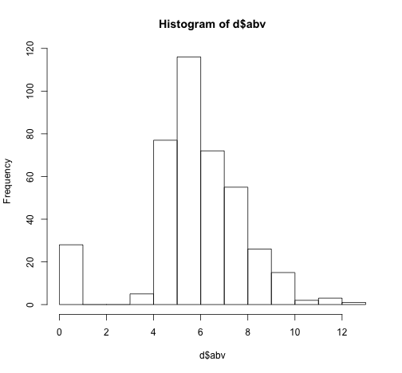 
*** =right


```r
hist(d$ratings)
```

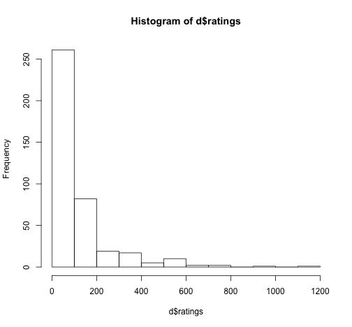 

----
## Look at the documentation 


```r
?hist
```


---- &twocol
## Change the number of break points

*** =left


```r
hist(d$ratings, breaks = 35)
```

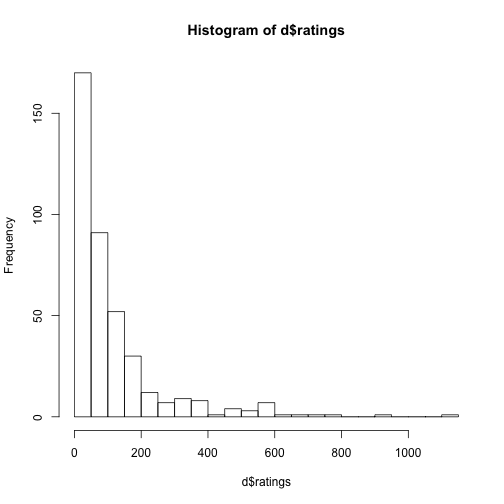 

*** =right


```r
hist(d$ratings, breaks = 100)
```

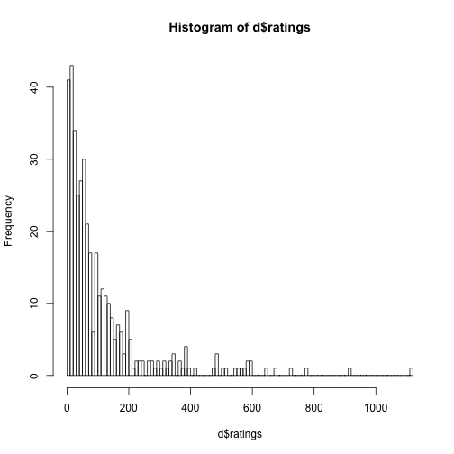 

---- &twocol
## Smooth the distribution

*** =left
# Standard Histogram

```r
hist(d$abv)
```

 

*** =right
# Density Plots

```r
dens <- density(d$abv); plot(dens)
```

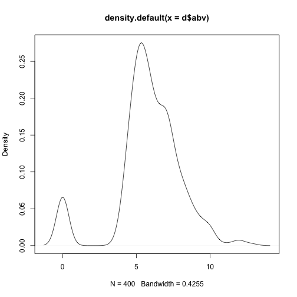 

---- &twocol
## A momentary detour: What is a density plot?

*** =left


*** =right

* A density plot is a probability density function
* The total area under the curve must sum (integrate) to 1. This represents the 
  total probability.
* Values on the y-axis represent the density of observations for particular x
  values. These numbers are largely uninterpretable by themselves. They are
  determined and constrained based on the total area summing to 1.
* To determine the probability that any randomly selected observation will fall 
  within a given x range, compute the area under the curve between those points
  (i.e., integrate).

---- &twocol
## Compute probability between two points

*** =left

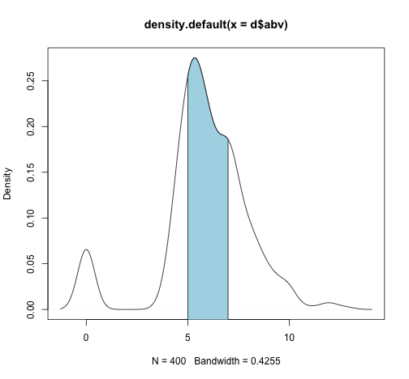 

```r
dens <- density(d$abv)
```
*** =right


```r
library(sfsmisc)
integrate.xy(dens$x, dens$y)
```

```
## [1] 1.000879
```

```r
abv57 <- cbind(dens$x, dens$y)
head(abv57, n = 2)
```

```
##           [,1]         [,2]
## [1,] -1.276634 0.0007432923
## [2,] -1.246588 0.0009135057
```

```r
abv57 <- subset(abv57, abv57[ ,1] >= 5 & 
                       abv57[ ,1] <= 7)
integrate.xy(abv57[ ,1], abv57[ ,2])
```

```
## [1] 0.4565267
```

---- &twocol
## Density binwidth
Change the binwidth to control the smoothing fact. The smaller the binwidth,
  the closer the function will resemble the observed data. The larger the 
  binwidth, the closer the function will resemble a standard normal.

*** =left


```r
dens1 <- density(d$abv, bw = .001)
plot(dens1)
```

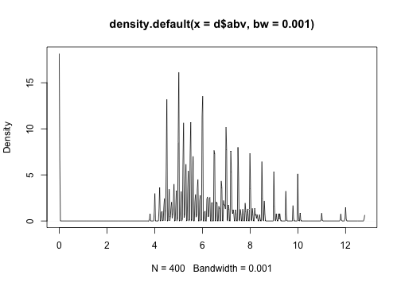 

*** =right


```r
dens2 <- density(d$abv, bw = 100)
plot(dens2)
```

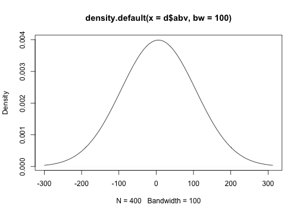 

----
## Your turn

* Load the beer dataset
* Produce a histogram
* Produce a density plot
* Change the number of breaks and the binwidth of each
* Try adding the additional argument `probability = TRUE` to a histogram. What
  do you notice?

---- 
## Scatter plots and controlling lines, colors, axes, etc.


----
## The `plot()` function
Generic x-y plotting. Multiple types of plots are possible. From the 
  documentation:


---- &twocol
## Plot types

*** =left

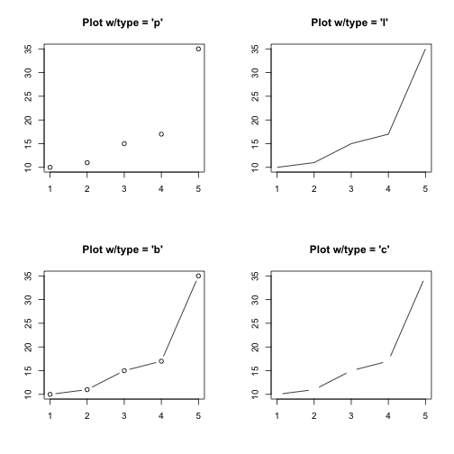 

*** =right

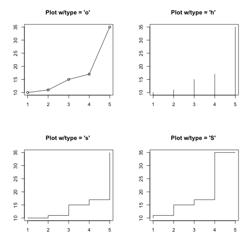 

---- &twocol
## Scatter plots

Two specifications


```r
plot(outcome ~ predictor, data = d) # Just like the lm function
plot(x-variable, y-variable)
```

# Examples

*** =left


```r
plot(score.overall ~ abv, data = d)
```

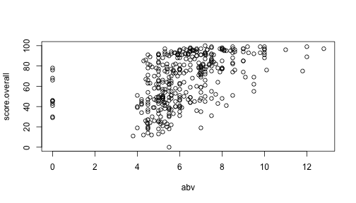 

*** =right


```r
plot(d$abv, d$score.overall)
```

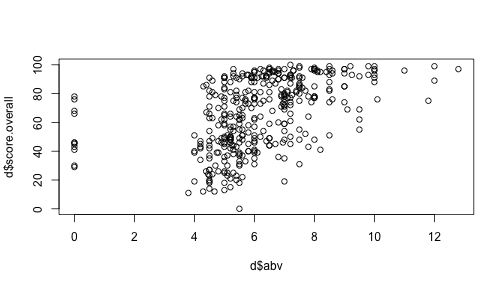 

----
## Additional arguments


|Argument |Description                                                                      |
|:--------|:--------------------------------------------------------------------------------|
|main     |Main title of the Plot                                                           |
|sub      |Subtitle, added at the bottom of the plot                                        |
|xlab     |x-axis label                                                                     |
|ylab     |y-axis lable                                                                     |
|col      |Color (can be multiple things, depending on call)                                |
|pch      |Point type                                                                       |
|xlim     |Limits of x-axis (vector of length 2)                                            |
|ylim     |Limits of y-axis (vector of length 2)                                            |
|bg       |Background color (can be multiple things, depending on call)                     |
|cex      |Size of points                                                                   |
|cex.SPEC |Specific call to axis/lab/main/sub to change size of those SPEC (specifications) |
|col.SPEC |Color specific calls                                                             |

---- &twocol
## Examples: Beer style and overall ratings

*** =left

# Standard Plot


```r
plot(d$score.by.style, d$score.overall)
```

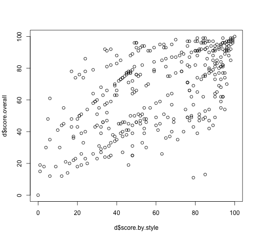 

*** =right

# Change axes labels, provide title


```r
plot(d$score.by.style, d$score.overall,
  main = "Relation Between Style Rating and Overall Rating",
  xlab = "Beer Style Rating",
  ylab = "Overall Beer Rating")
```

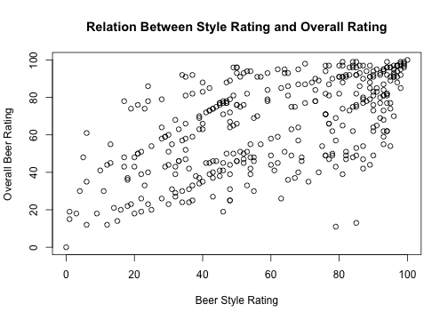 

---- &twocol
## Change point type, color, and size

*** =left


```r
plot(d$score.by.style, d$score.overall,
  main = "Relation Between Style 
    Rating and Overall Rating",
  xlab = "Beer Style Rating",
  ylab = "Overall Beer Rating",
  pch = 3,
  cex = 2,
  col = "purple")
```

*** =right

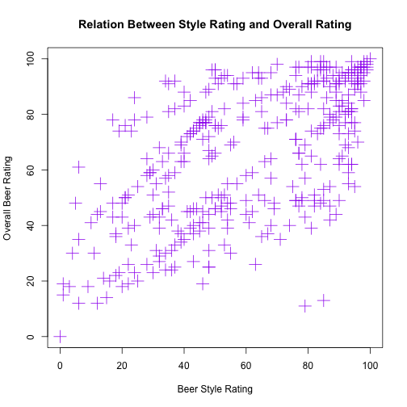 

---- 
## Colors in R

<div align = "left">

</div>

---- 
## Point Types


```r
plot(1:20, 1:20, pch = 1:20, cex = 3)
```

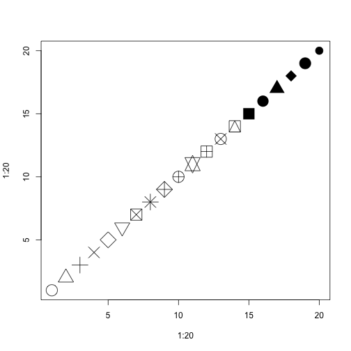 

---- &twocol
## Plotting the regression line

*** =left


```r
mod <- 
  lm(score.overall ~ score.by.style, 
    data = d)

plot(d$score.by.style, d$score.overall,
  main = "Relation Between Style 
    Rating and Overall Rating",
  xlab = "Beer Style Rating",
  ylab = "Overall Beer Rating",
  pch = 3,
  cex = 2,
  col = "purple")

abline(coef(mod)[1], coef(mod)[2], 
  lty = 3, 
  lwd = 5, 
  col = "aquamarine3")
```

*** =right

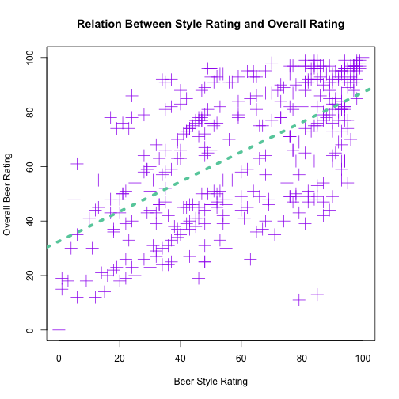 


----
## Line types


```r
plot(1:6, 1:6, type = "n")
for(i in 1:6) abline(i, 0, lty = i, lwd = 3)
```

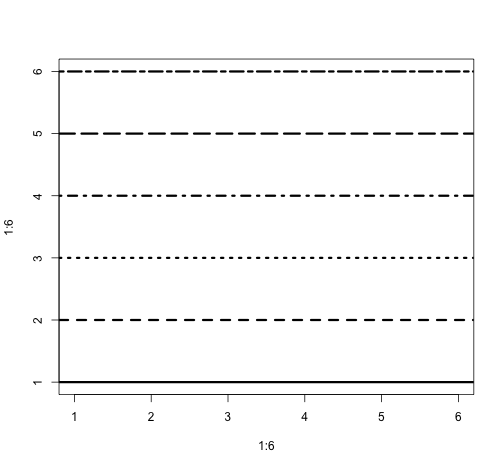 

----
## Your turn
Produce the following plot (the colors can be different, but it should not be 
  black)

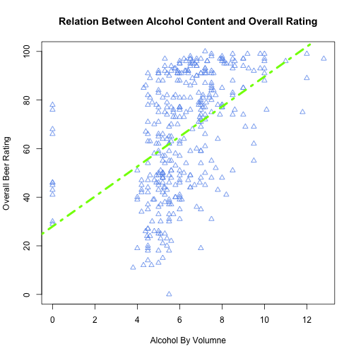 

----
## Last example: A (sort of) advanced example

Overlay a density plot on a histogram, maintain frequency y-axis

 

---- &twocol
## Multi-step process

*** =left

First, plot the histogram, suppressing all axes, labels, and plot border


```r
hist(d$abv, 
  probability = TRUE, 
  axes = FALSE,
  main = "", 
  xlab = "", 
  ylab = "")
```

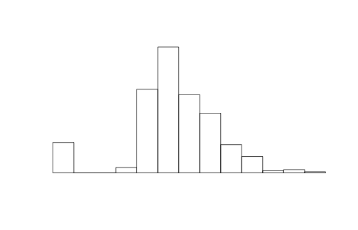 

*** =right

Next, use `lines` to add the density line


```r
lines(density(d$abv), 
  col = "darkgray", 
  lty = 3, 
  lwd = 3)
```
<br>
<br>

 

---- &twocol
## (sort of) Advanced example, continued

*** =left

Call a new plot to overaly on the current plot


```r
par(new = TRUE)
```

Plot the histogram again, labeling the axes how you'd like (note, this process 
  is neccessary to keep the frequency y-axis)


```r
hist(d$abv, 
  main = "Distribution of Beer Alcohol 
            by Volume",
  xlab = "Alcohol by Volume"
  )
```

*** =right

 

----
## Lab
Produce the following plots. Again, the colors, line types, etc., can be 
  different, but they should not be the default (where the defaults have been 
  changed).

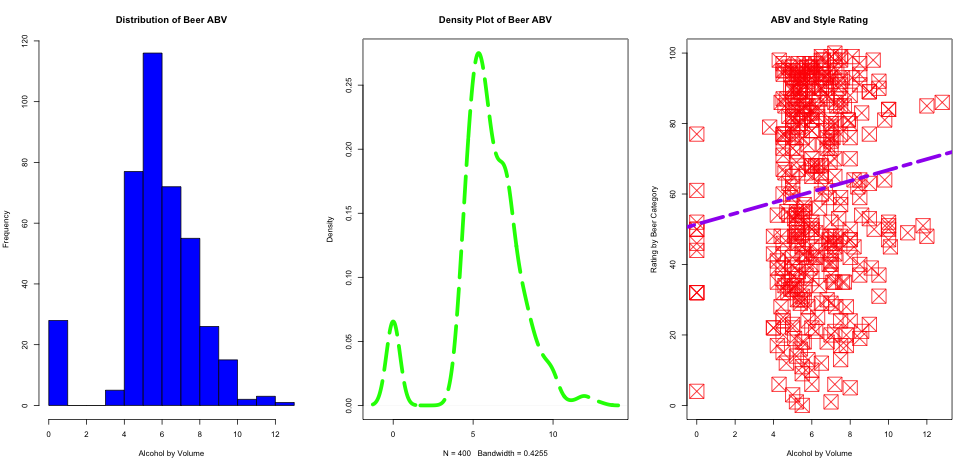 
