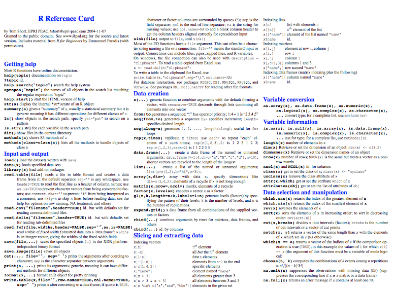
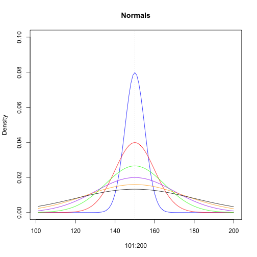
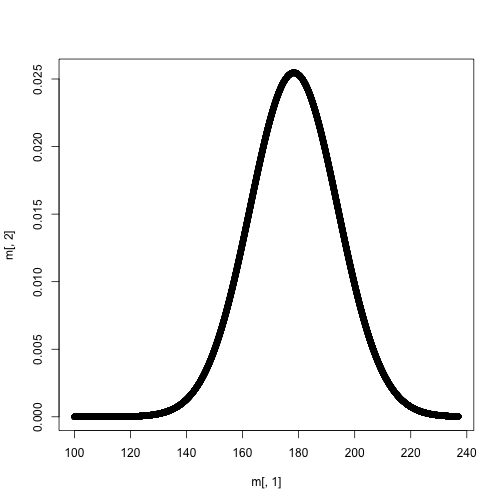

## Today's Agenda
* A note on matrix algebra vs element-wise algebra
* Lists
* Data frames
* Classes


--- &twocol

## Matrix Multiplication Versus Element-wise

To compute the product of two matrices, you have to use the matrix
  multiplication operator, `%*%`, rather than `*`. 

*** =left


```r
m1 <- matrix(round(rnorm(12, 10, 3)),
		ncol = 4)
m1
```

```
##      [,1] [,2] [,3] [,4]
## [1,]    6   11   11   14
## [2,]   11   11   13    8
## [3,]   10   13    4   11
```

```r
m2 <- matrix(round(rnorm(12, 10, 3)),
		ncol = 3)
m2
```

```
##      [,1] [,2] [,3]
## [1,]   13   12   11
## [2,]    5    3   12
## [3,]   11    9    8
## [4,]   11    7    9
```

*** =right


```r
m1 * m2
```

```
## Error in m1 * m2: non-conformable arrays
```

```r
m1 %*% m2
```

```
##      [,1] [,2] [,3]
## [1,]  408  302  412
## [2,]  429  338  429
## [3,]  360  272  397
```

----
## Matrix algebra

<div align = "center">

</div>

----
## Marix product rules
<br>
<div align = "center">

</div>

---- &twocol
## One more example

If you try to multiply two square matrices, the procedure will be conducted
  element-wise, unless you use the correct command for matrix multiplication.

*** =left


```r
m1 <- matrix(1:9, ncol = 3)
m1
```

```
##      [,1] [,2] [,3]
## [1,]    1    4    7
## [2,]    2    5    8
## [3,]    3    6    9
```

```r
m2 <- matrix(21:29, ncol = 3)
m2
```

```
##      [,1] [,2] [,3]
## [1,]   21   24   27
## [2,]   22   25   28
## [3,]   23   26   29
```

*** =right


```r
m1 * m2
```

```
##      [,1] [,2] [,3]
## [1,]   21   96  189
## [2,]   44  125  224
## [3,]   69  156  261
```

```r
m1 %*% m2
```

```
##      [,1] [,2] [,3]
## [1,]  270  306  342
## [2,]  336  381  426
## [3,]  402  456  510
```

----
## Your turn
* Create a 2 by 2 matrix and a 2 by 4 matrix with random normal numbers with a 
  mean of 10 and standard deviation of 2. Note, if you'd like your results to match mine, first run `set.seed(101)`.
* Multiply the matrices together
* Predict the dimensions of product matrix for each of the following
	+ 3*5 * 5*7
	+ 4*2 * 2*4
	+ 2*4 * 4*2
	+ 4*3 * 4*3
	+ 3*5 * 5*2


----

```r
set.seed(101)
m1 <- matrix(rnorm(4, 10, 2), ncol = 2)
m2 <- matrix(rnorm(8, 10, 2), ncol = 4)
m1 %*% m2
```

```
##          [,1]     [,2]     [,3]     [,4]
## [1,] 206.1004 189.5989 193.2626 176.0718
## [2,] 246.7245 226.7283 231.0469 210.4503
```
<br>
# Predictions

|Matrices  |Result |
|:---------|:------|
|3*5 * 5*7 |3*7    |
|4*2 * 2*4 |4*4    |
|2*4 * 4*2 |2*2    |
|4*3 * 4*3 |NA     |
|3*5 * 5*2 |3*2    |

---- &twocol
## Lists
Elements of lists can be of any type, including lists

*** =left


```r
l <- list(
	c("a", "b", "c"),
	1:5,
	rep(c(T,F), 7),
	rnorm(3, 100, 25)
		  )
```

*** =right


```r
l
```

```
## [[1]]
## [1] "a" "b" "c"
## 
## [[2]]
## [1] 1 2 3 4 5
## 
## [[3]]
##  [1]  TRUE FALSE  TRUE FALSE  TRUE FALSE  TRUE FALSE  TRUE FALSE  TRUE
## [12] FALSE  TRUE FALSE
## 
## [[4]]
## [1] 135.69389  63.32951  94.08292
```

---- &twocol
## Accessing List Elements
* List elements can be accessed in two methods: Using the `$` with the element 
  names, or through indexing with a double bracket `[[]]`.
* If a single bracket index is used, `[]`, the element will be returned, but of 
  type list.

*** =left


```r
typeof(l)
```

```
## [1] "list"
```

```r
typeof(l[1])
```

```
## [1] "list"
```

```r
typeof(l[[1]])
```

```
## [1] "character"
```

*** =right


```r
l[1]
```

```
## [[1]]
## [1] "a" "b" "c"
```

```r
l[[1]]
```

```
## [1] "a" "b" "c"
```

----
## Access list elements via names

# Provide element names


```r
names(l) <- c("letters", "numbers", "logical", "double")
str(l)
```

```
## List of 4
##  $ letters: chr [1:3] "a" "b" "c"
##  $ numbers: int [1:5] 1 2 3 4 5
##  $ logical: logi [1:14] TRUE FALSE TRUE FALSE TRUE FALSE ...
##  $ double : num [1:3] 135.7 63.3 94.1
```
<br>

# Access element


```r
l$letters
```

```
## [1] "a" "b" "c"
```

---- &twocol
## Naming lists versus vectors

*** =left

# Lists

```r
lst <- list(1:5, letters[1:15])
str(lst)
```

```
## List of 2
##  $ : int [1:5] 1 2 3 4 5
##  $ : chr [1:15] "a" "b" "c" "d" ...
```

```r
names(lst) <- c("Numbers", "Letters")
str(lst)
```

```
## List of 2
##  $ Numbers: int [1:5] 1 2 3 4 5
##  $ Letters: chr [1:15] "a" "b" "c" "d" ...
```

*** =right

# Vectors

```r
v <- lst[[1]]
names(v) <- c("One", "Two", 
	"Three", "Four", "Five")
v
```

```
##   One   Two Three  Four  Five 
##     1     2     3     4     5
```

----

```r
names(lst$Numbers) <- c("One", "Two", "Three", "Four", "Five")
lst
```

```
## $Numbers
##   One   Two Three  Four  Five 
##     1     2     3     4     5 
## 
## $Letters
##  [1] "a" "b" "c" "d" "e" "f" "g" "h" "i" "j" "k" "l" "m" "n" "o"
```
<br>
# Subsetting

```r
lst$Numbers["Three"]
```

```
## Three 
##     3
```

----
## Lists returned by functions
* We'll talk about this more when we get into functions (next week), but many
  functions return a list of objects. For example: `lm`.


```r
mod <- lm(hp ~ mpg, data = mtcars)
str(mod)
```

```
## List of 12
##  $ coefficients : Named num [1:2] 324.08 -8.83
##   ..- attr(*, "names")= chr [1:2] "(Intercept)" "mpg"
##  $ residuals    : Named num [1:32] -28.7 -28.7 -29.8 -25.1 16 ...
##   ..- attr(*, "names")= chr [1:32] "Mazda RX4" "Mazda RX4 Wag" "Datsun 710" "Hornet 4 Drive" ...
##  $ effects      : Named num [1:32] -829.8 296.3 -23.6 -20 19.3 ...
##   ..- attr(*, "names")= chr [1:32] "(Intercept)" "mpg" "" "" ...
##  $ rank         : int 2
##  $ fitted.values: Named num [1:32] 139 139 123 135 159 ...
##   ..- attr(*, "names")= chr [1:32] "Mazda RX4" "Mazda RX4 Wag" "Datsun 710" "Hornet 4 Drive" ...
##  $ assign       : int [1:2] 0 1
##  $ qr           :List of 5
##   ..$ qr   : num [1:32, 1:2] -5.657 0.177 0.177 0.177 0.177 ...
##   .. ..- attr(*, "dimnames")=List of 2
##   .. .. ..$ : chr [1:32] "Mazda RX4" "Mazda RX4 Wag" "Datsun 710" "Hornet 4 Drive" ...
##   .. .. ..$ : chr [1:2] "(Intercept)" "mpg"
##   .. ..- attr(*, "assign")= int [1:2] 0 1
##   ..$ qraux: num [1:2] 1.18 1.02
##   ..$ pivot: int [1:2] 1 2
##   ..$ tol  : num 0.0000001
##   ..$ rank : int 2
##   ..- attr(*, "class")= chr "qr"
##  $ df.residual  : int 30
##  $ xlevels      : Named list()
##  $ call         : language lm(formula = hp ~ mpg, data = mtcars)
##  $ terms        :Classes 'terms', 'formula' length 3 hp ~ mpg
##   .. ..- attr(*, "variables")= language list(hp, mpg)
##   .. ..- attr(*, "factors")= int [1:2, 1] 0 1
##   .. .. ..- attr(*, "dimnames")=List of 2
##   .. .. .. ..$ : chr [1:2] "hp" "mpg"
##   .. .. .. ..$ : chr "mpg"
##   .. ..- attr(*, "term.labels")= chr "mpg"
##   .. ..- attr(*, "order")= int 1
##   .. ..- attr(*, "intercept")= int 1
##   .. ..- attr(*, "response")= int 1
##   .. ..- attr(*, ".Environment")=<environment: R_GlobalEnv> 
##   .. ..- attr(*, "predvars")= language list(hp, mpg)
##   .. ..- attr(*, "dataClasses")= Named chr [1:2] "numeric" "numeric"
##   .. .. ..- attr(*, "names")= chr [1:2] "hp" "mpg"
##  $ model        :'data.frame':	32 obs. of  2 variables:
##   ..$ hp : num [1:32] 110 110 93 110 175 105 245 62 95 123 ...
##   ..$ mpg: num [1:32] 21 21 22.8 21.4 18.7 18.1 14.3 24.4 22.8 19.2 ...
##   ..- attr(*, "terms")=Classes 'terms', 'formula' length 3 hp ~ mpg
##   .. .. ..- attr(*, "variables")= language list(hp, mpg)
##   .. .. ..- attr(*, "factors")= int [1:2, 1] 0 1
##   .. .. .. ..- attr(*, "dimnames")=List of 2
##   .. .. .. .. ..$ : chr [1:2] "hp" "mpg"
##   .. .. .. .. ..$ : chr "mpg"
##   .. .. ..- attr(*, "term.labels")= chr "mpg"
##   .. .. ..- attr(*, "order")= int 1
##   .. .. ..- attr(*, "intercept")= int 1
##   .. .. ..- attr(*, "response")= int 1
##   .. .. ..- attr(*, ".Environment")=<environment: R_GlobalEnv> 
##   .. .. ..- attr(*, "predvars")= language list(hp, mpg)
##   .. .. ..- attr(*, "dataClasses")= Named chr [1:2] "numeric" "numeric"
##   .. .. .. ..- attr(*, "names")= chr [1:2] "hp" "mpg"
##  - attr(*, "class")= chr "lm"
```

----
You can access the elements through the list


```r
mod$coefficients
```

```
## (Intercept)         mpg 
##  324.082314   -8.829731
```

Note that some times there are more efficient methods


```r
coef(mod)
```

```
## (Intercept)         mpg 
##  324.082314   -8.829731
```
In this case the methods are roughly equivalent, but sometimes it can make a
  difference (IRT)

----
## Other functions will transform data into lists


```r
cyls <- split(mtcars, mtcars$cyl)
str(cyls)
```

```
## List of 3
##  $ 4:'data.frame':	11 obs. of  11 variables:
##   ..$ mpg : num [1:11] 22.8 24.4 22.8 32.4 30.4 33.9 21.5 27.3 26 30.4 ...
##   ..$ cyl : num [1:11] 4 4 4 4 4 4 4 4 4 4 ...
##   ..$ disp: num [1:11] 108 146.7 140.8 78.7 75.7 ...
##   ..$ hp  : num [1:11] 93 62 95 66 52 65 97 66 91 113 ...
##   ..$ drat: num [1:11] 3.85 3.69 3.92 4.08 4.93 4.22 3.7 4.08 4.43 3.77 ...
##   ..$ wt  : num [1:11] 2.32 3.19 3.15 2.2 1.61 ...
##   ..$ qsec: num [1:11] 18.6 20 22.9 19.5 18.5 ...
##   ..$ vs  : num [1:11] 1 1 1 1 1 1 1 1 0 1 ...
##   ..$ am  : num [1:11] 1 0 0 1 1 1 0 1 1 1 ...
##   ..$ gear: num [1:11] 4 4 4 4 4 4 3 4 5 5 ...
##   ..$ carb: num [1:11] 1 2 2 1 2 1 1 1 2 2 ...
##  $ 6:'data.frame':	7 obs. of  11 variables:
##   ..$ mpg : num [1:7] 21 21 21.4 18.1 19.2 17.8 19.7
##   ..$ cyl : num [1:7] 6 6 6 6 6 6 6
##   ..$ disp: num [1:7] 160 160 258 225 168 ...
##   ..$ hp  : num [1:7] 110 110 110 105 123 123 175
##   ..$ drat: num [1:7] 3.9 3.9 3.08 2.76 3.92 3.92 3.62
##   ..$ wt  : num [1:7] 2.62 2.88 3.21 3.46 3.44 ...
##   ..$ qsec: num [1:7] 16.5 17 19.4 20.2 18.3 ...
##   ..$ vs  : num [1:7] 0 0 1 1 1 1 0
##   ..$ am  : num [1:7] 1 1 0 0 0 0 1
##   ..$ gear: num [1:7] 4 4 3 3 4 4 5
##   ..$ carb: num [1:7] 4 4 1 1 4 4 6
##  $ 8:'data.frame':	14 obs. of  11 variables:
##   ..$ mpg : num [1:14] 18.7 14.3 16.4 17.3 15.2 10.4 10.4 14.7 15.5 15.2 ...
##   ..$ cyl : num [1:14] 8 8 8 8 8 8 8 8 8 8 ...
##   ..$ disp: num [1:14] 360 360 276 276 276 ...
##   ..$ hp  : num [1:14] 175 245 180 180 180 205 215 230 150 150 ...
##   ..$ drat: num [1:14] 3.15 3.21 3.07 3.07 3.07 2.93 3 3.23 2.76 3.15 ...
##   ..$ wt  : num [1:14] 3.44 3.57 4.07 3.73 3.78 ...
##   ..$ qsec: num [1:14] 17 15.8 17.4 17.6 18 ...
##   ..$ vs  : num [1:14] 0 0 0 0 0 0 0 0 0 0 ...
##   ..$ am  : num [1:14] 0 0 0 0 0 0 0 0 0 0 ...
##   ..$ gear: num [1:14] 3 3 3 3 3 3 3 3 3 3 ...
##   ..$ carb: num [1:14] 2 4 3 3 3 4 4 4 2 2 ...
```

----
## More on lists
* Note that previously slide looked like a nested list (list inside a list). 
  This is because data frames are lists, where each element of the list is a vector of the same length.
* lists are tremendously useful and flexible, but essentially require at least a 
  basic understanding of functions and/or loops. 
  	+ Functions because lists are often used to return output from a function 
  	  (as discussed previously). 
  	+ Loops because you often want to loop through a list and apply a function
  	  to each element of the list.

For example: 


```r
sapply(cyls, function(x) cor(x$mpg, x$hp))
```

```
##          4          6          8 
## -0.5235034 -0.1270678 -0.2836357
```
(Note `tapply` is a more efficent method for doing the same thing as above 
  without spliting the data frame first)

---- &twocol
# Lists and data frames

*** =left


```r
l <- list(
	lets = letters[1:5],
	ints = 9:5,
	dbl = rnorm(5, 12, 0.75)
	)
str(l)
```

```
## List of 3
##  $ lets: chr [1:5] "a" "b" "c" "d" ...
##  $ ints: int [1:5] 9 8 7 6 5
##  $ dbl : num [1:5] 11.9 11.4 12 11.4 10.5
```

```r
as.data.frame(l)
```

```
##   lets ints      dbl
## 1    a    9 11.85500
## 2    b    8 11.36268
## 3    c    7 12.04385
## 4    d    6 11.38675
## 5    e    5 10.46227
```

*** =right

Or equivalently


```r
dframe <- data.frame(
	lets = letters[1:5],
	ints = 9:5,
	dbl = rnorm(5, 12, 0.75)
	)
dframe
```

```
##   lets ints      dbl
## 1    a    9 11.87718
## 2    b    8 12.53139
## 3    c    7 11.79901
## 4    d    6 10.90206
## 5    e    5 12.55833
```

----
## More on data frames
Because data frames are actually lists, you can use the same subsetting 
  procedures you can with lists. 


```r
dframe[2]
```

```
##   ints
## 1    9
## 2    8
## 3    7
## 4    6
## 5    5
```

```r
dframe[[2]]
```

```
## [1] 9 8 7 6 5
```

----
## Your turn
* Create a list consisting of a character vector, an integer vector, and a 
  factor, all of the same length
* Provide names for each element.
* Provide names for each element of the integer vector.
* Subset the list using names to select one element of the integer vector.
* Subset the list to select the same element using indexing.
* Convert the list into a data frame

----

* Create a list consisting of a character vector, an integer vector, and a 
  factor, all of the same length
* Provide names for each element.


```r
l <- list(Lets = letters[1:7], 
		  Ints = 1:7,
		  fact = factor(
		  			c(rep(c("red", "green", "blue"), 2), "red")
		  			)
		  )
l
```

```
## $Lets
## [1] "a" "b" "c" "d" "e" "f" "g"
## 
## $Ints
## [1] 1 2 3 4 5 6 7
## 
## $fact
## [1] red   green blue  red   green blue  red  
## Levels: blue green red
```

----
* Provide names for each element of the integer vector.


```r
names(l[["Ints"]]) <- letters[11:17]
l
```

```
## $Lets
## [1] "a" "b" "c" "d" "e" "f" "g"
## 
## $Ints
## k l m n o p q 
## 1 2 3 4 5 6 7 
## 
## $fact
## [1] red   green blue  red   green blue  red  
## Levels: blue green red
```

----
* Subset the list using names to select one element of the integer vector.


```r
l$Ints["p"]
```

```
## p 
## 6
```

* Subset the list to select the same element using indexing.


```r
l[[2]][6]
```

```
## p 
## 6
```

----

* Convert the list into a data frame


```r
d <- as.data.frame(l)
d
```

```
##   Lets Ints  fact
## k    a    1   red
## l    b    2 green
## m    c    3  blue
## n    d    4   red
## o    e    5 green
## p    f    6  blue
## q    g    7   red
```

---- .segue
# Common/Routine Functions (very briefly)

----
# Resources
Plenty of helpful sheets for common/routine functions in R. For example: 
* https://cran.r-project.org/doc/contrib/Short-refcard.pdf
* http://www.columbia.edu/~cjd11/charles_dimaggio/DIRE/resources/R/rFunctionsList.pdf




----
## Big picture
There are lots of functions that you will use and need as you get deeper into 
  programming with R. Gaining fluency with these functions is one of the keys to taking the "next step" with R and truly being comfortable with it. Some examples of functions I use routinely include the following:

* `rep()` repeats an element or vector a specified number of times
* `seq()` creates a sequence of numbers from `x` to `y`
* `:` creates an integer index that changes by 1
* `table()` creates a summary of the number of times an element occurs in a
   vector (similar to Frequencies in SPSS)
* `c()` creates a vector
* `cbind()` binds vectors, matrices, or data frames together column-wise
* `rbind()` binds vectors, matrices, or data frames together row-wise

----
## Common functions (continued)
* `ifelse()` vectorized operator for conditional recoding of a vector. Takes
   three arguments: If condition == TRUE, then carry out an operation, else carry out a different operation.
* `rnorm()`, `rbinom()`, `rpois()`, etc., create randomly generated data from 
   the specified distribution (with the specified distributional properties).
* `dnorm()`, `dbinom()`, `dpois()`, etc, calculate the likelihood of specific
   data occurring from the specified distribution (with the specified distributional properties).
* `str()` provides the basic structure of the object (most useful for lists and
   data frames).
* `head()` and `tail()` display the first 6 (head) and the last 6 (tail) rows
   of a given data frame.
* `summary()` provides statistical summary information on vectors
* `sample()` randomly select `n` observations from a vector

---- 
## Additional arguments

While the basics of most of these functions are relatively straightforward, 
  most also include additional arguments that make them more flexible.

For example: 


```r
rep(c(3,5), 7) # typical application
```

```
##  [1] 3 5 3 5 3 5 3 5 3 5 3 5 3 5
```

```r
rep(c(3, 5), each = 2, length.out = 7) # additional arguments
```

```
## [1] 3 3 5 5 3 3 5
```

---- &twocol
## `dnorm()` etc. arguments

These functions can be used in ML estimation but are also commonly useful in plotting.

*** =left


```r
plot(x = 101:200,  
	y = seq(0, 0.1, length.out = 100), 
	type = "n", 
	ylab = "Density", main = "Normals")
abline(v = 150, lty = 3, col = "gray")

lines(101:200, dnorm(101:200, 150, 5), 
	col = "blue")
lines(101:200, dnorm(101:200, 150, 10), 
	col = "red")
lines(101:200, dnorm(101:200, 150, 15), 
	col = "green")
lines(101:200, dnorm(101:200, 150, 20), 
	col = "purple")
lines(101:200, dnorm(101:200, 150, 25), 
	col = "orange")
lines(101:200, dnorm(101:200, 150, 30), 
	col = "black")
```

*** =right

 

----
## Your Turn (probably fairly tough)
# Use some of the common/routine functions to do the following:
* Create a sequence vector from 100 to 237 that is of length 1000.
* Randomly order the vector
* Compute the likelihood of each point occurring from a normal distribution
  with $\mu$ = 178.32 and $\sigma$ = 15.67. Store the result in a new vector.
* Form a 1000 by 2 matrix that is composed of the sequence vector and
  the likelihood vector.
* Use the matrix to plot the relation between the sequence vector and the
  likelihood of each point.

----
* Create a sequence vector from 100 to 237 that is of length 10,000.


```r
v <- seq(100, 237, length.out = 1e4)
head(v)
```

```
## [1] 100.0000 100.0137 100.0274 100.0411 100.0548 100.0685
```

* Randomly order the vector


```r
v <- sample(v, length(v))
head(v)
```

```
## [1] 110.8515 159.4365 193.1145 200.5818 161.9713 207.3228
```

----
* Compute the likelihood of each point, and store the result in a new vector


```r
lik <- dnorm(v, 178.32, 15.67)
head(lik)
```

```
## [1] 0.000002400779 0.012316885312 0.016303475424 0.009280633627
## [5] 0.014773255270 0.004591672415
```

* Form a 1000 by 2 matrix that is composed of the sequence vector and
  the likelihood vector.


```r
m <- cbind(v, lik)
head(m)
```

```
##             v            lik
## [1,] 110.8515 0.000002400779
## [2,] 159.4365 0.012316885312
## [3,] 193.1145 0.016303475424
## [4,] 200.5818 0.009280633627
## [5,] 161.9713 0.014773255270
## [6,] 207.3228 0.004591672415
```

----
* Use the matrix to plot the relation between the sequence vector and the
  likelihood of each point.


```r
plot(m[ ,1], m[ ,2])
```

 
