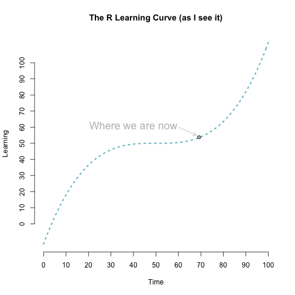
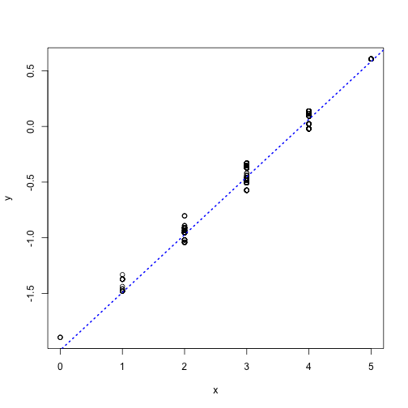
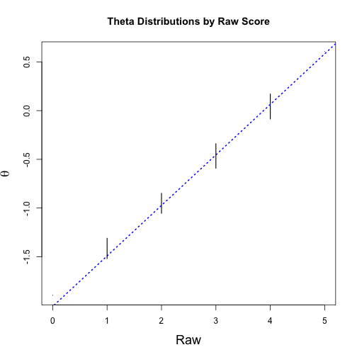

## Today's Agenda
* Overview of functions
* Function components
* Primitive functions
* Basics on writing functions
* Using functions with plotting
* Classes and methods (object-oriented programming)
* Storing and applying functions with `source()`

----
## A reminder: The R learning curve

 

----
## Functions
Anything that carries out an operation in R is a function. For example


```r
3 + 5 + 7
```

```
## [1] 15
```
Could also be written


```r
`+`(3, `+`(5, 7))
```

```
## [1] 15
```
In other words, the `+` operator is itself a function that takes two arguments (both numeric), which it sums. The `+` operator is an example of an infix function, which we'll discuss more later today.

----
Similarly, the following are the same


```r
a <- 7
a
```

```
## [1] 7
```

```r
`<-`(a, 7)
a
```

```
## [1] 7
```

----
## Functions are also objects


```r
a <- lm
data(mtcars)
summary( a(hp ~ drat + wt, data = mtcars) )
```

```
## 
## Call:
## a(formula = hp ~ drat + wt, data = mtcars)
## 
## Residuals:
##     Min      1Q  Median      3Q     Max 
## -83.873 -33.910 -12.853   9.585 171.597 
## 
## Coefficients:
##             Estimate Std. Error t value Pr(>|t|)   
## (Intercept)  -27.782    127.992  -0.217  0.82968   
## drat           5.354     25.511   0.210  0.83524   
## wt            48.244     13.940   3.461  0.00169 **
## ---
## Signif. codes:  0 '***' 0.001 '**' 0.01 '*' 0.05 '.' 0.1 ' ' 1
## 
## Residual standard error: 53.29 on 29 degrees of freedom
## Multiple R-squared:  0.4348,	Adjusted R-squared:  0.3958 
## F-statistic: 11.15 on 2 and 29 DF,  p-value: 0.0002552
```

----
## Function components
# Functions have three components
* `body()`
* `formals()`


* `environment()`
	+ A bit more complicated: Deals with scoping, which we'll discuss next 
	  class

----
## Primitive functions
* The one exception to the rule of functions having 3 components, are
  primitive functions, which call C code directly to increase efficiency.


```r
names(methods:::.BasicFunsList) # 198 primitive functions total
```

```
##   [1] "$"                    "$<-"                  "["                   
##   [4] "[<-"                  "[["                   "[[<-"                
##   [7] "%*%"                  "xtfrm"                "c"                   
##  [10] "all"                  "any"                  "sum"                 
##  [13] "prod"                 "max"                  "min"                 
##  [16] "range"                "is.matrix"            ">="                  
##  [19] "cosh"                 "cummax"               "dimnames<-"          
##  [22] "as.raw"               "log2"                 "tan"                 
##  [25] "dim"                  "as.logical"           "^"                   
##  [28] "is.finite"            "sinh"                 "log10"               
##  [31] "as.numeric"           "dim<-"                "is.array"            
##  [34] "tanpi"                "gamma"                "atan"                
##  [37] "as.integer"           "Arg"                  "signif"              
##  [40] "cumprod"              "cos"                  "length"              
##  [43] "!="                   "digamma"              "exp"                 
##  [46] "floor"                "acos"                 "seq.int"             
##  [49] "abs"                  "length<-"             "sqrt"                
##  [52] "!"                    "acosh"                "is.nan"              
##  [55] "Re"                   "tanh"                 "names"               
##  [58] "cospi"                "&"                    "anyNA"               
##  [61] "trunc"                "cummin"               "levels<-"            
##  [64] "*"                    "Mod"                  "|"                   
##  [67] "names<-"              "+"                    "log"                 
##  [70] "lgamma"               "as.complex"           "asinh"               
##  [73] "-"                    "sin"                  "/"                   
##  [76] "as.environment"       "<="                   "as.double"           
##  [79] "is.infinite"          "is.numeric"           "rep"                 
##  [82] "round"                "sinpi"                "dimnames"            
##  [85] "asin"                 "as.character"         "%/%"                 
##  [88] "is.na"                "<"                    ">"                   
##  [91] "Im"                   "%%"                   "trigamma"            
##  [94] "=="                   "cumsum"               "atanh"               
##  [97] "sign"                 "ceiling"              "Conj"                
## [100] "log1p"                "expm1"                "("                   
## [103] "is.list"              "switch"               ":"                   
## [106] "="                    "@"                    "{"                   
## [109] "~"                    "class"                "class<-"             
## [112] "is.function"          "repeat"               "UseMethod"           
## [115] "untracemem"           "return"               "forceAndCall"        
## [118] "lazyLoadDBfetch"      "nargs"                "proc.time"           
## [121] "attr"                 "&&"                   "next"                
## [124] "pos.to.env"           "nzchar"               "standardGeneric"     
## [127] ".C"                   "is.logical"           "is.single"           
## [130] "@<-"                  "<-"                   "browser"             
## [133] ".Call.graphics"       "break"                "oldClass<-"          
## [136] "is.atomic"            "attributes"           "storage.mode<-"      
## [139] "emptyenv"             "is.integer"           ".primTrace"          
## [142] ".External.graphics"   "substitute"           "is.object"           
## [145] "list"                 "tracemem"             "invisible"           
## [148] ".Primitive"           "if"                   "enc2native"          
## [151] "unclass"              "is.name"              "is.symbol"           
## [154] "baseenv"              "||"                   "seq_len"             
## [157] "is.character"         "function"             "is.call"             
## [160] "is.expression"        "is.pairlist"          ".primUntrace"        
## [163] "as.call"              "missing"              "is.language"         
## [166] "gc.time"              "quote"                "is.recursive"        
## [169] ".subset2"             "attr<-"               "interactive"         
## [172] ".Internal"            "is.complex"           "retracemem"          
## [175] ".External2"           "is.null"              ".isMethodsDispatchOn"
## [178] "is.environment"       "while"                "is.double"           
## [181] "for"                  ".cache_class"         "enc2utf8"            
## [184] "environment<-"        "seq_along"            "expression"          
## [187] "is.raw"               "globalenv"            "on.exit"             
## [190] "isS4"                 "oldClass"             ".External"           
## [193] "call"                 ".subset"              ".Fortran"            
## [196] "attributes<-"         "<<-"                  ".Call"
```

---- &twocol
## Writing functions: A basic example

*** =left


```r
pol <- function(x, power) {
	z <- x^power
return(z)
}
```
This function takes two arguments: `x` and `power`, with `x` being a generic
  numeric vector (could be a scalar), and power being the power to which the number or vector will be raised (could also be a vector).

While the function appears (and is) simple, it is actually quite flexible.


```r
pol(x = 2, power = 3)
```

```
## [1] 8
```

*** =right


```r
pol(c(3, 5, 7), 9)
```

```
## [1]    19683  1953125 40353607
```

```r
pol(c(7, 1, -5, 8), c(2, 3))
```

```
## [1]  49   1  25 512
```

```r
pol(c(8, 5), c(3, 5))
```

```
## [1]  512 3125
```

```r
pol(8, c(5, 3, 2))
```

```
## [1] 32768   512    64
```

---- &twocol
## Function components
You can extract the body, formals, or environment from a function, by using
  the corresponding function.

*** =left


```r
body(pol)
```

```
## {
##     z <- x^power
##     return(z)
## }
```

```r
formals(pol)
```

```
## $x
## 
## 
## $power
```

*** =right


```r
environment(pol)
```

```
## <environment: R_GlobalEnv>
```

```r
environment(lm)
```

```
## <environment: namespace:stats>
```

```r
formals(lm)
```

```
## $formula
## 
## 
## $data
## 
## 
## $subset
## 
## 
## $weights
## 
## 
## $na.action
## 
## 
## $method
## [1] "qr"
## 
## $model
## [1] TRUE
## 
## $x
## [1] FALSE
## 
## $y
## [1] FALSE
## 
## $qr
## [1] TRUE
## 
## $singular.ok
## [1] TRUE
## 
## $contrasts
## NULL
## 
## $offset
## 
## 
## $...
```

----
## Function components
Note that these calls will return `NULL` for primitive functions.


```r
formals(sum)
```

```
## NULL
```

```r
body(sum)
```

```
## NULL
```

```r
environment(sum)
```

```
## NULL
```

----
## More on formals
Functions do not neccessarily have to have formal arguments, but they must have a body.


```r
a <- 7; b <- 5

f <- function() {
	x <- 7 + a^2
return(x/b)
}

formals(f)
```

```
## NULL
```

```r
f()
```

```
## [1] 11.2
```
Note: Scoping (next class) is important here.

----
## Another basic example

# Just for practice, let's create a new standard deviation function. 

<br>

$$\sigma = \sqrt{\frac{\Sigma(x_i - \bar{x})^2}{(n-1)}}$$


```r
stDev <- function(x) {	
	num <- sum( (x - mean(x))^2 )
	denom <- length(x) - 1

	std <- sqrt(num / denom)
return(std)
}
```

This function takes one formal argument, `x`, which must be a numeric vector. The body of the function is the equation, and the standard deviation is returned.

---- &twocol
## Does it work?
# Compare to the base function `sd()`


```r
data(mtcars)
sd(mtcars$mpg); stDev(mtcars$mpg)
```

```
## [1] 6.026948
```

```
## [1] 6.026948
```

```r
sd(mtcars$drat); stDev(mtcars$drat)
```

```
## [1] 0.5346787
```

```
## [1] 0.5346787
```

----
## Your turn
The formula for calculating the mean is

$$\bar{x} = \frac{\Sigma x_i}{n}$$

* Write a function that calculates the sample mean, $\bar{x}$. Name the
  function `xbar`. The function must be written without using the base function `mean()`.
* Compare the results of your function with `mean()`. Do the results match?
* What are the formals and body of this function? Describe each.
* How could you modify the function to account for missing data? (we haven't 
  talked about this yet, so don't worry if you are having trouble with it)

---- &twocol
* Write a function that calculates the sample mean, $\bar{x}$. Name the
  function `xbar`. The function must be written without using the base function `mean()`.


```r
xbar <- function(x) {
	myMean <- sum(x)/length(x)
return(myMean)
}
```

* Compare the results of your function with `mean()`. Do the results match?

*** =left


```r
xbar(mtcars$mpg); mean(mtcars$mpg)
```

```
## [1] 20.09062
```

```
## [1] 20.09062
```

*** =right


```r
xbar(mtcars$drat); mean(mtcars$drat)
```

```
## [1] 3.596563
```

```
## [1] 3.596563
```

----
* What are the formals and body of this function?

Formals = `x`: a generic numeric vector

<br>

Body = `myMean <- sum(x)/length(x)`, sums the generic numeric vector and
  divides the result by the number of elements in the vector.

---- &twocol

* How could you modify the function to account for missing data?

*** =left

There are a few different options here. First, you could modify the function
  so it automatically calculates the mean from only the observed data.


```r
xbar2 <- function(x) {
	y <- na.omit(x)
	myMean <- sum(y)/length(y)
return(myMean)
}
```
To test this, we could set some values to missing and then run the function.


```r
v <- mtcars$mpg

# Randomly set 10 values to missing
set.seed(101) # Seed for replicability
v[sample(v, 10)] <- NA
```

*** =right


```r
v
```

```
##  [1] 21.0 21.0 22.8 21.4 18.7 18.1 14.3 24.4 22.8   NA 17.8 16.4 17.3   NA
## [15]   NA   NA   NA 32.4 30.4 33.9   NA   NA 15.2 13.3 19.2   NA 26.0 30.4
## [29] 15.8 19.7 15.0 21.4   NA
```

```r
mean(v, na.rm = TRUE)
```

```
## [1] 21.19583
```

```r
xbar2(v)
```

```
## [1] 21.19583
```

---- &twocol
# Alternatively, add a condition, and make missing data a formal argument


```r
xbar3 <- function(x, miss = FALSE) {
	if(miss == FALSE) {
		myMean <- sum(x)/length(x)
	}
	else {
		y <- na.omit(x)
		myMean <- sum(y)/length(y)
	}
return(myMean)
}
```
This function has two formal arguments, `x`, and `miss`. Notice that `miss`
  defaults to `FALSE`. This means the argument does not have to be explicitly called in the function, but it can still handle missing data, if they are present.

*** =left


```r
xbar3(mtcars$mpg)
```

```
## [1] 20.09062
```

*** =right


```r
xbar3(v, miss = TRUE)
```

```
## [1] 21.19583
```

---- &twocol
Because `else {}` was used, rather than `if() {}`, any argument other than 
  `FALSE` supplied to `miss` will result in that portion of the function being evaluated.


```r
xbar3(v, 3)
```

```
## [1] 21.19583
```

You may, or may not, want this type of behavior. If not, just use multiple 
  `if() {}` statements.

*** =left


```r
xbar3 <- function(x, miss = FALSE) {
	if(miss == FALSE) {
		myMean <- sum(x)/length(x)
	}
	if(miss == TRUE) {
		y <- na.omit(x)
		myMean <- sum(y)/length(y)
	}
return(myMean)
}
```

*** =right


```r
xbar3(v, 3)
```

```
## Error in xbar3(v, 3): object 'myMean' not found
```

---- &twocol
## More on `return()`
The `return()` function does not neccessarily need to be used within functions (although it can make it a little more clear). If `return()` is not used, the function will output the final expression from the function. For example, the following two functions are equivalent.

*** =left


```r
pol <- function(x, power) {
	z <- x^power
return(z)
}
```

```r
pol(3, 4)
```

```
## [1] 81
```


*** =right


```r
pol2 <- function(x, power) {
	x^power
}
```

```r
pol2(3, 4)
```

```
## [1] 81
```

----
## Even more compact
If the entire function only takes one line of code, you can eliminate the brackets.


```r
pol <- function(x, power) x^power
```

```r
pol(3,4)
```

```
## [1] 81
```

---- &twocol
## Embedding Messages, Returning Errors
Note that this is not close to the most important part of learning to write 
  functions, but it can be helpful in de-bugging (especially when you start writing functions that call functions). It is also imperitive when you start writing packages, where other people are using your functions. You need to give the user some breadcrumbs so they understand why the function is not working.

# Warning messages
Let's modify `xbar2` to report a warning if missing data are removed.

*** =left 


```r
xbar2 <- function(x) {
	y <- na.omit(x)
	
	if(length(y) != length(x)) {
		warning("Missing data removed")
	}

	myMean <- sum(y)/length(y)
return(myMean)
}
```

*** =right 


```r
xbar2(v)
```

```
## Warning in xbar2(v): Missing data removed
```

```
## [1] 21.19583
```

---- &twocol
## Error Messages

Lets modify the original `xbar` function to report an error, rather than `NA`,
  if missing data are present.

*** =left


```r
xbar <- function(x) {
	if(any(is.na(x))) {
		stop("Missing data present")
	}
	myMean <- sum(x)/length(x)
return(myMean)
}
```

*** =right


```r
xbar(v)
```

```
## Error in xbar(v): Missing data present
```

```r
xbar(na.omit(v))
```

```
## [1] 21.19583
```

----
## Your turn again (may be a bit tricky)

* Write a function, `catMean`, that takes a generic numeric vector, `x`, and a
  binary vector, `bin`, and reports the mean of the numeric vector for each of the two categories. Use your `xbar` function you wrote previously to calculate the means.
  	+ <span style="color:gray" > Hint: You may want to use `split()`. </span>
* The two vectors must be of the same length. Embed an error message if this
  is not the case.
* Run your code with the `mtcars` data, calculating the mean of `mpg` by `vs`,
  and the mean of `disp` by `am`. Then run the following two lines of code to see if the results match: 


```r
tapply(mtcars$mpg, mtcars$vs, mean)
tapply(mtcars$disp, mtcars$am, mean)
```

* For extra participation credit, make the names of the return meaningful.
  Test this out by calculating the means of a factor.

---- &twocol


```r
catMean <- function(x, bin) {
	if(length(x) != length(bin)) {
		stop("Vectors are of different lengths")
	}

	l <- split(x, bin)
	means <- c(xbar(l[[1]]), xbar(l[[2]]))
	names(means) <- names(l)
return(means)
}
```

*** =left


```r
catMean(mtcars$mpg, mtcars$vs)
```

```
##        0        1 
## 16.61667 24.55714
```

```r
tapply(mtcars$mpg, mtcars$vs, mean)
```

```
##        0        1 
## 16.61667 24.55714
```

*** =right


```r
catMean(mtcars$disp, mtcars$am)
```

```
##        0        1 
## 290.3789 143.5308
```

```r
tapply(mtcars$disp, mtcars$am, mean)
```

```
##        0        1 
## 290.3789 143.5308
```

----
# Checking on error message


```r
catMean(mtcars$disp, rep(c(0,1), 100))
```

```
## Error in catMean(mtcars$disp, rep(c(0, 1), 100)): Vectors are of different lengths
```

----
# Checking on `names` of returned vector


```r
fact <- as.factor(rep(
					c(rep("red", 3), "blue"), 
				  length.out = nrow(mtcars))
			)
catMean(mtcars$mpg, fact)
```

```
##    blue     red 
## 21.4500 19.6375
```

```r
tapply(mtcars$mpg, fact, mean)
```

```
##    blue     red 
## 21.4500 19.6375
```

---- &twocol
## Using Functions in Plotting

One of the best ways to get started with functions is by using them to plot
  more efficiently. For, example, let's write a function that produces a bivariate scatterplot with the regression line superimposed.

*** =left


```r
regPlot <- function(x, y, ...) {
	plot(x, y, ...)
	mod <- lm(y ~ x)
	abline(coef(mod)[1], coef(mod)[2], 
		col = "blue", lwd = 2, lty = 3)
}
```
Now we can feed the function any two vectors and have the regression plot
  produced automatically. For example, let's explore the relation between car weight and horsepower.

*** =right


```r
regPlot(mtcars$wt, mtcars$hp)
```

 

--- &twocol
## Digging a bit deeper

```r
regPlot <- function(x, y, ...) {
	plot(x, y, ...)
	mod <- lm(y ~ x)
	abline(coef(mod)[1], coef(mod)[2], 
		col = "blue", lwd = 2, lty = 3)
}
```
Note the use of `...`, which is a convention used to pass additional arguments into the function. For example, here, `regPlot` only has three formal arguments, but any of the `plot` arguments can be called through `...` 

*** =left


```r
regPlot(mtcars$wt, mtcars$hp,
	xlim = c(0,7),
	ylim = c(0,350),
	xlab = "Weight",
	ylab = "Horsepower",
	main = "Regression Plot"
	)
```

*** =right

 

----
## Extending the example
# LSAT theta data


```r
d <- read.csv("./data/LSAT_theta.csv")
head(d)
```

```
##   Item.1 Item.2 Item.3 Item.4 Item.5 Obs      Exp        z1     se.z1
## 1      0      0      0      0      0   3 2.277412 -1.895344 0.7954828
## 2      0      0      0      0      0   3 2.277412 -1.895344 0.7954828
## 3      0      0      0      0      0   3 2.277412 -1.895344 0.7954828
## 4      0      0      0      0      1   6 5.860769 -1.479314 0.7960948
## 5      0      0      0      0      1   6 5.860769 -1.479314 0.7960948
## 6      0      0      0      0      1   6 5.860769 -1.479314 0.7960948
```
We will compute the raw score for each student, and compare the difference
  between students' raw score and theta estimates from a two-parameter logistic item response theory model. In this dataset, theta values are stored in the column labeled `z1`.

----
## Calculate raw scores


```r
d$raw <- rowSums(d[ ,1:5])
head(d)
```

```
##   Item.1 Item.2 Item.3 Item.4 Item.5 Obs      Exp        z1     se.z1 raw
## 1      0      0      0      0      0   3 2.277412 -1.895344 0.7954828   0
## 2      0      0      0      0      0   3 2.277412 -1.895344 0.7954828   0
## 3      0      0      0      0      0   3 2.277412 -1.895344 0.7954828   0
## 4      0      0      0      0      1   6 5.860769 -1.479314 0.7960948   1
## 5      0      0      0      0      1   6 5.860769 -1.479314 0.7960948   1
## 6      0      0      0      0      1   6 5.860769 -1.479314 0.7960948   1
```

----
## Basic relation


```r
regPlot(d$raw, d$z1)
```

 

---- &twocol
## Plot theta distributions by raw score

*** =left

First, we'll write a function to calculate the mean and 95% bounds of
  the distribution (assuming a normal distribution).


```r
mean_CI <- function(x) {
return(
	data.frame(mean = mean(x), 
		 	   lower = mean(x) 
		 	     	- 1.96*sd(x),
		 	   upper = mean(x) 
		 	     	+ 1.96*sd(x)
		 	   )
	)
}
```

*** =right

Next, we'll write a function to combine all the estimates into a single data 
  frame. 


```r
all_CI <- function() {
	l <- split(d, d$raw)
return(
	rbind(mean_CI(l[[1]]$z1),
		  mean_CI(l[[2]]$z1),
		  mean_CI(l[[3]]$z1),
		  mean_CI(l[[4]]$z1),
		  mean_CI(l[[5]]$z1),
		  mean_CI(l[[6]]$z1)
		)
	)	
}
```

---- &twocol
## Quick digression

The `all_CI()` function is not really neccessary. We could do the same thing through the use of a loop (with `sapply()`). We'll discuss loops beginning the class after next. But quickly

*** =left


```r
l <- split(d, d$raw)

means <- sapply(l, function(x) { 
	mean_CI(x$z1)
})
means
```

```
##       0         1         2          3          4          5        
## mean  -1.895344 -1.414632 -0.9516479 -0.4654806 0.04203435 0.6063524
## lower -1.895344 -1.519195 -1.055081  -0.5919605 -0.0863043 0.6063524
## upper -1.895344 -1.310069 -0.8482147 -0.3390007 0.170373   0.6063524
```

*** =right


```r
means <- t(sapply(l, function(x) {
	mean_CI(x$z1)
}))
means
```

```
##   mean       lower      upper     
## 0 -1.895344  -1.895344  -1.895344 
## 1 -1.414632  -1.519195  -1.310069 
## 2 -0.9516479 -1.055081  -0.8482147
## 3 -0.4654806 -0.5919605 -0.3390007
## 4 0.04203435 -0.0863043 0.170373  
## 5 0.6063524  0.6063524  0.6063524
```

---- &twocol
## Combine estimates, produce empty plot

First, calculate means


```r
means <- all_CI()
means
```

```
##          mean      lower      upper
## 1 -1.89534389 -1.8953439 -1.8953439
## 2 -1.41463210 -1.5191948 -1.3100694
## 3 -0.95164795 -1.0550812 -0.8482147
## 4 -0.46548058 -0.5919605 -0.3390007
## 5  0.04203435 -0.0863043  0.1703730
## 6  0.60635243  0.6063524  0.6063524
```

---- &twocol
## Next, produce a plot, with no points

*** =left


```r
regPlot(d$raw, d$z1, 
	type = "n",
	main = "Theta Distributions by 
		Raw Score",
	xlab = "Raw",
	ylab = expression(theta), 
	cex.lab = 1.5)
```

*** =right

 

---- &twocol
## Add vertical distribution bars

*** =left


```r
segments(x0 = 0:5, y0 = means$lower, 
	     x1 = 0:5, y1 = means$upper,
	     lwd = 1.5)
```

*** =right

 


---- &twocol
## Add portion of distribution bars

*** =left


```r
width <- 0.03
segments(x0 = 0:5 - width, 
			y0 = means$lower, 
	     x1 = 0:5 + width, 
	     	y1 = means$lower)
segments(x0 = 0:5 - width, 
			y0 = means$upper, 
		 x1 = 0:5 + width, 
		 	y1 = means$upper)
```

*** =right

 

---- &twocol
## Add points (mean theta estimates)

*** =left


```r
points(x = 0:5, y = means$mean, 
	   pch = 21, 
	   bg = "aquamarine3", 
	   cex = 1.2)
```

*** =right

 

----
## Lab
* Write a generic function that takes a numeric vector, `x`, and returns a
  factor with 5 levels: Quintile1, Quintile2, Quintile3, Quintile4, and Quintile5. As the names of the levels suggest, you are essentially splitting the the continuous variable into quintiles. Hint: You will likely want to use the `quantile()` and `ifelse()` functions.
* Load the `cars` data, and create quintile variables for `mpg`, `hp`, and 
  `drat`.
* Calculate a categorical `mpg` variable by `cyl` (be careful about your
  variable naming conventions so you can distinguish them).


----
## Write the function


```r
catQ <- function(x) {
	qs <- quantile(x, seq(.2, .8, .2))

	q1 <- ifelse(x <= qs[1], 1, 0) # less or equal to 20th ptile
	q2 <- ifelse(x > qs[1] & x <= qs[2], 2, 0) # > 20th, <= 40th 
	q3 <- ifelse(x > qs[2] & x <= qs[3], 3, 0) # > 40th, <= 60th
	q4 <- ifelse(x > qs[3] & x <= qs[4], 4, 0) # > 60th, <= 80th
	q5 <- ifelse(x > qs[4] , 5, 0) # > 80th
	
	m <- cbind(q1, q2, q3, q4, q5)

	f <- factor(rowSums(m), 
			levels = 1:5, 
			labels =  paste0("Quintile", 1:5))
return(f)
}
```

----
## How does this function work
# Run code one line at a time


```r
d <- read.csv("./data/cars.csv")
	qs <- quantile(d$mpg, seq(.2, .8, .2))
qs
```

```
##   20%   40%   60%   80% 
## 15.20 17.92 21.00 24.08
```

```r
	q1 <- ifelse(d$mpg <= qs[1], 1, 0)
	q2 <- ifelse(d$mpg > qs[1] & d$mpg <= qs[2], 2, 0)
	q3 <- ifelse(d$mpg > qs[2] & d$mpg <= qs[3], 3, 0)
	q4 <- ifelse(d$mpg > qs[3] & d$mpg <= qs[4], 4, 0)
	q5 <- ifelse(d$mpg > qs[4] , 5, 0)
```

----

```r
	m <- cbind(q1, q2, q3, q4, q5)
head(m)
```

```
##      q1 q2 q3 q4 q5
## [1,]  0  0  3  0  0
## [2,]  0  0  3  0  0
## [3,]  0  0  0  4  0
## [4,]  0  0  0  4  0
## [5,]  0  0  3  0  0
## [6,]  0  0  3  0  0
```

```r
	f <- factor(rowSums(m), 
			levels = 1:5, 
			labels =  paste0("Quintile", 1:5))
head(f)
```

```
## [1] Quintile3 Quintile3 Quintile4 Quintile4 Quintile3 Quintile3
## Levels: Quintile1 Quintile2 Quintile3 Quintile4 Quintile5
```

----
## Create quintile variables


```r
d$mpg_q <- catQ(d$mpg)
d$hp_q <- catQ(d$hp)
d$drat_q <- catQ(d$drat)
head(d)
```

```
##               model  mpg cyl disp  hp drat    wt  qsec vs am gear carb
## 1         Mazda RX4 21.0   6  160 110 3.90 2.620 16.46  0  1    4    4
## 2     Mazda RX4 Wag 21.0   6  160 110 3.90 2.875 17.02  0  1    4    4
## 3        Datsun 710 22.8   4  108  93 3.85 2.320 18.61  1  1    4    1
## 4    Hornet 4 Drive 21.4   6  258 110 3.08 3.215 19.44  1  0    3    1
## 5 Hornet Sportabout 18.7   8  360 175 3.15 3.440 17.02  0  0    3    2
## 6           Valiant 18.1   6  225 105 2.76 3.460 20.22  1  0    3    1
##       mpg_q      hp_q    drat_q
## 1 Quintile3 Quintile2 Quintile4
## 2 Quintile3 Quintile2 Quintile4
## 3 Quintile4 Quintile1 Quintile4
## 4 Quintile4 Quintile2 Quintile2
## 5 Quintile3 Quintile4 Quintile2
## 6 Quintile3 Quintile2 Quintile1
```

---- 
## Categorical variables by `cyl`

# How I'd expect you to approach this

```r
l <- split(d, d$cyl)
l[[1]]$mpg_qBYcyl <- catQ(l[[1]]$mpg)
l[[2]]$mpg_qBYcyl <- catQ(l[[2]]$mpg)
l[[3]]$mpg_qBYcyl <- catQ(l[[3]]$mpg)

d2 <- rbind(l[[1]], l[[2]], l[[3]])
head(d2)
```

```
##             model  mpg cyl  disp hp drat    wt  qsec vs am gear carb
## 3      Datsun 710 22.8   4 108.0 93 3.85 2.320 18.61  1  1    4    1
## 8       Merc 240D 24.4   4 146.7 62 3.69 3.190 20.00  1  0    4    2
## 9        Merc 230 22.8   4 140.8 95 3.92 3.150 22.90  1  0    4    2
## 18       Fiat 128 32.4   4  78.7 66 4.08 2.200 19.47  1  1    4    1
## 19    Honda Civic 30.4   4  75.7 52 4.93 1.615 18.52  1  1    4    2
## 20 Toyota Corolla 33.9   4  71.1 65 4.22 1.835 19.90  1  1    4    1
##        mpg_q      hp_q    drat_q mpg_qBYcyl
## 3  Quintile4 Quintile1 Quintile4  Quintile1
## 8  Quintile5 Quintile1 Quintile3  Quintile2
## 9  Quintile4 Quintile2 Quintile4  Quintile1
## 18 Quintile5 Quintile1 Quintile5  Quintile5
## 19 Quintile5 Quintile1 Quintile5  Quintile4
## 20 Quintile5 Quintile1 Quintile5  Quintile5
```

---- 
## Categorical variables by `cyl`
# Better way (that we haven't learned yet)


```r
d$mpg_qBYcyl <- unlist(
					sapply(
						split(d, d$cyl), function(x) catQ(x$mpg)
						)
					)
head(d)
```

```
##               model  mpg cyl disp  hp drat    wt  qsec vs am gear carb
## 1         Mazda RX4 21.0   6  160 110 3.90 2.620 16.46  0  1    4    4
## 2     Mazda RX4 Wag 21.0   6  160 110 3.90 2.875 17.02  0  1    4    4
## 3        Datsun 710 22.8   4  108  93 3.85 2.320 18.61  1  1    4    1
## 4    Hornet 4 Drive 21.4   6  258 110 3.08 3.215 19.44  1  0    3    1
## 5 Hornet Sportabout 18.7   8  360 175 3.15 3.440 17.02  0  0    3    2
## 6           Valiant 18.1   6  225 105 2.76 3.460 20.22  1  0    3    1
##       mpg_q      hp_q    drat_q mpg_qBYcyl
## 1 Quintile3 Quintile2 Quintile4  Quintile1
## 2 Quintile3 Quintile2 Quintile4  Quintile2
## 3 Quintile4 Quintile1 Quintile4  Quintile1
## 4 Quintile4 Quintile2 Quintile2  Quintile5
## 5 Quintile3 Quintile4 Quintile2  Quintile4
## 6 Quintile3 Quintile2 Quintile1  Quintile5
```

