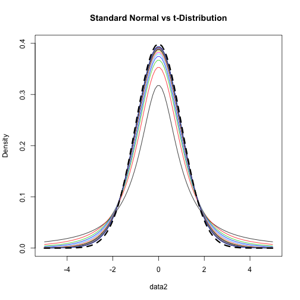
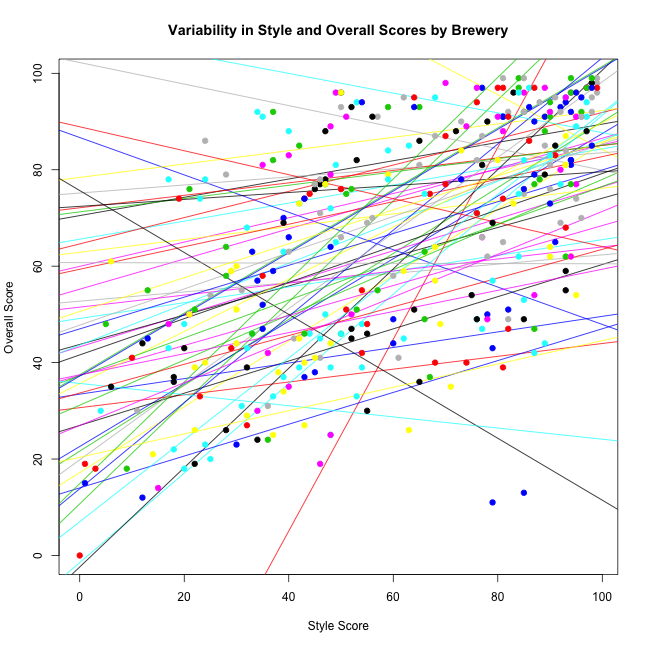
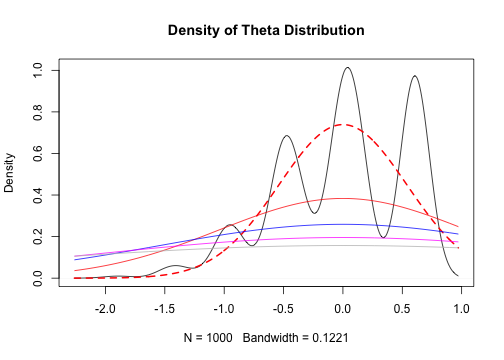

<style>
em {
  font-style: italic
}
</style>

<style>
strong {
  font-weight: bold;
}
</style>

## Today's Agenda 
* For loops (most of the day)
* While loops
* Repeat loops (not the same thing as the repeat function) 

---- &twocol
## Basic overview: for loops

*** =left
<div align = "left">

</div>

*** =right


```r
a <- letters[1:26]
a
```

```
##  [1] "a" "b" "c" "d" "e" "f" "g" "h" "i" "j" "k" "l" "m" "n" "o" "p" "q"
## [18] "r" "s" "t" "u" "v" "w" "x" "y" "z"
```

```r
for(i in 1:5){
	print(a[i])
}
```

```
## [1] "a"
## [1] "b"
## [1] "c"
## [1] "d"
## [1] "e"
```

----
## Another basic example

Simulate tossing a coin, record results


```r
b <- rep(NA, 10)
b
```

```
##  [1] NA NA NA NA NA NA NA NA NA NA
```

```r
for(i in seq_along(b)) {
	b[i] <- sample(c("Heads", "Tails"), 1)
}
b
```

```
##  [1] "Heads" "Tails" "Heads" "Heads" "Tails" "Tails" "Tails" "Heads"
##  [9] "Tails" "Tails"
```

---- &twocol
## Basic example of nested for loops

*** =left


```r
m <- matrix(101:112, ncol = 3)
m
```

```
##      [,1] [,2] [,3]
## [1,]  101  105  109
## [2,]  102  106  110
## [3,]  103  107  111
## [4,]  104  108  112
```

*** =right


```r
for(i in 1:3) {
	for(j in 1:4) {
		print(m[j, i])
	}
}
```

```
## [1] 101
## [1] 102
## [1] 103
## [1] 104
## [1] 105
## [1] 106
## [1] 107
## [1] 108
## [1] 109
## [1] 110
## [1] 111
## [1] 112
```

----
## Batch processing with for loops
# Look at the HSB_pieces folder, within the data folder.


---- &twocol
## Load all files


```r
# List all files in directory
files <- list.files("./data/HSB_pieces/")
files
```

```
## [1] "NonWhiteFemaleHSB.csv" "NonWhiteMaleHSB.csv"   "WhiteFemaleHSB.csv"   
## [4] "WhiteMaleHSB.csv"
```

```r
# Create empty list
l <- vector("list", length(files))
l
```

```
## [[1]]
## NULL
## 
## [[2]]
## NULL
## 
## [[3]]
## NULL
## 
## [[4]]
## NULL
```

----
## For loop to batch read files


```r
for(i in seq_along(files)) {
	l[[i]] <- read.csv(paste0("./data/HSB_pieces/", files[i]))
}

# Name elements of the list according to the file name
names(l) <- substr(files, 1, nchar(files) - 4)
```

----
## Inspect the structure of the list


```r
str(l)
```

```
## List of 4
##  $ NonWhiteFemaleHSB:'data.frame':	1065 obs. of  5 variables:
##   ..$ id      : int [1:1065] 1224 1288 1296 1296 1296 1296 1296 1296 1296 1296 ...
##   ..$ minority: int [1:1065] 1 1 1 1 1 1 1 1 1 1 ...
##   ..$ female  : int [1:1065] 1 1 1 1 1 1 1 1 1 1 ...
##   ..$ ses     : num [1:1065] -1.248 -1.468 -0.148 -1.568 -0.288 ...
##   ..$ mathach : num [1:1065] 4.75 10.66 12.67 4.97 8.28 ...
##  $ NonWhiteMaleHSB  :'data.frame':	909 obs. of  5 variables:
##   ..$ id      : int [1:909] 1224 1224 1224 1288 1288 1296 1296 1296 1296 1296 ...
##   ..$ minority: int [1:909] 1 1 1 1 1 1 1 1 1 1 ...
##   ..$ female  : int [1:909] 0 0 0 0 0 0 0 0 0 0 ...
##   ..$ ses     : num [1:909] -1.528 0.142 -1.658 -0.328 -0.158 ...
##   ..$ mathach : num [1:909] 4.145 -1.688 0.122 10.171 5.552 ...
##  $ WhiteFemaleHSB   :'data.frame':	2730 obs. of  5 variables:
##   ..$ id      : int [1:2730] 1224 1224 1224 1224 1224 1224 1224 1224 1224 1224 ...
##   ..$ minority: int [1:2730] 0 0 0 0 0 0 0 0 0 0 ...
##   ..$ female  : int [1:2730] 1 1 1 1 1 1 1 1 1 1 ...
##   ..$ ses     : num [1:2730] -1.528 -0.588 -0.618 -0.888 -1.448 ...
##   ..$ mathach : num [1:2730] 5.88 19.71 -2.83 1.53 9.47 ...
##  $ WhiteMaleHSB     :'data.frame':	2481 obs. of  5 variables:
##   ..$ id      : int [1:2481] 1224 1224 1224 1224 1224 1224 1224 1224 1224 1224 ...
##   ..$ minority: int [1:2481] 0 0 0 0 0 0 0 0 0 0 ...
##   ..$ female  : int [1:2481] 0 0 0 0 0 0 0 0 0 0 ...
##   ..$ ses     : num [1:2481] -0.528 -0.668 -0.158 0.022 -0.998 -0.458 -0.468 0.332 -0.298 -0.078 ...
##   ..$ mathach : num [1:2481] 20.349 8.781 17.898 4.583 0.523 ...
```

----
## Create a new variable
For each data frame, we're going to create a new variable that is a
  standardized version of `mathach`. Note that this variable will be standardized relative to the specific group.


```r
# First, write a z-score function
standardize <- function(x) (x - mean(x, na.rm = TRUE)) / (sd(x, na.rm = TRUE))

# Next, loop through the list to create each new variable
for(i in seq_along(l)) {
	l[[i]]$math_z <- standardize(l[[i]]$mathach)
}
head(l[[1]])
```

```
##     id minority female    ses mathach     math_z
## 1 1224        1      1 -1.248   4.753 -0.6949256
## 2 1288        1      1 -1.468  10.664  0.2485645
## 3 1296        1      1 -0.148  12.668  0.5684350
## 4 1296        1      1 -1.568   4.968 -0.6606082
## 5 1296        1      1 -0.288   8.278 -0.1322792
## 6 1296        1      1 -1.088   6.244 -0.4569382
```

----

```r
str(l)
```

```
## List of 4
##  $ NonWhiteFemaleHSB:'data.frame':	1065 obs. of  6 variables:
##   ..$ id      : int [1:1065] 1224 1288 1296 1296 1296 1296 1296 1296 1296 1296 ...
##   ..$ minority: int [1:1065] 1 1 1 1 1 1 1 1 1 1 ...
##   ..$ female  : int [1:1065] 1 1 1 1 1 1 1 1 1 1 ...
##   ..$ ses     : num [1:1065] -1.248 -1.468 -0.148 -1.568 -0.288 ...
##   ..$ mathach : num [1:1065] 4.75 10.66 12.67 4.97 8.28 ...
##   ..$ math_z  : num [1:1065] -0.695 0.249 0.568 -0.661 -0.132 ...
##  $ NonWhiteMaleHSB  :'data.frame':	909 obs. of  6 variables:
##   ..$ id      : int [1:909] 1224 1224 1224 1288 1288 1296 1296 1296 1296 1296 ...
##   ..$ minority: int [1:909] 1 1 1 1 1 1 1 1 1 1 ...
##   ..$ female  : int [1:909] 0 0 0 0 0 0 0 0 0 0 ...
##   ..$ ses     : num [1:909] -1.528 0.142 -1.658 -0.328 -0.158 ...
##   ..$ mathach : num [1:909] 4.145 -1.688 0.122 10.171 5.552 ...
##   ..$ math_z  : num [1:909] -0.9376 -1.7968 -1.5301 -0.0499 -0.7303 ...
##  $ WhiteFemaleHSB   :'data.frame':	2730 obs. of  6 variables:
##   ..$ id      : int [1:2730] 1224 1224 1224 1224 1224 1224 1224 1224 1224 1224 ...
##   ..$ minority: int [1:2730] 0 0 0 0 0 0 0 0 0 0 ...
##   ..$ female  : int [1:2730] 1 1 1 1 1 1 1 1 1 1 ...
##   ..$ ses     : num [1:2730] -1.528 -0.588 -0.618 -0.888 -1.448 ...
##   ..$ mathach : num [1:2730] 5.88 19.71 -2.83 1.53 9.47 ...
##   ..$ math_z  : num [1:2730] -1.11 1.028 -2.455 -1.782 -0.553 ...
##  $ WhiteMaleHSB     :'data.frame':	2481 obs. of  6 variables:
##   ..$ id      : int [1:2481] 1224 1224 1224 1224 1224 1224 1224 1224 1224 1224 ...
##   ..$ minority: int [1:2481] 0 0 0 0 0 0 0 0 0 0 ...
##   ..$ female  : int [1:2481] 0 0 0 0 0 0 0 0 0 0 ...
##   ..$ ses     : num [1:2481] -0.528 -0.668 -0.158 0.022 -0.998 -0.458 -0.468 0.332 -0.298 -0.078 ...
##   ..$ mathach : num [1:2481] 20.349 8.781 17.898 4.583 0.523 ...
##   ..$ math_z  : num [1:2481] 0.824 -0.892 0.461 -1.514 -2.117 ...
```

----
## Your turn
* First create, a random normal matrix, **m**, of size $4 * 3$ with 
  $\mu =$ 100 and $\sigma = 10$. If you want your results to match those on the following slides, first run `set.seed(100)` before generating the random numbers.
* Write a for loop that returns the mean of each column (note, there are
  better ways to do this, but this is just for practice).
* Create an empty list of length four. Use a for loop to store the each row of
  the matrix into each of the four elements of the list.

----
## Matrix creation


```r
set.seed(100)
m <- matrix(rnorm(n = 12, mean = 100, sd = 10), ncol = 3)
m
```

```
##           [,1]      [,2]      [,3]
## [1,]  94.97808 101.16971  91.74741
## [2,] 101.31531 103.18630  96.40138
## [3,]  99.21083  94.18209 100.89886
## [4,] 108.86785 107.14533 100.96274
```

----
## For loops to calculate column means


```r
colMeans <- rep(NA, ncol(m))
for(i in 1:ncol(m)) {
	colMeans[i] <- mean(m[ ,i])
}
colMeans
```

```
## [1] 101.0930 101.4209  97.5026
```

----
## Store rows in list


```r
rows <- vector("list", 4)
for(i in 1:4) {
	rows[[i]] <- m[i, ]
}
rows
```

```
## [[1]]
## [1]  94.97808 101.16971  91.74741
## 
## [[2]]
## [1] 101.31531 103.18630  96.40138
## 
## [[3]]
## [1]  99.21083  94.18209 100.89886
## 
## [[4]]
## [1] 108.8678 107.1453 100.9627
```


---- &twocol
## A few things to note
* For loops requre you initialize objects

*** =left


```r
a <- rep(NA, 100)
for(i in 1:100) {
	a[i] <- rnorm(1, mean = 0, sd = i)
}
a
```

```
##   [1]   -0.2016340    1.4796810    0.3701385   -0.1172668   -1.9442712
##   [6]    3.0651375   -6.3966993   18.4823746   -3.9428098    7.6406062
##  [11]    2.8815742    9.2808552  -10.5869286   -6.1383080  -10.8033233
##  [16]    3.6951125  -19.6814009    4.4473679   -1.7311577   35.1475124
##  [21]   -2.8965218   -2.4462569  -15.8703294   -5.3230615    4.5726921
##  [26]   10.8504054   28.7658628   27.1656565   -2.9472479   42.0961047
##  [31]  -55.0800446   19.9317565  -17.2353506   44.9558525  -12.7204114
##  [36]   47.4863667    1.6198255  -71.3889235  -17.4354251  -69.5439179
##  [41]    7.3334588   79.6935594  -97.6927959   43.1404221  -62.9471527
##  [46]   83.9441315   64.9210403  -40.2648900  -12.8377930   -3.4422014
##  [51]  -19.3230614  134.2618642    6.8812093  -38.5033489   35.0896834
##  [56]   11.2947291   -3.9852660   -5.3644128   26.4852931  -63.8613402
##  [61]  -70.9075787  102.2083483 -129.9120492    0.8159821  -70.6893427
##  [66]   17.8556066   67.5662755 -141.0595233   61.8807368   -3.4997037
##  [71]  -95.5198010 -139.0472305   51.7994556  -11.6849724   16.2275905
##  [76]   62.1195178  132.9925331   -8.0940828  -44.0126610  114.2641144
##  [81]  -72.3295496  -94.9208417  -44.0146058  205.4373516  -70.7621428
##  [86]   35.5627070 -102.5454332 -103.3150587  -29.6301782  122.6802336
##  [91]  -42.6924079   77.5445582 -135.5934162  -37.6287565  -73.7596421
##  [96]  -35.4524651  120.2898415  -10.5285132   17.0867571   25.4601268
```

*** =right


```r
for(i in 1:100) {
	f[i] <- rnorm(1, mean = 0, sd = i)
}
```

```
## Error in f[i] <- rnorm(1, mean = 0, sd = i): object 'f' not found
```

---- &twocol
## No printing by default

*** =left


```r
for(i in seq(0, 500, length.out = 40)) {
	rnorm(100, 0, i)
}
```

What sort of object would you need to create to most efficiently store the
  results of this `for` loop?

*** =right


```r
for(i in seq(0, 500, length.out = 40)) {
	print( round( rnorm(100, 0, i), 2) )
}
```

```
##   [1] 0 0 0 0 0 0 0 0 0 0 0 0 0 0 0 0 0 0 0 0 0 0 0 0 0 0 0 0 0 0 0 0 0 0 0
##  [36] 0 0 0 0 0 0 0 0 0 0 0 0 0 0 0 0 0 0 0 0 0 0 0 0 0 0 0 0 0 0 0 0 0 0 0
##  [71] 0 0 0 0 0 0 0 0 0 0 0 0 0 0 0 0 0 0 0 0 0 0 0 0 0 0 0 0 0 0
##   [1]   7.83  11.35   1.56  -5.21  22.76  -7.68  10.90  -6.03  -6.19   4.08
##  [11]  -2.81  14.54   8.97  -6.02   1.22  12.99   5.85   5.34   3.03 -15.36
##  [21]  -3.25   3.02  -1.70  13.72 -16.78   9.60   2.27   2.77  -3.34   5.47
##  [31]  -6.99  -9.84 -13.92 -13.50   4.96  -0.96   4.45  21.43  -2.99 -16.60
##  [41]  12.11   5.59  18.62 -14.87  -8.94  16.08   0.21 -17.47 -21.74   2.89
##  [51]   6.67   5.53  -5.79  14.59   4.29  -7.69  -3.03  -8.54   4.40  -3.37
##  [61]  12.85  -7.80   0.59  22.06   0.06  28.69  14.71 -12.63  -6.64 -14.19
##  [71] -32.90 -20.21   9.34   9.12  21.20   7.38  -4.47   3.14  22.84  -0.66
##  [81]   5.93 -12.74  28.71 -16.49   0.88 -16.23  -3.64  -6.89  -6.28  -2.91
##  [91]  -5.22 -16.42 -12.60   8.54  17.29   5.79  -0.21 -14.07 -17.52  23.70
##   [1]  15.88  32.85 -35.10 -24.41 -10.61 -24.08 -30.01  -9.24   4.25 -27.63
##  [11]  16.66 -21.00  60.57   3.00 -53.94  24.94 -48.27 -47.47  -3.89   1.32
##  [21]  -1.83 -30.75  -3.51 -27.05 -25.14 -43.69  20.24 -34.13  -8.32 -22.31
##  [31] -11.14  29.24  42.25  16.47  15.58  41.36  -4.98 -17.13 -34.95 -26.76
##  [41]  24.09  57.51 -46.64  -8.44  -2.71   4.02 -26.19  28.69  52.15 -12.48
##  [51]  36.62 -30.59   3.69  37.30  23.16 -11.48   2.31 -12.33 -28.53 -19.06
##  [61]  24.25  -2.77 -28.26  44.54 -13.23 -25.58   1.92  41.55  -6.46  13.09
##  [71]   5.41  -7.74 -50.81 -18.66 -19.09  21.36  20.85  -3.46 -20.54  20.92
##  [81] -15.56 -28.82  19.12 -13.50 -16.11  21.83 -14.12  12.25 -32.46  34.36
##  [91] -18.21  47.80 -13.91  -6.70  21.59  47.77 -40.15  15.93 -21.83  39.94
##   [1]    8.91   24.98   50.89   -2.81   53.51  -10.49   10.86   10.49
##   [9]   -5.29   26.67   57.58   21.59   34.69    2.99   -4.11  -21.87
##  [17]   23.53  -47.40  -43.38   80.90  -28.79 -104.59  -19.73   24.46
##  [25]  -53.41  -40.47   23.06   45.75   14.70  -20.37  -45.33   26.18
##  [33]  -79.57   25.84   -2.48  -27.98  -39.99    5.15   38.89   32.94
##  [41]   11.13 -133.01  -66.01  -21.71  -37.87   -4.88   12.47   13.12
##  [49]    4.65   23.72    8.51   -4.52   52.39  -50.09   -6.56    9.78
##  [57]   14.25  -30.30  -17.71  -15.52    9.08   35.45   23.44  -49.11
##  [65]   -9.89   58.15    1.91   55.51   17.06   26.13   -9.94   11.71
##  [73]  -15.73  -19.12   28.41    0.09  -17.54   -6.21   34.40  -44.38
##  [81]  -28.95   34.92  -52.29   19.29   62.82  -49.35   -3.32   -1.93
##  [89]  -20.20  103.47   36.54   -9.37    4.54   31.36   15.49   53.65
##  [97]   11.13  -47.55    8.58   57.80
##   [1]   36.74   87.07  -31.79  -18.99  -39.86   41.18   66.99  -43.48
##   [9]  -30.30  -57.22    9.57   24.60    4.77   32.57   58.59    7.40
##  [17]   78.60   31.08    2.87   57.04  -80.40   59.93   83.41   12.63
##  [25]   12.13  -16.27   17.06   14.06    1.52   19.65   29.40    4.53
##  [33]   10.94   28.51    3.06  -30.89  -96.87  -79.30   27.76   -0.70
##  [41]  -21.42   14.68 -171.77  -11.88  -96.98   56.52   -9.32  -14.14
##  [49]   -1.13   54.64   14.57   72.07    1.72  -12.76   19.79   15.77
##  [57] -118.83   63.55  -22.03   11.55   39.15    3.34  -37.97   52.51
##  [65]   48.02  -16.45   16.81  -48.24 -106.11  -87.90  -40.32   20.39
##  [73]   -0.87   55.59  -17.56    7.70  -58.36   43.62  -48.78  -24.45
##  [81]  -20.82  -88.73   34.52    0.38   37.72    0.51  -50.62  -43.96
##  [89]   46.39   41.84  -59.20   21.32  -52.31   14.47    9.90  -56.24
##  [97]   48.17  -29.46   -9.22  -35.51
##   [1]   33.01   82.42   55.81  -56.90  -47.39   15.53    5.46  104.35
##   [9]  -40.05  -41.19   55.54  105.04   29.91  -58.29  -54.32  -45.56
##  [17]  -72.51   -8.15   30.16   25.57  -54.17   58.96  -94.56  132.22
##  [25]   19.92  -76.95  -34.08  -46.49  -23.80   54.78  -64.78 -139.66
##  [33]  -74.88   21.44  -93.89  -50.03    4.72   40.25  -78.31   33.52
##  [41]   68.95   63.64   24.98   29.69  -82.22  -24.46   80.75  -18.61
##  [49]   13.84  -41.70  -20.50   36.91  -22.48 -122.00   -1.15   15.98
##  [57]  -57.73   -4.13   44.45  -62.59   96.03    5.10  119.62   22.23
##  [65]   -1.80  -74.46    8.50   22.55  -75.84   -2.88   76.76   -4.68
##  [73]  -26.19   13.56 -197.44   30.08    8.37  -80.44  -74.87  137.62
##  [81]  -35.17  108.23  -77.88  -43.04    4.13  -54.52   47.23   82.78
##  [89]   42.99  -19.65 -141.00  -22.28   46.28   11.42  -86.84  -51.24
##  [97]   25.68  -53.28   17.37  -24.65
##   [1]  -43.65   -7.77    1.69  -41.54  -96.10   78.78   67.56  -71.80
##   [9]  104.69   -4.26   26.59  -33.42   -7.61   52.45   87.02 -142.63
##  [17]   99.73  -30.98   75.65   42.12  -49.44 -103.49    8.84  -69.05
##  [25]  -15.16  -49.05   51.67  -39.47   94.01  -44.85   14.60   36.35
##  [33]  -49.60 -101.82  -39.35    1.88   27.04  -51.54  -33.62  -31.36
##  [41]   76.84  -69.47  110.74  122.87    6.02  -99.15   64.85  -86.12
##  [49]   61.64  126.59   25.94   36.27 -110.28  -48.10   48.88  -33.29
##  [57]  -25.46  -86.94   66.03 -110.53   15.68 -120.31 -158.50   -0.95
##  [65]  -17.63  -67.05 -168.30   61.31   14.42   39.52  -43.78   98.86
##  [73]   77.72   14.14   19.20  -29.58   64.26   70.63  -56.84   14.42
##  [81]   -6.67   -9.47   68.38   27.15  -15.56  -18.39   83.09  104.68
##  [89]   34.30  119.99   28.04   33.36  121.99  -61.74  158.69   34.36
##  [97]    2.01   19.19   -1.92  -71.89
##   [1] -147.15  -41.90  -41.02  125.81   19.09  189.94 -147.55  -35.17
##   [9] -132.06   31.56 -128.60  112.78   17.61  -87.48  -77.76  -14.02
##  [17]   64.70   89.34  -35.37   63.66   39.75  -49.44    0.95   17.90
##  [25]  -85.07  -88.89  164.14 -212.61   91.78  130.94   55.25  125.71
##  [33]   63.24  110.43   73.82   89.87  -36.31   83.25 -112.36 -106.71
##  [41]  144.84  -40.37  -71.27   -4.51   41.02 -200.63  -60.86   23.04
##  [49]    6.36  131.94  160.34   18.55  -43.53   50.24    0.31   82.34
##  [57]   41.68 -109.32 -126.78   24.73   32.27  158.08 -126.97  -95.32
##  [65]   42.47  113.79   55.66   89.43  -50.39  -67.78   72.84 -127.00
##  [73]   97.80   81.41   13.90   37.81   43.50  -71.62  107.84 -114.82
##  [81]   19.40   55.36  101.39   15.13    2.85  103.50  -39.03  -41.52
##  [89]    8.29  -34.40    7.99 -100.74   12.63  131.38  -78.24 -150.24
##  [97]   10.69   45.84   71.42 -200.20
##   [1]    9.19  236.14   99.29  118.01   -3.58  129.05  114.28  -10.37
##   [9]   35.74   25.01 -187.43  129.02  -19.50  -96.03  -61.84  122.23
##  [17]  -96.67  -44.40    5.13   73.27   14.06  -46.49  169.37   55.02
##  [25]  -81.78  109.11   58.24  143.84   -6.07  -72.66 -207.76   64.80
##  [33]  158.07  -69.72  134.77  -32.99  -36.41 -139.87  -50.98 -100.72
##  [41]  148.02  112.84  226.50   12.42 -194.03  -65.56   26.69   -3.79
##  [49]   23.64 -109.37  -65.66  -58.81  126.92   -7.37  -75.23   62.58
##  [57]   92.97 -202.31 -125.39   14.25   18.57  -77.17  218.03   81.80
##  [65] -112.50   60.34  -23.37   39.13  118.85  -37.92  -93.70    5.71
##  [73]  175.36  -52.86   26.39  -79.20   80.76   40.89  175.44 -156.80
##  [81]  222.36  272.47 -185.57   21.33  167.95  -33.19 -154.19 -114.17
##  [89] -150.80   10.94   35.85  156.75  -67.39   75.67  -72.38 -107.39
##  [97]  -72.25  107.43  -20.25  -52.79
##   [1] -181.73   83.57   66.12   77.42  -76.69  -86.19 -152.94  -67.09
##   [9] -129.24  -85.78   69.69  -40.40  147.26  145.02  -62.09  192.42
##  [17]  -77.32   72.20   92.13  -52.81 -111.70    3.18 -211.24   43.99
##  [25]   26.43   40.79  -13.43   98.39 -149.57 -108.03  199.89  -21.08
##  [33]   78.18   -4.07    8.14  -12.34   73.49  -31.15 -190.28 -237.24
##  [41] -121.08   -1.14  -67.59 -107.93    1.94  117.50   10.77  -79.55
##  [49]   54.56   93.42   -1.99   20.19    3.69  -25.87  117.86   14.46
##  [57]  -79.22  154.83   62.01   86.48 -144.78  -99.30   -8.48  192.48
##  [65]   57.64   80.69  -56.54  139.31   96.08  -26.74  -92.80   56.01
##  [73]  223.36 -144.78   -5.10  -84.38  -97.86 -193.32  282.56 -150.76
##  [81] -102.66 -314.16  -15.55   14.64  269.01 -100.83  -38.06  116.96
##  [89]  134.51  -47.23  -22.72  125.87  108.62 -129.39  -58.64  -53.15
##  [97]  -51.67   -6.05 -115.49    9.33
##   [1]  -16.00  168.10  -53.29   33.32 -113.18  -22.67  -84.95  -20.79
##   [9]  -51.84  -44.53   70.57  -29.74  -23.65  139.87  155.62  -22.96
##  [17] -107.89   49.66 -108.62  138.93   42.14  129.50   99.73   83.21
##  [25]  -16.98  -24.06  -42.92  -95.77  152.97   23.20 -166.98  -43.97
##  [33]   88.31   27.12  113.71  144.41  -21.62 -174.81 -143.62  -35.50
##  [41] -220.33  -31.41  -30.86  -41.76   36.97 -170.76  -40.26 -204.75
##  [49]  -15.83 -280.60   97.72   62.11   84.97  193.30  -62.18  159.78
##  [57]   31.17  213.93  203.82   96.18  -50.43 -261.82 -138.75  -89.34
##  [65]  118.63 -104.59   85.77  -34.34   38.06  -28.86  179.34  -69.16
##  [73]   21.03  -12.13   20.04  -88.43  -80.33 -179.20   -1.76 -118.62
##  [81]  210.62  313.94  -72.73 -146.68  118.83  185.36   63.71   54.76
##  [89]  -29.67   51.79  -70.50  -88.86 -175.97   -9.93  -13.60   56.50
##  [97]  -36.53   80.79 -206.10 -117.37
##   [1] -223.49 -157.36   96.71  160.08  154.11 -152.86 -134.89 -227.52
##   [9]  140.74  112.97  115.66  -13.09  -44.04  273.45  -95.97   -6.92
##  [17]   16.92 -184.54   83.57 -146.72 -168.56 -258.84   13.56   26.89
##  [25]   50.98  131.72 -120.28  -54.02   16.98  131.26   21.51  321.58
##  [33]  188.55  -91.03  -16.12  -82.08 -240.15  -37.00  -22.09   30.21
##  [41]   58.50   43.85  -88.09  116.09 -160.82  244.24  268.70    5.69
##  [49]  -29.70 -136.58  -11.99  -39.05   21.92  276.95    4.21 -354.52
##  [57]   90.04  -10.66 -163.21  154.43  -88.88  127.59 -115.36   26.14
##  [65]   81.52  127.42   33.92  248.53 -153.06  -96.41   21.19   42.41
##  [73]   41.35  180.21  -66.00  -48.53  225.98 -210.97  415.92  -71.79
##  [81]  -32.41   70.18  201.37   19.67  -37.95  -58.60 -125.68   69.63
##  [89]  -37.02   11.30 -126.85  -84.60 -258.42   23.80  186.07  105.04
##  [97]  168.94  237.24  184.20  119.32
##   [1]  195.86    1.56   -5.96  -64.36 -235.33 -328.34 -186.07   78.64
##   [9]  130.13 -141.62  200.63 -133.81  148.59   66.91   86.05  -48.38
##  [17]  -12.71    0.50   79.06 -332.28 -140.39 -251.40  215.10  -48.54
##  [25]  267.04   28.77  -31.54  112.48    8.81  368.86 -177.66 -204.22
##  [33]  217.04  -45.61 -198.76  -16.25  208.59  217.12 -275.43   97.88
##  [41] -109.70   70.67 -233.00   56.98  -15.37  194.57    6.19  143.10
##  [49]  -97.26  188.73  115.04 -122.33 -116.28  105.04  -47.46  -29.66
##  [57]  287.28   20.66  -69.36 -326.18 -346.74 -181.10  -91.45  -90.33
##  [65] -125.03  199.70  104.98  -43.23 -233.81   63.47   47.19  -42.02
##  [73]  -61.60 -429.77  144.68 -102.71 -475.74  119.38   12.92  295.86
##  [81]    0.98  189.96    2.67   -3.21  212.15   75.63  171.49 -157.04
##  [89]  125.19  -62.13  -41.11   16.28  275.66    9.53  -41.06  253.10
##  [97]  -44.40  -85.46    4.15 -196.01
##   [1]   16.57  232.73  115.66   53.40  107.95 -349.12  -28.31  134.83
##   [9]  102.07  -71.14  136.02 -164.37   -7.40  226.15 -112.26  137.90
##  [17]  204.64   15.52  -78.60 -105.20 -205.58  -17.27  -87.87  163.01
##  [25]  117.18  -62.64  -66.58   11.06  177.98  -18.93  170.71  -63.98
##  [33]  141.67  -61.39  270.01 -158.53 -217.62  -29.06  -71.08  -74.24
##  [41]  -80.11  241.67  171.39 -119.94  -34.63  201.02  -82.90 -112.82
##  [49]  265.44  132.66  104.22   32.71   -2.61 -454.68  314.51 -135.93
##  [57]   -0.06 -134.80  -52.00  155.48    9.05   14.40 -101.06   -0.52
##  [65]  372.25 -120.57  105.07   77.99  -25.90   82.24   72.60  219.30
##  [73]  -35.19  169.42  -95.97    6.07  187.87   54.80  197.73  139.53
##  [81]  393.65   77.77   29.84   51.12   92.03 -218.08  -90.55   41.25
##  [89]  131.01   79.00 -244.50   40.10 -160.70  232.89  -68.50  402.16
##  [97]  -91.46   70.15  -81.49  258.53
##   [1] -152.69 -339.62 -193.94 -115.02  -38.52  313.50  250.60  -95.82
##   [9]  -88.22  111.77  -66.80  151.26 -130.06 -280.72  -25.11   53.31
##  [17] -138.89 -202.50    6.32  -28.81 -101.26   51.93    5.49  135.99
##  [25]  -58.47 -111.39   24.97   48.12   21.00  145.78  121.01  280.35
##  [33] -121.28   -8.83  -75.39  -83.35  -99.28  184.54  -88.81 -205.90
##  [41]  221.14  112.54   37.65 -111.88   65.96 -134.26   29.66   97.89
##  [49]  258.46   -0.54 -477.48   46.99 -115.51  -17.94   89.69   -9.30
##  [57]   -5.53  222.25  -26.29  128.42  176.71  -14.58  -58.69 -217.88
##  [65] -121.52  232.09  -53.72 -191.63  -31.91 -364.81  138.61 -212.04
##  [73]  -73.97   24.77   33.86  -77.66 -241.26  172.06 -134.10  -47.33
##  [81]   27.51  -94.15 -134.59  -54.32   58.00  164.96  -43.57   59.54
##  [89] -346.51  -16.79   27.63  268.77  -42.45 -282.70 -217.63 -122.53
##  [97]    3.52  258.59    2.67  243.80
##   [1]  -90.38   32.50 -107.86   84.88  -19.08   14.87   13.31    6.72
##   [9] -175.48   83.49 -319.41    5.60  165.38   10.52  119.82  120.77
##  [17]    8.36   87.21  -77.75   88.26 -164.54  131.98    7.51 -271.72
##  [25]  -39.58  271.51   50.77 -389.78  118.80  241.37   97.23  -14.61
##  [33] -226.28  141.96  -64.49  337.20  226.92 -182.25   -0.84 -269.42
##  [41] -127.43  210.75 -168.63 -146.69   70.63 -313.07   21.39  -16.49
##  [49] -155.44   66.84  289.75   92.93  173.33  -20.23 -191.78 -127.33
##  [57]  252.63   57.78   78.97 -442.01 -101.73 -134.21  -18.33  -17.87
##  [65]   93.35 -164.49  -87.81  137.17  108.22   27.87  242.15 -153.15
##  [73]   72.75  -46.37   81.04 -207.91  -50.58 -395.54  177.77  -45.83
##  [81] -304.08 -140.96  150.97 -426.04  242.80 -192.93   68.54   -5.82
##  [89]  278.78 -113.01  151.76 -155.36 -358.27  125.63  391.21   54.06
##  [97]  179.17 -163.83  -79.74 -133.76
##   [1] -213.74  177.07  130.39   31.50  305.55   47.66  -86.76   -1.83
##   [9]  -82.19 -115.00 -186.56  -99.50  295.88   27.11 -172.14  182.50
##  [17]  115.93   29.23  357.04 -225.91  213.33  -59.92 -206.90   36.66
##  [25]  185.47  -87.42   88.72  159.95  216.02 -131.23  -36.78 -307.39
##  [33]  104.93 -192.71  191.75 -232.55  136.15   82.45  -69.19 -309.13
##  [41]  432.62  200.86  389.64   84.98  260.59  164.78  -91.45  -39.23
##  [49] -236.02    3.93  159.80 -207.96  -23.73    8.20 -105.30  -67.41
##  [57]  112.20  161.63  138.92 -106.89  -40.99 -210.45  102.60 -202.85
##  [65]  218.08  200.12  -29.36  -25.48 -230.57  227.62  202.89  257.34
##  [73]   27.48 -338.87  156.77  137.49 -229.79  -24.25   94.51  175.28
##  [81]  -86.63   16.47   81.75  -91.01 -318.90 -140.71  131.51  109.21
##  [89]  130.83  232.20  -10.56 -152.41  -55.99  488.00   45.20  -25.22
##  [97] -183.35  174.16  -41.81  296.01
##   [1] -288.16 -208.67  248.72  187.52 -449.82 -276.33  -13.83  -54.68
##   [9] -122.47  105.53  198.91  290.08 -151.62  -92.13  153.70  195.68
##  [17]  211.87 -106.16  -11.85   77.22  -61.60   98.69  177.78  129.69
##  [25] -189.10  170.27   77.58   87.77  -75.57   -6.05  104.56   16.62
##  [33] -108.35   52.08   40.01  -79.09   49.44   63.24  215.31 -238.47
##  [41]  100.85  -63.35  -60.17 -121.12  243.82 -167.16 -217.75  106.85
##  [49]  367.35  326.74   14.70  -84.15 -192.28  207.00  -47.41 -125.36
##  [57]  132.67 -188.35    8.12  -44.20   21.62  193.25   85.52 -721.98
##  [65]   89.32  -19.55   -0.01 -204.06  307.26  119.41 -254.13 -244.75
##  [73] -142.67  -85.62  -28.90   75.05 -150.93  134.71 -142.91 -360.02
##  [81]  439.24 -179.65 -156.57  129.75   71.17  -40.61  -71.83  311.74
##  [89] -134.19  209.74  -75.85 -243.18 -125.05   83.98 -124.84  -17.44
##  [97] -202.08   32.34  155.24  188.96
##   [1]  -83.63  -64.37   95.89 -157.09  301.51   49.75  -33.92  692.28
##   [9]   77.46  173.90 -178.39  -58.34  159.42   -2.19 -161.35 -509.87
##  [17]  101.45  450.89  125.73 -498.63  356.12 -108.21  295.92  142.22
##  [25] -273.07 -165.48 -311.35  -62.34  -51.97  409.02  289.84   80.98
##  [33] -117.78  336.90 -189.74  316.97 -292.76  379.98  203.79   44.75
##  [41]  292.59 -522.92  -24.58   40.85   55.10   26.17  -24.19  264.27
##  [49] -439.95  302.57  162.11  480.14  -91.60   59.08  -53.81 -197.80
##  [57]  346.55  -69.17  269.76 -243.78 -321.95   44.77   51.23 -156.29
##  [65]  -80.52   91.64   50.21  -85.32   41.51   74.91   17.13    1.70
##  [73]  -55.21 -131.72  381.10  -61.51  309.86  284.83  265.88 -286.26
##  [81]  135.47 -107.85 -437.18  198.21  165.02 -206.34  172.86  350.52
##  [89]  -93.75   11.72  -24.31  131.53 -296.36  -88.70  602.90   -9.38
##  [97] -474.94  570.55  240.12  208.51
##   [1] -209.82  271.17 -342.60  120.37 -339.73  112.05  368.28 -438.39
##   [9] -560.13 -568.20 -122.08  184.35   82.35   92.33  135.29  -93.02
##  [17]   37.19  -83.80 -191.03  267.65    0.76  119.30   -2.86  161.87
##  [25] -162.52  285.51  249.83   76.24  -87.01  105.73   24.83    9.28
##  [33] -354.53  164.97 -112.73  389.86  307.18  337.55 -219.07  -89.47
##  [41]   84.22 -103.00 -160.01  499.73    6.84  -31.27  370.01 -550.28
##  [49]  301.70  336.16  325.19   36.32  437.19  142.90   63.42  202.41
##  [57] -205.35 -108.92   62.15  646.04  114.58  -15.93  -84.05  182.70
##  [65]   19.14  107.31  -97.88  150.56  156.52  242.14 -203.95  224.63
##  [73]  -70.30  161.17 -175.90  233.93  -87.19  284.63 -163.01   43.18
##  [81] -223.90  -18.09   75.96   83.56 -238.05   15.54  -97.08  154.74
##  [89]  281.32 -433.60  263.99  272.44 -378.70  -40.09  156.33  453.60
##  [97]  656.45  320.82 -316.58  108.26
##   [1]  234.56 -139.06   65.09  493.90  352.15  690.87  179.88  -59.02
##   [9] -158.74  -83.50   46.36  544.94 -214.49  258.02   11.38 -866.01
##  [17]  442.63  562.38  -42.37  382.15 -242.74  143.96   41.35  141.59
##  [25]  185.83 -367.99  -70.44  140.85  155.79   77.91   84.80    7.25
##  [33] -251.97   -0.04   57.23 -501.89  339.92 -206.21 -620.88  -50.64
##  [41] -516.43  226.64  269.57  458.52 -200.44 -110.85  314.97  -86.39
##  [49] -249.34    2.85  -44.14  250.05 -272.72 -103.42 -336.49  -86.23
##  [57]  -53.14  280.90  153.82  -31.52  209.21 -431.81  118.17 -363.23
##  [65]   58.31 -444.56   -1.32  -85.90 -336.35 -416.63  283.07 -254.82
##  [73]  533.69 -124.06   25.02  253.57 -110.57 -517.09  -76.45  394.52
##  [81]  146.60 -230.39 -188.07   -9.21  -68.52 -108.62 -275.95 -121.43
##  [89]    6.72 -120.27 -293.09  120.15  132.85  175.75 -122.07 -238.09
##  [97] -563.85 -222.96  139.34   70.09
##   [1]  -69.22   38.59  228.62   10.14  291.95  -16.92 -209.61 -243.02
##   [9]   65.90    6.09 -494.82    4.30   12.29   -5.70  323.71 -203.38
##  [17] -172.91  276.20 -141.79    2.71  564.19   14.98  174.27 -441.89
##  [25]  -22.82  168.56   74.34  167.54  275.91 -294.09 -263.55  -82.39
##  [33]  -34.83   12.82   27.99 -112.04  465.67   85.92 -402.96 -305.84
##  [41] -369.54  488.03  451.49   91.72 -135.21 -398.34  199.38   -4.73
##  [49]  123.37  112.06  368.08 -172.08 -505.42 -331.48 -253.82   51.28
##  [57] -126.31   39.85   47.65 -364.72  -16.88 -207.28  396.78  -27.12
##  [65]  365.44  -88.32  -46.21  417.50  374.21  140.83   15.34 -292.40
##  [73]  131.25   34.95  -10.79 -126.24 -354.34 -244.17 -171.90  494.50
##  [81] -181.30  180.74   -5.54  176.77 -162.33 -353.34  360.58   46.56
##  [89]  548.02  328.51   -0.63 -258.21   32.97  226.29   58.08  162.65
##  [97] -162.70 -296.88   64.25 -270.18
##   [1] -361.67  177.84  128.37  156.15   89.86  384.29 -176.54 -165.41
##   [9]  250.34 -118.86  310.74 -190.14  269.96 -421.40  274.16  404.71
##  [17] -217.07  397.47 -365.81 -737.11   86.52  407.72   10.09 -142.84
##  [25]  931.37 -548.35 -176.15 -636.36 -270.51  -35.78  494.50  340.23
##  [33] -507.81   42.66  -39.47  414.55  -83.32  367.01   15.94 -249.11
##  [41] -207.15  -45.31 -247.13 -158.74 -253.55  -49.90  227.40 -210.14
##  [49] -183.37 -167.96 -154.15   15.67  597.93 -442.75  327.19  157.31
##  [57]  -30.01 -389.44  -71.31 -175.88 -124.41   90.57 -544.22 -154.80
##  [65]  127.44  308.61   68.34  -26.06   10.61  445.70 -148.79  499.67
##  [73] -210.81 -142.70  -83.87  187.22   20.52  102.64 -188.63 -243.24
##  [81]   38.96 -185.30  616.49   74.13  412.50 -295.85  538.88  280.04
##  [89] -110.02  160.09 -176.34 -129.79  411.28 -251.86  343.55  160.84
##  [97] -138.43 -203.99   17.59  344.36
##   [1]  174.55  437.91   20.92  -98.58 -319.05   26.68  -45.85 -265.13
##   [9]  217.38 -183.15 -219.14 -366.50 -304.78  360.61  -72.63  151.03
##  [17]  -50.32 -205.02  194.77 -346.98 -160.25   50.29 -136.47 -163.46
##  [25] -296.73 -220.90  365.17 -503.61  315.02  -68.76  284.92 -183.51
##  [33]  198.45  234.55  451.38  223.66  -64.53 -180.09  428.07   89.68
##  [41] -345.03  111.97  192.65 -346.04  562.99 -126.87 -205.65 -417.69
##  [49] -167.82   55.59 -150.42  -40.68  219.07  271.15   33.07  -41.07
##  [57]  565.47  531.01 -257.89  -48.83 -288.72   21.68  339.37  775.57
##  [65]   94.27 -365.93  144.57 -194.85  257.04  201.97 -209.80  601.42
##  [73]  353.46  159.10  828.27 -386.77 -159.24 -329.94  128.83 -237.71
##  [81]   87.72  287.12 -289.13 -408.32  -40.31  543.54   23.61 -406.90
##  [89] -832.07  103.27  320.70 -381.04  215.50  269.08   31.51  -74.46
##  [97]  228.76   72.80  -15.40 -108.91
##   [1]  256.69  -22.86  205.11  -70.92 -424.97    9.15  -91.76 -119.30
##   [9]  205.38 -444.66  -15.62 -684.26 -318.19  137.51 -236.88 -188.70
##  [17] -216.53  -86.39  436.35  751.59  -95.51  186.85 -745.89 -166.09
##  [25]  -72.38  -11.71   -0.15   65.95 -107.79  -36.22  210.68  133.68
##  [33] -117.29  -63.25  272.29 -443.37  305.41 -201.52 -109.33 -284.74
##  [41]  157.98  503.64  655.83  420.06  372.51  110.98  867.82  574.79
##  [49] -252.74  318.82 -265.74  -96.38 -394.59 -243.64  527.53  102.18
##  [57]  381.01  188.52 -139.01 -105.24   76.85 -309.01  426.90  316.74
##  [65]  295.58 -298.86  261.26 -145.70  117.89 -209.42    4.42  -85.69
##  [73]  112.95  260.68 -198.16 -331.21  327.79  178.83   43.10 -195.72
##  [81] -316.83 -370.50 -270.41  143.57  -86.83  124.30  463.64  -30.67
##  [89] -273.73 -350.34  101.60 -173.42  -81.69  151.12   25.41   15.58
##  [97] -444.53   38.05 -205.49 -156.61
##   [1]   96.03 -229.72  323.43 -404.91  248.89  200.80  371.48  300.56
##   [9] -458.05 -284.66 -280.04 -376.51  -93.78 -125.45 -242.61  -17.11
##  [17]  -52.35  574.79  129.16  160.22   34.60  378.03 -117.82 -486.77
##  [25] -213.20  394.84  271.64  425.77 -257.26 -277.39 -635.80  478.37
##  [33]  448.73  -71.39 -855.63 -191.62 -409.32  -60.54 -187.70  306.35
##  [41]  330.13 -187.91  472.35  -70.60 -251.61  147.64 -275.52  104.79
##  [49]  615.64 -414.75   39.44 -159.96   76.48 -214.12 -570.85  263.83
##  [57]  350.34 -374.31 -382.22  528.16 -211.22 -509.31 -561.88 -411.15
##  [65]  -39.24 -413.43 -238.27 -212.13 -255.62   62.42  236.82 -693.59
##  [73]   23.16   82.87  403.73  507.54  204.14 -287.31 -103.26  454.35
##  [81]  152.88  210.00  196.39 -277.10  204.01  229.67  -54.77  -51.84
##  [89]   86.35  475.61  459.46 -524.01  202.94 -323.77  187.02 -176.03
##  [97]   78.28  287.35 -145.96 -338.46
##   [1]  276.27 -159.95 -227.19 -260.97  -88.50  312.51  814.34 -167.39
##   [9] -503.97  512.81 -336.86  180.78   88.74 -114.39  284.05 -354.17
##  [17] -492.61  140.75 -221.88  188.80 -552.60 -109.02   67.87 -301.01
##  [25]  -87.72 -388.68 -737.29 -337.83 -200.28 -322.84  356.92  -48.98
##  [33] -185.42  343.08 -852.99  650.68   23.91 -194.36 -266.25  128.24
##  [41]   24.55 -365.40  173.81  -40.78  213.56 -170.26   94.20 -931.18
##  [49]  -39.78 -194.83  203.67  132.60   27.17 -330.95   90.06  512.45
##  [57] -527.82   93.11 -207.93 -154.76   -9.41  291.99  -86.77 -229.09
##  [65]  402.18  170.32  -82.34  472.47 -577.33  686.39  332.19 -378.39
##  [73]  162.85 -117.90  293.26  -99.84 -429.29 -389.34 -462.65 -381.52
##  [81] -374.94   87.95  -25.67 -684.25 -464.87 -321.23 -303.23  -60.86
##  [89] -273.88 -165.64 -307.32 -813.63   33.60 -141.55  185.65 -121.94
##  [97]  175.37   53.18 -376.28  434.89
##   [1]   78.38   58.96   41.14  -59.29 -318.23 -117.68  148.95  106.29
##   [9] -195.79  411.91  606.22  322.52 -310.15 -466.75  501.21 -166.93
##  [17] -422.06 -429.33 -280.66  146.64  -11.15  -41.93 -140.98 -797.78
##  [25]  250.83  481.31 -343.05  -43.36  -70.65  588.96  530.90 -430.16
##  [33]  220.45  177.20  317.40  279.47  297.61  536.31  -64.76  302.06
##  [41]   69.52  626.94 -247.98   -5.11  732.94  584.59  118.03 -553.19
##  [49] -198.45 -486.50   30.44 -416.10 -150.76  348.14 -290.60 -331.41
##  [57]  215.54  410.10  157.03 -136.81  -50.27 -252.44 -163.20 -300.48
##  [65] -110.65  236.18   48.69 -312.97   18.66 -367.22  326.54  256.55
##  [73] -189.68 -769.42 -441.85  732.08 -113.37 -159.67  216.57 -371.08
##  [81] -620.80 -290.31 -149.79  182.43  -78.41 -759.29 -549.41  -53.78
##  [89]  264.98 -351.83 -138.46  682.11  413.91 -131.71  647.51 -552.12
##  [97]  -18.69  507.10 -194.53 -337.82
##   [1] -821.93  116.26  135.39 -253.22   14.43 -818.22  105.38   90.59
##   [9] -342.39  382.27 -255.91  100.81  -93.10  143.50 -254.08  -44.96
##  [17]   20.72 -134.03  126.46 -453.38  451.17 -469.78 -390.10  292.98
##  [25]  330.84  432.81 -291.11 -486.06 -172.15  283.56  265.29 -203.68
##  [33] -282.01  178.32  -69.34 -159.47   12.52  371.72   -8.62 -283.69
##  [41]  723.16  108.46 -179.80    7.89 -175.36 -133.75  357.57  347.24
##  [49]   14.33 -175.35   65.68 -261.79  430.53  238.25  217.98 -249.02
##  [57]  -34.22  633.46 -159.50 -199.92  -52.40 -247.55 -277.53 -374.10
##  [65] -631.52 -171.27  443.86  197.41 -209.83  157.69  -37.05  800.88
##  [73]  201.11  162.53  272.48   21.70  374.40 -132.97  430.00  186.24
##  [81]  -99.80 -395.31  455.42 -455.40  123.41    2.52   24.11 -105.23
##  [89]   80.71  -58.15  -59.42  166.82 -254.38  626.32  134.90 -618.78
##  [97]  426.13  -61.37 -317.32 -144.13
##   [1] -297.53  769.35 -205.95  167.97  163.77  385.58 -158.95  305.94
##   [9]  166.47  666.81 -244.42   91.40 -177.54   97.50  683.53  556.72
##  [17]  373.38 -286.30  242.91 -117.14  -69.37  392.86  231.13 -114.49
##  [25]   62.35  567.08  539.38  686.50  118.18 -496.83  275.86  694.05
##  [33]  159.77   11.51 -106.09  366.83 -215.53  337.67  357.58  254.23
##  [41] -182.28  193.01  143.53 -109.88   92.16  491.60  749.65  515.34
##  [49]  309.43 -538.67 -459.96 -905.81  462.84  -35.78 -366.97   89.88
##  [57] -498.40   51.16  345.44 -778.77 -197.64 -166.02  155.56 -680.45
##  [65]  296.10 -220.04 -125.76  -79.52 -383.04 -111.24  357.09  570.73
##  [73] -440.14 -608.87  692.46  158.18  462.73 -835.17  239.16   72.71
##  [81]  218.97 -364.37  -49.25 -919.26 -175.55 -731.81  294.23  317.61
##  [89] -545.67  434.03  552.15  177.26 -535.61   49.80  335.64   28.96
##  [97] -696.68 -340.57  834.05 -111.57
##   [1]  -735.87  -392.59   222.70  -866.48   176.77   521.99  -355.80
##   [8]   461.91  -355.95   191.28  -317.18  -625.75  -188.22    68.05
##  [15]    89.09   -36.66  -191.14   158.12    27.83  -664.10  -123.40
##  [22]   127.59    58.68  -277.07    45.53  -259.88   301.52   -94.38
##  [29]  -172.55   -78.95   206.63  -655.16   441.47   520.56  -385.22
##  [36]   398.73   -76.88  -274.66   -37.43    37.95  -168.31    81.57
##  [43]   516.65   396.60   -30.82  -218.27  -153.94   -70.38  -292.94
##  [50]   654.42  -288.04    24.32   452.88   182.55   111.97  -207.63
##  [57]  -102.24   287.37  -268.95   201.92   615.41   376.75  -405.05
##  [64]  -127.98   -90.76  -393.02  -302.40  -314.22  -223.15  -559.81
##  [71]  -160.30   399.73  -252.07   406.35  -658.93   221.59   -40.58
##  [78]    15.59  -367.46   459.24  -222.75    93.72  -262.98   167.82
##  [85]   313.48   -32.95  -733.25  -621.48   264.95  -267.06  -250.60
##  [92]  -134.73   213.27   725.78   289.80 -1041.95  -766.67  -241.64
##  [99]  -693.47  -171.86
##   [1]  -430.99   -43.79   -45.32  -315.40  -821.14   409.81  -613.38
##   [8]  -152.55   308.47    51.62  -271.88  -299.94  -547.37  -145.91
##  [15]  -247.80   171.07   294.96   531.28   227.06   -48.88  -157.78
##  [22]  -665.59   301.02    53.04    63.65    31.00   501.56   962.77
##  [29]   483.26  1045.44    30.91   362.20  -131.28  -484.45   543.70
##  [36]   -87.11  -486.96  -229.38   774.33  -416.64   -87.26   -53.70
##  [43]   -75.55   243.28    19.33  -100.87  -557.12  -248.95   320.54
##  [50]  -199.75  -992.60   117.98  -145.59   775.57  -238.74  -362.24
##  [57]   218.83  -928.64    83.94  -187.99   471.27  -104.47   359.47
##  [64]   -42.15  -570.79 -1624.68   423.25   244.96   206.58   -67.13
##  [71]  -197.56   315.03  -794.02  -580.43  -362.46   367.88   -75.85
##  [78]  -176.36   142.86   177.14   -51.73   280.94    76.22  -328.65
##  [85]   497.85   390.01    61.04    -0.14   -63.32  -107.78  -218.77
##  [92]   140.40  -201.59   827.62    -5.41   290.77  -105.22  -307.10
##  [99]    24.28   738.47
##   [1]  156.17  253.45  380.04  557.47 -129.77 -217.78 -185.26  181.60
##   [9]  130.75 -373.64  118.90  643.20  146.99   48.35  233.07  200.52
##  [17]  241.77 -495.19 -705.79 -497.47  632.11  344.48 -114.96  341.99
##  [25]  -68.92  240.24   43.81  106.30 -173.84 -252.32  162.19 -245.27
##  [33] -608.91  460.09  432.82 -323.64  -72.83 -659.01 -316.56  323.98
##  [41] -230.60  103.19 -155.69 -511.83  169.31  150.04 -871.90 -201.11
##  [49]  192.97 -932.85  664.02 -152.85 -123.24  132.03  224.23 -530.29
##  [57] -165.04  265.54  238.26  619.12 -480.03  436.51 -273.18 -554.92
##  [65] -399.25 -141.36 -949.34 -528.12 -219.34 -399.59 -332.31  615.89
##  [73]  301.06  276.23  828.75  401.53  649.47 -321.01 -402.39  -58.30
##  [81]  -46.22 -250.55 -100.58  548.59   16.15 -268.90 -580.49  421.74
##  [89]  185.26 -491.45   20.71  377.90  878.63 -407.23 -174.32   49.57
##  [97]   87.68 -484.14  468.74   78.15
##   [1]   726.41   -20.44  -355.64  -731.60   -69.87   539.24   416.83
##   [8]    -7.19   123.89   113.28  -439.92    90.68  -363.19   282.68
##  [15]   165.25  -235.41   474.28 -1026.16   658.19   183.01   383.78
##  [22]  -772.68  -213.38   246.10  -223.72  -337.92   465.99   184.67
##  [29]  -254.17   176.53   289.02   415.92   -12.48   153.99  -142.16
##  [36]   494.95  -573.59   532.55  -265.12   428.92  -325.95   300.82
##  [43]  -244.54   -64.18  -491.85  -235.72  -111.75   275.51   309.28
##  [50]   -94.96    -5.12  -255.09    38.73  -669.73   118.18   -75.01
##  [57]   257.73   437.67   259.64  -495.08   334.82   481.06  -229.00
##  [64]   683.80    49.80   249.09  -145.85  -435.77   371.35   306.44
##  [71]   352.81  -100.45    16.40   553.46  -490.67   670.50   408.63
##  [78]  -108.64  -189.32  -192.30  -444.26  -820.54   222.79  -515.50
##  [85]  -171.15     4.20  -133.88   229.64   -77.97    98.44  -516.24
##  [92]   205.10  -448.68  -402.73   408.45   366.68  -113.14    49.58
##  [99]    75.77  -462.67
##   [1]   193.52  -238.28  -568.83  -303.38   588.23   -95.32  -986.67
##   [8]   224.14  -685.97   -17.91     7.85   366.78  -314.69    93.26
##  [15]  -351.60   139.11 -1041.57   192.98   290.13   213.39  -350.43
##  [22]   640.60     5.18   259.22  1106.18   190.47   426.71   405.12
##  [29]  -574.26  -436.17   222.22   380.39   144.76  -106.41   532.67
##  [36]   864.32  -197.90   -35.88   -33.54  -144.35   223.14   364.48
##  [43]   -68.36  -954.35   679.89  -159.31   145.23  -475.56  -274.56
##  [50]   103.60  -385.87    25.47  -190.65   253.19  -379.24    19.77
##  [57]    86.35   -27.36    42.69   228.27   597.95   282.95   494.07
##  [64]  -516.19   666.75   142.42  -494.16  -244.46  -115.05   643.95
##  [71]   221.29  -267.05  -454.68  -195.07  -343.05  -232.91   367.26
##  [78]   183.19  -340.53   477.82   143.21  -426.29  -489.17  -101.97
##  [85]   223.02   -47.85  -642.47   -90.83  -398.05   -43.22  -409.00
##  [92]  -325.55   366.85  -432.20   406.63   151.98 -1145.29   688.23
##  [99]    59.87   -59.61
##   [1]    79.42  -751.76    -8.59   768.42   -21.78  -419.56   262.96
##   [8]   674.76  -403.33  -264.52   420.66   108.00  -214.65    34.74
##  [15]   474.26   807.96  -773.09   577.22   175.19  -478.21   106.56
##  [22]  -108.73   351.56  -610.63    26.68  1168.89   147.30    92.54
##  [29]   -38.79   574.03  -141.69  -449.29  -306.21   683.59   122.02
##  [36]  -324.43 -1040.48 -1318.39   390.66   257.42  -644.26   262.79
##  [43]   616.51  -260.20   413.63  -457.96   385.44  -697.03   572.70
##  [50]   343.76    22.36  -522.42  -409.26  -151.13  -114.46  1216.25
##  [57]   251.85   788.52   -40.31  -174.17  -213.94  1083.10    63.26
##  [64]    18.82  -575.10   363.12   -90.65   373.25     7.45  -527.69
##  [71]    64.41  1053.70  -220.31   324.77    78.45   104.58   -38.29
##  [78]    57.68  -356.99  -412.31  -877.44   -20.71   696.37   220.57
##  [85]  -506.39  -392.51   428.71   479.46   166.80    -2.08   339.54
##  [92]   -43.03  -344.48   625.24  -136.68  1112.63   504.98   412.00
##  [99]   149.97  -413.29
##   [1]  -124.23   455.16  -394.44   999.18   237.12   247.92  -335.16
##   [8]   678.91    34.91  -178.95  -359.30 -1010.40   549.93  -378.38
##  [15]  -592.89  -642.65   741.71    90.55     6.68   113.58   104.53
##  [22]   432.79   124.81  -306.17   396.36   380.69  -397.28  -109.04
##  [29]   -41.37  -579.27  -586.55  -434.31   285.83  -465.12    59.46
##  [36]   519.56   347.59  -481.68   147.87   659.83 -1087.73  -664.32
##  [43]   410.68   164.70   191.64   232.53  -424.97   720.27   326.88
##  [50]  -130.60  -144.11   157.46     4.28    33.07  -163.71   127.18
##  [57]  -782.06   342.33  -488.94    82.31  -289.61   481.14  -353.46
##  [64]  -640.37    64.21   -34.66  -650.03   313.07  -345.43  -380.82
##  [71]  -746.53   548.51  -192.45  -471.28  -387.68  -301.77   509.26
##  [78]  -598.05  -724.83  -227.62   115.88  -467.78  -267.13   -35.68
##  [85]   354.01  -190.21   471.53 -1108.93   -70.28   205.48  -120.28
##  [92]   -45.15   -75.71  -285.96   513.67    53.49  -655.93  -256.44
##  [99]   433.24   529.26
##   [1]  689.63  -76.52  425.44  205.71   23.87  136.71  622.86 -267.63
##   [9]  493.33 -259.24  -74.86  147.80 -228.25  586.65 -691.95  439.67
##  [17] -458.17 -190.66 -573.04   13.25  -34.71  648.65  500.52  232.69
##  [25] -203.43 -124.60 -650.50 -291.60 -239.71  857.75  437.69   71.13
##  [33]  217.69  893.95  126.16 -147.36 -529.20  141.74 -677.67  -68.39
##  [41]  593.32  -55.05 1037.89 -428.15 -434.41  399.36 -327.36 -162.08
##  [49] -248.80   96.70  305.91 -334.99 -427.63  299.77 -321.50  722.06
##  [57] -272.08 -484.42 -434.24  376.16 -272.41  517.20  618.29  -12.45
##  [65]  633.73 -425.76 -849.53  107.51  312.53 -492.01  725.23  408.39
##  [73] -296.41 -708.29   55.45   92.91  340.16 -829.23  439.26   29.77
##  [81] -262.52  443.52  122.30 -541.00  239.44  275.03   39.68 -603.56
##  [89]   42.95 -221.20  120.95  313.69 -150.79 -682.29 -862.69 -434.51
##  [97]  264.33   36.55 -227.27 -588.79
##   [1]   538.42  -354.23  -267.74   -13.45   -77.46   620.83  -125.02
##   [8]  -310.80  -185.57   728.50  -274.23   875.27    95.11   105.27
##  [15]    88.57   151.66  -438.46   354.63   663.27  -837.85    26.00
##  [22]   -50.19   -58.70   -51.33  -552.18  -289.16   256.87   -26.96
##  [29]   -46.99   680.38   192.48  -750.23  -346.06   122.73  -478.61
##  [36]  -270.96  -369.63  -243.64  -136.03   108.97   142.65   419.08
##  [43]  -287.19  -808.81   399.49    99.30  1322.74   496.12    52.11
##  [50]   711.13  -108.90 -1181.98    10.99   899.12  -589.24   -67.82
##  [57]  -691.41  -269.73  -185.81   -87.04  -580.41  -288.13   982.90
##  [64]  -241.39  -141.07   822.11  -159.74   237.16  -342.38  1894.17
##  [71]  -793.39    -6.88  -134.15  -455.37  -213.76   417.28  -753.37
##  [78]   354.58  -537.90   385.06    92.17   -60.87   -39.78   165.11
##  [85]  -487.98   326.90   462.93  -301.56  -577.14  -373.94  -523.72
##  [92]   141.58  -598.76    -8.39   379.99    95.93   300.17  -303.94
##  [99]   205.36  -224.67
##   [1]  -621.79   -51.41  -585.20   894.53  -362.54  -151.51   132.54
##   [8]  -832.48   378.53  -106.01  -150.08  -156.91  -759.52   401.39
##  [15]   139.12   388.11   414.83   884.10  -481.35  -828.92   941.20
##  [22]   632.65   243.18   214.96    70.36  -600.00   551.23  -305.21
##  [29]   585.74  -320.22    32.85   425.28  -251.16  -768.61  -132.65
##  [36]  -494.25   190.36  -355.08  -530.06  -108.35  -351.70   666.88
##  [43]  -592.25   380.79   201.33  -362.79   242.85  -250.35  -189.56
##  [50]   368.82  -404.20  -288.16   266.05   308.50  1168.07   119.19
##  [57]  -311.55   218.84   408.05  -616.21  -895.69   446.51  -578.06
##  [64]  -214.37  -487.01  -514.69 -1080.71  -614.72 -1376.15  -251.92
##  [71]  -437.27  -704.21   -54.13  -644.54   563.72   619.53  -191.88
##  [78]   227.21   308.89   228.53   597.66  -136.32   245.08   803.02
##  [85]   582.26  -261.22   -47.87  -731.75  -309.39  1357.97   141.41
##  [92]   220.55  -662.12   229.65  -138.12  -615.01   217.13  -200.78
##  [99]  -222.35   375.82
```

----
## Storing random variables
# A bit of a convoluded nested for loop


```r
m <- matrix(rep(NA, 40*100), ncol = 100)

for(i in 1:40) {
	for(j in seq(0, 500, length.out = 40)[i]) {
		m[i, ] <- rnorm(100, 0, j)
	}
}
head(m)
```

```
##           [,1]       [,2]       [,3]       [,4]        [,5]     [,6]
## [1,]   0.00000   0.000000   0.000000   0.000000   0.0000000  0.00000
## [2,]  17.15808  -2.476363  -7.358526  12.281141  -0.8602777 15.65838
## [3,] -29.57301 -22.316825  21.276769   6.215364   7.5869387 31.71108
## [4,]  18.53503 -16.803256 -11.159468 -22.309801 -85.0600147 34.85136
## [5,] -10.58283  88.295955   7.962968  40.578377  34.0025056 51.74244
## [6,] 142.92708  36.176127 -59.918253  57.606241 113.7885382 32.45456
##            [,7]       [,8]       [,9]       [,10]     [,11]       [,12]
## [1,]   0.000000   0.000000   0.000000    0.000000   0.00000    0.000000
## [2,]   7.754137  -4.085729  16.419953   -1.067967 -22.65132    3.831958
## [3,]  -2.879273  -3.803274  -7.679799   13.083020 -19.87236   25.497315
## [4,]  20.833841 -23.193353 -57.338818   23.371369  13.21156   14.264091
## [5,] -54.621837   7.962333  31.574667  -44.199491  20.49615 -104.207346
## [6,] -22.018950 -67.238024   6.935963 -101.350406 -40.22205  -41.801909
##          [,13]     [,14]      [,15]     [,16]      [,17]       [,18]
## [1,]   0.00000   0.00000  0.0000000   0.00000   0.000000   0.0000000
## [2,] -17.47663 -11.15149  5.0295168  12.37988   4.149750   0.7932756
## [3,] -27.75584  47.61907  9.5175103 -25.49762 -24.056006 -10.8596950
## [4,] -18.55512 -30.70568 46.4126933  23.44447  20.425015   3.3375555
## [5,] -94.42404  -9.13566 44.6972395 -63.17979  94.838323  21.1853377
## [6,]  52.55140 111.78782  0.3802697 158.75291  -8.772762 -84.6013313
##          [,19]     [,20]      [,21]      [,22]     [,23]      [,24]
## [1,]   0.00000   0.00000   0.000000   0.000000   0.00000   0.000000
## [2,]  26.33389  15.21580 -12.655559   1.235258  11.75409   8.026788
## [3,]  20.15364  11.70060  -2.773402  20.868388   7.80084 -22.665198
## [4,]  33.01048 -19.46735 106.327788 -54.447038 -45.72678  35.152876
## [5,]  69.66991 -40.78722   5.800490   8.607129  22.84946 -11.562577
## [6,] -22.30786  46.56020 -14.016755   4.241410 -13.21229  21.882165
##           [,25]      [,26]     [,27]      [,28]     [,29]        [,30]
## [1,]   0.000000   0.000000  0.000000   0.000000   0.00000    0.0000000
## [2,]  -4.115039  11.163307  2.525500  -2.502326 -32.29864    4.4710929
## [3,]  12.782674 -29.367098 -3.060861 -23.673603  14.94229  -15.9132681
## [4,] -52.403778  -4.723491 64.100344 -11.580986  80.83909    9.7663595
## [5,]  57.519076 -32.434054  9.021932  24.691411  28.89675    0.3531922
## [6,]  60.358654 -49.331043 50.952610  12.593758  18.29170 -103.1041200
##             [,31]      [,32]      [,33]     [,34]     [,35]      [,36]
## [1,]   0.00000000   0.000000    0.00000   0.00000   0.00000   0.000000
## [2,]  -0.05241057   9.413437  -13.47833   6.59815 -15.25603   9.682837
## [3,]   4.23357017 -43.837033   -7.46568  24.57277  19.31753 -32.498472
## [4,]  41.26399941 -43.532440  -38.36194 -29.66669 -14.11129 -20.897922
## [5,]  18.44821728  90.863470  -19.53769 -28.50761 -62.98439 -66.957153
## [6,] -50.50702471  55.829979 -113.19472  91.80506 106.55223  31.971720
##           [,37]     [,38]      [,39]       [,40]      [,41]      [,42]
## [1,]   0.000000  0.000000   0.000000   0.0000000   0.000000    0.00000
## [2,]  -3.962685  3.739141 -12.494549  -1.8385578  -2.185439  -10.70331
## [3,]  76.710870  0.640596  -3.746091  52.9588555 -35.682527    2.25487
## [4,] -20.011418  8.051758  29.967052 -35.2045320 -61.853193  -30.41773
## [5,]  30.616615 -9.743057  21.688975   0.5722465  20.826355  118.77869
## [6,]  79.199868 46.052201 -74.081697  -8.7180620 -27.695978 -105.77708
##           [,43]      [,44]      [,45]      [,46]       [,47]      [,48]
## [1,]   0.000000   0.000000   0.000000   0.000000   0.0000000   0.000000
## [2,]  -3.782900 -10.592171 -18.911698 -21.600728   1.1818437   2.687921
## [3,]  -5.989716   2.973968  -3.760434  -2.597685 -31.0319979 -49.444781
## [4,]  10.457835 -59.598572 -35.303827  20.511160  22.8735003 -26.893173
## [5,]  -5.193724  -9.774633 -13.470008 140.862895 -16.4097434 -36.871211
## [6,] -56.166813 -30.783420 -82.042172  31.664132   0.4228221  11.126238
##           [,49]      [,50]     [,51]      [,52]      [,53]       [,54]
## [1,]   0.000000   0.000000   0.00000   0.000000   0.000000    0.000000
## [2,]   1.771754 -13.766496  22.81198   8.621292  19.628213  -15.450741
## [3,] -38.655837  -2.349381 -37.75027 -18.249975 -12.287742   16.731539
## [4,] -14.930612 -41.210782  53.42359 -57.226582  -9.497171    2.905126
## [5,]  34.182831 -18.091879 -26.69083  25.232165  67.377391 -107.159453
## [6,] 160.579530  -3.647247 -33.86951 -33.198970 -76.588762  -34.987525
##           [,55]      [,56]       [,57]      [,58]      [,59]     [,60]
## [1,]   0.000000   0.000000   0.0000000   0.000000   0.000000  0.000000
## [2,]  -6.244333   6.614586  -0.3272225 -13.870368  -4.056573 12.397017
## [3,]   2.536589  43.639619 -72.4292586 -32.529256 -23.884756 27.370369
## [4,] -14.850118  71.687908  30.8552234   8.351372  -4.943059 58.816267
## [5,] 115.625513 -67.509315 -29.0467835  18.750252  41.446148 -4.147892
## [6,]  47.770808 -18.128004 -55.5351603  73.615307 -70.662788 47.994835
##          [,61]      [,62]      [,63]     [,64]      [,65]     [,66]
## [1,]   0.00000   0.000000   0.000000   0.00000   0.000000   0.00000
## [2,]  11.79386  -9.652259   6.410428  14.68887   5.732915   3.91944
## [3,] -16.13403  40.444122  11.319779  43.33212  -7.499725  26.28687
## [4,]  33.62916  25.186366  -1.299195 -59.00115 -23.203315  36.80670
## [5,] -86.40499 -97.368797 105.540262 113.82389   5.540282 -40.78750
## [6,] -32.30602  66.096188 -88.129310 -52.73091 113.935763 -17.19966
##          [,67]      [,68]      [,69]      [,70]      [,71]      [,72]
## [1,]   0.00000   0.000000   0.000000   0.000000   0.000000   0.000000
## [2,]  19.40138 -10.657306   9.682225  -6.878207   9.273745 -12.648079
## [3,]  10.31016 -20.744902   5.158438  17.902435   8.467144  19.198787
## [4,] -45.07168   3.138525  -7.480459  14.646691  -5.240594  33.874550
## [5,]  50.35244  18.554273 -20.673079 -16.445215  25.309916  -8.616302
## [6,]  28.84871 -72.542504 -75.317182  -3.724335 -48.915151  13.272865
##          [,73]      [,74]       [,75]     [,76]       [,77]        [,78]
## [1,]   0.00000   0.000000   0.0000000   0.00000   0.0000000   0.00000000
## [2,]  10.99860   6.766805  -2.2350550  19.38627   0.3159278  -0.02375048
## [3,]  14.21538  49.196415   0.2145765 -11.90549 -35.9261008 -16.88388087
## [4,] -60.93910 -13.518774 -44.6877067 -38.56387  15.0067949  20.70332618
## [5,] -46.56150  48.635003 -35.7468876  50.39779  38.4588658 -21.51616453
## [6,] -22.69998  83.866920 -16.9944907  52.53072  79.3795117  61.43186761
##           [,79]     [,80]      [,81]      [,82]      [,83]       [,84]
## [1,]   0.000000   0.00000   0.000000   0.000000   0.000000   0.0000000
## [2,] -10.872574 -14.67650 -16.627459   2.469706   5.446098   4.6529434
## [3,]  39.067696  -2.17323  10.835446  17.018164  14.717397  -0.5121756
## [4,] -56.229027  20.28831   3.389371  24.680535  45.632009  24.9739995
## [5,] -21.581824 -54.94966  10.097625 -27.776653 109.141656  11.6353262
## [6,]   5.849308 -74.82934  29.514471  17.491537  46.572901 -50.0061444
##           [,85]      [,86]      [,87]      [,88]      [,89]      [,90]
## [1,]   0.000000  0.0000000   0.000000   0.000000   0.000000   0.000000
## [2,]  -4.743696 15.8144526  -4.208566  -6.029826   2.290216  -8.931408
## [3,] -20.737213 -5.2267919 -17.751596 -10.400145 -30.313620   4.530087
## [4,] -17.574236 -5.7107987 -25.942664  26.342416 -50.383434  -4.894678
## [5,]  21.379629 50.2659099 -44.113235 -48.851003 -57.536742 -14.141358
## [6,]  58.904847  0.3572754  24.447567 -74.486502  12.955289  83.345157
##           [,91]      [,92]      [,93]     [,94]      [,95]      [,96]
## [1,]   0.000000   0.000000   0.000000   0.00000   0.000000   0.000000
## [2,]   9.361034  -9.558861  -9.303856  13.59591 -11.872855  -3.992232
## [3,]  -3.328390 -36.695392 -11.451326 -10.40748   6.556257  21.822743
## [4,] -32.439666   8.914194  22.090450 -21.95757 -28.674349  28.626433
## [5,]   9.266969   8.171904   8.649397 -18.46903 105.515217  20.251799
## [6,]  13.433058  -8.668205 124.258005  40.04737  52.289861 -88.377501
##           [,97]      [,98]     [,99]     [,100]
## [1,]   0.000000   0.000000   0.00000   0.000000
## [2,]  -7.193925   7.671864  28.90202   8.666876
## [3,] -23.786832  33.810524   4.20925  -1.427832
## [4,]  13.136089  26.876882  63.01565  34.997857
## [5,]  87.268415 -27.331002 -25.87545 -40.198359
## [6,] 121.971434 -23.925800 -53.28089 -19.412959
```

---- &twocol
## Use the results for plotting

*** =left


```r
plot(-100:100, 
	seq(0, 0.02, 
		length.out = length(-100:100)), 
	type = "n",
	xlab = "Simulated value",
	ylab = "Density",
	main = "100 Random Normal 
	Draws w/Same Mean and Varying SDs")
for(i in 2:nrow(m)) {
	lines(density(m[i, ]), col = "gray")	
}
```

*** =right

 

---- &twocol
## A few more plotting examples
# Display likelihood of data, given a distribution: Half-Cauchy

*** =left


```r
data <- seq(0, 10, .1)
plot(x = data, 
	y = seq(0, 0.6, 
		length.out = length(data)), 
	type = "n",
	ylab = "Density",
	main = "Half-Cauchy Distribtuion")
for(i in seq(0.5, 10, by = 0.5)) {
	lines(x = data, 
		y = dcauchy(data, 0, i), 
		col = "gray")
}
```

*** =right

 

---- &twocol
## Student's $t$

*** =left


```r
data2 <- seq(-5, 5, length.out = 100)
plot(x = data2, 
	y = seq(0, 0.4, 
		length.out = length(data2)), 
	type = "n",
	ylab = "Density", 
	main = "Standard Normal vs 
		t-Distribution")

for(i in 1:20) {
	lines(x = data2, 
		y = dt(data2, i), 
		col = i)
}

lines(x = data2, y = dnorm(data2, 0, 1), 
	lwd = 3, lty = 2)
```

*** =right

 

----
## One last for loop example
* Load the beer data, fit a regression within each brewer between style and
  overall score. 
* Plot all the regression lines on one plot to get a sense of the intercept
  and slope variability.


```r
beer <- read.delim("./data/ratebeer_beerjobber.txt")
head(beer)
```

```
##                                  name                 brewer
## 1                     Abbey Monks Ale Abbey Beverage Company
## 2                  Abbey Monks Tripel Abbey Beverage Company
## 3                     Abbey Monks Wit Abbey Beverage Company
## 4 Alameda Barn Owl Imperial Brown Ale    Alameda Brewing Co.
## 5         Alameda Black Bear XX Stout    Alameda Brewing Co.
## 6       Alameda El Torero Organic IPA    Alameda Brewing Co.
##                     style abv ratings score.overall score.by.style
## 1             Belgian Ale 5.2      96            50             49
## 2            Abbey Tripel 8.0       3            NA             NA
## 3 Belgian White (Witbier) 5.1      46            23             19
## 4               Brown Ale 7.9      13            74             81
## 5           Foreign Stout 6.8     172            94             76
## 6    India Pale Ale (IPA) 7.2      56            74             43
```

----
## Fitting a regression model within each brewery

* First, remove cases with missing data on `score.overall` or 
  `score.by.style`. 


```r
beer <- beer[!is.na(beer$score.overall) & !is.na(beer$score.by.style), ]
head(beer)
```

```
##                                  name                 brewer
## 1                     Abbey Monks Ale Abbey Beverage Company
## 3                     Abbey Monks Wit Abbey Beverage Company
## 4 Alameda Barn Owl Imperial Brown Ale    Alameda Brewing Co.
## 5         Alameda Black Bear XX Stout    Alameda Brewing Co.
## 6       Alameda El Torero Organic IPA    Alameda Brewing Co.
## 8          Alameda Klickitat Pale Ale    Alameda Brewing Co.
##                     style abv ratings score.overall score.by.style
## 1             Belgian Ale 5.2      96            50             49
## 3 Belgian White (Witbier) 5.1      46            23             19
## 4               Brown Ale 7.9      13            74             81
## 5           Foreign Stout 6.8     172            94             76
## 6    India Pale Ale (IPA) 7.2      56            74             43
## 8       American Pale Ale 5.3      61            75             67
```

----

* Second, subset the data to only breweries with at least 3 beers (this is a
  really convoluted way of doing it, but works with the topics we've discussed so far. `tapply` would be a much better approach, which we'll talk about next class).


```r
splitd <- split(beer, as.character(beer$brewer)) # overide factor

nBeers <- data.frame(brewer = unique(beer$brewer), 
					 nBeers = rep(NA, length(unique(beer$brewer))))

for(i in seq_along(splitd)) {
	nBeers$nBeers[i] <- nrow(splitd[[i]])
}
beer <- merge(beer, nBeers, by = "brewer", all = TRUE)
head(beer)
```

```
##                   brewer                                name
## 1 Abbey Beverage Company                     Abbey Monks Ale
## 2 Abbey Beverage Company                     Abbey Monks Wit
## 3    Alameda Brewing Co. Alameda Barn Owl Imperial Brown Ale
## 4    Alameda Brewing Co.         Alameda Black Bear XX Stout
## 5    Alameda Brewing Co.       Alameda El Torero Organic IPA
## 6    Alameda Brewing Co.          Alameda Klickitat Pale Ale
##                     style abv ratings score.overall score.by.style nBeers
## 1             Belgian Ale 5.2      96            50             49      2
## 2 Belgian White (Witbier) 5.1      46            23             19      2
## 3               Brown Ale 7.9      13            74             81      6
## 4           Foreign Stout 6.8     172            94             76      6
## 5    India Pale Ale (IPA) 7.2      56            74             43      6
## 6       American Pale Ale 5.3      61            75             67      6
```

----
## Finally, subset the data and fit each regression model


```r
beer <- subset(beer, nBeers > 2)

regList <- vector("list", length(unique(beer$brewer)))
coefs <- vector("list", length(regList))

for(i in seq_along(regList)) {
	regList[[i]] <- lm(score.overall ~ score.by.style, 
		data = beer, 
		subset = beer$brewer == unique(beer$brewer)[i])
	
	coefs[[i]] <- coef(regList[[i]])
}
```

----
## Now plot all the regression lines


```r
plot(beer$score.by.style, beer$score.overall, 
	type = "n", 
	xlab = "Style Score", 
	ylab = "Overall Score", 
	main = "Variability in Style and Overall Scores by Brewery")

for(i in seq_along(coefs)) {
	abline(a = coefs[[i]][1], b = coefs[[i]][2], 
		col = i)
}
for(i in 1:nrow(beer)) {
	points(beer$score.by.style[i], beer$score.overall[i],
		pch = 21, 
		col = as.numeric(beer$brewer)[i],
		bg = as.numeric(beer$brewer)[i])
}
```

----


 

----
## Summary on for loops
* Very general
* Some say they are slower 
    * (They're wrong, see https://kbroman.wordpress.com/2013/04/02/apply-vs-for/)
* Pretty intuitive
* Have limitation (initializing objects, etc.)
* We'll contrast `for` loops with other the `apply` family of loops in the
  coming weeks.

----
## While loops
Evaluate a loop while a condition is `TRUE`. Break from the loop once the
  condition becomes `FALSE`. 


```r
index <- 0
while(index < 5) {
	index <- index + 1
print(index)
}
```

```
## [1] 1
## [1] 2
## [1] 3
## [1] 4
## [1] 5
```

----
## Skip elements

# Skip 2 


```r
index <- 0
while(index < 5) {

	index <- index + 1

	if(index == 2) {
		next
	}
print(index)
}
```

```
## [1] 1
## [1] 3
## [1] 4
## [1] 5
```

----
## While loop caution
* If the condition is not met, the loop will run infinitely. For example the 
  following code will run into eternity. Why?


```r
counts <- 0
while(counts < 10 ) {
	out <- counts + rpois(1, 10)
}
```

----
## Explicit breaks
(This is a pretty dumb example, because the while loop is junk, but...)


```r
counts <- 0
ptm <- proc.time()[3] # computer processor time: Third element is "real" time
while(counts < 10 ) {
	out <- counts + rpois(1, 10)
	if(proc.time()[3] - ptm > 10) {
		break
	} 
}
```

----
## While loop summary
* Conditionally carry out an operation while the condition holds (i.e., break
  once the condition is false)
* I personally do not use them regularly (but this doesn't mean they can't be
  useful)

----
## Repeat loops
* Repeat loops require an explicit break command. 
* They will repeat the body of the function continuously until the condition
  relating to the break is met.


```r
a <- 0
repeat {
	a <- a + 1
	
	if(a > 5) {
		break
	}
	print(a)
}
```

```
## [1] 1
## [1] 2
## [1] 3
## [1] 4
## [1] 5
```

----
## Cautions with repeat loops
The cautions with repeat loops are essentially analagous to those of while
  loops. If the brek function cannot occur, the loop will run in perpetuity. For example, the following will never break. 


```r
a <- 0
repeat {
	b <- 0
	a <- b + 1
	
	if(a > 5) {
		break
	}
	print(a)
}
```

----
## Real life example
Only time I've used a repeat loop to date was from my *r2Winsteps* package.
  This bit of code is from the *runWinsteps* function. The function writes out the neccessary text files to run an analysis, along with a .bat file, which can be used to call Winsteps. The function then opens the .bat file, prompting Winsteps to run, and then waits for Winsteps to complete the analysis. Once the analysis is complete, two new files should exist. This function repeats the `Sys.sleep()` function, prompting R to be dormant, until both files exist, at which point the rest of the function evaluated.


```r
repeat { Sys.sleep(0.1)
        
        if (file.exists(pfileName) == TRUE & file.exists(ifileName) == TRUE) 
            
        break
    }
```

----

The previous function also probably could have been written with a while loop.


```r
while(file.exists(pfileName) != TRUE & file.exists(ifileName) != TRUE) { 
	Sys.sleep(0.1)
    }
```
(Note the above code is untested)

----
## Lab
* Load the LSAT_theta data
* Use a for loop to calculate *p* values: The proportion of students corretly
  responding to each of items 1 through 5.
* Use a for loop to create a new *raw score* variable. Split the data frame by
  raw score.
* Use a for loop to create a new standardized version of *z1* within each raw
  score. Why does it fail for raw scores of 0 and 6?
* Move back to the standard lsat data. Plot the density of *z1*. Use a for
  loop to overlay  5 normal distributions with a mean equal to the sample mean, and standard deviations ranging from the sample mean to plus or minus 0.5 to 2.0 standard deviations by 0.5 invervals. Make each distribution a different color.

----
# Load the LSAT_theta data


```r
lsat <- read.csv("./data/LSAT_theta.csv")
head(lsat)
```

```
##   Item.1 Item.2 Item.3 Item.4 Item.5 Obs      Exp        z1     se.z1
## 1      0      0      0      0      0   3 2.277412 -1.895344 0.7954828
## 2      0      0      0      0      0   3 2.277412 -1.895344 0.7954828
## 3      0      0      0      0      0   3 2.277412 -1.895344 0.7954828
## 4      0      0      0      0      1   6 5.860769 -1.479314 0.7960948
## 5      0      0      0      0      1   6 5.860769 -1.479314 0.7960948
## 6      0      0      0      0      1   6 5.860769 -1.479314 0.7960948
```

----
# Calculate p values with a for loop


```r
pvals <- rep(NA, 5)
for(i in 1:5) {
	pvals[i] <- mean(lsat[ ,i], na.rm = TRUE)
}
pvals
```

```
## [1] 0.924 0.709 0.553 0.763 0.870
```

----
# Calculate raw scores 
(Again, there are better ways to do this. We're just practicing.)


```r
for(i in 1:nrow(lsat)) {
	lsat$raw[i] <- sum(lsat[i, 1:5])	
}
head(lsat)
```

```
##   Item.1 Item.2 Item.3 Item.4 Item.5 Obs      Exp        z1     se.z1 raw
## 1      0      0      0      0      0   3 2.277412 -1.895344 0.7954828   0
## 2      0      0      0      0      0   3 2.277412 -1.895344 0.7954828   0
## 3      0      0      0      0      0   3 2.277412 -1.895344 0.7954828   0
## 4      0      0      0      0      1   6 5.860769 -1.479314 0.7960948   1
## 5      0      0      0      0      1   6 5.860769 -1.479314 0.7960948   1
## 6      0      0      0      0      1   6 5.860769 -1.479314 0.7960948   1
```

----
# Split the data fram by raw score


```r
l <- split(lsat, lsat$raw)
str(l)
```

```
## List of 6
##  $ 0:'data.frame':	3 obs. of  10 variables:
##   ..$ Item.1: int [1:3] 0 0 0
##   ..$ Item.2: int [1:3] 0 0 0
##   ..$ Item.3: int [1:3] 0 0 0
##   ..$ Item.4: int [1:3] 0 0 0
##   ..$ Item.5: int [1:3] 0 0 0
##   ..$ Obs   : int [1:3] 3 3 3
##   ..$ Exp   : num [1:3] 2.28 2.28 2.28
##   ..$ z1    : num [1:3] -1.9 -1.9 -1.9
##   ..$ se.z1 : num [1:3] 0.795 0.795 0.795
##   ..$ raw   : int [1:3] 0 0 0
##  $ 1:'data.frame':	20 obs. of  10 variables:
##   ..$ Item.1: int [1:20] 0 0 0 0 0 0 0 0 0 0 ...
##   ..$ Item.2: int [1:20] 0 0 0 0 0 0 0 0 0 1 ...
##   ..$ Item.3: int [1:20] 0 0 0 0 0 0 0 0 1 0 ...
##   ..$ Item.4: int [1:20] 0 0 0 0 0 0 1 1 0 0 ...
##   ..$ Item.5: int [1:20] 1 1 1 1 1 1 0 0 0 0 ...
##   ..$ Obs   : int [1:20] 6 6 6 6 6 6 2 2 1 1 ...
##   ..$ Exp   : num [1:20] 5.86 5.86 5.86 5.86 5.86 ...
##   ..$ z1    : num [1:20] -1.48 -1.48 -1.48 -1.48 -1.48 ...
##   ..$ se.z1 : num [1:20] 0.796 0.796 0.796 0.796 0.796 ...
##   ..$ raw   : int [1:20] 1 1 1 1 1 1 1 1 1 1 ...
##  $ 2:'data.frame':	85 obs. of  10 variables:
##   ..$ Item.1: int [1:85] 0 0 0 0 0 0 0 0 0 0 ...
##   ..$ Item.2: int [1:85] 0 0 0 0 0 0 0 0 0 0 ...
##   ..$ Item.3: int [1:85] 0 0 0 0 0 0 0 0 0 0 ...
##   ..$ Item.4: int [1:85] 1 1 1 1 1 1 1 1 1 1 ...
##   ..$ Item.5: int [1:85] 1 1 1 1 1 1 1 1 1 1 ...
##   ..$ Obs   : int [1:85] 11 11 11 11 11 11 11 11 11 11 ...
##   ..$ Exp   : num [1:85] 8.94 8.94 8.94 8.94 8.94 ...
##   ..$ z1    : num [1:85] -1.04 -1.04 -1.04 -1.04 -1.04 ...
##   ..$ se.z1 : num [1:85] 0.8 0.8 0.8 0.8 0.8 ...
##   ..$ raw   : int [1:85] 2 2 2 2 2 2 2 2 2 2 ...
##  $ 3:'data.frame':	237 obs. of  10 variables:
##   ..$ Item.1: int [1:237] 0 0 0 0 0 0 0 0 0 0 ...
##   ..$ Item.2: int [1:237] 0 0 0 0 1 1 1 1 1 1 ...
##   ..$ Item.3: int [1:237] 1 1 1 1 0 0 0 0 0 0 ...
##   ..$ Item.4: int [1:237] 1 1 1 1 1 1 1 1 1 1 ...
##   ..$ Item.5: int [1:237] 1 1 1 1 1 1 1 1 1 1 ...
##   ..$ Obs   : int [1:237] 4 4 4 4 16 16 16 16 16 16 ...
##   ..$ Exp   : num [1:237] 5.95 5.95 5.95 5.95 13.58 ...
##   ..$ z1    : num [1:237] -0.463 -0.463 -0.463 -0.463 -0.573 ...
##   ..$ se.z1 : num [1:237] 0.812 0.812 0.812 0.812 0.809 ...
##   ..$ raw   : int [1:237] 3 3 3 3 3 3 3 3 3 3 ...
##  $ 4:'data.frame':	357 obs. of  10 variables:
##   ..$ Item.1: int [1:357] 0 0 0 0 0 0 0 0 0 0 ...
##   ..$ Item.2: int [1:357] 1 1 1 1 1 1 1 1 1 1 ...
##   ..$ Item.3: int [1:357] 1 1 1 1 1 1 1 1 1 1 ...
##   ..$ Item.4: int [1:357] 1 1 1 1 1 1 1 1 1 1 ...
##   ..$ Item.5: int [1:357] 1 1 1 1 1 1 1 1 1 1 ...
##   ..$ Obs   : int [1:357] 15 15 15 15 15 15 15 15 15 15 ...
##   ..$ Exp   : num [1:357] 13.9 13.9 13.9 13.9 13.9 ...
##   ..$ z1    : num [1:357] 0.0226 0.0226 0.0226 0.0226 0.0226 ...
##   ..$ se.z1 : num [1:357] 0.828 0.828 0.828 0.828 0.828 ...
##   ..$ raw   : int [1:357] 4 4 4 4 4 4 4 4 4 4 ...
##  $ 5:'data.frame':	298 obs. of  10 variables:
##   ..$ Item.1: int [1:298] 1 1 1 1 1 1 1 1 1 1 ...
##   ..$ Item.2: int [1:298] 1 1 1 1 1 1 1 1 1 1 ...
##   ..$ Item.3: int [1:298] 1 1 1 1 1 1 1 1 1 1 ...
##   ..$ Item.4: int [1:298] 1 1 1 1 1 1 1 1 1 1 ...
##   ..$ Item.5: int [1:298] 1 1 1 1 1 1 1 1 1 1 ...
##   ..$ Obs   : int [1:298] 298 298 298 298 298 298 298 298 298 298 ...
##   ..$ Exp   : num [1:298] 297 297 297 297 297 ...
##   ..$ z1    : num [1:298] 0.606 0.606 0.606 0.606 0.606 ...
##   ..$ se.z1 : num [1:298] 0.855 0.855 0.855 0.855 0.855 ...
##   ..$ raw   : int [1:298] 5 5 5 5 5 5 5 5 5 5 ...
```

----
# Create within-group standardized *z1* variable


```r
standardize <- function(x) (x - mean(x, na.rm = TRUE)) / (sd(x, na.rm = TRUE))
for(i in seq_along(l)) {
	l[[i]]$z1_z <- standardize(l[[i]]$z1)
}
str(l)
```

```
## List of 6
##  $ 0:'data.frame':	3 obs. of  11 variables:
##   ..$ Item.1: int [1:3] 0 0 0
##   ..$ Item.2: int [1:3] 0 0 0
##   ..$ Item.3: int [1:3] 0 0 0
##   ..$ Item.4: int [1:3] 0 0 0
##   ..$ Item.5: int [1:3] 0 0 0
##   ..$ Obs   : int [1:3] 3 3 3
##   ..$ Exp   : num [1:3] 2.28 2.28 2.28
##   ..$ z1    : num [1:3] -1.9 -1.9 -1.9
##   ..$ se.z1 : num [1:3] 0.795 0.795 0.795
##   ..$ raw   : int [1:3] 0 0 0
##   ..$ z1_z  : num [1:3] NaN NaN NaN
##  $ 1:'data.frame':	20 obs. of  11 variables:
##   ..$ Item.1: int [1:20] 0 0 0 0 0 0 0 0 0 0 ...
##   ..$ Item.2: int [1:20] 0 0 0 0 0 0 0 0 0 1 ...
##   ..$ Item.3: int [1:20] 0 0 0 0 0 0 0 0 1 0 ...
##   ..$ Item.4: int [1:20] 0 0 0 0 0 0 1 1 0 0 ...
##   ..$ Item.5: int [1:20] 1 1 1 1 1 1 0 0 0 0 ...
##   ..$ Obs   : int [1:20] 6 6 6 6 6 6 2 2 1 1 ...
##   ..$ Exp   : num [1:20] 5.86 5.86 5.86 5.86 5.86 ...
##   ..$ z1    : num [1:20] -1.48 -1.48 -1.48 -1.48 -1.48 ...
##   ..$ se.z1 : num [1:20] 0.796 0.796 0.796 0.796 0.796 ...
##   ..$ raw   : int [1:20] 1 1 1 1 1 1 1 1 1 1 ...
##   ..$ z1_z  : num [1:20] -1.21 -1.21 -1.21 -1.21 -1.21 ...
##  $ 2:'data.frame':	85 obs. of  11 variables:
##   ..$ Item.1: int [1:85] 0 0 0 0 0 0 0 0 0 0 ...
##   ..$ Item.2: int [1:85] 0 0 0 0 0 0 0 0 0 0 ...
##   ..$ Item.3: int [1:85] 0 0 0 0 0 0 0 0 0 0 ...
##   ..$ Item.4: int [1:85] 1 1 1 1 1 1 1 1 1 1 ...
##   ..$ Item.5: int [1:85] 1 1 1 1 1 1 1 1 1 1 ...
##   ..$ Obs   : int [1:85] 11 11 11 11 11 11 11 11 11 11 ...
##   ..$ Exp   : num [1:85] 8.94 8.94 8.94 8.94 8.94 ...
##   ..$ z1    : num [1:85] -1.04 -1.04 -1.04 -1.04 -1.04 ...
##   ..$ se.z1 : num [1:85] 0.8 0.8 0.8 0.8 0.8 ...
##   ..$ raw   : int [1:85] 2 2 2 2 2 2 2 2 2 2 ...
##   ..$ z1_z  : num [1:85] -1.69 -1.69 -1.69 -1.69 -1.69 ...
##  $ 3:'data.frame':	237 obs. of  11 variables:
##   ..$ Item.1: int [1:237] 0 0 0 0 0 0 0 0 0 0 ...
##   ..$ Item.2: int [1:237] 0 0 0 0 1 1 1 1 1 1 ...
##   ..$ Item.3: int [1:237] 1 1 1 1 0 0 0 0 0 0 ...
##   ..$ Item.4: int [1:237] 1 1 1 1 1 1 1 1 1 1 ...
##   ..$ Item.5: int [1:237] 1 1 1 1 1 1 1 1 1 1 ...
##   ..$ Obs   : int [1:237] 4 4 4 4 16 16 16 16 16 16 ...
##   ..$ Exp   : num [1:237] 5.95 5.95 5.95 5.95 13.58 ...
##   ..$ z1    : num [1:237] -0.463 -0.463 -0.463 -0.463 -0.573 ...
##   ..$ se.z1 : num [1:237] 0.812 0.812 0.812 0.812 0.809 ...
##   ..$ raw   : int [1:237] 3 3 3 3 3 3 3 3 3 3 ...
##   ..$ z1_z  : num [1:237] 0.0347 0.0347 0.0347 0.0347 -1.6716 ...
##  $ 4:'data.frame':	357 obs. of  11 variables:
##   ..$ Item.1: int [1:357] 0 0 0 0 0 0 0 0 0 0 ...
##   ..$ Item.2: int [1:357] 1 1 1 1 1 1 1 1 1 1 ...
##   ..$ Item.3: int [1:357] 1 1 1 1 1 1 1 1 1 1 ...
##   ..$ Item.4: int [1:357] 1 1 1 1 1 1 1 1 1 1 ...
##   ..$ Item.5: int [1:357] 1 1 1 1 1 1 1 1 1 1 ...
##   ..$ Obs   : int [1:357] 15 15 15 15 15 15 15 15 15 15 ...
##   ..$ Exp   : num [1:357] 13.9 13.9 13.9 13.9 13.9 ...
##   ..$ z1    : num [1:357] 0.0226 0.0226 0.0226 0.0226 0.0226 ...
##   ..$ se.z1 : num [1:357] 0.828 0.828 0.828 0.828 0.828 ...
##   ..$ raw   : int [1:357] 4 4 4 4 4 4 4 4 4 4 ...
##   ..$ z1_z  : num [1:357] -0.296 -0.296 -0.296 -0.296 -0.296 ...
##  $ 5:'data.frame':	298 obs. of  11 variables:
##   ..$ Item.1: int [1:298] 1 1 1 1 1 1 1 1 1 1 ...
##   ..$ Item.2: int [1:298] 1 1 1 1 1 1 1 1 1 1 ...
##   ..$ Item.3: int [1:298] 1 1 1 1 1 1 1 1 1 1 ...
##   ..$ Item.4: int [1:298] 1 1 1 1 1 1 1 1 1 1 ...
##   ..$ Item.5: int [1:298] 1 1 1 1 1 1 1 1 1 1 ...
##   ..$ Obs   : int [1:298] 298 298 298 298 298 298 298 298 298 298 ...
##   ..$ Exp   : num [1:298] 297 297 297 297 297 ...
##   ..$ z1    : num [1:298] 0.606 0.606 0.606 0.606 0.606 ...
##   ..$ se.z1 : num [1:298] 0.855 0.855 0.855 0.855 0.855 ...
##   ..$ raw   : int [1:298] 5 5 5 5 5 5 5 5 5 5 ...
##   ..$ z1_z  : num [1:298] NaN NaN NaN NaN NaN NaN NaN NaN NaN NaN ...
```

----
# Plotting


```r
dens <- density(lsat$z1)
plot(dens, main = "Density of Theta Distribution")
	lines(x = dens$x, y = dnorm(dens$x, 0, sd(lsat$z1, na.rm = TRUE)), 
		col = "red", lwd = 2, lty = 2)
for(i in seq(0.5, 2, by = 0.5)) {
	lines(x = dens$x, y = dnorm(dens$x, 0, (sd(lsat$z1, na.rm = TRUE) - 1)), 
		col = i*10)
	lines(x = dens$x, y = dnorm(dens$x, 0, (sd(lsat$z1, na.rm = TRUE) + i)), 
		col = i*20)
}
```

----


```
## Warning in dnorm(dens$x, 0, (sd(lsat$z1, na.rm = TRUE) - 1)): NaNs produced
```

```
## Warning in dnorm(dens$x, 0, (sd(lsat$z1, na.rm = TRUE) - 1)): NaNs produced
```

```
## Warning in dnorm(dens$x, 0, (sd(lsat$z1, na.rm = TRUE) - 1)): NaNs produced
```

```
## Warning in dnorm(dens$x, 0, (sd(lsat$z1, na.rm = TRUE) - 1)): NaNs produced
```

 

----

Note that this plot did produce some warnings, because we tried to calculate
  the likelihood of the data from a distribution with a negative standard deviation (i.e., the the question was sort of bogus, because the standard deviation was already very small).
