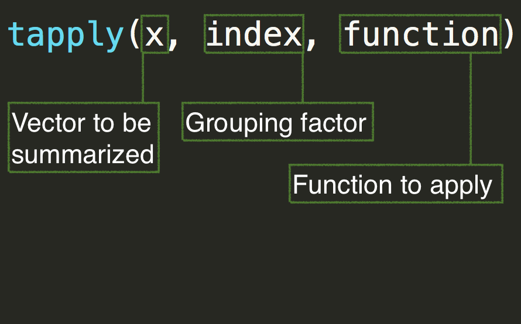

<style>
em {
  font-style: italic
}
</style>

<style>
strong {
  font-weight: bold;
}
</style>

## Today's Agenda 
* Apply family of loops
    + `apply()`
      - Also `rowSums()` and `colSums()`
    + `tapply()`
    + `lapply()`
    + `sapply()`
    + `mapply()`
* Similar functions
    + `by()`
    + `aggregate()`
    + `sweep()`

----
# Some basic background
* The apply family of loops are exceptionally useful, and can often speed up
  your code.
* Advantages over for loops include
	+ No need for initialization of objects
	+ Automatic indexing of an object (if you want)
	+ Simplification of results (can be a massive benefit)

----
## apply
Each of the members of the apply family function a little bit differently. The `apply()` function is probably the most straight forward.

<div align = "center">

</div>

----
## Examples of `apply()`


```r
m <- matrix(1:12, ncol = 4)
m
```

```
##      [,1] [,2] [,3] [,4]
## [1,]    1    4    7   10
## [2,]    2    5    8   11
## [3,]    3    6    9   12
```


```r
# Mean of each row
apply(m, 1, mean)
```

```
## [1] 5.5 6.5 7.5
```

```r
# Mean of each column
apply(m, 2, mean)
```

```
## [1]  2  5  8 11
```

----
## A few more examples: LSAT data


```r
lsat <- read.csv("./data/LSAT_theta.csv")
head(lsat)
```

```
##   Item.1 Item.2 Item.3 Item.4 Item.5 Obs      Exp        z1     se.z1
## 1      0      0      0      0      0   3 2.277412 -1.895344 0.7954828
## 2      0      0      0      0      0   3 2.277412 -1.895344 0.7954828
## 3      0      0      0      0      0   3 2.277412 -1.895344 0.7954828
## 4      0      0      0      0      1   6 5.860769 -1.479314 0.7960948
## 5      0      0      0      0      1   6 5.860769 -1.479314 0.7960948
## 6      0      0      0      0      1   6 5.860769 -1.479314 0.7960948
```

----
## Calculate raw scores


```r
lsat$raw <- apply(lsat[ ,1:5], 1, sum) # Only item-level data
head(lsat)
```

```
##   Item.1 Item.2 Item.3 Item.4 Item.5 Obs      Exp        z1     se.z1 raw
## 1      0      0      0      0      0   3 2.277412 -1.895344 0.7954828   0
## 2      0      0      0      0      0   3 2.277412 -1.895344 0.7954828   0
## 3      0      0      0      0      0   3 2.277412 -1.895344 0.7954828   0
## 4      0      0      0      0      1   6 5.860769 -1.479314 0.7960948   1
## 5      0      0      0      0      1   6 5.860769 -1.479314 0.7960948   1
## 6      0      0      0      0      1   6 5.860769 -1.479314 0.7960948   1
```

```r
table(lsat$raw)
```

```
## 
##   0   1   2   3   4   5 
##   3  20  85 237 357 298
```

----
## Calculate p values


```r
apply(lsat[ ,1:5], 2, mean, na.rm = TRUE)
```

```
## Item.1 Item.2 Item.3 Item.4 Item.5 
##  0.924  0.709  0.553  0.763  0.870
```
Notice that additional arguments to the function (in this case `mean`) just
  get passed as additional arguments to `apply()`.

----
## One more example


```r
att <- read.delim("./data/attitude.txt")
head(att)
```

```
##   rating complaints privileges learning raises critical advance
## 1     43         51         30       39     61       92      45
## 2     63         64         51       54     63       73      47
## 3     71         70         68       69     76       86      48
## 4     61         63         45       47     54       84      35
## 5     81         78         56       66     71       83      47
## 6     43         55         49       44     54       49      34
```

----
## Center all but *learning* (which we'll say is our outcome)


```r
center <- function(x) x - mean(x, na.rm = TRUE) # write the centering function
att2 <- att # copy dataset
att2[ ,-4] <- apply(att[ ,-4], 2, center) # apply the function to all but the 4th column
head(att2)
```

```
##       rating complaints privileges learning     raises   critical
## 1 -21.633333      -15.6 -23.133333       39  -3.633333  17.233333
## 2  -1.633333       -2.6  -2.133333       54  -1.633333  -1.766667
## 3   6.366667        3.4  14.866667       69  11.366667  11.233333
## 4  -3.633333       -3.6  -8.133333       47 -10.633333   9.233333
## 5  16.366667       11.4   2.866667       66   6.366667   8.233333
## 6 -21.633333      -11.6  -4.133333       44 -10.633333 -25.766667
##     advance
## 1  2.066667
## 2  4.066667
## 3  5.066667
## 4 -7.933333
## 5  4.066667
## 6 -8.933333
```

----
## Check that centering worked


```r
round( apply(att2, 2, mean, na.rm = TRUE), 2)
```

```
##     rating complaints privileges   learning     raises   critical 
##       0.00       0.00       0.00      56.37       0.00       0.00 
##    advance 
##       0.00
```

---- 
## Summing rows 

The following are equivalent


```r
apply(att, 1, sum)
```

```
##  [1] 361 415 488 389 482 328 392 428 478 403 387 387 373 450 482 443 513
## [18] 460 444 424 297 426 401 333 381 508 492 366 518 443
```

```r
rowSums(att)
```

```
##  [1] 361 415 488 389 482 328 392 428 478 403 387 387 373 450 482 443 513
## [18] 460 444 424 297 426 401 333 381 508 492 366 518 443
```
However, `rowSums` is optimized for speed (but it often doesn't have a huge
  practical impact)

----
## Summing columns

The same rules apply for summing collumns. The following are equivalent


```r
apply(att, 2, sum) 
```

```
##     rating complaints privileges   learning     raises   critical 
##       1939       1998       1594       1691       1939       2243 
##    advance 
##       1288
```

```r
colSums(att)
```

```
##     rating complaints privileges   learning     raises   critical 
##       1939       1998       1594       1691       1939       2243 
##    advance 
##       1288
```

but `colSums` is, again, optimized for speed

----
## Applying function by group

The `tapply()` function is useful for applying any generic function to each
  level of a grouping factor




----
## Load the beer data

```r
beer <- read.delim("./data/ratebeer_beerjobber.txt") # Load beer data
head(beer)
```

```
##                                  name                 brewer
## 1                     Abbey Monks Ale Abbey Beverage Company
## 2                  Abbey Monks Tripel Abbey Beverage Company
## 3                     Abbey Monks Wit Abbey Beverage Company
## 4 Alameda Barn Owl Imperial Brown Ale    Alameda Brewing Co.
## 5         Alameda Black Bear XX Stout    Alameda Brewing Co.
## 6       Alameda El Torero Organic IPA    Alameda Brewing Co.
##                     style abv ratings score.overall score.by.style
## 1             Belgian Ale 5.2      96            50             49
## 2            Abbey Tripel 8.0       3            NA             NA
## 3 Belgian White (Witbier) 5.1      46            23             19
## 4               Brown Ale 7.9      13            74             81
## 5           Foreign Stout 6.8     172            94             76
## 6    India Pale Ale (IPA) 7.2      56            74             43
```

----
## Mean overall score by brewer


```r
tapply(beer$score.overall, beer$brewer, mean, na.rm = TRUE)
```

```
##                         Abbey Beverage Company 
##                                       36.50000 
##                            Alameda Brewing Co. 
##                                       83.16667 
##                                 Ale Industries 
##                                       93.00000 
##                       American Brewing Company 
##                                       76.00000 
##               Appalachian Brewing Company (PA) 
##                                       56.57143 
##                     Bent River Brewing Company 
##                                       54.50000 
##                          Bison Brewing Company 
##                                       63.50000 
##                          Blue Mountain Brewery 
##                                       81.66667 
##                             Blue Point Brewing 
##                                       65.76923 
##                         Boxcar Brewing Company 
##                                       23.33333 
##             Brewers Alley Restaurant & Brewery 
##                                       58.50000 
##                       Carolina Brewing Company 
##                                       61.60000 
##                        Cavalry Brewing Company 
##                                       33.75000 
##                             Colorado Cider Co. 
##                                       59.50000 
##                      Crow Peak Brewing Company 
##                                       54.33333 
##                Devils Backbone Brewing Company 
##                                       70.50000 
##                      Devils Canyon Brewing Co. 
##                                       68.25000 
##                           Diamond Knot Brewery 
##                                       69.37500 
##                          Dicks Brewing Company 
##                                       73.58333 
##                           Dry Dock Brewing Co. 
##                                       91.00000 
##                         DuClaw Brewing Company 
##                                       80.71429 
##                Eddyline Restaurant and Brewery 
##                                       42.00000 
##                         Elevation Beer Company 
##                                       80.00000 
##                            Elysian Brewing Co. 
##                                       86.41176 
##                           Erie Brewing Company 
##                                       49.90000 
##                       Evil Genius Beer Company 
##                                       38.66667 
##                       Figure Eight Brewing LLC 
##                                       51.33333 
##                              Flat 12 Bierwerks 
##                                       79.20000 
##                           Fort Collins Brewery 
##                                       72.42857 
##                       French Broad Brewing Co. 
##                                       75.50000 
##                            Great River Brewery 
##                                       70.00000 
##                                     Hales Ales 
##                                       72.00000 
##                         Harlem Brewing Company 
##                                       20.00000 
##                        Heretic Brewing Company 
##                                       87.00000 
##                     High Noon Saloon & Brewery 
##                                       26.33333 
##                       Highland Brewing Company 
##                                       75.75000 
##                      Hilliards Brewing Company 
##                                       57.66667 
##                         Hopworks Urban Brewery 
##                                       89.80000 
##                        Huebert Brewing Company 
##                                            NaN 
##                      La Cumbre Brewing Company 
##                                      100.00000 
##              Laurelwood Public House & Brewery 
##                                       84.87500 
##                  Lazy Magnolia Brewing Company 
##                                       65.60000 
##     Left Coast/Oggis Pizza and Brewing Company 
##                                       80.57143 
##                              Mad River Brewery 
##                                       82.00000 
##                  Madison River Brewing Company 
##                                       44.00000 
##                                 Marble Brewery 
##                                       92.50000 
##                     Millstream Brewing Company 
##                                       60.30000 
##                                Mission Brewery 
##                                       72.33333 
##                       Monocacy Brewing Company 
##                                            NaN 
##                    Mother Road Brewing Company 
##                                            NaN 
##                   Moylans Brewery & Restaurant 
##                                       84.00000 
##                   Narragansett Brewing Company 
##                                       37.14286 
##                           Odin Brewing Company 
##                                       69.66667 
##                     Pale Horse Brewing Company 
##                                       66.50000 
##                   Philadelphia Brewing Company 
##                                       55.80000 
##                      Port City Brewing Company 
##                                       70.00000 
##                            Rahr & Sons Brewing 
##                                       32.00000 
##                                 Red Lodge Ales 
##                                       47.16667 
##                       Renegade Brewing Company 
##                                       72.00000 
## Rio Grande Brewing Co. (Sierra Blanca Brewing) 
##                                       23.75000 
##                              Rivertown Brewing 
##                                       60.58824 
##                       Santa Fe Brewing Company 
##                                       77.00000 
##                       Sierra Blanca Brewing Co 
##                                       41.20000 
##                             Six Rivers Brewery 
##                                       56.40000 
##                                Straight To Ale 
##                                       91.00000 
##                         Strike Brewing Company 
##                                            NaN 
##                      Telluride Brewing Company 
##                                            NaN 
##                          Terrapin Beer Company 
##                                       83.25000 
##                    Thunderhead Brewing Company 
##                                       39.50000 
##                           Twisted Pine Brewing 
##                                       42.80000 
##                        Upslope Brewing Company 
##                                       48.80000 
##                             Voodoo Brewing Co. 
##                                       75.66667
```

----
## Number of beers rated by brewer


```r
tapply(beer$name, beer$brewer, length)
```

```
##                         Abbey Beverage Company 
##                                              3 
##                            Alameda Brewing Co. 
##                                              7 
##                                 Ale Industries 
##                                              3 
##                       American Brewing Company 
##                                              3 
##               Appalachian Brewing Company (PA) 
##                                             14 
##                     Bent River Brewing Company 
##                                              2 
##                          Bison Brewing Company 
##                                              6 
##                          Blue Mountain Brewery 
##                                              6 
##                             Blue Point Brewing 
##                                             13 
##                         Boxcar Brewing Company 
##                                              3 
##             Brewers Alley Restaurant & Brewery 
##                                              4 
##                       Carolina Brewing Company 
##                                              5 
##                        Cavalry Brewing Company 
##                                              5 
##                             Colorado Cider Co. 
##                                              4 
##                      Crow Peak Brewing Company 
##                                              3 
##                Devils Backbone Brewing Company 
##                                              2 
##                      Devils Canyon Brewing Co. 
##                                              4 
##                           Diamond Knot Brewery 
##                                              8 
##                          Dicks Brewing Company 
##                                             12 
##                           Dry Dock Brewing Co. 
##                                              3 
##                         DuClaw Brewing Company 
##                                              7 
##                Eddyline Restaurant and Brewery 
##                                              5 
##                         Elevation Beer Company 
##                                              1 
##                            Elysian Brewing Co. 
##                                             17 
##                           Erie Brewing Company 
##                                             10 
##                       Evil Genius Beer Company 
##                                              4 
##                       Figure Eight Brewing LLC 
##                                              6 
##                              Flat 12 Bierwerks 
##                                              7 
##                           Fort Collins Brewery 
##                                              7 
##                       French Broad Brewing Co. 
##                                              6 
##                            Great River Brewery 
##                                              4 
##                                     Hales Ales 
##                                              8 
##                         Harlem Brewing Company 
##                                              1 
##                        Heretic Brewing Company 
##                                              5 
##                     High Noon Saloon & Brewery 
##                                              3 
##                       Highland Brewing Company 
##                                              8 
##                      Hilliards Brewing Company 
##                                              3 
##                         Hopworks Urban Brewery 
##                                              5 
##                        Huebert Brewing Company 
##                                              4 
##                      La Cumbre Brewing Company 
##                                              1 
##              Laurelwood Public House & Brewery 
##                                              8 
##                  Lazy Magnolia Brewing Company 
##                                              5 
##     Left Coast/Oggis Pizza and Brewing Company 
##                                              7 
##                              Mad River Brewery 
##                                              6 
##                  Madison River Brewing Company 
##                                              4 
##                                 Marble Brewery 
##                                              4 
##                     Millstream Brewing Company 
##                                             10 
##                                Mission Brewery 
##                                              6 
##                       Monocacy Brewing Company 
##                                              1 
##                    Mother Road Brewing Company 
##                                              3 
##                   Moylans Brewery & Restaurant 
##                                             13 
##                   Narragansett Brewing Company 
##                                              7 
##                           Odin Brewing Company 
##                                              3 
##                     Pale Horse Brewing Company 
##                                              6 
##                   Philadelphia Brewing Company 
##                                             10 
##                      Port City Brewing Company 
##                                              5 
##                            Rahr & Sons Brewing 
##                                              4 
##                                 Red Lodge Ales 
##                                              6 
##                       Renegade Brewing Company 
##                                              1 
## Rio Grande Brewing Co. (Sierra Blanca Brewing) 
##                                              4 
##                              Rivertown Brewing 
##                                             17 
##                       Santa Fe Brewing Company 
##                                              9 
##                       Sierra Blanca Brewing Co 
##                                              5 
##                             Six Rivers Brewery 
##                                              5 
##                                Straight To Ale 
##                                              1 
##                         Strike Brewing Company 
##                                              5 
##                      Telluride Brewing Company 
##                                              1 
##                          Terrapin Beer Company 
##                                              4 
##                    Thunderhead Brewing Company 
##                                              2 
##                           Twisted Pine Brewing 
##                                              5 
##                        Upslope Brewing Company 
##                                              5 
##                             Voodoo Brewing Co. 
##                                              6
```

----
## Average overall score by abv 
#(rounded to nearest whole number)


```r
tapply(beer$score.overall, round(beer$abv), mean, na.rm = TRUE)
```

```
##        0        4        5        6        7        8        9       10 
## 51.63636 43.68571 54.64706 65.58416 76.33333 79.91111 88.25000 85.38462 
##       11       12       13 
## 96.00000 87.66667 97.00000
```

----
## Make a summary by abv


```r
summary <- data.frame(
	row.names = c(0, 4:13),
	meanOverallScore = tapply(beer$score.overall, 
						   round(beer$abv), 
						   mean, na.rm = TRUE),
	numberRatings = tapply(beer$ratings, 
						   round(beer$abv), 
						   sum, na.rm = TRUE),
	numberBreweries = tapply(beer$brewer, 
						   round(beer$abv), 
						   function(x) length(unique(x)))
	)
```

----

```r
summary
```

```
##    meanOverallScore numberRatings numberBreweries
## 0          51.63636           531              18
## 4          43.68571          3231              25
## 5          54.64706         10061              44
## 6          65.58416         13704              46
## 7          76.33333          6575              39
## 8          79.91111          5722              29
## 9          88.25000          2362              13
## 10         85.38462          2656              10
## 11         96.00000            14               1
## 12         87.66667           487               3
## 13         97.00000            99               1
```
