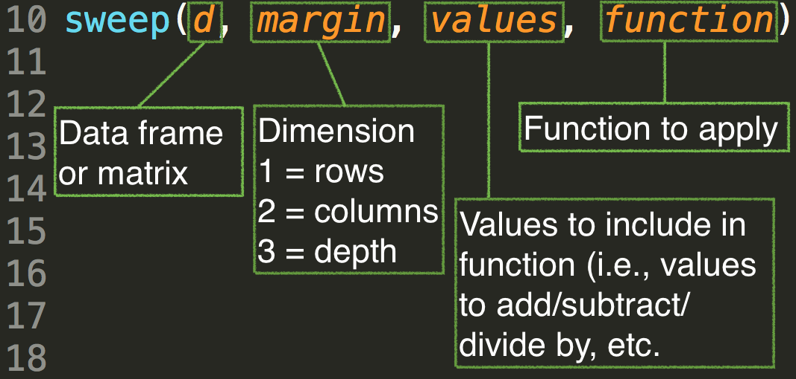

```{r setup, include = FALSE}
knitr::opts_knit$set(root.dir = "/Users/Daniel/Dropbox/Teaching/CourseR/")
```
<style>
em {
  font-style: italic
}
</style>

<style>
strong {
  font-weight: bold;
}
</style>

## Today's Agenda
* Review everything we've covered to date
* Finish up from last session (group-level summaries)
    + We may still have a hard time getting here.

<br>

<span style="color:red"> Schedule the rest of spring term dates </span>


---- &twocol
## Review everything we've covered to date

*** =left

* Object assignment
* Data 
    - Types: Logical, integer, double, character, factors (and coercions)
    - Structures: Vectors, matrices, arrays, lists, data frames
    - Attributes
    - Subsetting
* Basic plotting
    - Scatterplots
    - Boxplots
    - Histograms & density plots

*** =right

* Functions
    - Writing generic functions
    - Writing plot functions
* Loops
    - `for()` loops
    - `apply()`, `lapply()`, and `sapply()`
    - Using loops with custom functions

----
## Object assignment

Fluent object-oriented programming begins with understanding object assignment

```{r, objectAssign1}
a <- 5
b <- c(2, 4, 7)
c <- matrix(1:12, ncol = 4)
a + b
b * c # element-wise multiplication
```

----
## Essentially everything should be stored in objects

```{r, objectAssign2}
d <- read.csv("./data/CamdenBoroughs.csv")
mod <- lm(School.Capacity ~ Town, data = d)
summary(mod)
```

----
## Data types
# Logical
`FALSE` or `TRUE`

```{r, VocabData}
library(car)
data(Vocab)
head(Vocab)
```

----
## Logical example
Calculate proportion of vocabulary scores between 3 and 6

```{r, logical1}
voc36 <- with(Vocab, vocabulary > 2 & vocabulary < 7) 
str(voc36)
```
<br>

```{r, logical2}
table(voc36) / nrow(Vocab)
```
Note that logical vectors coerce to 0/1 (numeric) and "TRUE"/"FALSE" (character)

----
## Integer versus Double

```{r, intDbl}
int <- as.integer(c(2.56, 3.01, 3.99, 7, 2, 4))
dbl <- as.double(c(2.56, 3.01, 3.99, 7, 2, 4))
int
dbl
```

----
## Character

* Most flexible: Essentially everything can be coerced to character

```{r, char1}
as.character(c(TRUE, 3.12, 6L, "some string"))
```

* Lots of operations can be conducted on string variables (as we'll begin to discuss next class)

----
## Data structures
# Atomic Vectors
* All elements must be of the same type
    + leads to "implicit" coercion

```{r, coercion1}
c(TRUE, 3.12, 6L)
```

* Represent the foundation of essentially all other data types (outside of lists and data frames)

---- &twocol
## Matrices
Atomic vectors with a dimension attribute

*** =left

```{r, vec}
v <- rnorm(24, 10, 2)
str(v)
class(v)
typeof(v)
```

*** =right

```{r, vecMat}
dim(v) <- c(6, 4)
class(v)
v
```

---- &twocol
## More typical matrix generation

*** =left

```{r, mat1}
m1 <- matrix(c(1, 2.5, 3,
               5, 12, 8,
               14, 1, 9
            ), 
    nrow = 3, 
    ncol = 3,
    byrow = TRUE)
m1
```

*** =right
Be careful about the `byrow` argument

```{r, mat2}
m2 <- matrix(c(1, 2.5, 3,
               5, 12, 8,
               14, 1, 9
            ), 
    nrow = 3, 
    ncol = 3)
m2
```

----
## Arrays
*n* dimensional matrices (essentially)

```{r, array}
dim(v) <- c(2, 2, 2, 3)
v
```

----
## Other attributes
# Add row and column names

```{r, rowColNames}
rownames(m1) <- c("r1", "r2", "r3")
colnames(m1) <- c("c1", "c2", "c3")
m
```

----
# Name the specific elements of the matrix

```{r }
names(m1) <- letters[1:9]
m1
```

----
## Subsetting atomic vectors

Indexing with the bracket function, `[`:

```{r subsetAtomic1}
# Third element of int
int[3]

# Third through fifth
int[3:5]

# First, third, and fifth
int[c(1, 3, 5)]
```

----
## Subsetting atomic vectors with a dimension attribute 
(i.e., matrices and arrays)

```{r, subsetAtomic2}
# First row, third column
m1[1, 3]

# Entire second row
m1[2, ]

# Extract first row, second column, from all matrices in array
v[1, 2, , ]
```

----
## Names in subsetting

```{r, namesSubseting}
m1[ ,"c1"]
m1["d"]
```

----
## Lists and data frames
**Lists**: can contain any type of data, including other lists
**Data Frames**: Lists of equal-length vectors

```{r, list1}
l <- list(
  c("a", "b", "c"),
  list(1:5),
  rep(c(T,F), 7),
  rnorm(3, 100, 25)
      )
str(l)
```

---- &twocol
## Accessing List Elements
* List elements can be accessed in two methods: Using the `$` with the element 
  names, or through indexing with a double bracket `[[]]`.
* If a single bracket index is used, `[]`, the element will be returned, but
  of type list.

*** =left

```{r, listTypeOf1}
typeof(l)
typeof(l[1])
typeof(l[[1]])
```

*** =right

```{r, listTypeOf2}
l[1]
l[[1]]
```

----
## Switching between lists and data frames

```{r, listDF1}
l2 <- list(rnorm(5, 100, 10), letters[5:9], c(T, T, F, F, T))
names(l2) <- c("rand", "letters", "log")
str(l2)
l2
```

----

```{r, listDF2}
df <- as.data.frame(l2)
df
as.list(df)
```

---
## Factors
* Used to store categorical data
* Can only store predefined values
* String variables default to factors when reading in data 

```{r}
colors <- factor(c("black", "green", "blue", "blue", "black"))
attributes(colors)
str(colors)
```

----
## Adding elements to factors

```{r}
colors[6] <- "blue"
colors
colors[7] <- "purple"
colors
```

---- 
## Benefits of factors
* No need for multiple variables to define a categorical variable: internal 
  contrast-coding
<br>
<span style="color:gray" >  
(Remember the slides discussing dummy-coding and other contrast coding schemes with factors)
</span>

----
## Factors and attributes

* Factors are atomic integer vectors with a "levels" attribute.

```{r}
is.atomic(colors)
typeof(colors)
```

Note: Be careful with `is.vector()`. It only returns `TRUE` if the vector has no
  attributes outside of names

```{r}
is.vector(colors)
```

---- &twocol
## Basic plotting
# Scatterplots

Examine the relation between education and vocabulary

*** =left

```{r, scatter1, eval = FALSE}
# Basic plot
library(lme4)
data(sleepstudy)
with(sleepstudy, plot(Days, Reaction))
```

*** =right

```{r, scatter1b, echo = FALSE}
# Basic plot
library(lme4)
data(sleepstudy)
with(sleepstudy, plot(Days, Reaction))
```

---- &twocol
## Extending the basic plot
Provide more meaningful labels, change points

*** =left

```{r scatter2, eval = FALSE}
with(sleepstudy, 
  plot(Days, Reaction, 
    xlab = "Days w/3hrs of Sleep",
    ylab = "Reaction time",
    main = "Sleep Deprivation and 
      Reaction Time",
    pch = 21, 
    bg = "gray", 
    col = "steelblue")
)
```

*** =right

```{r scatter3, echo = FALSE}
with(sleepstudy, 
  plot(Days, Reaction, 
    xlab = "Days w/3hrs of Sleep",
    ylab = "Reaction time",
    main = "Sleep Deprivation and Reaction Time",
    pch = 21, 
    bg = "gray", 
    col = "steelblue")
)
```


----
## Extending the plot further
Plotting multiple fits

```{r lm1}
# Linear model
mod1 <- lm(Reaction ~ Days, data = sleepstudy)

# Quadratic model
mod2 <- lm(Reaction ~ poly(Days, 2), data = sleepstudy)

# Increasingly complex models

mod3 <- lm(Reaction ~ poly(Days, 3), data = sleepstudy)
mod4 <- lm(Reaction ~ poly(Days, 4), data = sleepstudy)
mod5 <- lm(Reaction ~ poly(Days, 5), data = sleepstudy)
```

----
## Add lines to the plot

```{r, lines1, eval = FALSE}
lines(x = 0:10, y = predict(mod1, newdata = data.frame(Days = 0:10)),
  lwd = 2, lty = 1)
lines(x = 0:10, y = predict(mod2, newdata = data.frame(Days = 0:10)),
  col = "blue", lwd = 2, lty = 2)
lines(x = 0:10, y = predict(mod3, newdata = data.frame(Days = 0:10)),
  col = "red", lwd = 2, lty = 3)
lines(x = 0:10, y = predict(mod4, newdata = data.frame(Days = 0:10)),
  col = "orange", lwd = 2, lty = 4)
lines(x = 0:10, y = predict(mod5, newdata = data.frame(Days = 0:10)),
  col = "purple", lwd = 2, lty = 5)
```

----

```{r, lines2, echo = FALSE, fig.width = 14, fig.height = 8}
with(sleepstudy, 
  plot(Days, Reaction, 
    xlab = "Days w/3hrs of Sleep",
    ylab = "Reaction time",
    main = "Sleep Deprivation and Reaction Time",
    pch = 21,
    cex = 1.5, 
    bg = "gray", 
    col = "steelblue")
)

lines(x = 0:10, y = predict(mod1, newdata = data.frame(Days = 0:10)),
  lwd = 4, lty = 1)
lines(x = 0:10, y = predict(mod2, newdata = data.frame(Days = 0:10)),
  col = "blue", lwd = 4, lty = 2)
lines(x = 0:10, y = predict(mod3, newdata = data.frame(Days = 0:10)),
  col = "red", lwd = 4, lty = 3)
lines(x = 0:10, y = predict(mod4, newdata = data.frame(Days = 0:10)),
  col = "orange", lwd = 4, lty = 4)
lines(x = 0:10, y = predict(mod5, newdata = data.frame(Days = 0:10)),
  col = "purple", lwd = 4, lty = 5)
```

---- &twocol
## Boxplots

*** =left

When you plot the relation between a categorical predictor and continuous outcome, the default `plot()` method is a boxplot.

*** =right

```{r boxplot1}
plot(vocabulary ~ sex, data = Vocab)
```

---- &twocol
## Extending boxplots
<span style="color:gray" >
(Note: to really extend the boxplot, move to violin or bean plots)
</span>
*** =left

```{r boxplot2a, eval = FALSE}
par(bty = "n")
plot(vocabulary ~ sex, data = Vocab, 
  notch = TRUE,
  col = "deepskyblue",
  main = "Vocabulary Scores by Sex")
```

*** =right

```{r boxplot2b, echo = FALSE}
par(bty = "n")
plot(vocabulary ~ sex, data = Vocab, 
  notch = TRUE,
  col = "deepskyblue",
  main = "Vocabulary Scores by Sex")
```

---- &twocol
## Basic Histograms & Densities

*** =left

```{r}
hist(sleepstudy$Reaction)
```
*** =right

```{r}
plot(density(sleepstudy$Reaction))
```

----
## Functions
Anything that carries out an operation in R is a function. For example

```{r}
3 + 5 + 7
```
Could also be written

```{r}
`+`(3, `+`(5, 7))
```
In other words, the `+` operator is itself a function that takes two arguments (both numeric), which it sums. The `+` operator is an example of an infix function, which we'll discuss more later today.

----
## Functions are also objects

```{r}
a <- lm
data(mtcars)
summary( a(hp ~ drat + wt, data = mtcars) )
```

----
## Function components
# Functions have three components
* `body()`
* `formals()`


----
## Writing a function
Often it's useful to know the location of variables quickly. Let's write a function that provides us with an output of all the variable names in a dataset, and their location, with a clean and convenient output.

> * What would the formal arguments be here?
> * We should only need one formal argument, the data set.

----
## Doing it without a function to start

```{r writFun1}
varNames <- names(d)
head(varNames)
length(varNames)
```

----
```{r writFun2}
cbind(1:length(varNames), varNames)
```

----
## Wrapping it in a function

```{r, writFun3}
nms <- function(d) {
  varNames <- names(d)
return(cbind(1:length(varNames), varNames))
}
nms(sleepstudy)
```

----
## Classes and Methods

* **Class**: Identifies characteristics about the object
* **Methods**: Define how a function operates

In other words, a generic function, like `plot()` will change in behavior depending on the specific class of object fed to it (i.e., the methods will change).

----
## Quick example (one I've actually written)

Generic function that produces a regression plot w/Standard error.
* Formals: `x`, `y` **OR** an object of class *lm* (i.e., the results of a linear model)

# Define generic function
```{r classMeth1}
regPlot <- function(x, y, lcol = "blue", 
        se = TRUE, secol = c(0, 0, 0.5, 0.2), ...) UseMethod("regPlot")
```

----
# Define default method

```{r classMeth2}
regPlot.default <- function(x, y, lcol = "blue", 
        se = TRUE, secol = c(0, 0, 0.5, 0.2), ...) {

  mod <- lm(y ~ x)
  nd <- data.frame(x = c(min(x, na.rm = TRUE) - sd(x, na.rm = TRUE),
               unique(x),
               max(x, na.rm = TRUE) + sd(x, na.rm = TRUE)))
  
  pred <- predict(mod, 
    newdata = nd, 
    se.fit = TRUE)
  
  plot(x, y, ...)
  abline(mod, col = lcol, lwd = 2)
  
  if(se == TRUE) {
    polygon(c(nd$x, rev(nd$x)), 
      c(pred$fit - (1.96 * pred$se.fit), 
        rev(pred$fit + (1.96 * pred$se.fit))),
    col = rgb(secol[1], secol[2], secol[3], secol[4]), border = NA)
  }
}
```

-----
# Define method for class `lm`

```{r classMeth3}
regPlot.lm <- function(mod, lcol = "blue", 
        se = TRUE, secol = c(0, 0, 0.5, 0.2), ...) {
  x <- mod$model[[2]]
  y <- mod$model[[1]]

  nd <- data.frame(x = c(min(x, na.rm = TRUE) - sd(x, na.rm = TRUE),
              unique(x),
              max(x, na.rm = TRUE) + sd(x, na.rm = TRUE)))
  names(nd) <- names(mod$model)[2]

  pred <- predict(mod, 
    newdata = nd, 
    se.fit = TRUE) 
  plot(x, y, ...)
  lines(nd[[1]], pred$fit, col = lcol)
  
  if(se == TRUE) {
    polygon(c(nd[[1]], rev(nd[[1]])), 
      c(pred$fit - (1.96 * pred$se.fit), 
        rev(pred$fit + (1.96 * pred$se.fit))),
    col = rgb(secol[1], secol[2], secol[3], secol[4]), border = NA)
  }
}
```

----
# Test it out: Default method

```{r classMeth4}
regPlot(sleepstudy$Days, sleepstudy$Reaction)
```

---- &twocol
# Test it out: `lm` method

*** =left

```{r, classMeth5a, eval = FALSE}
test <- lm(Reaction ~ Days + 
            I(Days^2) + I(Days^3) + 
            I(Days^4), 
          data = sleepstudy)

regPlot(test, 
  xlab = "Days",
  ylab = "Reaction Time",
  main = "Overfit model")
```

*** =right

```{r, classMeth5b, echo = FALSE}
test <- lm(Reaction ~ Days + 
            I(Days^2) + I(Days^3) + 
            I(Days^4), 
          data = sleepstudy)

regPlot(test, 
  xlab = "Days",
  ylab = "Reaction Time",
  main = "Overfit model")
```

----
# Limitations 
* `poly()` function can't be used within the lm.
* Only linear relations are shown when two variables are fed to the function
* x and y shown on x and y axes. May want to make it default to the variable
  names.

<span style="color:blue" > 
We could fix these issues!
</span>

---- &twocol
## for loops

*** =left
<div align = "left">

</div>

*** =right

```{r, forLets}
a <- letters[1:26]
a
for(i in 1:5){
  print(a[i])
}
```

----
## Another basic example

Simulate tossing a coin, record results

```{r, forCoins}
b <- rep(NA, 10)
b
for(i in seq_along(b)) {
  b[i] <- sample(c("Heads", "Tails"), 1)
}
b
```

----
## Batch processing with for loops
# Look at the HSB_pieces folder, within the data folder.


---- &twocol
## Load all files

```{r, loadHSB}
# List all files in directory
files <- list.files("./data/HSB_pieces/")
files

# Create empty list
l <- vector("list", length(files))
l
```

----
## For loop to batch read files

```{r, readHSB}
for(i in seq_along(files)) {
  l[[i]] <- read.csv(paste0("./data/HSB_pieces/", files[i]))
}

# Name elements of the list according to the file name
names(l) <- substr(files, 1, nchar(files) - 4)
````

----
## Inspect the structure of the list

```{r, strHSB1}
str(l)
```

----
## Create a new variable
For each data frame, we're going to create a new variable that is a
  standardized version of `mathach`. Note that this variable will be standardized relative to the specific group.

```{r, standardize}
# First, write a z-score function
standardize <- function(x) (x - mean(x, na.rm = TRUE)) / (sd(x, na.rm = TRUE))

# Next, loop through the list to create each new variable
for(i in seq_along(l)) {
  l[[i]]$math_z <- standardize(l[[i]]$mathach)
}
head(l[[1]])
```

----
```{r, strHSB2}
str(l)
```

----
## Apply family of loops
* Exceptionally useful, and can often speed up your code.
* Advantages over for loops include
  + No need for initialization of objects
  + Automatic indexing of an object (if you want)
  + Simplification of results (can be a massive benefit)

----
## apply
Each of the members of the apply family function a little bit differently. The `apply()` function is probably the most straight forward.

<div align = "center">

</div>

----
## Examples of `apply()`

```{r, emptyMat}
m <- matrix(1:12, ncol = 4)
m
```

```{r, applyMat}
# Mean of each row
apply(m, 1, mean)

# Mean of each column
apply(m, 2, mean)
```

----
## A few more examples: LSAT data

```{r, readLSAT}
lsat <- read.csv("./data/LSAT_theta.csv")
head(lsat)
```

----
## Calculate raw scores

```{r, lsatRaw}
lsat$raw <- apply(lsat[ ,1:5], 1, sum) # Only item-level data
head(lsat)
table(lsat$raw)
```

----
## Calculate p values

```{r, lsatPvals}
apply(lsat[ ,1:5], 2, mean, na.rm = TRUE)
```
Notice that additional arguments to the function (in this case `mean`) just
  get passed as additional arguments to `apply()`.


----
## lapply and sapply
* `lapply()` allows you to apply a function to a **l**ist. You can also use it
   similarly to a `for` loop. In both cases, `lapply()` will return a **l**ist.
* `sapply()` does the same thing as `lapply()`, but simplifies the result if it
  can, into a vector, matrix, or array.

----
## Basic structure of an lapply loop


----
## Batch loading
# Alternative to for loop

```{r, lapplyReadFiles}
files <- list.files("./data/HSB_pieces/")
l <- lapply(seq_along(files), function(i) {
  read.csv(paste0("./data/HSB_pieces/", files[i]))
})
names(l) <- substr(files, 1, nchar(files) - 4)
str(l)
```

----
## Create group-standardized mathach variable

```{r, standardizeLapply1}
standardize <- function(x) (x - mean(x, na.rm = TRUE)) / (sd(x, na.rm = TRUE))
l <- lapply(l, function(x) {
  x$mathach_z <- standardize(x$mathach)
  return(x) # This part is important if you want the full data frame returned
})
str(l)
```

----
## Example without return

```{r, standardizeLapply2}
standardized <- lapply(l, function(x) standardize(x$mathach))
str(standardized)
```

----
## Revisiting the convoluted random matrix from previous class

```{r convolutedMat}
m <- matrix(rep(NA, 40*100), ncol = 100)

for(i in 1:40) {
  for(j in seq(0, 500, length.out = 40)[i]) {
    m[i, ] <- rnorm(100, 0, j)
  }
}
head(m)
```

----
## Creating the same matrix with lapply

```{r, convolutedMatLapply1}
norm <- lapply(seq(0, 500, length.out = 40), function(i) rnorm(100, 0, i))
str(norm)
```

----
```{r, convolutedMat2}
m <- matrix(unlist(norm), ncol = 100, byrow = TRUE)
head(m)
```

----
## Even better, use sapply

```{r convolutedMat3}
m <- sapply(seq(0, 500, length.out = 40), function(i) rnorm(100, 0, i))
head(m) 
```

----
Note that by default, sapply returned the transpose of the matrix we were
 going for before. That's really not a problem, now each column represent 100 draws from the corresponding random normal distribution rather than rows. We can easily verify this.

```{r, convolutedMat4}
nrow(m)
ncol(m)
```
<br>
Of course, we can also easily get the matrix back by just transposing it.

```{r, convolutedMat5}
m <- t(m)
head(m)
```

----
## Contrasting lapply and sapply

```{r, sapply}
sapply(l, function(x) cor(x$ses, x$mathach_z, use = "complete.obs"))
```

```{r, lapply}
lapply(l, function(x) cor(x$ses, x$mathach_z, use = "complete.obs"))
```

----
## Summary on lapply/sapply
Major benefits over for loops include:
* No need to initialize objects
* Names from the list are maintained
* Overall, can substantially reduce the amount of code you may need to write,
  and can therefore also make your code more clear.

---- .segue
# Summaries by grouping variables

----
## Applying function by group

The `tapply()` function is useful for applying any generic function to each
  level of a grouping factor


----
## Load the beer data
```{r, loadBeer}
beer <- read.delim("./data/ratebeer_beerjobber.txt") # Load beer data
head(beer)
```

----
## Mean overall score by brewer

```{r, tapplyBrewerScore}
tapply(beer$score.overall, beer$brewer, mean, na.rm = TRUE)
```

----
## Number of beers rated by brewer

```{r, tapplyBrewerBeerN}
tapply(beer$name, beer$brewer, length)
```

----
## Average overall score by abv 

```{r, tapplyScoreByABV}
tapply(beer$score.overall, round(beer$abv), mean, na.rm = TRUE)
```

----
## Make a summary by abv

```{r, abvSummary}
abv <- round(beer$abv)

smry <- data.frame(
  row.names = names(table(abv)),
  meanOverallScore = tapply(beer$score.overall, abv, mean, na.rm = TRUE),
  numberRatings = tapply(beer$ratings, abv, sum, na.rm = TRUE),
  numberBreweries = tapply(beer$brewer, abv, function(x) length(unique(x)))
  )
```

----
```{r, printsmry}
smry
```

----
## An alternative to tapply for summation

Just as `rowSums` and `colSums` are optimized versions of `apply` for summation, `rowsum` is an optimized version of `tapply` for summation.

Compute the total number of ratings by brewer

```{r, nRatingsByBrewer}
rowsum(beer$ratings, beer$brewer)
```

----
## Calculate average overall score for each brewer

```{r, BrewerScoreOverall}
tot <- rowsum(beer$score.overall, beer$brewer)
n <- tapply(beer$score.overall, beer$brewer, length)
av <- tot[ ,1]/n # Note tot is an integer matrix
as.matrix(av)
```

----
## The `by()` function

Apply a function to groups.

```{r, loadCensus}
library(openintro) # Lots of nice datasets (which I just discovered)
data(census)
head(census)
```

----
## Calculate means by state, race, and sex

```{r, meansCensus}
means <- by(census$totalPersonalIncome, 
              list(census$stateFIPScode, 
                   census$raceGeneral,
                   census$sex), mean, na.rm = TRUE)
means # Note there's a lot of missing data
```

----
## Structure of means

```{r, strMeans}
str(means)
```

----
## Compute marginal means by state

```{r, stateMeans}
apply(means, 1, mean, na.rm = TRUE)
```

----
## Compute marginal means by race/ethnicity

```{r, raceMeans}
apply(means, 2, mean, na.rm = TRUE)
```

----
## Compute marginal means by sex

```{r, sexMeans}
apply(means, 3, mean, na.rm = TRUE)
```

----
## Look within a particular state

```{r, OregonMeans}
means["Oregon", , ]
```

----
## Only individuals identifying as Black

```{r, BlackMeans}
means[ ,"Black", ]
```

----
## Only Males

```{r, maleMeans}
means[ , ,"Male"]
```

----
## The `aggregate()` Function

Aggregate is another way of summarizing data, but the output returned is different.

Note that a formula can be used.

```{r, aggregate1}
ag <- aggregate(totalPersonalIncome ~ stateFIPScode + raceGeneral + sex, 
        data = census, mean, na.rm = TRUE)
str(ag)
```

----
## View output

```{r, ag1}
ag[3:15, ]
```

----
## Compare to `tapply()`
The below output (and syntax, essentially) will produce exactly the same array
  produced earlier with `by()`, but that of course is different than `aggregate()`.

```{r, tapplyAggregate}
means2 <- with(census, tapply(totalPersonalIncome, 
                            list(stateFIPScode, raceGeneral, sex),
                          mean, na.rm = TRUE))
str(means2)
```

----
## Contrasting functions
Why `tapply()` or `by()` or `aggregate()`?
* The `aggregate()` function provides different output from the other two, 
  which may be preferable at times.
* `tapply()` and `by()` are essentially the same, but `by()` can occasionally
  produce summaries when `tapply()` fails

----
## Contrasting functions example
(Note. The example shown is from SabDeM on [SO](http://stackoverflow.com/questions/3505701/r-grouping-functions-sapply-vs-lapply-vs-apply-vs-tapply-vs-by-vs-aggrega) (the response from joran there is also worth reading))

```{r, loadIris}
data(iris)
head(iris)
```

----
Note that `tapply()` fails in this context

```{r, tapplyFail}
tapply(iris, iris$Species, summary)
```
<br>

But `by()` can handle this situation

----
```{r, tapplyFail_byWins}
by(iris, iris$Species, summary)
```

----
## Finally: `sweep()`
* Used when you want to *sweep* a function across an array.
* Generally used when you want to apply an operation to an array, but the
  values differ for each column.



----
## Example

`sweep()` can be an efficient way to **center** variables, because you need to
   subtract each value within a column by the mean of that column (rather than subtracting a specific value from each column, in which case we'd just us `apply()`)

----
## Centering columns 4-7 in beer data
```{r, beerHead}
head(beer)
````

----
```{r, centerBeer1}
col_M <- colMeans(beer[ ,4:ncol(beer)], na.rm = TRUE)
col_M
centered <- sweep(beer[ ,4:ncol(beer)], 2, col_M, "-")
head(centered)
```

----
```{r, centerBeer2}
names(centered) <- paste0(names(centered), "_c")
names(centered)

# Check that centering worked properly
round(colMeans(centered, na.rm = TRUE), digits = 2)
```

----
## Put it all back together
```{r, centerBeer3}
beer <- cbind(beer, centered)
head(beer)
```

----
## Final Guided Practice
MLB salary data

```{r, loadMLB}
data(MLB)
head(MLB)
```

----
## Salary by position and team
First, transform salary to represent salary in millions

```{r, salaryByTeam1}
MLB$salary <- MLB$salary / 1000
```
Next, compute the average salary by team and position using the following two
  methods:

```{r, salaryByTeam}
array <- by(MLB$salary, list(MLB$team, MLB$position), mean)
dtaframe <- aggregate(salary ~ team + position, data = MLB, mean)
```
Use either of the summaries from above to answer the following two questions

1. Which team spends the most, on average, on pitchers?
2. Which team spends the least, on average, on shortstops?

Finally, compute the total salary by position an team, and answer Questions 1 and 2 again (only in sum, instead of on average).

----
## Solutions w/array

```{r, MLBarray}
array[ ,"Pitcher"]
array[ ,"Pitcher"][which.max(array[ ,"Pitcher"])]

array[ ,"Shortstop"][which.min(array[ ,"Shortstop"])]
```


----
## Solutions w/dtaframe

```{r, dtaframe}
pitchers <- subset(dtaframe, position == "Pitcher")
pitchers[which.max(pitchers$salary), ]

shortstops <- subset(dtaframe, position == "Shortstop")
shortstops[which.min(shortstops$salary), ]
```

----
## Recalculate with summing

```{r, summing}
arraySum <- by(MLB$salary, list(MLB$team, MLB$position), sum)
dtaframeSum <- aggregate(salary ~ team + position, data = MLB, sum)

arraySum[ ,"Pitcher"][which.max(arraySum[ ,"Pitcher"])]
arraySum[ ,"Shortstop"][which.min(arraySum[ ,"Shortstop"])]
```


