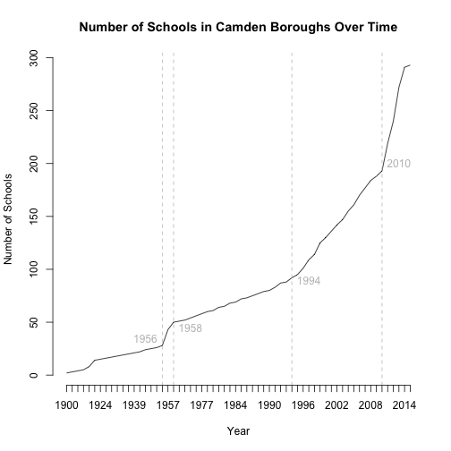

## Extracting parts of strings with `substr`
<div align = "left">

</div>

----

```r
s <- "supercalifragilisticexpialidocious"
substr(s, 1, 5)
```

```
## [1] "super"
```

```r
substr(s, 6, 9)
```

```
## [1] "cali"
```
<br>

`substr` can often be used in combination with `nchar`, which calculates the number of characters in a string.


```r
substr(s, 21, nchar(s))
```

```
## [1] "expialidocious"
```

-----
## Use with vectors


```r
itemIDs <- c("E8LA2H04", "E11WR5L04", "E6RL1L01", "E11RL1M08", "E3RI1L03")

#Extract item type
type <- substr(itemIDs, nchar(itemIDs) - 5, nchar(itemIDs) - 4)
table(type)
```

```
## type
## LA RI RL WR 
##  1  1  2  1
```

```r
# Extract theoretical difficulty level
diff <- substr(itemIDs, nchar(itemIDs) - 2, nchar(itemIDs) - 2)
table(diff)
```

```
## diff
## H L M 
## 1 3 1
```

-----
## Splitting strings


```r
longString <- "Here's some of my favorite colors: blue, green, and purple"
strsplit(longString, " ")
```

```
## [[1]]
##  [1] "Here's"   "some"     "of"       "my"       "favorite" "colors:" 
##  [7] "blue,"    "green,"   "and"      "purple"
```

```r
strsplit(longString, ":")
```

```
## [[1]]
## [1] "Here's some of my favorite colors" " blue, green, and purple"
```

```r
strsplit(longString, ",")
```

```
## [[1]]
## [1] "Here's some of my favorite colors: blue"
## [2] " green"                                 
## [3] " and purple"
```

----
## More on strsplit
Note that the output is a list


```r
strsplit(longString, "")
```

```
## [[1]]
##  [1] "H" "e" "r" "e" "'" "s" " " "s" "o" "m" "e" " " "o" "f" " " "m" "y"
## [18] " " "f" "a" "v" "o" "r" "i" "t" "e" " " "c" "o" "l" "o" "r" "s" ":"
## [35] " " "b" "l" "u" "e" "," " " "g" "r" "e" "e" "n" "," " " "a" "n" "d"
## [52] " " "p" "u" "r" "p" "l" "e"
```

```r
strsplit(longString, "")[[1]][3]
```

```
## [1] "r"
```

----
## Use with vectors


```r
moreText <- c("Here's some text", "Here's some more", "and even more")
strsplit(moreText, " ")
```

```
## [[1]]
## [1] "Here's" "some"   "text"  
## 
## [[2]]
## [1] "Here's" "some"   "more"  
## 
## [[3]]
## [1] "and"  "even" "more"
```

----
## Changing text case


```r
toupper(moreText)
```

```
## [1] "HERE'S SOME TEXT" "HERE'S SOME MORE" "AND EVEN MORE"
```

```r
tolower(moreText)
```

```
## [1] "here's some text" "here's some more" "and even more"
```

<br>

Why would this be useful?

----
## Merging data frames with string ids: Create fake data


```r
d1 <- data.frame(id = c("Mary", "liam", "Karina"), score = c(100, 112, 97))
d1
```

```
##       id score
## 1   Mary   100
## 2   liam   112
## 3 Karina    97
```

```r
d2 <- data.frame(id = c("Mary", "Liam", "Karina"), score = c(102, 116, 100))
d2
```

```
##       id score
## 1   Mary   102
## 2   Liam   116
## 3 Karina   100
```

----
## Merge data  
Merging data frames by an id that has even slight differences will fail 


```r
d <- merge(d1, d2, by = "id", all = TRUE)
d
```

```
##       id score.x score.y
## 1 Karina      97     100
## 2   liam     112      NA
## 3   Mary     100     102
## 4   Liam      NA     116
```

----
## Change ids to all lower


```r
d1$id <- tolower(d1$id)
d2$id <- tolower(d2$id)
head(d1); head(d2)
```

```
##       id score
## 1   mary   100
## 2   liam   112
## 3 karina    97
```

```
##       id score
## 1   mary   102
## 2   liam   116
## 3 karina   100
```

----
## Change var names, merge datasets


```r
names(d1)[2] <- paste0(names(d1)[2], "_t1")
names(d2)[2] <- paste0(names(d2)[2], "_t2")
d <- merge(d1, d2, by = "id", all = TRUE)
d
```

```
##       id score_t1 score_t2
## 1 karina       97      100
## 2   liam      112      116
## 3   mary      100      102
```

----
## Guided practice
* Load the CamdenBoroughs data set


```r
cam <- read.csv("./data/CamdenBoroughs.csv", na = "999")
head(cam)
```

```
##   Unique.Reference.Number Local.Authority.Code Local.Authority.Name
## 1                  100007                  202               Camden
## 2                  100052                  202               Camden
## 3                  100029                  202               Camden
## 4                  100406                  206            Islington
## 5                  100027                  202               Camden
## 6                  100428                  206            Islington
##   Establishment.Number                 Establishment.Name
## 1                 1101 Camden Primary Pupil Referral Unit
## 2                 4275                   Hampstead School
## 3                 3327               Christ Church School
## 4                 2261             Grafton Primary School
## 5                 2841      Eleanor Palmer Primary School
## 6                 2646              Winton Primary School
##    Type.Of.Establishment Establishment.Status Reason.Establishment.Opened
## 1    Pupil Referral Unit                 Open              Not applicable
## 2       Community School                 Open              Not applicable
## 3 Voluntary Aided School                 Open              Not applicable
## 4       Community School                 Open              Not applicable
## 5       Community School                 Open              Not applicable
## 6       Community School                 Open              Not applicable
##   Open.Date Reason.Establishment.Closed Close.Date Phase.Of.Education
## 1                        Not applicable         NA     Not applicable
## 2                        Not applicable         NA          Secondary
## 3                        Not applicable         NA            Primary
## 4                        Not applicable         NA            Primary
## 5                        Not applicable         NA            Primary
## 6                        Not applicable         NA            Primary
##   Statutory.Low.Age Statutory.High.Age    Boarders
## 1                 5                 11 No Boarders
## 2                11                 18 No Boarders
## 3                 3                 11 No Boarders
## 4                 3                 11 No Boarders
## 5                 3                 11 No Boarders
## 6                 3                 11 No Boarders
##          Official.Sixth.Form Gender Religious.Character           Diocese
## 1             Not applicable  Mixed      Does not apply    Not applicable
## 2           Has a sixth form  Mixed      Does not apply    Not applicable
## 3 Does not have a sixth form  Mixed   Church of England Diocese of London
## 4 Does not have a sixth form  Mixed      Does not apply    Not applicable
## 5 Does not have a sixth form  Mixed      Does not apply    Not applicable
## 6 Does not have a sixth form  Mixed      Does not apply    Not applicable
##   Admissions.Policy School.Capacity    Special.Classes Census.Date
## 1    Not applicable              20     Not applicable  16/01/2014
## 2     Comprehensive            1302 No Special Classes  16/01/2014
## 3    Not applicable             210 No Special Classes  16/01/2014
## 4    Not applicable             393 No Special Classes  16/01/2014
## 5    Not applicable             210 No Special Classes  16/01/2014
## 6    Not applicable             315 No Special Classes  16/01/2014
##   Number.Of.Pupils Number.Of.Boys Number.Of.Girls
## 1               12             10              NA
## 2             1259            710             550
## 3              228            120             110
## 4              519            270             250
## 5              237            125             115
## 6              194            110              85
##   Percentage.Claiming.Free.School.Meals   Trust.School Trust.Name
## 1                                       Not applicable           
## 2                                 29.6% Not applicable           
## 3                                 27.2% Not applicable           
## 4                                 43.2% Not applicable           
## 5                                 12.2% Not applicable           
## 6                                 54.3% Not applicable           
##   School.Sponsored School.Sponsor             Federation Federation.Name
## 1   Not applicable                        Not applicable                
## 2   Not applicable                Not under a federation                
## 3   Not applicable                Not under a federation                
## 4   Not applicable                Not under a federation                
## 5   Not applicable                Not under a federation                
## 6   Not applicable                Not under a federation                
##   Unique.Property.Reference.Number Further.Higher.Education.Identifier
## 1                               NA                                  NA
## 2                         10002876                                  NA
## 3                               NA                                  NA
## 4                               NA                                  NA
## 5                               NA                                  NA
## 6                               NA                                  NA
##   Further.Education.Type Ofsted.Last.Inspected Ofsted.Special.Measures
## 1         Not applicable            26/03/2015 Not in special measures
## 2         Not applicable            01/02/2012 Not in special measures
## 3         Not applicable            19/01/2012 Not in special measures
## 4         Not applicable            13/11/2008 Not in special measures
## 5         Not applicable            18/10/2011 Not in special measures
## 6         Not applicable            11/03/2014 Not in special measures
##   Last.Changed.Date                           Street         Locality
## 1        02/06/2015 Robson House, 74 Stanhope Street                 
## 2        18/06/2014                    Westbere Road        Hampstead
## 3        18/06/2014                   Redhill Street           Camden
## 4        18/06/2014                      Eburne Road         Holloway
## 5        18/06/2014                    Lupton Street                 
## 6        18/06/2014                   Killick Street Pentonville Road
##   Address.3   Town County Postcode                                 Website
## 1           London         NW1 3EX     http://www.robsonhouse.org.uk/main/
## 2           London         NW2 3RT      http://www.hampsteadschool.org.uk/
## 3           London         NW1 4BD     http://www.cchurchnw1.camden.sch.uk
## 4           London          N7 6AR                                        
## 5           London         NW5 2JA http://www.eleanorpalmer.camden.sch.uk/
## 6           London          N1 9AZ      http://www.wintonprimaryschool.com
##   Telephone.Number Head.Title Head.First.Name Head.Last.Name Head.Honours
## 1       2037720370         Mr          Andrew        Herbert             
## 2       2077948133         Mr         Jacques  Szemalikowski             
## 3       2073877881         Ms           Paula         Walker             
## 4       2072723284         Ms               T       Sergides             
## 5       2074852155        Mrs            Kate          Frood             
## 6       2078376096         Mr          Andrew          Rigby             
##   Head.Preferred.Job.Title   Teen.Mothers Teen.Mothers.Places
## 1          Head of Service Not applicable                  NA
## 2                     Head Not applicable                  NA
## 3              Headteacher Not applicable                  NA
## 4              Headteacher Not applicable                  NA
## 5              Headteacher Not applicable                  NA
## 6              Headteacher Not applicable                  NA
##   Child.Care.Facilities Special.Education.Needs.Pupil.Referral.Unit
## 1        Not applicable             PRU Does have Provision for SEN
## 2        Not applicable                              Not applicable
## 3        Not applicable                              Not applicable
## 4        Not applicable                              Not applicable
## 5        Not applicable                              Not applicable
## 6        Not applicable                              Not applicable
##   Emotional.Behavioural.Difficulties                Full.Time.Provision
## 1        PRU Does have EBD provision PRU does offer full time provision
## 2                     Not applicable                                   
## 3                     Not applicable                                   
## 4                     Not applicable                                   
## 5                     Not applicable                                   
## 6                     Not applicable                                   
##   Education.By.Other Section.41.Approved
## 1     Not applicable      Not applicable
## 2     Not applicable      Not applicable
## 3     Not applicable      Not applicable
## 4     Not applicable      Not applicable
## 5     Not applicable      Not applicable
## 6     Not applicable      Not applicable
##                    Special.Education.Needs.1 Special.Education.Needs.2
## 1 SEMH - Social, Emotional and Mental Health                          
## 2                   PD - Physical Disability                          
## 3                                                                     
## 4                                                                     
## 5                                                                     
## 6                                                                     
##   Region Administrative.Ward   Parliamentary.Constituency
## 1 London       Regent's Park      Holborn and St. Pancras
## 2 London       Fortune Green        Hampstead and Kilburn
## 3 London       Regent's Park      Holborn and St. Pancras
## 4 London       Finsbury Park              Islington North
## 5 London        Kentish Town      Holborn and St. Pancras
## 6 London          Caledonian Islington South and Finsbury
##                 Urban.Rural GSSLA.Code Easting Northing
## 1 Urban > 10k - less sparse  E09000007  529076   182495
## 2 Urban > 10k - less sparse  E09000007  524402   185633
## 3 Urban > 10k - less sparse  E09000007  528821   182991
## 4 Urban > 10k - less sparse  E09000019  530483   186145
## 5 Urban > 10k - less sparse  E09000007  529117   185613
## 6 Urban > 10k - less sparse  E09000019  530634   183172
##   Middle.Super.Output.Area Lower.Super.Output.Area Boarding.Establishment
## 1               Camden 023             Camden 023B                       
## 2               Camden 005             Camden 005A                       
## 3               Camden 021             Camden 021B                       
## 4            Islington 007          Islington 007B                       
## 5               Camden 003             Camden 003C                       
## 6            Islington 021          Islington 021B                       
##   Previous.Local.Authority.Code Previous.Local.Authority.Name
## 1                            NA                              
## 2                            NA                              
## 3                            NA                              
## 4                            NA                              
## 5                            NA                              
## 6                            NA                              
##   Previous.Establishment.Number Longitude Latitude Spatial.Accuracy
## 1                            NA -0.140758 51.52663          Unknown
## 2                            NA -0.206990 51.55588          Unknown
## 3                            NA -0.144251 51.53115          Unknown
## 4                            NA -0.119136 51.55911          Unknown
## 5                            NA -0.139025 51.55465          Unknown
## 6                            NA -0.118062 51.53236          Unknown
##   Last.Uploaded               Location Socrata.ID
## 1    24/09/2015 (51.526635, -0.140758)          7
## 2    24/09/2015  (51.555884, -0.20699)         50
## 3    24/09/2015  (51.53115, -0.144251)         27
## 4    24/09/2015 (51.559113, -0.119136)         97
## 5    24/09/2015 (51.554646, -0.139025)         25
## 6    24/09/2015 (51.532361, -0.118062)        106
```

----	
You can calculate the month of *Last.Uploaded* by doing the following
* Use `strsplit` to split the variable into Day/Month/Year


```r
lastUpload <- strsplit(as.character(cam$Last.Uploaded), "/")
lastUpload
```

```
## [[1]]
## [1] "24"   "09"   "2015"
## 
## [[2]]
## [1] "24"   "09"   "2015"
## 
## [[3]]
## [1] "24"   "09"   "2015"
## 
## [[4]]
## [1] "24"   "09"   "2015"
## 
## [[5]]
## [1] "24"   "09"   "2015"
## 
## [[6]]
## [1] "24"   "09"   "2015"
## 
## [[7]]
## [1] "24"   "09"   "2015"
## 
## [[8]]
## [1] "24"   "09"   "2015"
## 
## [[9]]
## [1] "24"   "09"   "2015"
## 
## [[10]]
## [1] "24"   "09"   "2015"
## 
## [[11]]
## [1] "24"   "09"   "2015"
## 
## [[12]]
## [1] "24"   "09"   "2015"
## 
## [[13]]
## [1] "24"   "09"   "2015"
## 
## [[14]]
## [1] "24"   "09"   "2015"
## 
## [[15]]
## [1] "24"   "09"   "2015"
## 
## [[16]]
## [1] "24"   "09"   "2015"
## 
## [[17]]
## [1] "24"   "09"   "2015"
## 
## [[18]]
## [1] "24"   "09"   "2015"
## 
## [[19]]
## [1] "24"   "09"   "2015"
## 
## [[20]]
## [1] "24"   "09"   "2015"
## 
## [[21]]
## [1] "24"   "09"   "2015"
## 
## [[22]]
## [1] "24"   "09"   "2015"
## 
## [[23]]
## [1] "24"   "09"   "2015"
## 
## [[24]]
## [1] "24"   "09"   "2015"
## 
## [[25]]
## [1] "24"   "09"   "2015"
## 
## [[26]]
## [1] "24"   "09"   "2015"
## 
## [[27]]
## [1] "24"   "09"   "2015"
## 
## [[28]]
## [1] "24"   "09"   "2015"
## 
## [[29]]
## [1] "24"   "09"   "2015"
## 
## [[30]]
## [1] "24"   "09"   "2015"
## 
## [[31]]
## [1] "24"   "09"   "2015"
## 
## [[32]]
## [1] "24"   "09"   "2015"
## 
## [[33]]
## [1] "24"   "09"   "2015"
## 
## [[34]]
## [1] "24"   "09"   "2015"
## 
## [[35]]
## [1] "24"   "09"   "2015"
## 
## [[36]]
## [1] "24"   "09"   "2015"
## 
## [[37]]
## [1] "24"   "09"   "2015"
## 
## [[38]]
## [1] "24"   "09"   "2015"
## 
## [[39]]
## [1] "24"   "09"   "2015"
## 
## [[40]]
## [1] "24"   "09"   "2015"
## 
## [[41]]
## [1] "24"   "09"   "2015"
## 
## [[42]]
## [1] "24"   "09"   "2015"
## 
## [[43]]
## [1] "24"   "09"   "2015"
## 
## [[44]]
## [1] "24"   "09"   "2015"
## 
## [[45]]
## [1] "24"   "09"   "2015"
## 
## [[46]]
## [1] "24"   "09"   "2015"
## 
## [[47]]
## [1] "24"   "09"   "2015"
## 
## [[48]]
## [1] "24"   "09"   "2015"
## 
## [[49]]
## [1] "24"   "09"   "2015"
## 
## [[50]]
## [1] "24"   "09"   "2015"
## 
## [[51]]
## [1] "24"   "09"   "2015"
## 
## [[52]]
## [1] "24"   "09"   "2015"
## 
## [[53]]
## [1] "24"   "09"   "2015"
## 
## [[54]]
## [1] "24"   "09"   "2015"
## 
## [[55]]
## [1] "24"   "09"   "2015"
## 
## [[56]]
## [1] "24"   "09"   "2015"
## 
## [[57]]
## [1] "24"   "09"   "2015"
## 
## [[58]]
## [1] "24"   "09"   "2015"
## 
## [[59]]
## [1] "24"   "09"   "2015"
## 
## [[60]]
## [1] "24"   "09"   "2015"
## 
## [[61]]
## [1] "24"   "09"   "2015"
## 
## [[62]]
## [1] "24"   "09"   "2015"
## 
## [[63]]
## [1] "24"   "09"   "2015"
## 
## [[64]]
## [1] "24"   "09"   "2015"
## 
## [[65]]
## [1] "24"   "09"   "2015"
## 
## [[66]]
## [1] "24"   "09"   "2015"
## 
## [[67]]
## [1] "24"   "09"   "2015"
## 
## [[68]]
## [1] "24"   "09"   "2015"
## 
## [[69]]
## [1] "24"   "09"   "2015"
## 
## [[70]]
## [1] "24"   "09"   "2015"
## 
## [[71]]
## [1] "24"   "09"   "2015"
## 
## [[72]]
## [1] "24"   "09"   "2015"
## 
## [[73]]
## [1] "24"   "09"   "2015"
## 
## [[74]]
## [1] "24"   "09"   "2015"
## 
## [[75]]
## [1] "24"   "09"   "2015"
## 
## [[76]]
## [1] "24"   "09"   "2015"
## 
## [[77]]
## [1] "24"   "09"   "2015"
## 
## [[78]]
## [1] "24"   "09"   "2015"
## 
## [[79]]
## [1] "24"   "09"   "2015"
## 
## [[80]]
## [1] "24"   "09"   "2015"
## 
## [[81]]
## [1] "24"   "09"   "2015"
## 
## [[82]]
## [1] "24"   "09"   "2015"
## 
## [[83]]
## [1] "24"   "09"   "2015"
## 
## [[84]]
## [1] "24"   "09"   "2015"
## 
## [[85]]
## [1] "24"   "09"   "2015"
## 
## [[86]]
## [1] "24"   "09"   "2015"
## 
## [[87]]
## [1] "24"   "09"   "2015"
## 
## [[88]]
## [1] "24"   "09"   "2015"
## 
## [[89]]
## [1] "24"   "09"   "2015"
## 
## [[90]]
## [1] "24"   "09"   "2015"
## 
## [[91]]
## [1] "24"   "09"   "2015"
## 
## [[92]]
## [1] "24"   "09"   "2015"
## 
## [[93]]
## [1] "24"   "09"   "2015"
## 
## [[94]]
## [1] "24"   "09"   "2015"
## 
## [[95]]
## [1] "24"   "09"   "2015"
## 
## [[96]]
## [1] "24"   "09"   "2015"
## 
## [[97]]
## [1] "24"   "09"   "2015"
## 
## [[98]]
## [1] "24"   "09"   "2015"
## 
## [[99]]
## [1] "24"   "09"   "2015"
## 
## [[100]]
## [1] "24"   "09"   "2015"
## 
## [[101]]
## [1] "24"   "09"   "2015"
## 
## [[102]]
## [1] "24"   "09"   "2015"
## 
## [[103]]
## [1] "24"   "09"   "2015"
## 
## [[104]]
## [1] "24"   "09"   "2015"
## 
## [[105]]
## [1] "24"   "09"   "2015"
## 
## [[106]]
## [1] "24"   "09"   "2015"
## 
## [[107]]
## [1] "24"   "09"   "2015"
## 
## [[108]]
## [1] "24"   "09"   "2015"
## 
## [[109]]
## [1] "24"   "09"   "2015"
## 
## [[110]]
## [1] "24"   "09"   "2015"
## 
## [[111]]
## [1] "24"   "09"   "2015"
## 
## [[112]]
## [1] "24"   "09"   "2015"
## 
## [[113]]
## [1] "24"   "09"   "2015"
## 
## [[114]]
## [1] "24"   "09"   "2015"
## 
## [[115]]
## [1] "24"   "09"   "2015"
## 
## [[116]]
## [1] "24"   "09"   "2015"
## 
## [[117]]
## [1] "24"   "09"   "2015"
## 
## [[118]]
## [1] "24"   "09"   "2015"
## 
## [[119]]
## [1] "24"   "09"   "2015"
## 
## [[120]]
## [1] "24"   "09"   "2015"
## 
## [[121]]
## [1] "24"   "09"   "2015"
## 
## [[122]]
## [1] "24"   "09"   "2015"
## 
## [[123]]
## [1] "24"   "09"   "2015"
## 
## [[124]]
## [1] "24"   "09"   "2015"
## 
## [[125]]
## [1] "24"   "09"   "2015"
## 
## [[126]]
## [1] "24"   "09"   "2015"
## 
## [[127]]
## [1] "24"   "09"   "2015"
## 
## [[128]]
## [1] "24"   "09"   "2015"
## 
## [[129]]
## [1] "24"   "09"   "2015"
## 
## [[130]]
## [1] "24"   "09"   "2015"
## 
## [[131]]
## [1] "24"   "09"   "2015"
## 
## [[132]]
## [1] "24"   "09"   "2015"
## 
## [[133]]
## [1] "24"   "09"   "2015"
## 
## [[134]]
## [1] "24"   "09"   "2015"
## 
## [[135]]
## [1] "24"   "09"   "2015"
## 
## [[136]]
## [1] "24"   "09"   "2015"
## 
## [[137]]
## [1] "24"   "09"   "2015"
## 
## [[138]]
## [1] "24"   "09"   "2015"
## 
## [[139]]
## [1] "24"   "09"   "2015"
## 
## [[140]]
## [1] "24"   "09"   "2015"
## 
## [[141]]
## [1] "24"   "09"   "2015"
## 
## [[142]]
## [1] "24"   "09"   "2015"
## 
## [[143]]
## [1] "24"   "09"   "2015"
## 
## [[144]]
## [1] "24"   "09"   "2015"
## 
## [[145]]
## [1] "24"   "09"   "2015"
## 
## [[146]]
## [1] "24"   "09"   "2015"
## 
## [[147]]
## [1] "24"   "09"   "2015"
## 
## [[148]]
## [1] "24"   "09"   "2015"
## 
## [[149]]
## [1] "24"   "09"   "2015"
## 
## [[150]]
## [1] "24"   "09"   "2015"
## 
## [[151]]
## [1] "24"   "09"   "2015"
## 
## [[152]]
## [1] "24"   "09"   "2015"
## 
## [[153]]
## [1] "24"   "09"   "2015"
## 
## [[154]]
## [1] "24"   "09"   "2015"
## 
## [[155]]
## [1] "24"   "09"   "2015"
## 
## [[156]]
## [1] "24"   "09"   "2015"
## 
## [[157]]
## [1] "24"   "09"   "2015"
## 
## [[158]]
## [1] "24"   "09"   "2015"
## 
## [[159]]
## [1] "24"   "09"   "2015"
## 
## [[160]]
## [1] "24"   "09"   "2015"
## 
## [[161]]
## [1] "24"   "09"   "2015"
## 
## [[162]]
## [1] "24"   "09"   "2015"
## 
## [[163]]
## [1] "24"   "09"   "2015"
## 
## [[164]]
## [1] "24"   "09"   "2015"
## 
## [[165]]
## [1] "24"   "09"   "2015"
## 
## [[166]]
## [1] "24"   "09"   "2015"
## 
## [[167]]
## [1] "24"   "09"   "2015"
## 
## [[168]]
## [1] "24"   "09"   "2015"
## 
## [[169]]
## [1] "24"   "09"   "2015"
## 
## [[170]]
## [1] "24"   "09"   "2015"
## 
## [[171]]
## [1] "24"   "09"   "2015"
## 
## [[172]]
## [1] "24"   "09"   "2015"
## 
## [[173]]
## [1] "24"   "09"   "2015"
## 
## [[174]]
## [1] "24"   "09"   "2015"
## 
## [[175]]
## [1] "24"   "09"   "2015"
## 
## [[176]]
## [1] "24"   "09"   "2015"
## 
## [[177]]
## [1] "24"   "09"   "2015"
## 
## [[178]]
## [1] "24"   "09"   "2015"
## 
## [[179]]
## [1] "24"   "09"   "2015"
## 
## [[180]]
## [1] "24"   "09"   "2015"
## 
## [[181]]
## [1] "24"   "09"   "2015"
## 
## [[182]]
## [1] "24"   "09"   "2015"
## 
## [[183]]
## [1] "24"   "09"   "2015"
## 
## [[184]]
## [1] "24"   "09"   "2015"
## 
## [[185]]
## [1] "24"   "09"   "2015"
## 
## [[186]]
## [1] "24"   "09"   "2015"
## 
## [[187]]
## [1] "24"   "09"   "2015"
## 
## [[188]]
## [1] "24"   "09"   "2015"
## 
## [[189]]
## [1] "24"   "09"   "2015"
## 
## [[190]]
## [1] "24"   "09"   "2015"
## 
## [[191]]
## [1] "24"   "09"   "2015"
## 
## [[192]]
## [1] "24"   "09"   "2015"
## 
## [[193]]
## [1] "24"   "09"   "2015"
## 
## [[194]]
## [1] "24"   "09"   "2015"
## 
## [[195]]
## [1] "24"   "09"   "2015"
## 
## [[196]]
## [1] "24"   "09"   "2015"
## 
## [[197]]
## [1] "24"   "09"   "2015"
## 
## [[198]]
## [1] "24"   "09"   "2015"
## 
## [[199]]
## [1] "24"   "09"   "2015"
## 
## [[200]]
## [1] "24"   "09"   "2015"
## 
## [[201]]
## [1] "24"   "09"   "2015"
## 
## [[202]]
## [1] "24"   "09"   "2015"
## 
## [[203]]
## [1] "24"   "09"   "2015"
## 
## [[204]]
## [1] "24"   "09"   "2015"
## 
## [[205]]
## [1] "24"   "09"   "2015"
## 
## [[206]]
## [1] "24"   "09"   "2015"
## 
## [[207]]
## [1] "24"   "09"   "2015"
## 
## [[208]]
## [1] "24"   "09"   "2015"
## 
## [[209]]
## [1] "24"   "09"   "2015"
## 
## [[210]]
## [1] "24"   "09"   "2015"
## 
## [[211]]
## [1] "24"   "09"   "2015"
## 
## [[212]]
## [1] "24"   "09"   "2015"
## 
## [[213]]
## [1] "24"   "09"   "2015"
## 
## [[214]]
## [1] "24"   "09"   "2015"
## 
## [[215]]
## [1] "24"   "09"   "2015"
## 
## [[216]]
## [1] "24"   "09"   "2015"
## 
## [[217]]
## [1] "24"   "09"   "2015"
## 
## [[218]]
## [1] "24"   "09"   "2015"
## 
## [[219]]
## [1] "24"   "09"   "2015"
## 
## [[220]]
## [1] "24"   "09"   "2015"
## 
## [[221]]
## [1] "24"   "09"   "2015"
## 
## [[222]]
## [1] "24"   "09"   "2015"
## 
## [[223]]
## [1] "24"   "09"   "2015"
## 
## [[224]]
## [1] "24"   "09"   "2015"
## 
## [[225]]
## [1] "24"   "09"   "2015"
## 
## [[226]]
## [1] "24"   "09"   "2015"
## 
## [[227]]
## [1] "24"   "09"   "2015"
## 
## [[228]]
## [1] "24"   "09"   "2015"
## 
## [[229]]
## [1] "24"   "09"   "2015"
## 
## [[230]]
## [1] "24"   "09"   "2015"
## 
## [[231]]
## [1] "24"   "09"   "2015"
## 
## [[232]]
## [1] "24"   "09"   "2015"
## 
## [[233]]
## [1] "24"   "09"   "2015"
## 
## [[234]]
## [1] "24"   "09"   "2015"
## 
## [[235]]
## [1] "24"   "09"   "2015"
## 
## [[236]]
## [1] "24"   "09"   "2015"
## 
## [[237]]
## [1] "24"   "09"   "2015"
## 
## [[238]]
## [1] "24"   "09"   "2015"
## 
## [[239]]
## [1] "24"   "09"   "2015"
## 
## [[240]]
## [1] "24"   "09"   "2015"
## 
## [[241]]
## [1] "24"   "09"   "2015"
## 
## [[242]]
## [1] "24"   "09"   "2015"
## 
## [[243]]
## [1] "24"   "09"   "2015"
## 
## [[244]]
## [1] "24"   "09"   "2015"
## 
## [[245]]
## [1] "24"   "09"   "2015"
## 
## [[246]]
## [1] "24"   "09"   "2015"
## 
## [[247]]
## [1] "24"   "09"   "2015"
## 
## [[248]]
## [1] "24"   "09"   "2015"
## 
## [[249]]
## [1] "24"   "09"   "2015"
## 
## [[250]]
## [1] "24"   "09"   "2015"
## 
## [[251]]
## [1] "24"   "09"   "2015"
## 
## [[252]]
## [1] "24"   "09"   "2015"
## 
## [[253]]
## [1] "24"   "09"   "2015"
## 
## [[254]]
## [1] "24"   "09"   "2015"
## 
## [[255]]
## [1] "24"   "09"   "2015"
## 
## [[256]]
## [1] "24"   "09"   "2015"
## 
## [[257]]
## [1] "24"   "09"   "2015"
## 
## [[258]]
## [1] "24"   "09"   "2015"
## 
## [[259]]
## [1] "24"   "09"   "2015"
## 
## [[260]]
## [1] "24"   "09"   "2015"
## 
## [[261]]
## [1] "24"   "09"   "2015"
## 
## [[262]]
## [1] "24"   "09"   "2015"
## 
## [[263]]
## [1] "24"   "09"   "2015"
## 
## [[264]]
## [1] "24"   "09"   "2015"
## 
## [[265]]
## [1] "24"   "09"   "2015"
## 
## [[266]]
## [1] "24"   "09"   "2015"
## 
## [[267]]
## [1] "24"   "09"   "2015"
## 
## [[268]]
## [1] "24"   "09"   "2015"
## 
## [[269]]
## [1] "24"   "09"   "2015"
## 
## [[270]]
## [1] "24"   "09"   "2015"
## 
## [[271]]
## [1] "24"   "09"   "2015"
## 
## [[272]]
## [1] "24"   "09"   "2015"
## 
## [[273]]
## [1] "24"   "09"   "2015"
## 
## [[274]]
## [1] "24"   "09"   "2015"
## 
## [[275]]
## [1] "24"   "09"   "2015"
## 
## [[276]]
## [1] "24"   "09"   "2015"
## 
## [[277]]
## [1] "24"   "09"   "2015"
## 
## [[278]]
## [1] "24"   "09"   "2015"
## 
## [[279]]
## [1] "24"   "09"   "2015"
## 
## [[280]]
## [1] "24"   "09"   "2015"
## 
## [[281]]
## [1] "24"   "09"   "2015"
## 
## [[282]]
## [1] "24"   "09"   "2015"
## 
## [[283]]
## [1] "24"   "09"   "2015"
## 
## [[284]]
## [1] "24"   "09"   "2015"
## 
## [[285]]
## [1] "24"   "09"   "2015"
## 
## [[286]]
## [1] "24"   "09"   "2015"
## 
## [[287]]
## [1] "24"   "09"   "2015"
## 
## [[288]]
## [1] "24"   "09"   "2015"
## 
## [[289]]
## [1] "24"   "09"   "2015"
## 
## [[290]]
## [1] "24"   "09"   "2015"
## 
## [[291]]
## [1] "24"   "09"   "2015"
## 
## [[292]]
## [1] "24"   "09"   "2015"
## 
## [[293]]
## [1] "24"   "09"   "2015"
## 
## [[294]]
## [1] "24"   "09"   "2015"
## 
## [[295]]
## [1] "24"   "09"   "2015"
## 
## [[296]]
## [1] "24"   "09"   "2015"
## 
## [[297]]
## [1] "24"   "09"   "2015"
## 
## [[298]]
## [1] "24"   "09"   "2015"
## 
## [[299]]
## [1] "24"   "09"   "2015"
## 
## [[300]]
## [1] "24"   "09"   "2015"
## 
## [[301]]
## [1] "24"   "09"   "2015"
## 
## [[302]]
## [1] "24"   "09"   "2015"
## 
## [[303]]
## [1] "24"   "09"   "2015"
## 
## [[304]]
## [1] "24"   "09"   "2015"
## 
## [[305]]
## [1] "24"   "09"   "2015"
## 
## [[306]]
## [1] "24"   "09"   "2015"
## 
## [[307]]
## [1] "24"   "09"   "2015"
## 
## [[308]]
## [1] "24"   "09"   "2015"
## 
## [[309]]
## [1] "24"   "09"   "2015"
## 
## [[310]]
## [1] "24"   "09"   "2015"
## 
## [[311]]
## [1] "24"   "09"   "2015"
## 
## [[312]]
## [1] "24"   "09"   "2015"
## 
## [[313]]
## [1] "24"   "09"   "2015"
## 
## [[314]]
## [1] "24"   "09"   "2015"
## 
## [[315]]
## [1] "24"   "09"   "2015"
## 
## [[316]]
## [1] "24"   "09"   "2015"
## 
## [[317]]
## [1] "24"   "09"   "2015"
## 
## [[318]]
## [1] "24"   "09"   "2015"
## 
## [[319]]
## [1] "24"   "09"   "2015"
## 
## [[320]]
## [1] "24"   "09"   "2015"
## 
## [[321]]
## [1] "24"   "09"   "2015"
## 
## [[322]]
## [1] "24"   "09"   "2015"
## 
## [[323]]
## [1] "24"   "09"   "2015"
## 
## [[324]]
## [1] "24"   "09"   "2015"
## 
## [[325]]
## [1] "24"   "09"   "2015"
## 
## [[326]]
## [1] "24"   "09"   "2015"
## 
## [[327]]
## [1] "24"   "09"   "2015"
## 
## [[328]]
## [1] "24"   "09"   "2015"
## 
## [[329]]
## [1] "24"   "09"   "2015"
## 
## [[330]]
## [1] "24"   "09"   "2015"
## 
## [[331]]
## [1] "24"   "09"   "2015"
## 
## [[332]]
## [1] "24"   "09"   "2015"
## 
## [[333]]
## [1] "24"   "09"   "2015"
## 
## [[334]]
## [1] "24"   "09"   "2015"
## 
## [[335]]
## [1] "24"   "09"   "2015"
## 
## [[336]]
## [1] "24"   "09"   "2015"
## 
## [[337]]
## [1] "24"   "09"   "2015"
## 
## [[338]]
## [1] "24"   "09"   "2015"
## 
## [[339]]
## [1] "24"   "09"   "2015"
## 
## [[340]]
## [1] "24"   "09"   "2015"
## 
## [[341]]
## [1] "24"   "09"   "2015"
## 
## [[342]]
## [1] "24"   "09"   "2015"
## 
## [[343]]
## [1] "24"   "09"   "2015"
## 
## [[344]]
## [1] "24"   "09"   "2015"
## 
## [[345]]
## [1] "24"   "09"   "2015"
## 
## [[346]]
## [1] "24"   "09"   "2015"
## 
## [[347]]
## [1] "24"   "09"   "2015"
## 
## [[348]]
## [1] "24"   "09"   "2015"
## 
## [[349]]
## [1] "24"   "09"   "2015"
## 
## [[350]]
## [1] "24"   "09"   "2015"
## 
## [[351]]
## [1] "24"   "09"   "2015"
## 
## [[352]]
## [1] "24"   "09"   "2015"
## 
## [[353]]
## [1] "24"   "09"   "2015"
## 
## [[354]]
## [1] "24"   "09"   "2015"
## 
## [[355]]
## [1] "24"   "09"   "2015"
## 
## [[356]]
## [1] "24"   "09"   "2015"
## 
## [[357]]
## [1] "24"   "09"   "2015"
## 
## [[358]]
## [1] "24"   "09"   "2015"
## 
## [[359]]
## [1] "24"   "09"   "2015"
## 
## [[360]]
## [1] "24"   "09"   "2015"
## 
## [[361]]
## [1] "24"   "09"   "2015"
## 
## [[362]]
## [1] "24"   "09"   "2015"
## 
## [[363]]
## [1] "24"   "09"   "2015"
## 
## [[364]]
## [1] "24"   "09"   "2015"
## 
## [[365]]
## [1] "24"   "09"   "2015"
## 
## [[366]]
## [1] "24"   "09"   "2015"
## 
## [[367]]
## [1] "24"   "09"   "2015"
## 
## [[368]]
## [1] "24"   "09"   "2015"
## 
## [[369]]
## [1] "24"   "09"   "2015"
## 
## [[370]]
## [1] "24"   "09"   "2015"
## 
## [[371]]
## [1] "24"   "09"   "2015"
## 
## [[372]]
## [1] "24"   "09"   "2015"
## 
## [[373]]
## [1] "24"   "09"   "2015"
## 
## [[374]]
## [1] "24"   "09"   "2015"
## 
## [[375]]
## [1] "24"   "09"   "2015"
## 
## [[376]]
## [1] "24"   "09"   "2015"
## 
## [[377]]
## [1] "24"   "09"   "2015"
## 
## [[378]]
## [1] "24"   "09"   "2015"
## 
## [[379]]
## [1] "24"   "09"   "2015"
## 
## [[380]]
## [1] "24"   "09"   "2015"
## 
## [[381]]
## [1] "24"   "09"   "2015"
## 
## [[382]]
## [1] "24"   "09"   "2015"
## 
## [[383]]
## [1] "24"   "09"   "2015"
## 
## [[384]]
## [1] "24"   "09"   "2015"
## 
## [[385]]
## [1] "24"   "09"   "2015"
## 
## [[386]]
## [1] "24"   "09"   "2015"
## 
## [[387]]
## [1] "24"   "09"   "2015"
## 
## [[388]]
## [1] "24"   "09"   "2015"
## 
## [[389]]
## [1] "24"   "09"   "2015"
## 
## [[390]]
## [1] "24"   "09"   "2015"
## 
## [[391]]
## [1] "24"   "09"   "2015"
## 
## [[392]]
## [1] "24"   "09"   "2015"
## 
## [[393]]
## [1] "24"   "09"   "2015"
## 
## [[394]]
## [1] "24"   "09"   "2015"
## 
## [[395]]
## [1] "24"   "09"   "2015"
## 
## [[396]]
## [1] "24"   "09"   "2015"
## 
## [[397]]
## [1] "24"   "09"   "2015"
## 
## [[398]]
## [1] "24"   "09"   "2015"
## 
## [[399]]
## [1] "24"   "09"   "2015"
## 
## [[400]]
## [1] "24"   "09"   "2015"
## 
## [[401]]
## [1] "24"   "09"   "2015"
## 
## [[402]]
## [1] "24"   "09"   "2015"
## 
## [[403]]
## [1] "24"   "09"   "2015"
## 
## [[404]]
## [1] "24"   "09"   "2015"
## 
## [[405]]
## [1] "24"   "09"   "2015"
## 
## [[406]]
## [1] "24"   "09"   "2015"
## 
## [[407]]
## [1] "24"   "09"   "2015"
## 
## [[408]]
## [1] "24"   "09"   "2015"
## 
## [[409]]
## [1] "24"   "09"   "2015"
## 
## [[410]]
## [1] "24"   "09"   "2015"
## 
## [[411]]
## [1] "24"   "09"   "2015"
## 
## [[412]]
## [1] "24"   "09"   "2015"
## 
## [[413]]
## [1] "24"   "09"   "2015"
## 
## [[414]]
## [1] "24"   "09"   "2015"
## 
## [[415]]
## [1] "24"   "09"   "2015"
## 
## [[416]]
## [1] "24"   "09"   "2015"
## 
## [[417]]
## [1] "24"   "09"   "2015"
## 
## [[418]]
## [1] "24"   "09"   "2015"
## 
## [[419]]
## [1] "24"   "09"   "2015"
## 
## [[420]]
## [1] "24"   "09"   "2015"
## 
## [[421]]
## [1] "24"   "09"   "2015"
## 
## [[422]]
## [1] "24"   "09"   "2015"
## 
## [[423]]
## [1] "24"   "09"   "2015"
## 
## [[424]]
## [1] "24"   "09"   "2015"
## 
## [[425]]
## [1] "24"   "09"   "2015"
## 
## [[426]]
## [1] "24"   "09"   "2015"
## 
## [[427]]
## [1] "24"   "09"   "2015"
## 
## [[428]]
## [1] "24"   "09"   "2015"
## 
## [[429]]
## [1] "24"   "09"   "2015"
## 
## [[430]]
## [1] "24"   "09"   "2015"
## 
## [[431]]
## [1] "24"   "09"   "2015"
## 
## [[432]]
## [1] "24"   "09"   "2015"
## 
## [[433]]
## [1] "24"   "09"   "2015"
## 
## [[434]]
## [1] "24"   "09"   "2015"
## 
## [[435]]
## [1] "24"   "09"   "2015"
## 
## [[436]]
## [1] "24"   "09"   "2015"
## 
## [[437]]
## [1] "24"   "09"   "2015"
## 
## [[438]]
## [1] "24"   "09"   "2015"
## 
## [[439]]
## [1] "24"   "09"   "2015"
## 
## [[440]]
## [1] "24"   "09"   "2015"
## 
## [[441]]
## [1] "24"   "09"   "2015"
## 
## [[442]]
## [1] "24"   "09"   "2015"
## 
## [[443]]
## [1] "24"   "09"   "2015"
## 
## [[444]]
## [1] "24"   "09"   "2015"
## 
## [[445]]
## [1] "24"   "09"   "2015"
## 
## [[446]]
## [1] "24"   "09"   "2015"
## 
## [[447]]
## [1] "24"   "09"   "2015"
## 
## [[448]]
## [1] "24"   "09"   "2015"
## 
## [[449]]
## [1] "24"   "09"   "2015"
## 
## [[450]]
## [1] "24"   "09"   "2015"
## 
## [[451]]
## [1] "24"   "09"   "2015"
## 
## [[452]]
## [1] "24"   "09"   "2015"
## 
## [[453]]
## [1] "24"   "09"   "2015"
## 
## [[454]]
## [1] "24"   "09"   "2015"
## 
## [[455]]
## [1] "24"   "09"   "2015"
## 
## [[456]]
## [1] "24"   "09"   "2015"
## 
## [[457]]
## [1] "24"   "09"   "2015"
## 
## [[458]]
## [1] "24"   "09"   "2015"
## 
## [[459]]
## [1] "24"   "09"   "2015"
## 
## [[460]]
## [1] "24"   "09"   "2015"
## 
## [[461]]
## [1] "24"   "09"   "2015"
## 
## [[462]]
## [1] "24"   "09"   "2015"
## 
## [[463]]
## [1] "24"   "09"   "2015"
## 
## [[464]]
## [1] "24"   "09"   "2015"
## 
## [[465]]
## [1] "24"   "09"   "2015"
## 
## [[466]]
## [1] "24"   "09"   "2015"
## 
## [[467]]
## [1] "24"   "09"   "2015"
## 
## [[468]]
## [1] "24"   "09"   "2015"
## 
## [[469]]
## [1] "24"   "09"   "2015"
## 
## [[470]]
## [1] "24"   "09"   "2015"
## 
## [[471]]
## [1] "24"   "09"   "2015"
## 
## [[472]]
## [1] "24"   "09"   "2015"
## 
## [[473]]
## [1] "24"   "09"   "2015"
## 
## [[474]]
## [1] "24"   "09"   "2015"
## 
## [[475]]
## [1] "24"   "09"   "2015"
## 
## [[476]]
## [1] "24"   "09"   "2015"
## 
## [[477]]
## [1] "24"   "09"   "2015"
## 
## [[478]]
## [1] "24"   "09"   "2015"
## 
## [[479]]
## [1] "24"   "09"   "2015"
## 
## [[480]]
## [1] "24"   "09"   "2015"
## 
## [[481]]
## [1] "24"   "09"   "2015"
## 
## [[482]]
## [1] "24"   "09"   "2015"
## 
## [[483]]
## [1] "24"   "09"   "2015"
## 
## [[484]]
## [1] "24"   "09"   "2015"
## 
## [[485]]
## [1] "24"   "09"   "2015"
## 
## [[486]]
## [1] "24"   "09"   "2015"
## 
## [[487]]
## [1] "24"   "09"   "2015"
## 
## [[488]]
## [1] "24"   "09"   "2015"
## 
## [[489]]
## [1] "24"   "09"   "2015"
## 
## [[490]]
## [1] "24"   "09"   "2015"
## 
## [[491]]
## [1] "24"   "09"   "2015"
## 
## [[492]]
## [1] "24"   "09"   "2015"
## 
## [[493]]
## [1] "24"   "09"   "2015"
## 
## [[494]]
## [1] "24"   "09"   "2015"
## 
## [[495]]
## [1] "24"   "09"   "2015"
## 
## [[496]]
## [1] "24"   "09"   "2015"
## 
## [[497]]
## [1] "24"   "09"   "2015"
## 
## [[498]]
## [1] "24"   "09"   "2015"
## 
## [[499]]
## [1] "24"   "09"   "2015"
## 
## [[500]]
## [1] "24"   "09"   "2015"
## 
## [[501]]
## [1] "24"   "09"   "2015"
## 
## [[502]]
## [1] "24"   "09"   "2015"
## 
## [[503]]
## [1] "24"   "09"   "2015"
## 
## [[504]]
## [1] "24"   "09"   "2015"
## 
## [[505]]
## [1] "24"   "09"   "2015"
## 
## [[506]]
## [1] "24"   "09"   "2015"
## 
## [[507]]
## [1] "24"   "09"   "2015"
## 
## [[508]]
## [1] "24"   "09"   "2015"
## 
## [[509]]
## [1] "24"   "09"   "2015"
## 
## [[510]]
## [1] "24"   "09"   "2015"
## 
## [[511]]
## [1] "24"   "09"   "2015"
## 
## [[512]]
## [1] "24"   "09"   "2015"
## 
## [[513]]
## [1] "24"   "09"   "2015"
## 
## [[514]]
## [1] "24"   "09"   "2015"
## 
## [[515]]
## [1] "24"   "09"   "2015"
## 
## [[516]]
## [1] "24"   "09"   "2015"
## 
## [[517]]
## [1] "24"   "09"   "2015"
## 
## [[518]]
## [1] "24"   "09"   "2015"
## 
## [[519]]
## [1] "24"   "09"   "2015"
## 
## [[520]]
## [1] "24"   "09"   "2015"
## 
## [[521]]
## [1] "24"   "09"   "2015"
## 
## [[522]]
## [1] "24"   "09"   "2015"
## 
## [[523]]
## [1] "24"   "09"   "2015"
## 
## [[524]]
## [1] "24"   "09"   "2015"
## 
## [[525]]
## [1] "24"   "09"   "2015"
## 
## [[526]]
## [1] "24"   "09"   "2015"
## 
## [[527]]
## [1] "24"   "09"   "2015"
## 
## [[528]]
## [1] "24"   "09"   "2015"
## 
## [[529]]
## [1] "24"   "09"   "2015"
## 
## [[530]]
## [1] "24"   "09"   "2015"
## 
## [[531]]
## [1] "24"   "09"   "2015"
## 
## [[532]]
## [1] "24"   "09"   "2015"
## 
## [[533]]
## [1] "24"   "09"   "2015"
## 
## [[534]]
## [1] "24"   "09"   "2015"
## 
## [[535]]
## [1] "24"   "09"   "2015"
## 
## [[536]]
## [1] "24"   "09"   "2015"
## 
## [[537]]
## [1] "24"   "09"   "2015"
## 
## [[538]]
## [1] "24"   "09"   "2015"
## 
## [[539]]
## [1] "24"   "09"   "2015"
## 
## [[540]]
## [1] "24"   "09"   "2015"
## 
## [[541]]
## [1] "24"   "09"   "2015"
## 
## [[542]]
## [1] "24"   "09"   "2015"
## 
## [[543]]
## [1] "24"   "09"   "2015"
## 
## [[544]]
## [1] "24"   "09"   "2015"
## 
## [[545]]
## [1] "24"   "09"   "2015"
## 
## [[546]]
## [1] "24"   "09"   "2015"
## 
## [[547]]
## [1] "24"   "09"   "2015"
## 
## [[548]]
## [1] "24"   "09"   "2015"
## 
## [[549]]
## [1] "24"   "09"   "2015"
## 
## [[550]]
## [1] "24"   "09"   "2015"
## 
## [[551]]
## [1] "24"   "09"   "2015"
## 
## [[552]]
## [1] "24"   "09"   "2015"
## 
## [[553]]
## [1] "24"   "09"   "2015"
## 
## [[554]]
## [1] "24"   "09"   "2015"
## 
## [[555]]
## [1] "24"   "09"   "2015"
## 
## [[556]]
## [1] "24"   "09"   "2015"
## 
## [[557]]
## [1] "24"   "09"   "2015"
## 
## [[558]]
## [1] "24"   "09"   "2015"
## 
## [[559]]
## [1] "24"   "09"   "2015"
## 
## [[560]]
## [1] "24"   "09"   "2015"
## 
## [[561]]
## [1] "24"   "09"   "2015"
## 
## [[562]]
## [1] "24"   "09"   "2015"
## 
## [[563]]
## [1] "24"   "09"   "2015"
## 
## [[564]]
## [1] "24"   "09"   "2015"
## 
## [[565]]
## [1] "24"   "09"   "2015"
## 
## [[566]]
## [1] "24"   "09"   "2015"
## 
## [[567]]
## [1] "24"   "09"   "2015"
## 
## [[568]]
## [1] "24"   "09"   "2015"
## 
## [[569]]
## [1] "24"   "09"   "2015"
## 
## [[570]]
## [1] "24"   "09"   "2015"
## 
## [[571]]
## [1] "24"   "09"   "2015"
## 
## [[572]]
## [1] "24"   "09"   "2015"
## 
## [[573]]
## [1] "24"   "09"   "2015"
## 
## [[574]]
## [1] "24"   "09"   "2015"
## 
## [[575]]
## [1] "24"   "09"   "2015"
## 
## [[576]]
## [1] "24"   "09"   "2015"
## 
## [[577]]
## [1] "24"   "09"   "2015"
## 
## [[578]]
## [1] "24"   "09"   "2015"
## 
## [[579]]
## [1] "24"   "09"   "2015"
## 
## [[580]]
## [1] "24"   "09"   "2015"
## 
## [[581]]
## [1] "24"   "09"   "2015"
## 
## [[582]]
## [1] "24"   "09"   "2015"
## 
## [[583]]
## [1] "24"   "09"   "2015"
## 
## [[584]]
## [1] "24"   "09"   "2015"
## 
## [[585]]
## [1] "24"   "09"   "2015"
## 
## [[586]]
## [1] "24"   "09"   "2015"
## 
## [[587]]
## [1] "24"   "09"   "2015"
## 
## [[588]]
## [1] "24"   "09"   "2015"
## 
## [[589]]
## [1] "24"   "09"   "2015"
## 
## [[590]]
## [1] "24"   "09"   "2015"
## 
## [[591]]
## [1] "24"   "09"   "2015"
## 
## [[592]]
## [1] "24"   "09"   "2015"
## 
## [[593]]
## [1] "24"   "09"   "2015"
## 
## [[594]]
## [1] "24"   "09"   "2015"
## 
## [[595]]
## [1] "24"   "09"   "2015"
## 
## [[596]]
## [1] "24"   "09"   "2015"
## 
## [[597]]
## [1] "24"   "09"   "2015"
## 
## [[598]]
## [1] "24"   "09"   "2015"
## 
## [[599]]
## [1] "24"   "09"   "2015"
## 
## [[600]]
## [1] "24"   "09"   "2015"
## 
## [[601]]
## [1] "24"   "09"   "2015"
## 
## [[602]]
## [1] "24"   "09"   "2015"
## 
## [[603]]
## [1] "24"   "09"   "2015"
## 
## [[604]]
## [1] "24"   "09"   "2015"
## 
## [[605]]
## [1] "24"   "09"   "2015"
## 
## [[606]]
## [1] "24"   "09"   "2015"
## 
## [[607]]
## [1] "24"   "09"   "2015"
## 
## [[608]]
## [1] "24"   "09"   "2015"
## 
## [[609]]
## [1] "24"   "09"   "2015"
## 
## [[610]]
## [1] "24"   "09"   "2015"
## 
## [[611]]
## [1] "24"   "09"   "2015"
## 
## [[612]]
## [1] "24"   "09"   "2015"
## 
## [[613]]
## [1] "24"   "09"   "2015"
## 
## [[614]]
## [1] "24"   "09"   "2015"
## 
## [[615]]
## [1] "24"   "09"   "2015"
## 
## [[616]]
## [1] "24"   "09"   "2015"
## 
## [[617]]
## [1] "24"   "09"   "2015"
## 
## [[618]]
## [1] "24"   "09"   "2015"
## 
## [[619]]
## [1] "24"   "09"   "2015"
## 
## [[620]]
## [1] "24"   "09"   "2015"
## 
## [[621]]
## [1] "24"   "09"   "2015"
## 
## [[622]]
## [1] "24"   "09"   "2015"
## 
## [[623]]
## [1] "24"   "09"   "2015"
## 
## [[624]]
## [1] "24"   "09"   "2015"
## 
## [[625]]
## [1] "24"   "09"   "2015"
## 
## [[626]]
## [1] "24"   "09"   "2015"
## 
## [[627]]
## [1] "24"   "09"   "2015"
## 
## [[628]]
## [1] "24"   "09"   "2015"
## 
## [[629]]
## [1] "24"   "09"   "2015"
## 
## [[630]]
## [1] "24"   "09"   "2015"
## 
## [[631]]
## [1] "24"   "09"   "2015"
## 
## [[632]]
## [1] "24"   "09"   "2015"
## 
## [[633]]
## [1] "24"   "09"   "2015"
## 
## [[634]]
## [1] "24"   "09"   "2015"
## 
## [[635]]
## [1] "24"   "09"   "2015"
## 
## [[636]]
## [1] "24"   "09"   "2015"
## 
## [[637]]
## [1] "24"   "09"   "2015"
## 
## [[638]]
## [1] "24"   "09"   "2015"
## 
## [[639]]
## [1] "24"   "09"   "2015"
## 
## [[640]]
## [1] "24"   "09"   "2015"
## 
## [[641]]
## [1] "24"   "09"   "2015"
## 
## [[642]]
## [1] "24"   "09"   "2015"
## 
## [[643]]
## [1] "24"   "09"   "2015"
## 
## [[644]]
## [1] "24"   "09"   "2015"
## 
## [[645]]
## [1] "24"   "09"   "2015"
## 
## [[646]]
## [1] "24"   "09"   "2015"
## 
## [[647]]
## [1] "24"   "09"   "2015"
## 
## [[648]]
## [1] "24"   "09"   "2015"
## 
## [[649]]
## [1] "24"   "09"   "2015"
## 
## [[650]]
## [1] "24"   "09"   "2015"
## 
## [[651]]
## [1] "24"   "09"   "2015"
## 
## [[652]]
## [1] "24"   "09"   "2015"
## 
## [[653]]
## [1] "24"   "09"   "2015"
## 
## [[654]]
## [1] "24"   "09"   "2015"
## 
## [[655]]
## [1] "24"   "09"   "2015"
## 
## [[656]]
## [1] "24"   "09"   "2015"
## 
## [[657]]
## [1] "24"   "09"   "2015"
## 
## [[658]]
## [1] "24"   "09"   "2015"
## 
## [[659]]
## [1] "24"   "09"   "2015"
## 
## [[660]]
## [1] "24"   "09"   "2015"
## 
## [[661]]
## [1] "24"   "09"   "2015"
## 
## [[662]]
## [1] "24"   "09"   "2015"
## 
## [[663]]
## [1] "24"   "09"   "2015"
## 
## [[664]]
## [1] "24"   "09"   "2015"
```

-----
* Use `sapply` to extract the month, store it as a new variable


```r
cam$LastUploadMonth <- sapply(lastUpload, "[", 2)
head(cam[ ,(ncol(cam) - 3):ncol(cam)])
```

```
##   Last.Uploaded               Location Socrata.ID LastUploadMonth
## 1    24/09/2015 (51.526635, -0.140758)          7              09
## 2    24/09/2015  (51.555884, -0.20699)         50              09
## 3    24/09/2015  (51.53115, -0.144251)         27              09
## 4    24/09/2015 (51.559113, -0.119136)         97              09
## 5    24/09/2015 (51.554646, -0.139025)         25              09
## 6    24/09/2015 (51.532361, -0.118062)        106              09
```

* Use a similar process to calculate the year the school opened (from *Open.Date*)
	+ Can you use at least one different process to do the same thing?
* Use `substr` to create a new *areaCode* variable from *Telephone.Number*

----
## Answers
* Use a similar process to calculate the year the school opened (from *Open.Date*)


```r
openDate <- strsplit(as.character(cam$Open.Date), "/")
cam$yearOpen <- sapply(openDate, "[", 3)
```

---- &twocol
## Quick aside: Plotting growth in number schools

*** =left


```r
tbl <- table(cam$yearOpen)
nSchools <- cumsum(tbl)
head(nSchools)
```

```
## 1900 1907 1912 1918 1919 1920 
##    2    3    4    5    8   14
```


```r
plot(x = nSchools, 
	type = "l", 
	xaxt = "n", 
	bty = "n",
	xlab = "Year",
	ylab = "Number of Schools",
	main = "Number of Schools in 
		Camden Boroughs Over Time")

axis(1, at=1:length(nSchools), 
	labels=names(tbl))
```

*** =right


---- &twocol
## Add reference lines

*** =left


```r
abline(v = 57, col = "gray", lty = 2)
text(names(tbl)[57], 
	x = 60, y = 200, col = "gray")

abline(v = 41, col = "gray", lty = 2)
text(names(tbl)[41], 
	x = 44, y = 90, col = "gray")

abline(v = 20, col = "gray", lty = 2)
text(names(tbl)[20], 
	x = 23, y = 45, col = "gray")

abline(v = 18, col = "gray", lty = 2)
text(names(tbl)[18], 
	x = 15, y = 35, col = "gray")
```

*** =right



---- .segue
# Equality Boolean operators

---- &twocol
## Equality and Boolean

*** =left
* Can be used on on numerics or strings
* Test equality element-wise
* Test if value is within a vector
* Combine common unique elements
* etc.

*** =right


----
## The `==` operator
Logical element-wise equality test.


```r
string1 <- c("a", "c", "f", "g")
string2 <- c("a", "f", "c", "g")
string1 == string2
```

```
## [1]  TRUE FALSE FALSE  TRUE
```
Note that this can be used with non-strings as well


```r
num1 <- 1:5
num2 <- c(1, -1, 3, 3, 5)
num1 == num2
```

```
## [1]  TRUE FALSE  TRUE FALSE  TRUE
```

----
## `identical`
Evaluates whether the entire vector is identical. 


```r
identical(string1, string2)
```

```
## [1] FALSE
```

```r
identical(string1, string1)
```

```
## [1] TRUE
```

```r
identical(1:5, 1:5)
```

```
## [1] TRUE
```

```r
identical(1:5, 5:1)
```

```
## [1] FALSE
```

----
## `setequal`
For identical, order matters. But, if you just want to know if the elements are all the same, and you don't care about order, use `setequal`


```r
setequal(string1, string2)
```

```
## [1] TRUE
```

```r
setequal(c("a", "b", "c"), c("b", "c", "a"))
```

```
## [1] TRUE
```

```r
setequal(c("a", "b", "c"), c("d", "c", "b"))
```

```
## [1] FALSE
```

---- &twocol
## `%in%` and `is.element`
As far as I know there's no difference between them. 

*** =left


```r
"c" %in% c("a", "c", "f", "g")
```

```
## [1] TRUE
```

```r
"h" %in% c("a", "c", "f", "g")
```

```
## [1] FALSE
```

```r
1:3 %in% 3:6
```

```
## [1] FALSE FALSE  TRUE
```

```r
3:6 %in% 1:3
```

```
## [1]  TRUE FALSE FALSE FALSE
```

*** =right


```r
is.element("c", c("a", "c", "f", "g")) 
```

```
## [1] TRUE
```

```r
is.element("h", c("a", "c", "f", "g"))
```

```
## [1] FALSE
```

```r
is.element(1:3, 3:6)
```

```
## [1] FALSE FALSE  TRUE
```

```r
is.element(3:6, 1:3) 
```

```
## [1]  TRUE FALSE FALSE FALSE
```

----
## Using `%in%` for subsetting


```r
dta1 <- data.frame("a" = rnorm(5), "b" = rnorm(5), "c" = rnorm(5))
dta2 <- data.frame("d" = rnorm(5), "c" = rnorm(5), "a" = rnorm(5))
dta1
```

```
##            a          b          c
## 1 -2.3317420 -1.1618647  2.0619911
## 2  0.2713665  0.1317364  0.7743039
## 3  0.7501112  0.4150806 -0.7209201
## 4 -0.4037719 -0.3144298 -1.1679867
## 5  1.6903328 -0.1776039  1.0091170
```

```r
dta2
```

```
##            d          c          a
## 1  0.1423975 -1.4788725  1.8926039
## 2  3.3745572  0.6438043 -1.3363039
## 3 -1.3601808 -0.8262088 -0.5872207
## 4 -0.6619926  1.2393595  1.8810505
## 5 -1.3007155  0.9247345 -1.9745383
```

----


```r
# Select the columns from dataset 2 that have the same names as dataset 1.
dta1[ ,names(dta1) %in% names(dta2)]
```

```
##            a          c
## 1 -2.3317420  2.0619911
## 2  0.2713665  0.7743039
## 3  0.7501112 -0.7209201
## 4 -0.4037719 -1.1679867
## 5  1.6903328  1.0091170
```

```r
# Select the columns from dataset 2 that have the same names as dataset 1.
dta2[ ,names(dta2) %in% names(dta1)]
```

```
##            c          a
## 1 -1.4788725  1.8926039
## 2  0.6438043 -1.3363039
## 3 -0.8262088 -0.5872207
## 4  1.2393595  1.8810505
## 5  0.9247345 -1.9745383
```

-----
## Combine all unique elements


```r
union(c("a", "c", "f"), c("d", "d", "b", "a"))
```

```
## [1] "a" "c" "f" "d" "b"
```

```r
union(c(1, 3, 3, 4, 7), c(8, 8, 8, 8, 9))
```

```
## [1] 1 3 4 7 8 9
```

```r
union(c(1, 3, 2), c("a", "c"))
```

```
## [1] "1" "3" "2" "a" "c"
```

-----
## Extract only common elements


```r
intersect(c("a", "c", "f"), c("d", "d", "b", "a"))
```

```
## [1] "a"
```

```r
intersect(c(1, 3, 3, 4, 7), c(8, 8, 8, 8, 9))
```

```
## numeric(0)
```

```r
intersect(c(1, 5, 7, 8), c(3, 5, 7))
```

```
## [1] 5 7
```

----
## Remove elements from a vector


```r
setdiff(c("a", "c", "f"), c("d", "d", "b", "a"))
```

```
## [1] "c" "f"
```

```r
setdiff(3:9, 5)
```

```
## [1] 3 4 6 7 8 9
```


----
## Guided practice/Lab

* Load the *CollegeScorecard* dataset, set stringsAsFactors to `FALSE`, and specify the missing data.


```r
scCard <- read.csv("./data/CollegeScorecard.csv", 
	stringsAsFactors = FALSE, na = c("NULL", "PrivacySuppressed"))
head(scCard)
```

```
##   UNITID   OPEID opeid6                              INSTNM       CITY
## 1 100654  100200   1002            Alabama A & M University     Normal
## 2 100663  105200   1052 University of Alabama at Birmingham Birmingham
## 3 100690 2503400  25034                  Amridge University Montgomery
## 4 100706  105500   1055 University of Alabama in Huntsville Huntsville
## 5 100724  100500   1005            Alabama State University Montgomery
## 6 100751  105100   1051           The University of Alabama Tuscaloosa
##   STABBR                        INSTURL
## 1     AL                  www.aamu.edu/
## 2     AL                    www.uab.edu
## 3     AL      www.amridgeuniversity.edu
## 4     AL                    www.uah.edu
## 5     AL www.alasu.edu/email/index.aspx
## 6     AL                    www.ua.edu/
##                                                                                    NPCURL
## 1                                          galileo.aamu.edu/netpricecalculator/npcalc.htm
## 2                                         www.collegeportraits.org/AL/UAB/estimator/agree
## 3 tcc.noellevitz.com/(S(miwoihs5stz5cpyifh4nczu0))/Amridge%20University/Freshman-Students
## 4                                                                         finaid.uah.edu/
## 5                                     www.alasu.edu/cost-aid/forms/calculator/index.aspx/
## 6                                                                             oira.ua.edu
##   HCM2 PREDDEG CONTROL LOCALE HBCU PBI ANNHI TRIBAL AANAPII HSI NANTI
## 1    0       3       1     12    1   0     0      0       0   0     0
## 2    0       3       1     12    0   0     0      0       0   0     0
## 3    0       3       2     12    0   0     0      0       0   0     0
## 4    0       3       1     12    0   0     0      0       0   0     0
## 5    0       3       1     12    1   0     0      0       0   0     0
## 6    0       3       1     13    0   0     0      0       0   0     0
##   MENONLY WOMENONLY RELAFFIL SATVR25 SATVR75 SATMT25 SATMT75 SATWR25
## 1       0         0       NA     370     450     350     450      NA
## 2       0         0       NA     520     640     520     650      NA
## 3       0         0       74      NA      NA      NA      NA      NA
## 4       0         0       NA     510     640     510     650      NA
## 5       0         0       NA     380     480     370     480      NA
## 6       0         0       NA     490     620     500     640     480
##   SATWR75 SATVRMID SATMTMID SATWRMID ACTCM25 ACTCM75 ACTEN25 ACTEN75
## 1      NA      410      400       NA      15      19      14      19
## 2      NA      580      585       NA      22      28      22      29
## 3      NA       NA       NA       NA      NA      NA      NA      NA
## 4      NA      575      580       NA      23      29      22      30
## 5      NA      430      425       NA      15      19      14      20
## 6     600      555      570      540      22      30      22      32
##   ACTMT25 ACTMT75 ACTWR25 ACTWR75 ACTCMMID ACTENMID ACTMTMID ACTWRMID
## 1      15      18      NA      NA       17       17       17       NA
## 2      20      26      NA      NA       25       26       23       NA
## 3      NA      NA      NA      NA       NA       NA       NA       NA
## 4      22      28      NA      NA       26       26       25       NA
## 5      15      18      NA      NA       17       17       17       NA
## 6      21      28       6       8       26       27       25        7
##   SAT_AVG SAT_AVG_ALL PCIP01 PCIP03 PCIP04 PCIP05 PCIP09 PCIP10 PCIP11
## 1     823         823 0.0397 0.0199 0.0116 0.0000 0.0000 0.0348 0.0348
## 2    1146        1146 0.0000 0.0000 0.0000 0.0018 0.0456 0.0000 0.0099
## 3      NA          NA 0.0000 0.0000 0.0000 0.0000 0.0000 0.0000 0.0411
## 4    1180        1180 0.0000 0.0000 0.0000 0.0000 0.0318 0.0000 0.0273
## 5     830         830 0.0000 0.0000 0.0000 0.0000 0.0733 0.0000 0.0450
## 6    1171        1171 0.0000 0.0054 0.0000 0.0022 0.1084 0.0000 0.0068
##   PCIP12 PCIP13 PCIP14 PCIP15 PCIP16 PCIP19 PCIP22 PCIP23 PCIP24 PCIP25
## 1      0 0.1490 0.1175 0.0348 0.0000 0.0281      0 0.0182 0.0546      0
## 2      0 0.0862 0.0632 0.0000 0.0090 0.0000      0 0.0203 0.0262      0
## 3      0 0.0000 0.0000 0.0000 0.0000 0.0000      0 0.0000 0.6301      0
## 4      0 0.0173 0.2566 0.0000 0.0173 0.0000      0 0.0309 0.0000      0
## 5      0 0.2150 0.0000 0.0000 0.0000 0.0000      0 0.0183 0.0000      0
## 6      0 0.0840 0.0640 0.0000 0.0068 0.0700      0 0.0178 0.0000      0
##   PCIP26 PCIP27 PCIP29 PCIP30 PCIP31 PCIP38 PCIP39 PCIP40 PCIP41 PCIP42
## 1 0.1026 0.0199      0 0.0000 0.0000 0.0000 0.0000 0.0248      0 0.0579
## 2 0.0619 0.0135      0 0.0000 0.0000 0.0095 0.0000 0.0181      0 0.0840
## 3 0.0000 0.0000      0 0.0000 0.0000 0.0000 0.2603 0.0000      0 0.0000
## 4 0.0855 0.0218      0 0.0000 0.0000 0.0082 0.0000 0.0209      0 0.0218
## 5 0.1033 0.0183      0 0.0000 0.0183 0.0000 0.0000 0.0150      0 0.0617
## 6 0.0348 0.0076      0 0.0302 0.0000 0.0060 0.0000 0.0074      0 0.0354
##   PCIP43 PCIP44 PCIP45 PCIP46 PCIP47 PCIP48 PCIP49 PCIP50 PCIP51 PCIP52
## 1 0.0050 0.0364 0.0480      0      0      0      0 0.0166 0.0000 0.1457
## 2 0.0280 0.0244 0.0501      0      0      0      0 0.0415 0.2090 0.1765
## 3 0.0000 0.0000 0.0000      0      0      0      0 0.0000 0.0000 0.0685
## 4 0.0000 0.0000 0.0173      0      0      0      0 0.0346 0.1720 0.2247
## 5 0.1183 0.0650 0.0150      0      0      0      0 0.0567 0.0633 0.1067
## 6 0.0216 0.0124 0.0422      0      0      0      0 0.0360 0.0946 0.2870
##   PCIP54 DISTANCEONLY  UGDS UGDS_WHITE UGDS_BLACK UGDS_HISP UGDS_ASIAN
## 1 0.0000            0  4051     0.0279     0.9501    0.0089     0.0022
## 2 0.0212            0 11200     0.5987     0.2590    0.0258     0.0518
## 3 0.0000            0   322     0.2919     0.4224    0.0093     0.0031
## 4 0.0118            0  5525     0.7012     0.1310    0.0338     0.0364
## 5 0.0067            0  5354     0.0161     0.9285    0.0114     0.0015
## 6 0.0194            0 28692     0.7865     0.1140    0.0313     0.0112
##   UGDS_AIAN UGDS_NHPI UGDS_2MOR UGDS_NRA UGDS_UNKN PPTUG_EF CURROPER
## 1    0.0012    0.0010    0.0000   0.0002    0.0084   0.0622        1
## 2    0.0026    0.0007    0.0344   0.0140    0.0130   0.2579        1
## 3    0.0031    0.0031    0.0000   0.0000    0.2671   0.3727        1
## 4    0.0145    0.0002    0.0161   0.0329    0.0338   0.2395        1
## 5    0.0009    0.0007    0.0064   0.0207    0.0138   0.0902        1
## 6    0.0044    0.0011    0.0210   0.0278    0.0028   0.0852        1
##   NPT4_PUB NPT4_PRIV NPT41_PUB NPT42_PUB NPT43_PUB NPT44_PUB NPT45_PUB
## 1    13415        NA     12683     13292     16104     16944     15416
## 2    14805        NA     12361     13765     16670     17096     17291
## 3       NA      7455        NA        NA        NA        NA        NA
## 4    17520        NA     14652     16334     19016     20263     20306
## 5    11936        NA     12342     10811     11362     13079      2948
## 6    20916        NA     17206     19960     21363     23115     23748
##   NPT41_PRIV NPT42_PRIV NPT43_PRIV NPT44_PRIV NPT45_PRIV PCTPELL RET_FT4
## 1         NA         NA         NA         NA         NA  0.7115  0.6314
## 2         NA         NA         NA         NA         NA  0.3505  0.8016
## 3       6736       9974         NA         NA         NA  0.6839  0.3750
## 4         NA         NA         NA         NA         NA  0.3281  0.8098
## 5         NA         NA         NA         NA         NA  0.8265  0.6219
## 6         NA         NA         NA         NA         NA  0.2107  0.8700
##   RET_FTL4 RET_PT4 RET_PTL4 PCTFLOAN UG25abv GRAD_DEBT_MDN_SUPP
## 1       NA  0.5000       NA   0.8204  0.1049            33611.5
## 2       NA  0.5000       NA   0.5397  0.2422            23117.0
## 3       NA  0.3333       NA   0.7629  0.8540                 NA
## 4       NA  0.4444       NA   0.4728  0.2640            24738.0
## 5       NA  0.3023       NA   0.8735  0.1270            33452.0
## 6       NA  0.6563       NA   0.4148  0.0853            24000.0
##   GRAD_DEBT_MDN10YR_SUPP RPY_3YR_RT_SUPP C150_4_POOLED_SUPP
## 1               373.1566       0.4447139          0.3087183
## 2               256.6461       0.7562667          0.5085498
## 3                     NA       0.6472492                 NA
## 4               274.6425       0.7819979          0.4782113
## 5               371.3858       0.3311989          0.2574820
## 6               266.4492       0.8139413          0.6660094
##   C200_L4_POOLED_SUPP md_earn_wne_p10 gt_25k_p6
## 1                  NA           31400 0.4622980
## 2                  NA           40300 0.6604845
## 3                  NA           38100 0.6466666
## 4                  NA           46600 0.6605657
## 5                  NA           27800 0.3422256
## 6                  NA           42400 0.6610854
```

----
* Use the `%in%` operator to subset the data to only schools in Oregon, using the *STABBR* variable and the string "OR"
	+ Which university has the highest median SAT verbal (*SATVRMID*)
* Use the `union` operator to find all the unique values of *SATVRMID* and 
  *SATMTMID* in Oregon.
  	+ What is the average across these variables? Range? Plot the results in a
  	  histogram
* Use `==` to subset the full data to only schools with the same *SATVRMID*
  and *SATMTMID* scores.
  	+ *Note.* This is harder than it initially seems. Use `!is.na()` with `&` 
  	  to also eliminate missing values from the equality test.
  	+ How many schools have the same *SATVRMID* and *SATMTMID*? Calculate this 
  	  number as a percentage of the total number of schools.

----


```r
oregon <- subset(scCard, STABBR %in% "OR")
oregon[which.max(oregon$SATVRMID), 4]
```

```
## [1] "Reed College"
```

---- &twocol

*** =left


```r
satmv <- union(oregon$SATVRMID, 
				oregon$SATMTMID)
mean(satmv, na.rm = TRUE)
```

```
## [1] 549
```

```r
range(satmv, na.rm = TRUE)
```

```
## [1] 465 705
```

*** =right


```r
hist(satmv)
```


----


```r
same <- scCard[(scCard$SATVRMID == scCard$SATMTMID) & 
		!is.na(scCard$SATVRMID) & !is.na(scCard$SATMTMID), ]
nrow(same)
```

```
## [1] 112
```

```r
(nrow(same) / nrow(scCard)) * 100
```

```
## [1] 1.435161
```

```r
head(same)
```

```
##     UNITID  OPEID opeid6                                      INSTNM
## 52  102234 104100   1041                         Spring Hill College
## 118 105330 108200   1082                 Northern Arizona University
## 169 107044 109700   1097                          Harding University
## 242 110361 112500   1125               California Baptist University
## 259 110547 114100   1141 California State University-Dominguez Hills
## 374 114813 125300   1253                   Fresno Pacific University
##          CITY STABBR            INSTURL
## 52     Mobile     AL        www.shc.edu
## 118 Flagstaff     AZ           nau.edu/
## 169    Searcy     AR    www.harding.edu
## 242 Riverside     CA www.calbaptist.edu
## 259    Carson     CA      www.csudh.edu
## 374    Fresno     CA     www.fresno.edu
##                                                                             NPCURL
## 52         www.shc.edu/ug/tuition-and-financial-aid/resources/net-price-calculator
## 118                                                 nau.edu/FinAid/Cost/Budgeting/
## 169                                            www.harding.edu/admissions/npc.html
## 242                               calbaptist.studentaidcalculator.com/welcome.aspx
## 259                                                 www.csumentor.edu/finaid/pais/
## 374 experiencefpu.com/financial-aid/traditional-undergraduate-net-price-calculator
##     HCM2 PREDDEG CONTROL LOCALE HBCU PBI ANNHI TRIBAL AANAPII HSI NANTI
## 52     0       3       2     12    0   0     0      0       0   0     0
## 118    0       3       1     13    0   0     0      0       0   0     0
## 169    0       3       2     32    0   0     0      0       0   0     0
## 242    0       3       2     11    0   0     0      0       0   0     0
## 259    0       3       1     13    0   0     0      0       0   1     0
## 374    0       3       2     11    0   0     0      0       0   0     0
##     MENONLY WOMENONLY RELAFFIL SATVR25 SATVR75 SATMT25 SATMT75 SATWR25
## 52        0         0       30     480     600     480     600     480
## 118       0         0       NA     470     580     470     580     450
## 169       0         0       74     490     630     500     620      NA
## 242       0         0       75     430     550     420     560     420
## 259       0         0       NA     380     470     380     470      NA
## 374       0         0       43     440     550     440     550     428
##     SATWR75 SATVRMID SATMTMID SATWRMID ACTCM25 ACTCM75 ACTEN25 ACTEN75
## 52      610      540      540      545      21      27      22      28
## 118     560      525      525      505      20      25      19      25
## 169      NA      560      560       NA      22      28      22      30
## 242     540      490      490      480      18      24      17      24
## 259      NA      425      425       NA      15      19      14      20
## 374     550      495      495      489      18      22      15      22
##     ACTMT25 ACTMT75 ACTWR25 ACTWR75 ACTCMMID ACTENMID ACTMTMID ACTWRMID
## 52       20      26       6       8       24       25       23        7
## 118      20      26       6       8       23       22       23        7
## 169      21      27      NA      NA       25       26       24       NA
## 242      17      24      NA      NA       21       21       21       NA
## 259      16      20      NA      NA       17       17       18       NA
## 374      17      23      NA      NA       20       19       20       NA
##     SAT_AVG SAT_AVG_ALL PCIP01 PCIP03 PCIP04 PCIP05 PCIP09 PCIP10 PCIP11
## 52     1100        1100      0 0.0000      0 0.0000 0.0660  0.000 0.0000
## 118    1050        1050      0 0.0308      0 0.0023 0.0501  0.000 0.0057
## 169    1139        1139      0 0.0000      0 0.0000 0.0392  0.000 0.0333
## 242     984         984      0 0.0000      0 0.0000 0.0441  0.028 0.0000
## 259     845         845      0 0.0000      0 0.0077 0.0637  0.000 0.0141
## 374     979         979      0 0.0025      0 0.0038 0.0126  0.000 0.0000
##     PCIP12 PCIP13 PCIP14 PCIP15 PCIP16 PCIP19 PCIP22 PCIP23 PCIP24 PCIP25
## 52       0 0.1226 0.0047  0.000 0.0094 0.0000 0.0000 0.0425 0.0566      0
## 118      0 0.1413 0.0384  0.000 0.0043 0.0000 0.0002 0.0250 0.1077      0
## 169      0 0.1403 0.0321  0.000 0.0119 0.0178 0.0000 0.0095 0.0761      0
## 242      0 0.0452 0.0560  0.000 0.0011 0.0000 0.0000 0.0248 0.0657      0
## 259      0 0.0246 0.0000  0.002 0.0073 0.0000 0.0000 0.0250 0.0814      0
## 374      0 0.1788 0.0000  0.000 0.0013 0.0000 0.0088 0.0013 0.2116      0
##     PCIP26 PCIP27 PCIP29 PCIP30 PCIP31 PCIP38 PCIP39 PCIP40 PCIP41 PCIP42
## 52  0.0755 0.0283      0 0.0142 0.0000 0.0236 0.0000 0.0142 0.0000 0.0991
## 118 0.0566 0.0041      0 0.0039 0.0341 0.0037 0.0000 0.0244 0.0283 0.0406
## 169 0.0273 0.0048      0 0.0095 0.0595 0.0000 0.0440 0.0059 0.0000 0.0547
## 242 0.0226 0.0043      0 0.0463 0.0786 0.0301 0.0140 0.0032 0.0000 0.1087
## 259 0.0185 0.0113      0 0.0113 0.0318 0.0012 0.0000 0.0040 0.0000 0.1012
## 374 0.0202 0.0088      0 0.0063 0.0202 0.0013 0.0264 0.0025 0.0000 0.0378
##     PCIP43 PCIP44 PCIP45 PCIP46 PCIP47 PCIP48 PCIP49 PCIP50 PCIP51 PCIP52
## 52  0.0000 0.0000 0.0566      0      0      0      0 0.0377 0.0849 0.2264
## 118 0.0000 0.0121 0.0652      0      0      0      0 0.0351 0.0892 0.1889
## 169 0.0226 0.0333 0.0107      0      0      0      0 0.0642 0.1189 0.1677
## 242 0.0441 0.0000 0.0689      0      0      0      0 0.0151 0.1389 0.1464
## 259 0.0621 0.0617 0.1024      0      0      0      0 0.0210 0.1197 0.2044
## 374 0.0025 0.0176 0.0756      0      0      0      0 0.0076 0.0491 0.2821
##     PCIP54 DISTANCEONLY  UGDS UGDS_WHITE UGDS_BLACK UGDS_HISP UGDS_ASIAN
## 52  0.0377            0  1269     0.6643     0.1608    0.0875     0.0071
## 118 0.0080            0 22011     0.6280     0.0325    0.1925     0.0160
## 169 0.0166            0  4428     0.8347     0.0379    0.0294     0.0068
## 242 0.0140            0  5797     0.4480     0.0840    0.3012     0.0497
## 259 0.0238            0 11894     0.0931     0.1703    0.5397     0.0943
## 374 0.0214            0  2496     0.3842     0.0525    0.4058     0.0405
##     UGDS_AIAN UGDS_NHPI UGDS_2MOR UGDS_NRA UGDS_UNKN PPTUG_EF CURROPER
## 52     0.0063    0.0000    0.0236   0.0134    0.0370   0.0504        1
## 118    0.0310    0.0034    0.0478   0.0424    0.0063   0.1561        1
## 169    0.0079    0.0007    0.0133   0.0657    0.0036   0.0729        1
## 242    0.0071    0.0098    0.0285   0.0191    0.0526   0.1226        1
## 259    0.0019    0.0041    0.0281   0.0246    0.0439   0.2794        1
## 374    0.0108    0.0048    0.0180   0.0176    0.0657   0.1450        1
##     NPT4_PUB NPT4_PRIV NPT41_PUB NPT42_PUB NPT43_PUB NPT44_PUB NPT45_PUB
## 52        NA     18555        NA        NA        NA        NA        NA
## 118    15011        NA     11962     12893     15636     18280     19619
## 169       NA     23534        NA        NA        NA        NA        NA
## 242       NA     23137        NA        NA        NA        NA        NA
## 259     3698        NA      1592      3104      8070     12615     12319
## 374       NA     15403        NA        NA        NA        NA        NA
##     NPT41_PRIV NPT42_PRIV NPT43_PRIV NPT44_PRIV NPT45_PRIV PCTPELL RET_FT4
## 52       14705      17885      17946      20409      22490  0.3328  0.7559
## 118         NA         NA         NA         NA         NA  0.3778  0.7178
## 169      20056      21435      24091      25320      25363  0.2631  0.8234
## 242      20886      21686      22042      24141      28143  0.4777  0.7683
## 259         NA         NA         NA         NA         NA  0.5862  0.7926
## 374      12391      13144      15370      20075      21564  0.5761  0.8263
##     RET_FTL4 RET_PT4 RET_PTL4 PCTFLOAN UG25abv GRAD_DEBT_MDN_SUPP
## 52        NA      NA       NA   0.6564  0.0712            27000.0
## 118       NA  0.4381       NA   0.5571  0.1989            21450.0
## 169       NA  0.6667       NA   0.5573  0.0580            26250.0
## 242       NA  0.4848       NA   0.7734  0.2255            27686.5
## 259       NA  0.5679       NA   0.4291  0.3762            17201.5
## 374       NA  0.5000       NA   0.6928  0.4482            19205.0
##     GRAD_DEBT_MDN10YR_SUPP RPY_3YR_RT_SUPP C150_4_POOLED_SUPP
## 52                299.7554       0.8119181          0.5889917
## 118               238.1390       0.7601142          0.4919794
## 169               291.4288       0.8767541          0.6147346
## 242               307.3769       0.7827980          0.5844250
## 259               190.9719       0.6982066          0.2846300
## 374               213.2149       0.8079242          0.5677522
##     C200_L4_POOLED_SUPP md_earn_wne_p10 gt_25k_p6
## 52                   NA           43800 0.6388060
## 118                  NA           38800 0.6524296
## 169                  NA           38600 0.6309091
## 242                  NA           41800 0.6174636
## 259                  NA           42800 0.6189524
## 374                  NA           39700 0.6051051
```


