---
title       : "Plotting with ggplot2"
subtitle    : Week 8.1
author      : Daniel Anderson
job         : CourseR
framework   : io2012        # {io2012, html5slides, shower, dzslides, ...}
highlighter : highlight.js  # {highlight.js, prettify, highlight}
hitheme     : zenburn      # 
widgets     : [mathjax]            # {mathjax, quiz, bootstrap}
mode        : selfcontained # {standalone, draft}
knit        : slidify::knit2slides
--- &twocol

<style>
em {
  font-style: italic
}
</style>

<style>
strong {
  font-weight: bold;
}
</style>

## Today's Agenda
Today, we'll be covering the basics of the *ggplot2* package. Note that the majority of this presentation is based on examples from the new *ggplot2* book.


----
## Part of the many reasons Hadley is a cool guy


----
## Other resources
The *ggplot2* package is one of the most popular R packages. There are a plethora of resources to learn the syntax. 

* Perhaps the most definitive, and index of all the capabilities of ggplot2, along with multiple examples 
	+ http://docs.ggplot2.org/current/index.html#

* RStudio cheat sheet can also be helpful
	+ https://www.rstudio.com/wp-content/uploads/2015/03/ggplot2-cheatsheet.pdf


---- 
## Components
Every *ggplot* plot has three components

1. data
	* The data used to produce the plot
2. aesthetic mappings
	* between variables and visual properties
3. layer(s)
	* usually through the geom function to produce geometric shape to be rendered

----
## Basic syntax


Note that Hadley recommends putting each `geom_XXX` on a separate line to ease clarity. I agree with this suggestion, but will not be following it in these slides to help save space.

----
## mpg data
Very similar to the *mtcars* data, but with more cases and a few more interesting variables


```r
library(ggplot2)
data(mpg)
head(mpg)
```

```
## Source: local data frame [6 x 11]
## 
##   manufacturer model displ  year   cyl      trans   drv   cty   hwy    fl
##          (chr) (chr) (dbl) (int) (int)      (chr) (chr) (int) (int) (chr)
## 1         audi    a4   1.8  1999     4   auto(l5)     f    18    29     p
## 2         audi    a4   1.8  1999     4 manual(m5)     f    21    29     p
## 3         audi    a4   2.0  2008     4 manual(m6)     f    20    31     p
## 4         audi    a4   2.0  2008     4   auto(av)     f    21    30     p
## 5         audi    a4   2.8  1999     6   auto(l5)     f    16    26     p
## 6         audi    a4   2.8  1999     6 manual(m5)     f    18    26     p
## Variables not shown: class (chr)
```

----
## Quick example


```r
data(mpg)
ggplot(mpg, aes(x = displ, y = hwy)) + geom_point()
```

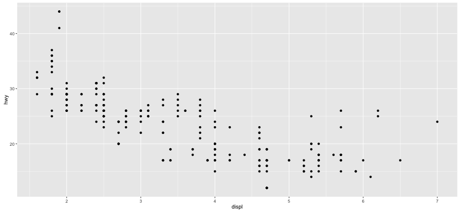

----
## Quick example 2
Note that the only thing that has changed here is the `geom` 


```r
data(mpg)
ggplot(mpg, aes(x = displ, y = hwy)) + geom_smooth()
```

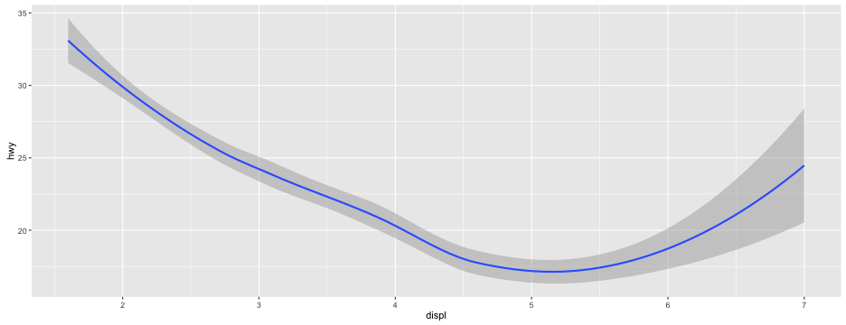

----
## Add an additional layer


```r
ggplot(mpg, aes(x = displ, y = hwy)) + geom_point() + geom_smooth()
```

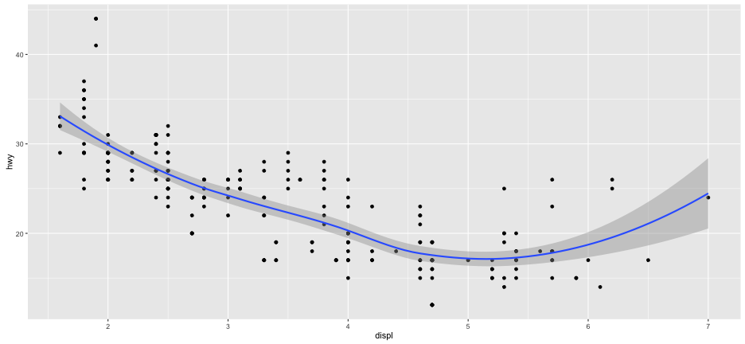

----
## Add an additional aesthetic


```r
ggplot(mpg, aes(x = displ, y = hwy, color = class)) + geom_point() 
```

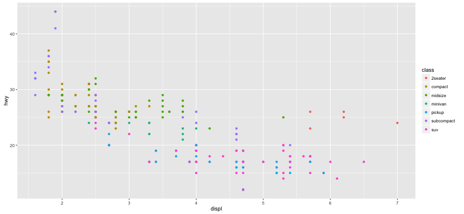

----
## Add smooth line for each class
# Too busy
Note the below spits out some warnings because of the sparsity of the data. I've suppressed them here.


```r
ggplot(mpg, aes(x = displ, y = hwy, color = class)) + geom_point() +
 geom_smooth()
```
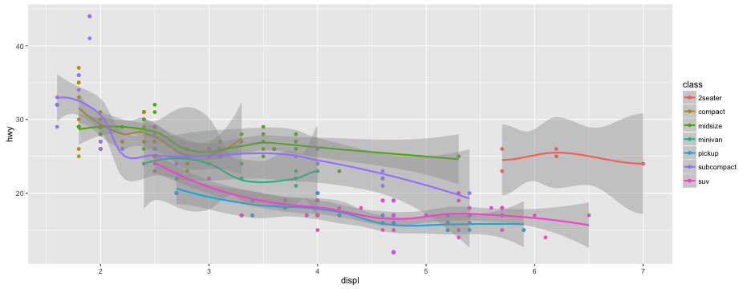

----
## Remove SE


```r
ggplot(mpg, aes(x = displ, y = hwy, color = class)) + geom_point() +
 geom_smooth(se = FALSE)
```

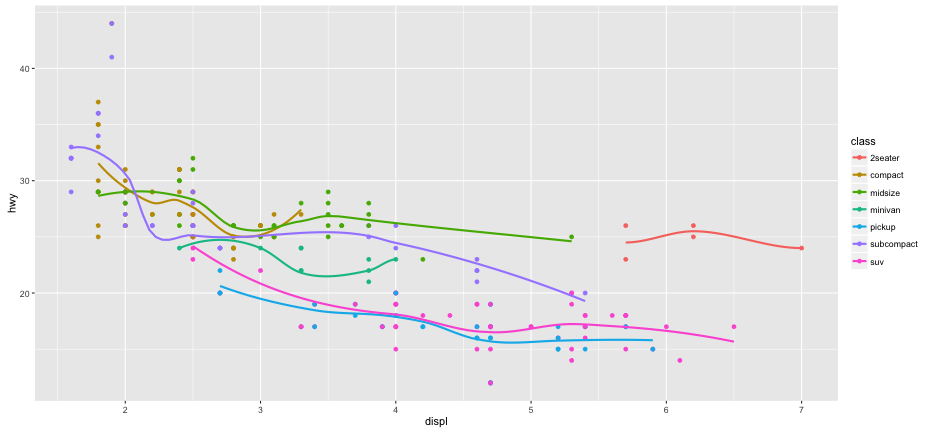

----
## Change the color of all points


```r
ggplot(mpg, aes(x = displ, y = hwy)) + geom_point(color = "purple") +
 geom_smooth(se = FALSE)
```

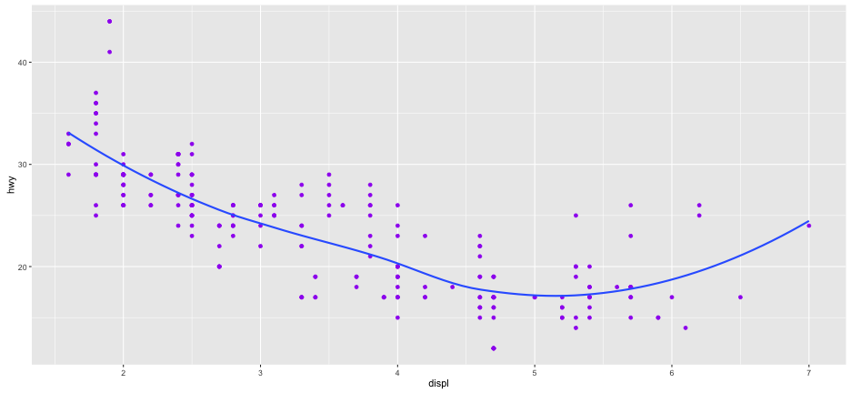

---- .segue
# Can you guess how we would change the line color?

----


```r
ggplot(mpg, aes(x = displ, y = hwy)) + geom_point(color = "purple") +
 geom_smooth(se = FALSE, color = "gray", size = 2, linetype = "dashed")
```


----
Worth mentioning, traditional calls to line color/type/size also work


```r
ggplot(mpg, aes(x = displ, y = hwy)) + geom_point(color = "purple") +
 geom_smooth(se = FALSE, col = "gray", lwd = 2, lty = "dashed")
```


----
## Change the "wiggliness" of the smoother


```r
ggplot(mpg, aes(x = displ, y = hwy)) + geom_point(color = "purple") +
 geom_smooth(span = 0.2)
```

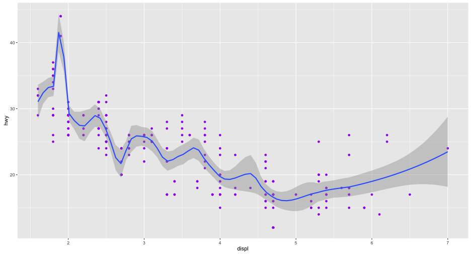

----
## Geoms for two continuous variables


|Geoms     |Description                                                              |Code             |
|:---------|:------------------------------------------------------------------------|:----------------|
|jitter    |Jitter points (to avoid overlapping)                                     |geom_jitter()    |
|point     |Plot points at each x&#124;y intersection                                |geom_point()     |
|quantile  |Plot lines from quantile regression                                      |geom_quantile()  |
|rug       |Plot 1d scatterplot on margins (stripchart)                              |geom_rug()       |
|smooth    |Plot a smoothing function (many smoothers available)                     |geom_smooth()    |
|text      |Add text annotations                                                     |geom_text()      |
|bin2d     |Bin observations that are close together and color according the density |geom_bin2d()     |
|density2d |Contour lines of the data density                                        |geom_density2d() |
|hex       |Hexagonal bins of data colored according to their density                |geom_hex()       |

----
## Guided practice
* Load (install first, if necessary) the *ggplot2* package. 
* Load the diamonds dataset with `data(diamonds)`
* Set and store the data and aesthetics, in an object `p`, using the following code


```r
p <- ggplot(diamonds, aes(carat, price))
```

* Explore different geoms, with `p + geom_XXX()`. For example, a basic scatterplot could be produced with


```r
p + geom_point()
```

* Add at least one additional layer (i.e., produce a plot with at least two layers)
* Modify the aesthetics to color the points by one of *cut*, *color*, or *clarity*. Store this in `p2`
* Play around and change some more colors, explore other variables, geoms, etc.


-----
## Some possibilities


```r
p + geom_point()
```


----
## Probably better


```r
p + geom_hex()
```

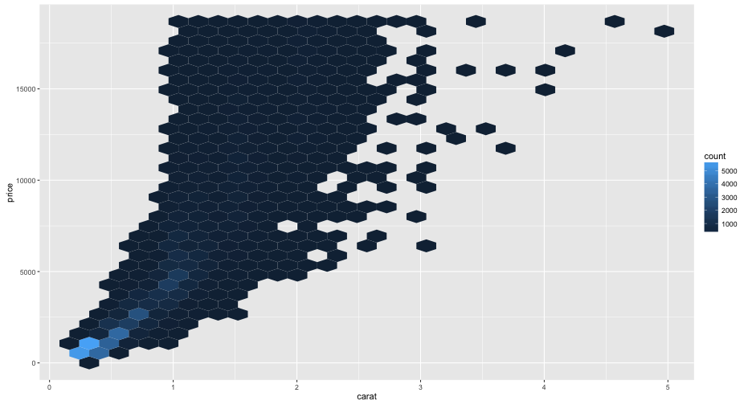

----
## Another similar alternative

```r
p + geom_bin2d()
```

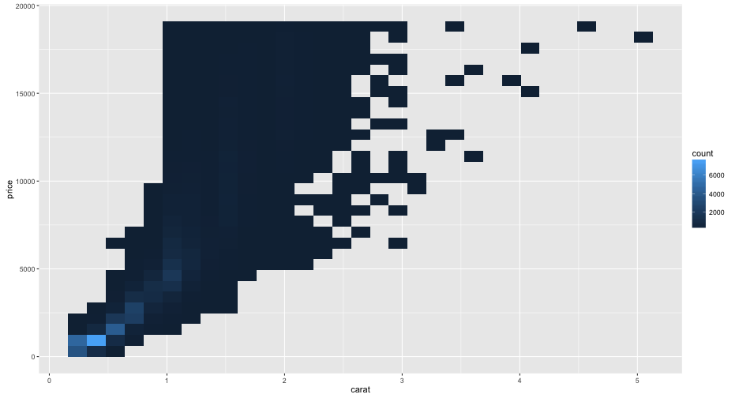

----
## Yet another alternative


```r
p + geom_point(alpha = 0.01) + geom_density2d(color = "red")
```

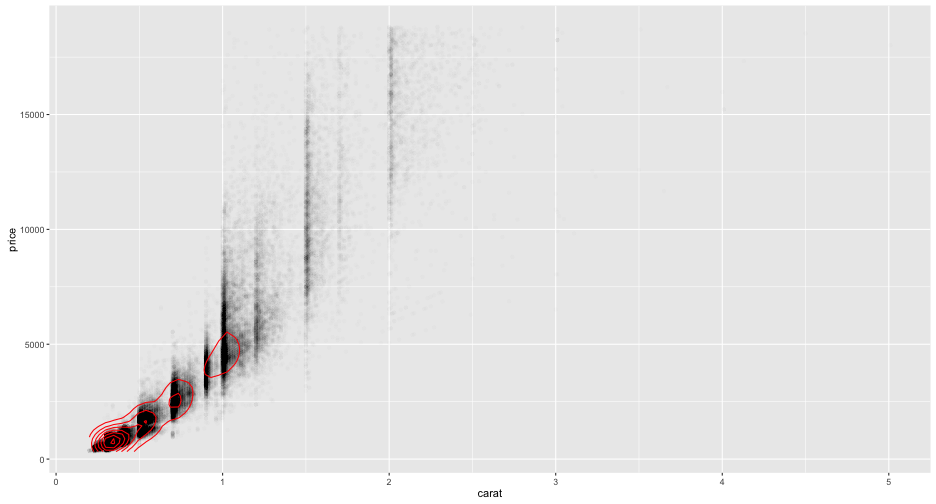

----
## An alternative with base


```r
dens <- densCols(diamonds$carat, diamonds$price, 
  colramp = colorRampPalette(c("black", "white")))

cols <-  colorRampPalette(c("#000099", "#00FEFF", "#45FE4F", 
                            "#FCFF00", "#FF9400", "#FF3100"))(250)
diamonds$dens <- col2rgb(dens)[1,] + 1
diamonds$col <- cols[diamonds$dens]
diamonds <- diamonds[order(diamonds$dens),]
plot(price ~ carat, 
	 data=diamonds, 
	 pch=20, 
	 col=col, 
	 bty = "n",
	 xlim = c(0,5),
	 ylim = c(0, 20000))
```

----


----
## Add contour lines


```r
library(MASS)
zd <- na.omit(cbind(diamonds$carat, diamonds$price))
z <- kde2d(zd[ ,1], zd[ ,2], n=50)
contour(z, drawlabels=FALSE, nlevels=8, add=TRUE)
```


-----
## Quantiles
Defaults to the 25th, 50th, and 75th percentiles


```r
p + geom_quantile()
```

```
## Smoothing formula not specified. Using: y ~ x
```

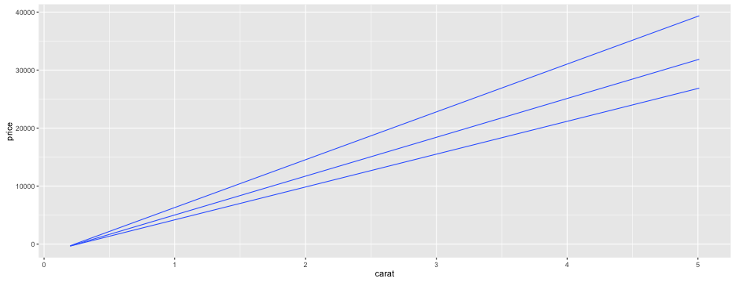

-----
## Quantiles
Change the quantiles to deciles (from 10th to 90th)


```r
p + geom_quantile(quantiles = seq(0.1, 0.9, 0.1))
```

```
## Smoothing formula not specified. Using: y ~ x
```


----
## Add an extra layer


```r
p + geom_point() + geom_rug() + geom_smooth()
```

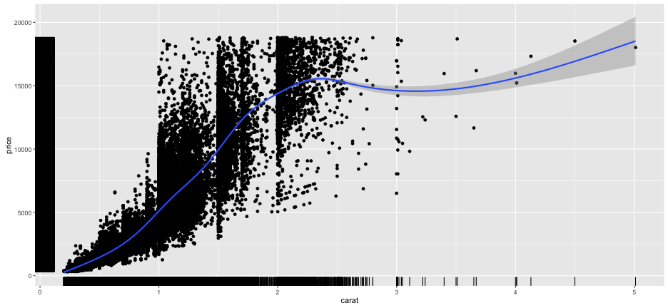

----
## Color by cut


```r
p2cut <- ggplot(diamonds, aes(carat, price, color = cut))
p2cut + geom_point()
```

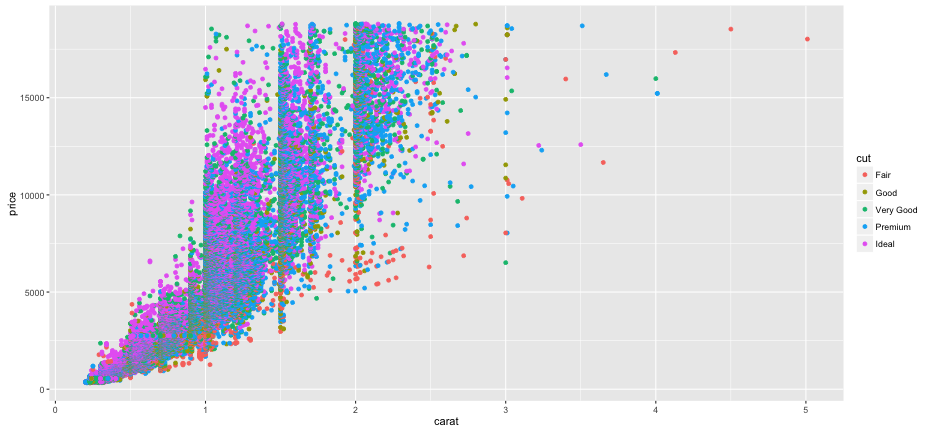

----
## Color by color


```r
p2color <- ggplot(diamonds, aes(carat, price, color = color))
p2color + geom_point()
```


----
## Color by clarity


```r
p2clarity <- ggplot(diamonds, aes(carat, price, color = clarity))
p2clarity + geom_point()
```

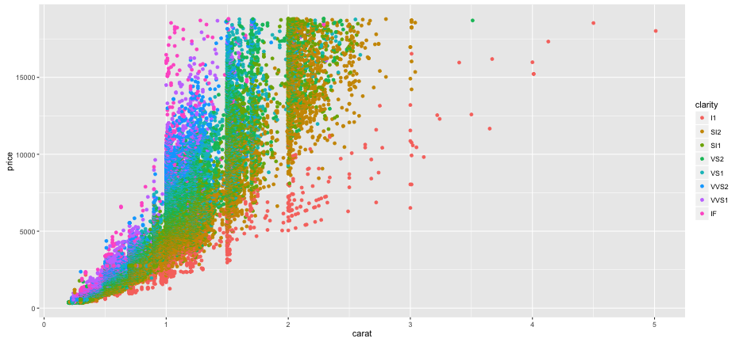

----
## geoms: One variable


|Geoms                  |Description                                                |Code                    |
|:----------------------|:----------------------------------------------------------|:-----------------------|
|area                   |Filled area plot                                           |geom_area(stat = "bin") |
|density                |Density plot                                               |geom_density()          |
|dotplot                |Stacked dotplot, with each dot representing an observation |geom_dotplot()          |
|polygon of Frequencies |Polygon of frequencies                                     |geom_freqpoly           |
|histogram              |Standard histogram                                         |geom_histogram          |
|barplot                |Standard barchart                                          |geom_bar                |

----
## Area plot

```r
price <- ggplot(diamonds, aes(price)) 
price + geom_area(stat = "bin")
```

```
## `stat_bin()` using `bins = 30`. Pick better value with `binwidth`.
```

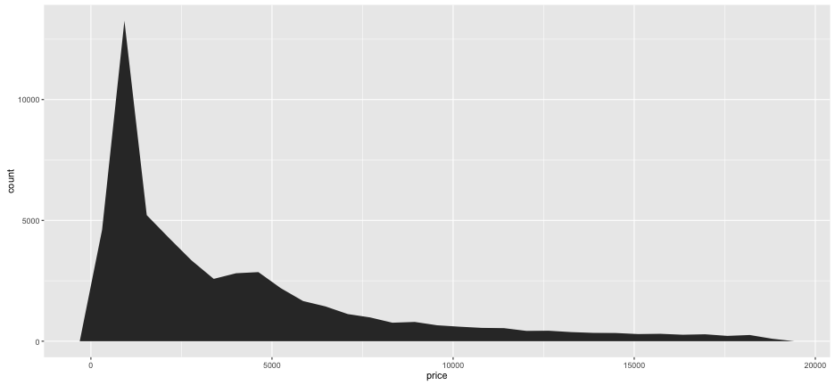

----
# Frequency polygons

```r
price + geom_freqpoly()
```

```
## `stat_bin()` using `bins = 30`. Pick better value with `binwidth`.
```

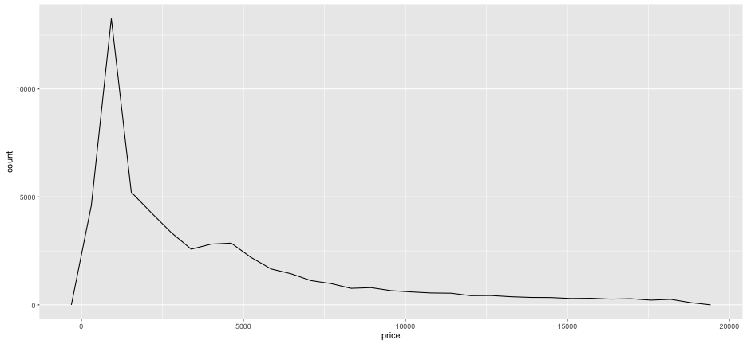

----
## Evaluate frequencies by *cut*


```r
price2 <- ggplot(diamonds, aes(price, color = cut))
price2 + geom_freqpoly(bins = 50)
```

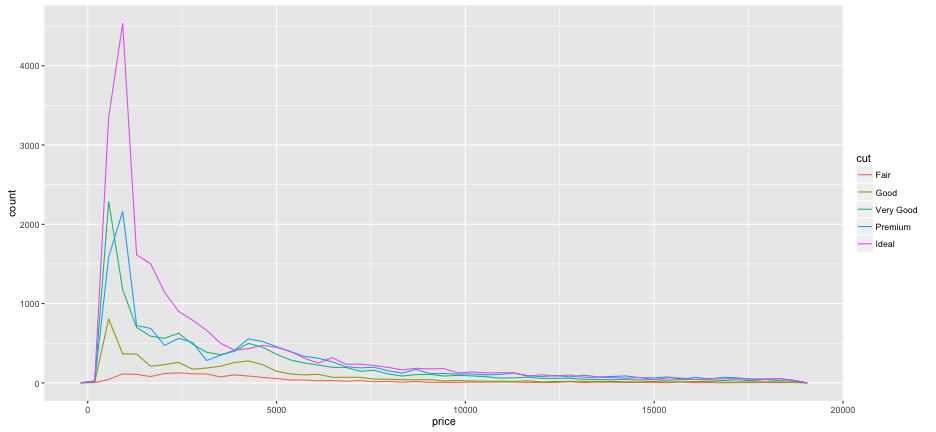

----
## Histograms

```r
price + geom_histogram()
```

```
## `stat_bin()` using `bins = 30`. Pick better value with `binwidth`.
```

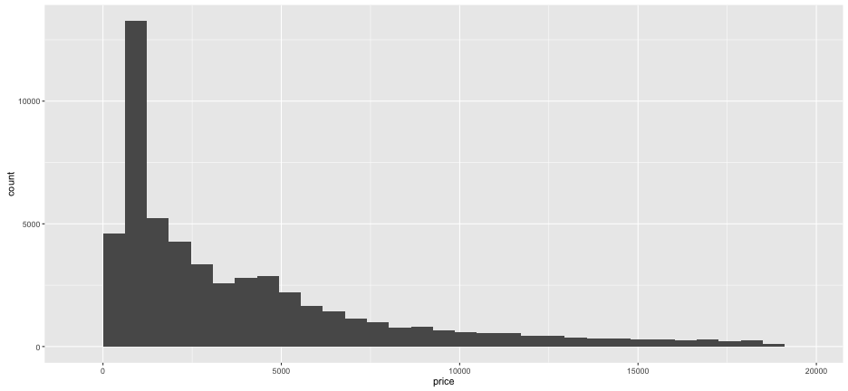

----
# Change binwidth

```r
price + geom_histogram(binwidth = 5)
```

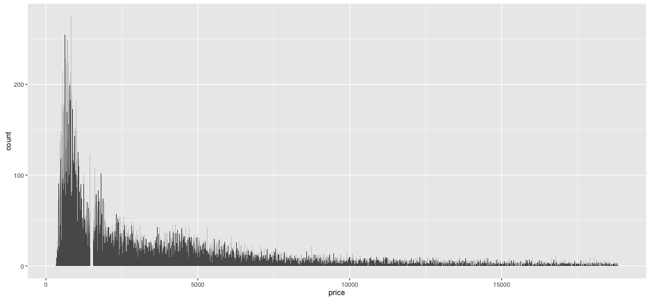

----
## Barplots


```r
ggplot(mpg, aes(trans)) + geom_bar()
```

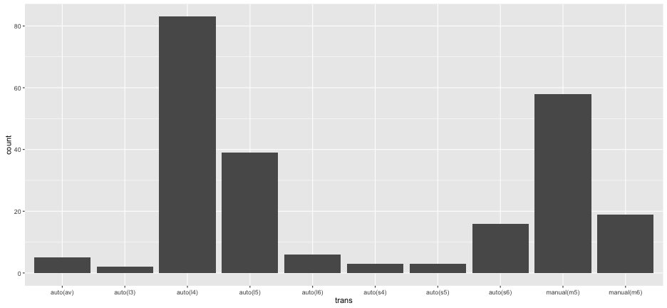

----
## Better: Tufte-esque
* Install and load the *ggthemes* package
* Add white horizontal lines at y-axis labels (via `geom_hline`)


```r
install.packages("ggthemes")
library(ggthemes)
ggplot(mpg, aes(trans)) + geom_bar(fill = "gray") + theme_tufte() + 
	geom_hline(yintercept = seq(20, 80, 20), col = "white")
```
(plot displayed on next slide)

----
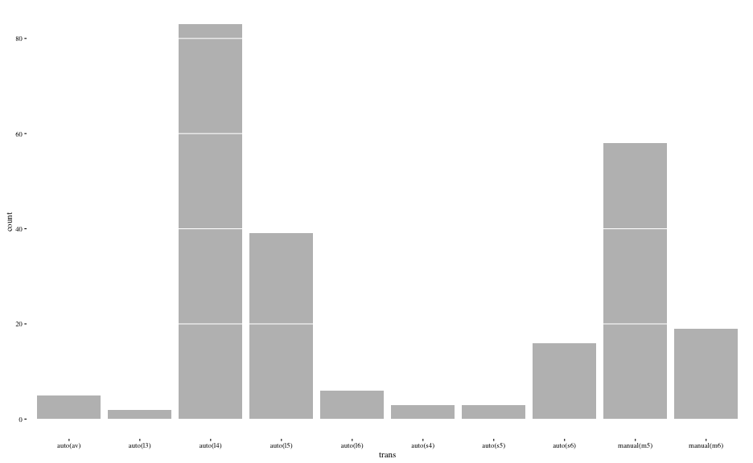

---- .segue
# Plotting categorical variables

----
## boxplots
Note that the categorical variable must be categorical or declared as a factor


```r
bp <- ggplot(mpg, aes(drv, hwy))
bp + geom_boxplot()
```

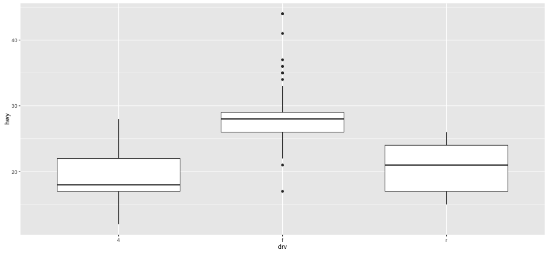

---- &twocol
## stripcharts

*** =left


```r
bp + geom_point()
```

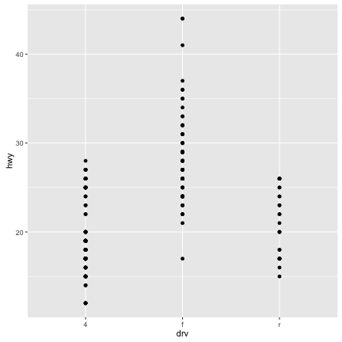

*** =right


```r
bp + geom_jitter()
```

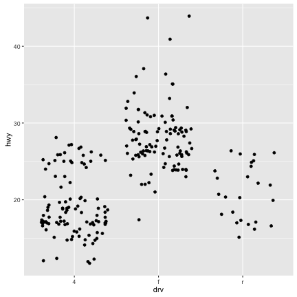

-----
## Control the amount of jittering


```r
bp + geom_jitter(width = 0.3)
```

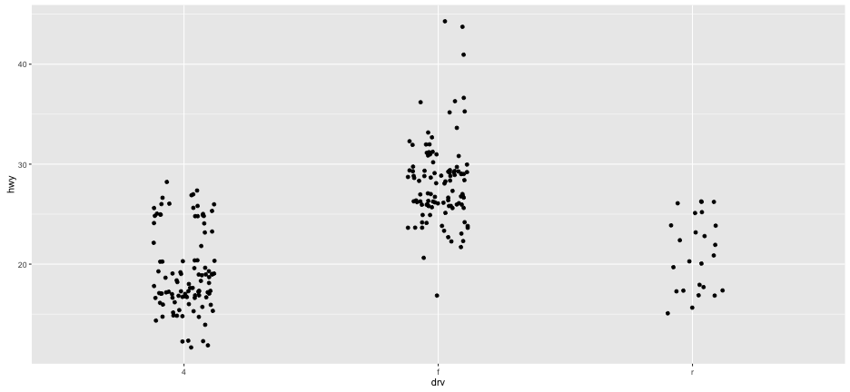

----
## Useful together


```r
bp + geom_boxplot() + geom_jitter(width = 0.3)
```

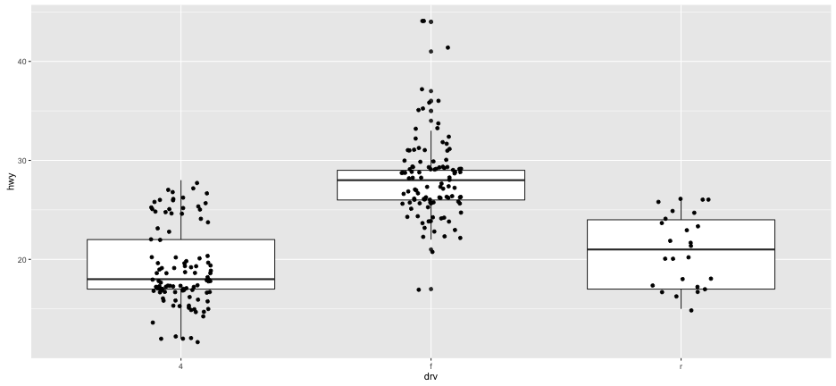

----
## Usually better: Violin plots


```r
bp + geom_violin()
```

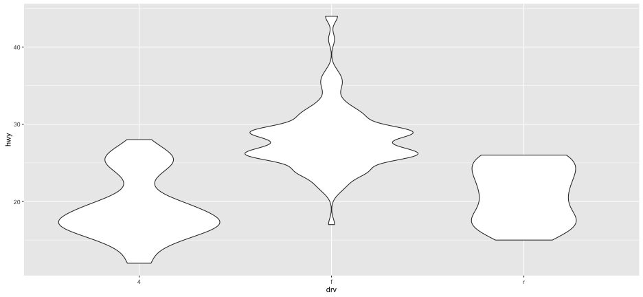

---- .segue
# Modifying axes and labels

---- &twocol
## Changing labels

*** =left


```r
ggplot(mpg, aes(cty, hwy)) + geom_point()
```

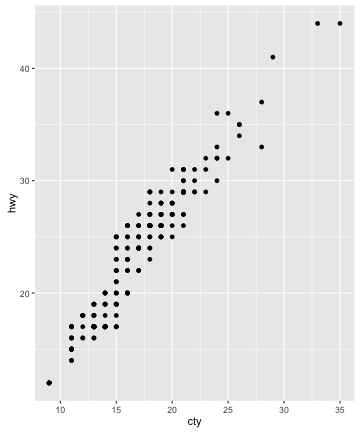

*** =right


```r
ggplot(mpg, aes(cty, hwy)) + geom_point() +
	xlab("MPG (city)") +
	ylab("MPG (highway)")
```

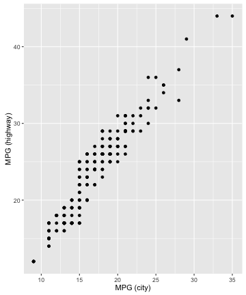

----
## Adding a main title


```r
ggplot(mpg, aes(cty, hwy)) + geom_point() +
	xlab("MPG (city)") +
	ylab("MPG (highway)") + 
	ggtitle("Relation between city and highway miles per gallon")
```


----
## Alternative specification


```r
mpgHC <- ggplot(mpg, aes(cty, hwy)) + geom_point()
mpgHC + labs(title = "Relation between city and highway miles per gallon",
				x = "MPG (city)", y = "MPG (highway)")
```

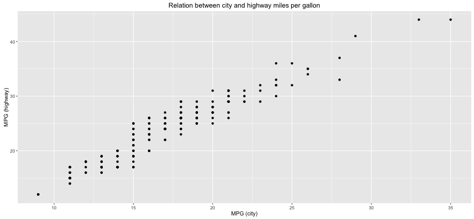

----
## Labs also allows you to change legend names


```r
mpgHC2 <- ggplot(mpg, aes(cty, hwy, color = drv)) + geom_point()
mpgHC2 + labs(title = "Relation between city and highway miles per gallon",
				x = "MPG (city)", y = "MPG (highway)", color = "Drivetrain")
```

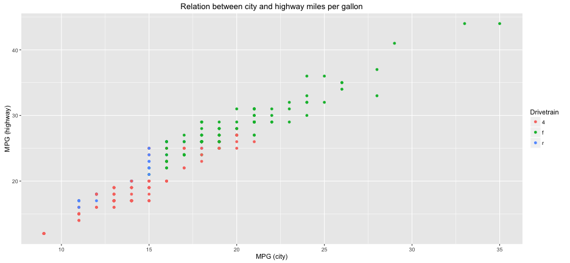

----
## Omit labels


```r
mpgHC2 + xlab(NULL) + ylab(NULL)
```

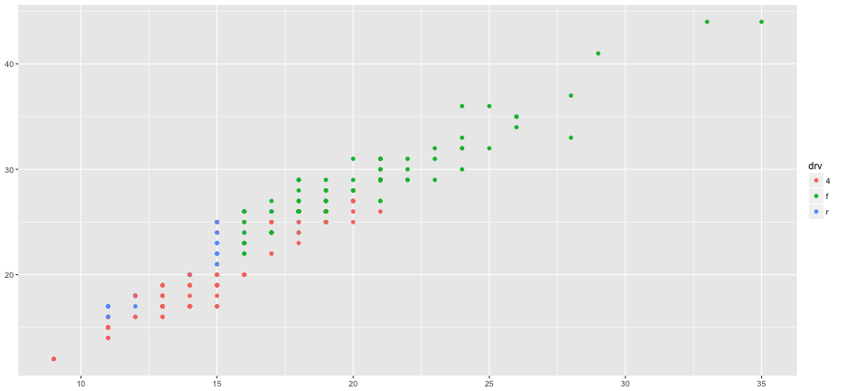

----
## Limit x-axis range


```r
mpgHC2 + xlim(15, 30)
```

```
## Warning: Removed 75 rows containing missing values (geom_point).
```

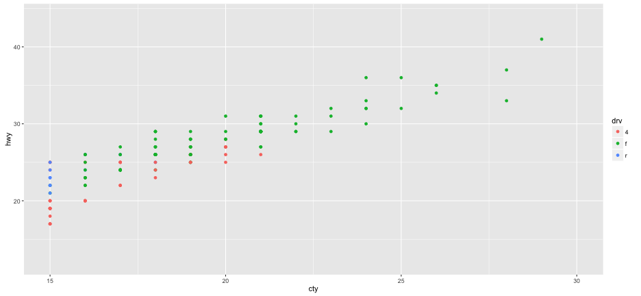

----
## Limit y-axis range


```r
mpgHC2 + ylim(20, 35)
```

```
## Warning: Removed 84 rows containing missing values (geom_point).
```

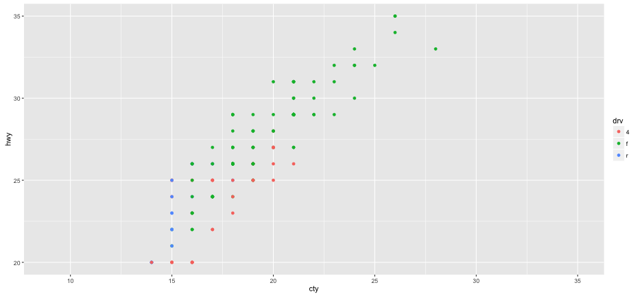


--- .segue
# Faceting

----
## Produce separate plots according to a specific variable
Back to the mpg dataset:
* Produce a separate plot of the relation between engine size and highway miles per gallon for each car type.


```r
hwy <- ggplot(mpg, aes(displ, hwy))
hwy + geom_point() + facet_wrap(~class)
```

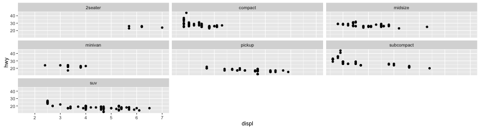

----
## Add a linear function to each plot


```r
hwy <- ggplot(mpg, aes(displ, hwy))
hwy + geom_point() + geom_smooth(method = "lm") + facet_wrap(~class)
```

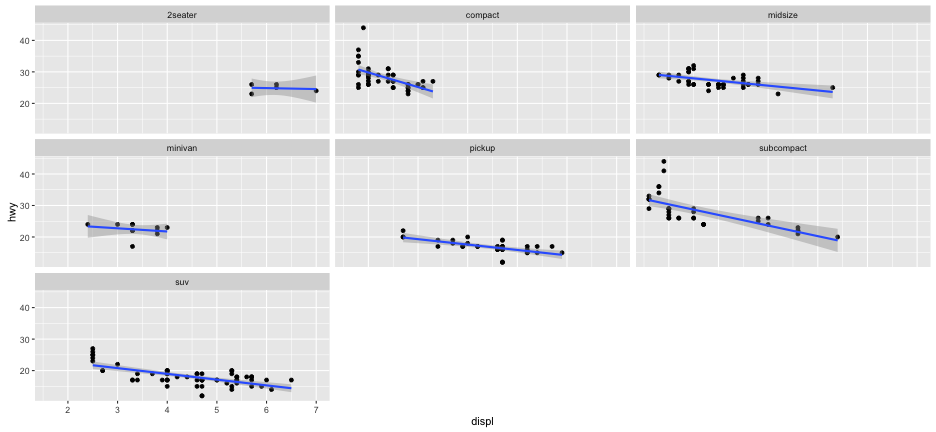

----
## Example with growth modeling
The data


```r
# Loaded earlier
head(d, n = 15)
```

```
##         SID   TID ScID    Months RIT
## 2873 332347 30867 1117 8.7387097 192
## 355  400047 69957 1077 1.6387097 182
## 387  400047 69957 1077 4.3225806 179
## 162  400047 69957 1077 8.9677419 191
## 648  400277 69957 1077 1.2053763 196
## 230  400277 69957 1077 4.3225806 197
## 780  400277 69957 1077 8.9677419 209
## 8878 400597 32247 1257 0.9720430 197
## 8914 400597 32247 1257 4.2258065 202
## 8790 400597 32247 1257 8.3053763 211
## 348  400807 28767 1077 1.3387097 178
## 168  400807 28767 1077 4.1935484 190
## 803  400807 28767 1077 8.8053763 178
## 1150 401227 32787 1087 0.9387097 187
## 1269 401227 32787 1087 4.1612903 192
```

----
## Random sampling
There are far too many students to plot every one. Instead, we'll take a random sample of 16 (a couple of times)


```r
set.seed(100)
samp1 <- d[d$SID %in% sample(levels(d$SID), 16), ]
samp2 <- d[d$SID %in% sample(levels(d$SID), 16), ]
samp3 <- d[d$SID %in% sample(levels(d$SID), 16), ]
head(samp1)
```

```
##         SID   TID ScID    Months RIT
## 2803 503177 30867 1117 1.1053763 198
## 2829 503177 30867 1117 4.3548387 202
## 2761 503177 30867 1117 8.7387097 214
## 9275 516037 34167 1267 0.9387097 214
## 9191 516037 34167 1267 4.1612903 205
## 9614 516037 34167 1267 8.5720430 209
```

----
## Sample 1

```r
ggplot(samp1, aes(Months, RIT)) + 
	geom_point() + geom_smooth(color = "red", span = 2, se = FALSE) +
	 facet_wrap(~SID)
```

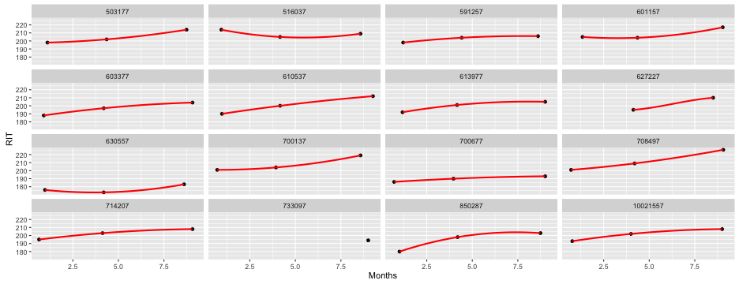

----
## Sample 2

```r
ggplot(samp2, aes(Months, RIT)) + 
	geom_point() + geom_smooth(color = "red", span = 2, se = FALSE) +
	 facet_wrap(~SID)
```

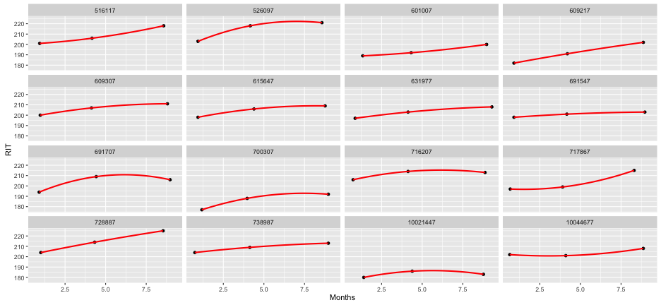

----
## Sample 3

```r
ggplot(samp3, aes(Months, RIT)) + 
	geom_point() + geom_smooth(color = "red", span = 2, se = FALSE) +
	 facet_wrap(~SID)
```

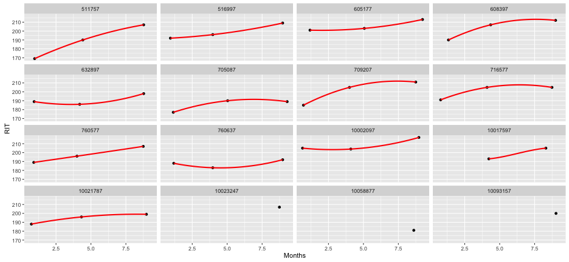

----
## Alternative: Connect the dots
Note that `group` is specified in the aesthetic now.


```r
ggplot(samp1, aes(Months, RIT, group = SID)) + geom_point() + 
	geom_line()
```

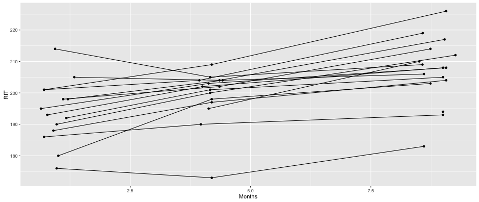

----
Or, put all lines in a single plot


```r
ggplot(samp1, aes(Months, RIT, group = SID)) + geom_point() + 
	geom_smooth(se = FALSE, span = 2)
```

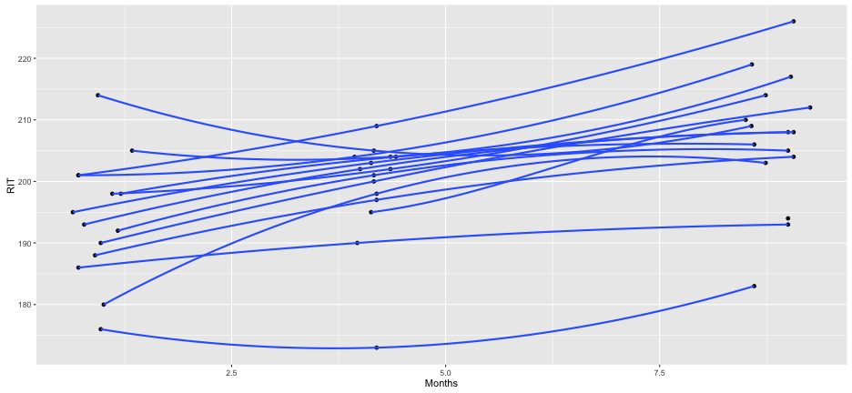

----
## What happens if you forget to specify the group?


```r
ggplot(samp1, aes(Months, RIT)) + geom_point() + 
	geom_line()
```

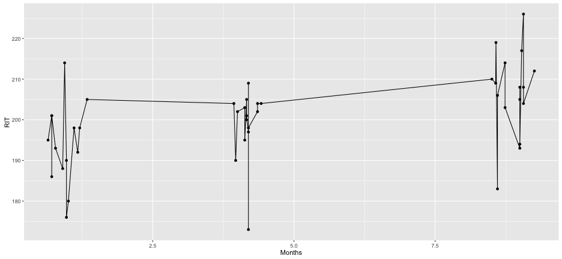

----
## How bad is the nonlinearity, really?
Overlay a linear trend


```r
ggplot(samp1, aes(Months, RIT)) + 
	geom_point() + geom_smooth(color = "red", span = 2, se = FALSE) +
	 geom_smooth(method = "lm", se = FALSE) + facet_wrap(~SID)
```

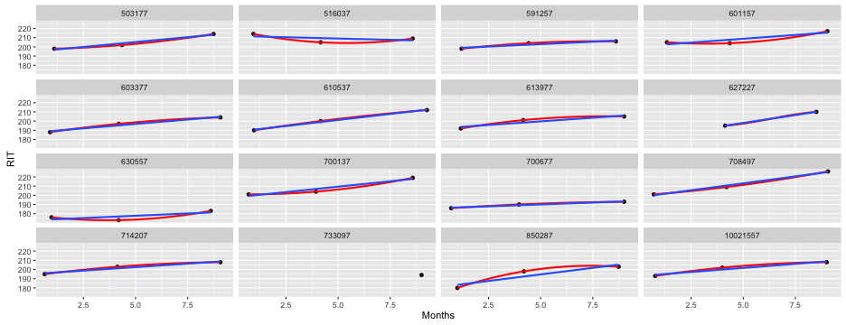

----

```r
ggplot(samp2, aes(Months, RIT)) + 
	geom_point() + geom_smooth(color = "red", span = 2, se = FALSE) +
	 geom_smooth(method = "lm", se = FALSE) + facet_wrap(~SID)
```

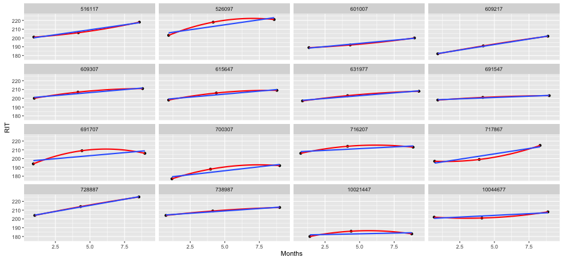

----

```r
ggplot(samp3, aes(Months, RIT)) + 
	geom_point() + geom_smooth(color = "red", span = 2, se = FALSE) +
	 geom_smooth(method = "lm", se = FALSE) + facet_wrap(~SID)
```

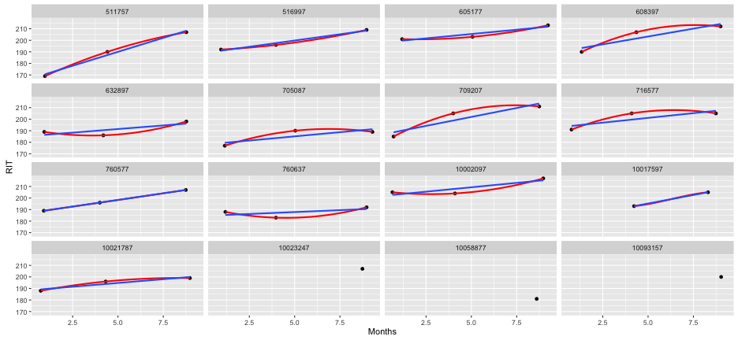

----
## A few notes
* Equivalent plots could be produced at other levels (in this case, the classroom or school levels)
* The previous plots did produce some warnings (only 3 points with the LOESS)


```r
lfit <- loess(RIT ~ Months, data = samp1, subset = SID == 503177, span = 2)
```

```
## Warning in simpleLoess(y, x, w, span, degree = degree, parametric =
## parametric, : span too small. fewer data values than degrees of freedom.
```

```
## Warning in simpleLoess(y, x, w, span, degree = degree, parametric =
## parametric, : Chernobyl! trL>n 3

## Warning in simpleLoess(y, x, w, span, degree = degree, parametric =
## parametric, : Chernobyl! trL>n 3
```

----
## Different faceting
`facet_wrap` vs `facet_grid`


----
## Options for `facet_wrap`
Change the number of columns


```r
f <- ggplot(mpg, aes(displ, hwy)) + geom_point()
f + facet_wrap(~class, ncol = 4)
```

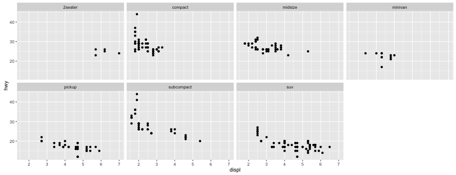

----
Change the direction plots are produced


```r
f + facet_wrap(~class, ncol = 4, dir = "v")
```

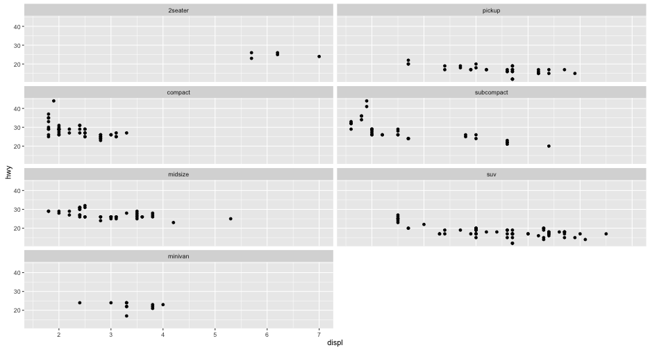

----
## Facet Grid
Note that `.` must be included on the left, if only a single variable is used


```r
f + facet_grid(. ~ cyl)
```

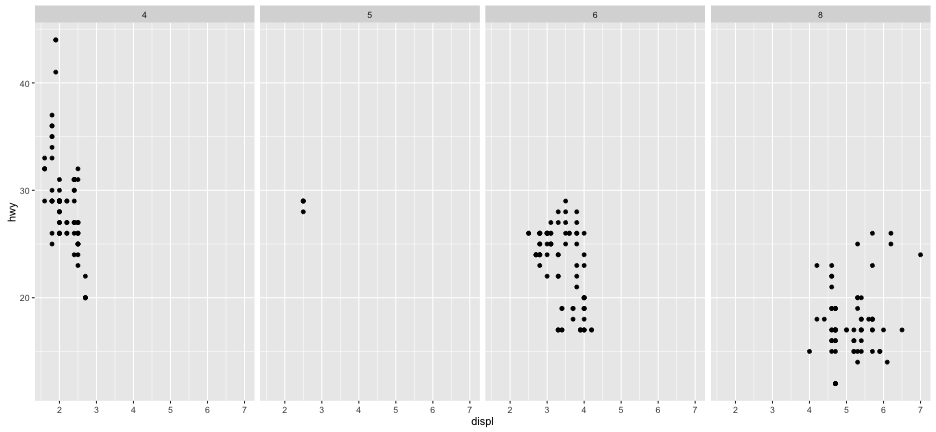

----

```r
f + facet_grid(drv ~ .)
```

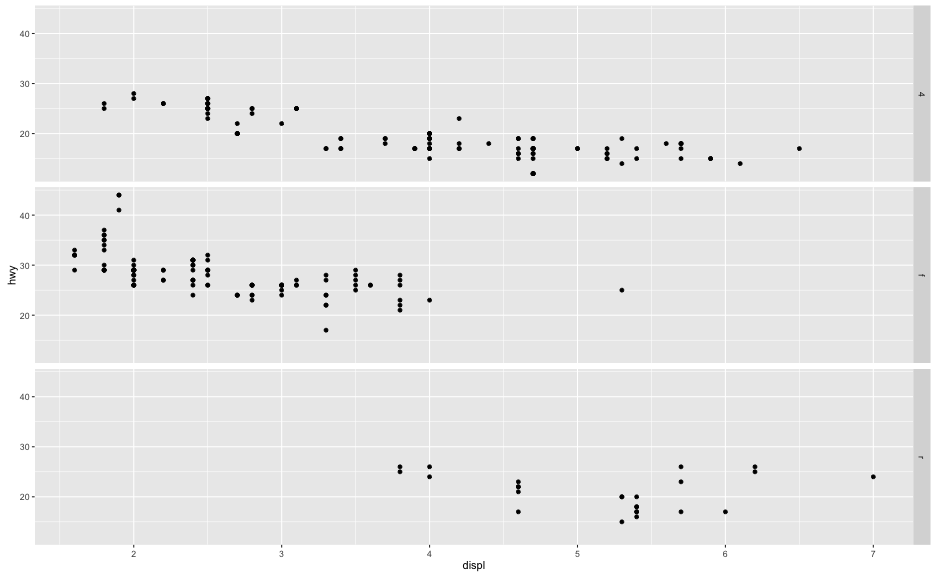

----
## Two variables


```r
f + facet_grid(drv ~ cyl)
```

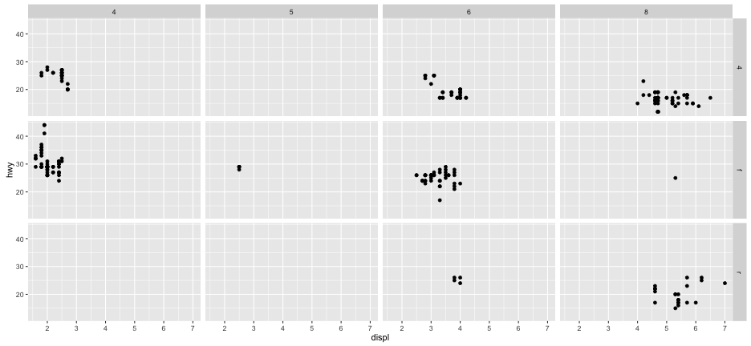

----
## Two variables

(The LOESS estimator spits out warnings here again)


```r
f + geom_smooth(span = 2) + facet_grid(drv ~ cyl)
```

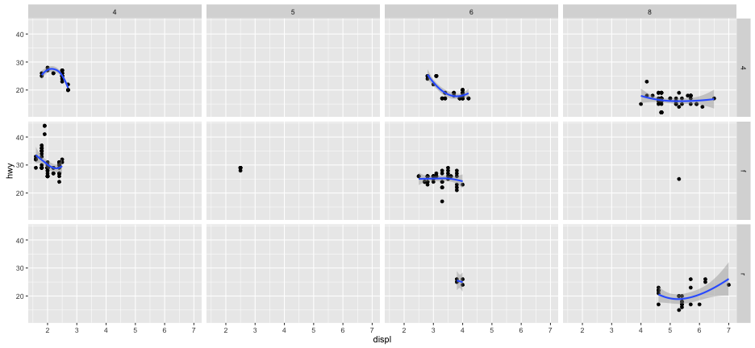

-----
## Scales with faceting
Allow all scales to be produced independently (freely)


```r
f + facet_wrap(~ cyl, scales = "free")
```

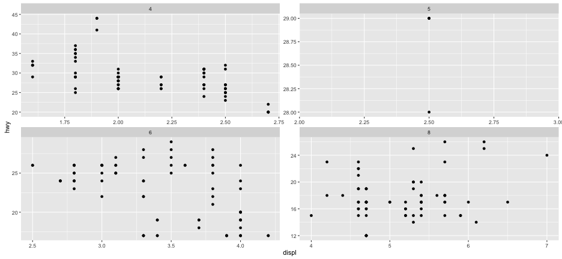

----
Free y-axis scale, fixed x


```r
f + facet_wrap(~ cyl, scales = "free_y")
```

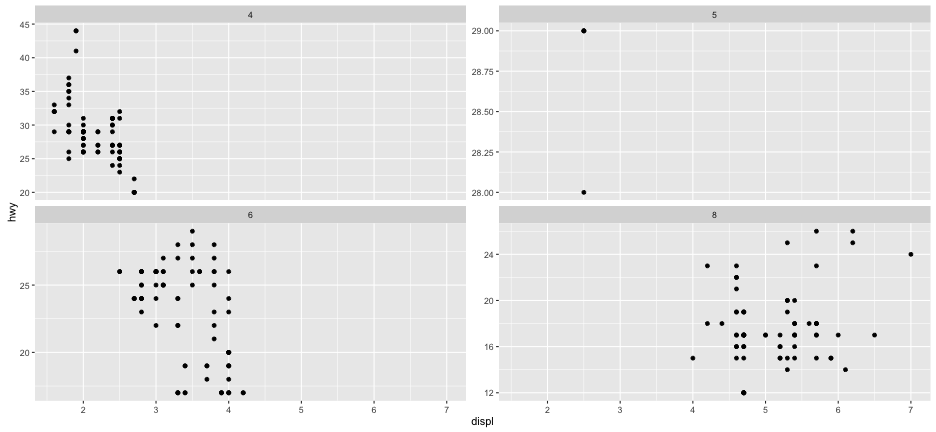

----
Free x-axis scale, fixed y


```r
f + facet_wrap(~ cyl, scales = "free_x")
```

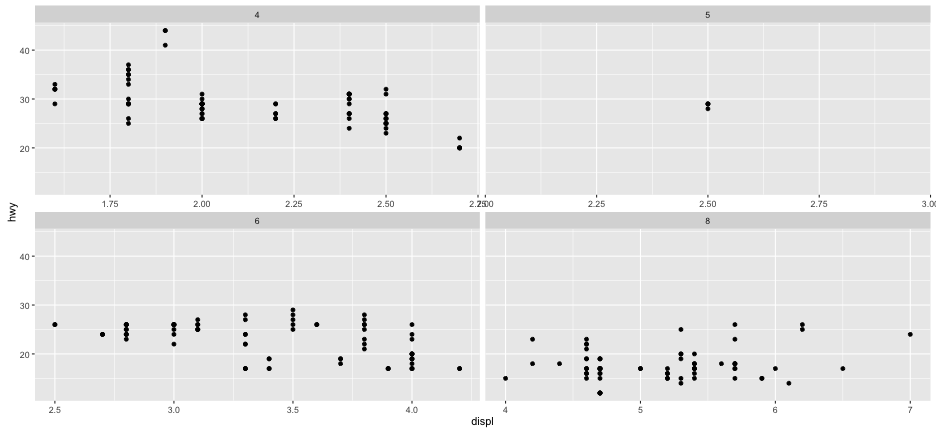

----
Change spacing with `facet_grid`


```r
f + facet_grid(drv ~ cyl, scales = "free", space = "free")
```

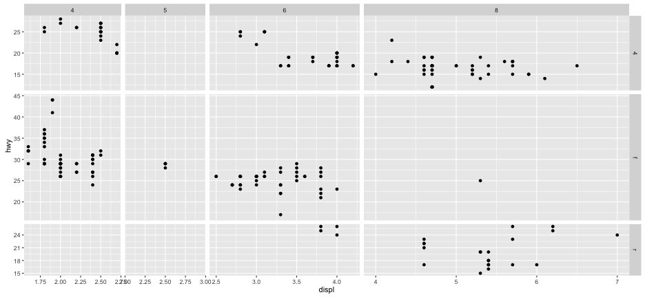

---- &twocol
## Faceting vs Grouping

*** =left


```r
ggplot(mpg, 
	aes(displ, hwy, color = factor(drv))) + 
	geom_point()
```

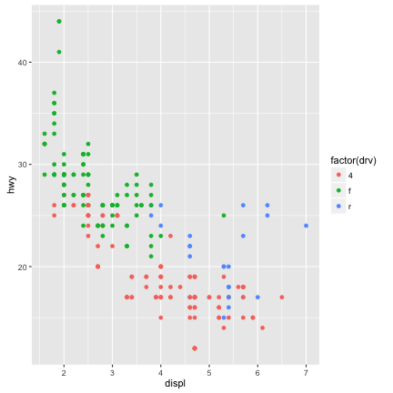

*** =right


```r
ggplot(mpg, aes(displ, hwy)) + 
	geom_point() + 
	facet_wrap(~ drv)
```

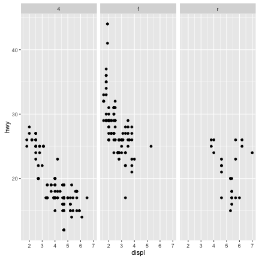

----
## Another option
Plot all the points on each plot in the background


```r
mpg2 <- mpg[ ,c("displ", "hwy")]

ggplot(mpg, aes(displ, hwy)) + 
	geom_point(data = mpg2, col = "gray80") + 
	geom_point(aes(color = drv)) +
	facet_wrap(~ drv)
```

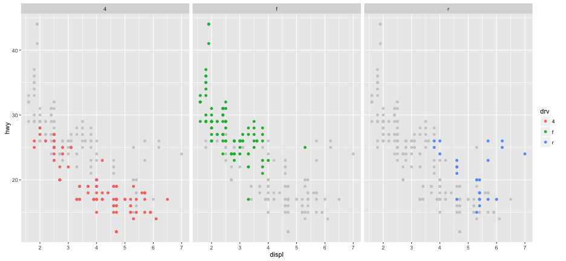

----
## Guided practice

You can view the probability densities of diamond price by cut with the following code.


```r
base <- ggplot(diamonds, aes(price, color = cut))
base + geom_density()
```

* Use faceting to view the conditional densities by *clarity*.
* Modify the code to group by *clarity* and facet by *cut*. Which do you 
  prefer?

You can view the relation between *price* and *carat* with the following code


```r
ggplot(diamonds, aes(carat, price)) + geom_point()
```
* Modify the code so the points are colored according to their color.
* Use faceting to produce separate plots for each color.

----
Use faceting to view the conditional densities by *clarity*.


```r
base <- ggplot(diamonds, aes(price, color = cut))
base + geom_density() + facet_wrap(~ clarity)
```

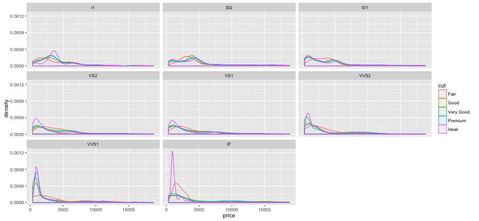

----
Modify the code to group by *clarity* and facet by *cut*.


```r
base2 <- ggplot(diamonds, aes(price, color = clarity))
base2 + geom_density() + facet_wrap(~ cut)
```

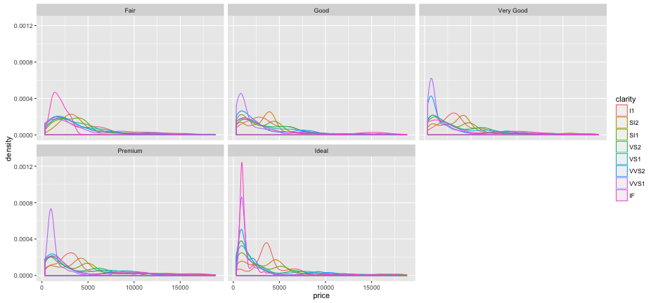

----
Modify the code so the points are colored according to their color.


```r
ggplot(diamonds, aes(carat, price, color = color)) + geom_point()
```

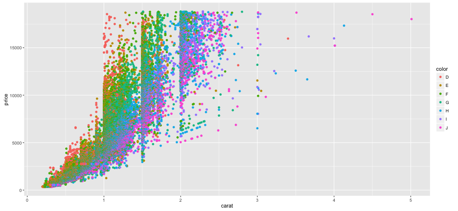

----
Use faceting to produce separate plots for each color.


```r
ggplot(diamonds, aes(carat, price)) + geom_point() + facet_wrap(~ color)
```

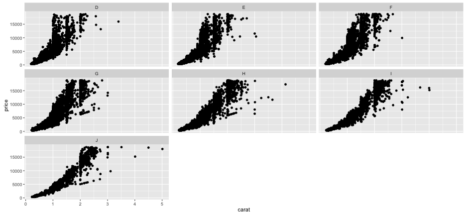

---- .segue
# Themes

----
## Overview of themes
* Themes do not change how the data are rendered
* Only change visual properties
* Many built-in themes
	+ Even more available through extension packages (specifically *ggthemes*)
* Fully customizable (though the syntax becomes lengthier)

----
## theme_gray (default)


```r
baseP <- ggplot(economics, aes(date, unemploy)) + geom_line()
baseP + theme_gray()
```

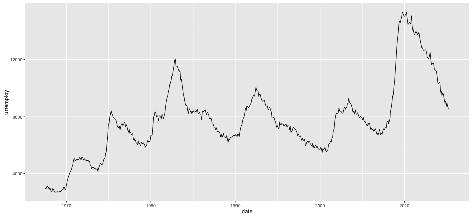

----
## theme_bw


```r
baseP + theme_bw()
```

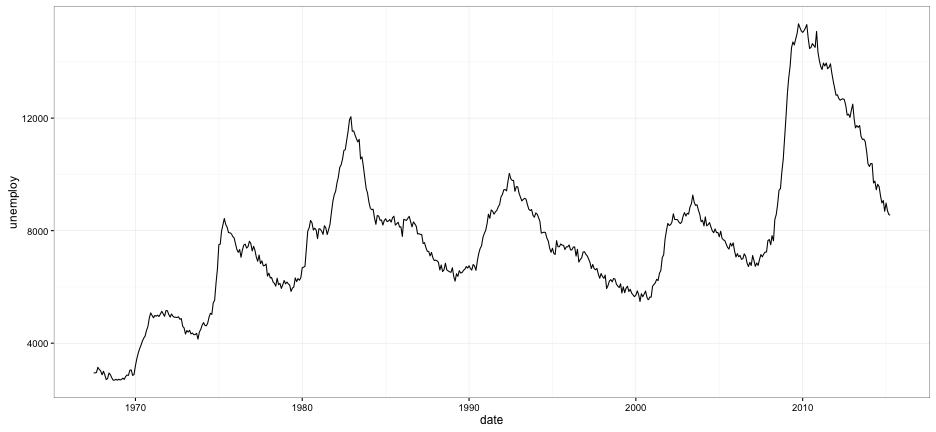

----
## theme_classic


```r
baseP + theme_classic()
```

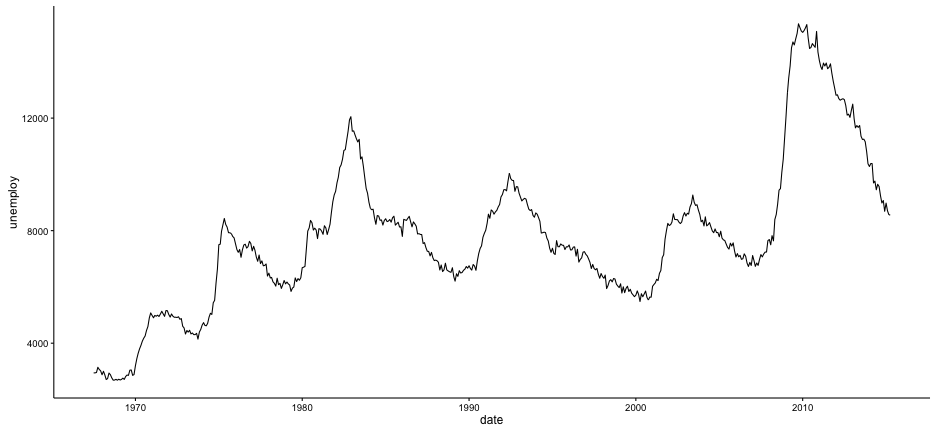

----
## theme_dark


```r
baseP + theme_dark()
```

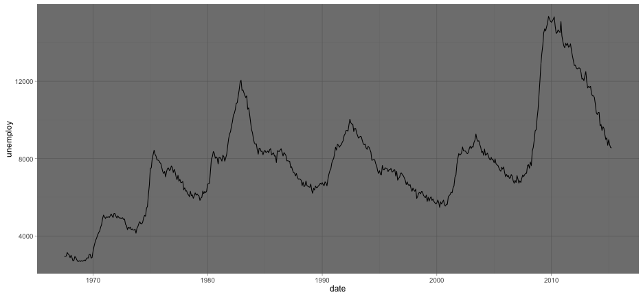

----
## theme_minimal


```r
baseP + theme_minimal()
```

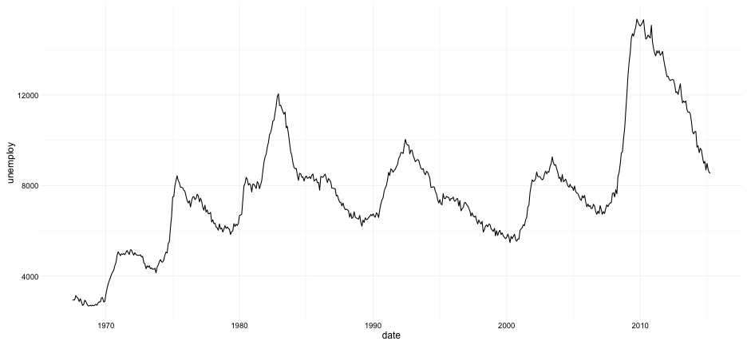

----
## Some from the *ggthemes* packages
# theme_tufte


```r
# install.packages("ggthemes") # (stable) or
# devtools::install_github(""jrnold/ggthemes"") # (development)
library(ggthemes)
baseP + theme_tufte()
```

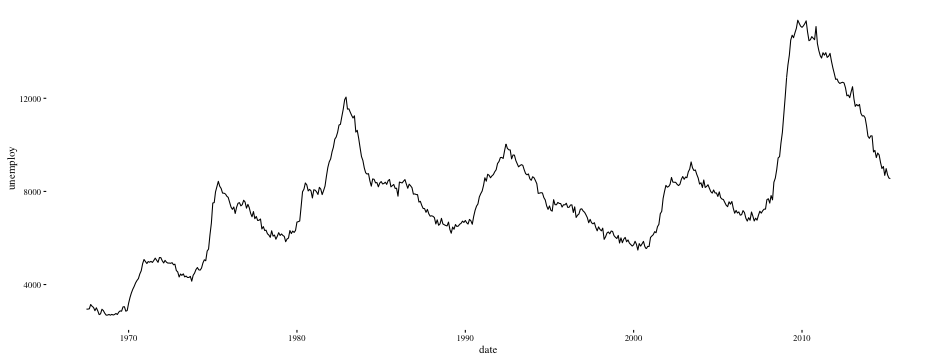

----
## theme_fivethirtyeight


```r
baseP + theme_fivethirtyeight()
```

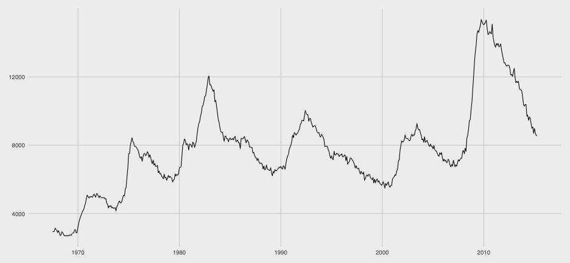

----
## theme_stata


```r
baseP + theme_stata()
```

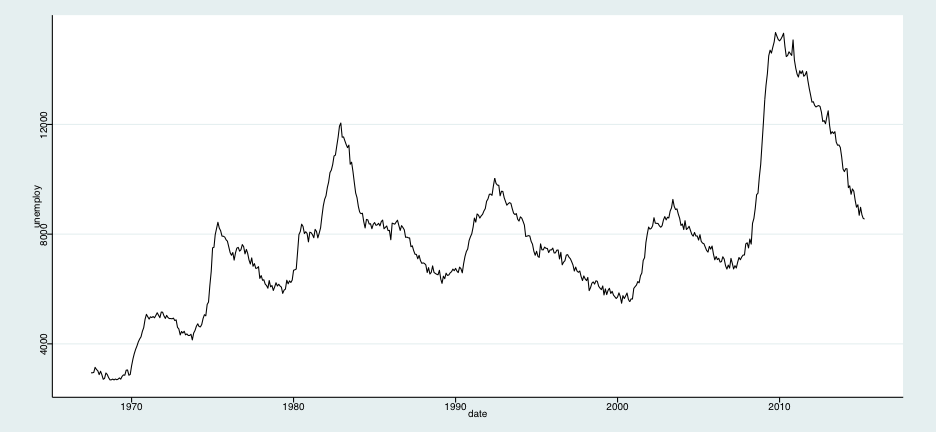

----
## theme_base


```r
baseP + theme_base()
```

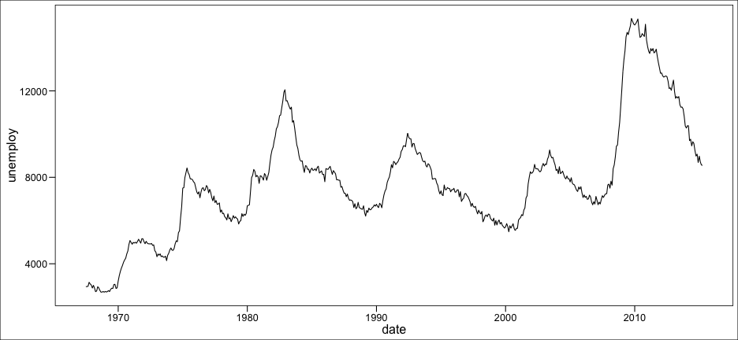

----
## theme_solarized


```r
baseP + theme_solarized()
```

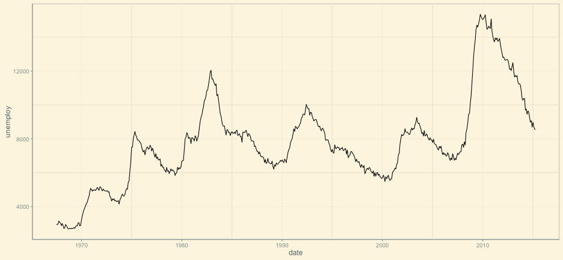

----
## theme_wsj


```r
baseP + theme_wsj()
```

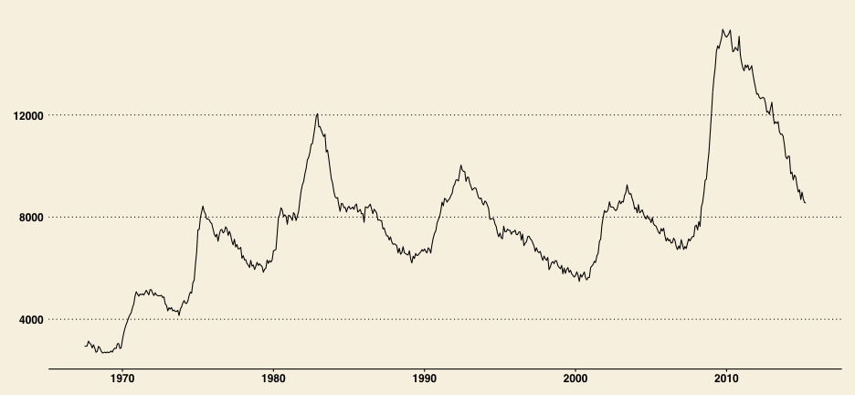

----
## Further customization
(We're probably out of time, so...)
* See http://docs.ggplot2.org/dev/vignettes/themes.html
* See *ggplot2* book, Chapter 8

<br>
**Take Home Message:** If you want it to look a certain way, you can do it (essentially nothing is impossible). Often there are others who have developed themes that will be close to what you want, which is easier than developing your own theme (although that can be rewarding in its own right).

---- .segue
# At the edge of development

----
## ggvis
* Eventual replacement for *ggplot2*
* Currently fairly limited
	+ Can't produce interactive plots within something like this slideshow
Let's take a look! http://ggvis.rstudio.com/interactivity.html

----
## The *gganimate* extension to *ggplot2*

<video   controls loop><source src="assets/fig/gganimate1-.webm" /><p>video of chunk gganimate1</p></video>
**Credit:** David Robinson (http://varianceexplained.org/files/loess.html)


----
## What does LOESS (and LOWESS) stand for again?
* Locally weighted scatterplot smoothing
* non-parametric
* Similar in for to k-nearest neighbor models

Let's visualize it!

----
## Animating LOESS fits with different spans

<video   controls loop><source src="assets/fig/gganimate2-.webm" /><p>video of chunk gganimate2</p></video>
**Credit:** David Robinson (http://varianceexplained.org/files/loess.html)


----
## Other extensions

See https://www.ggplot2-exts.org/ggiraph.html
