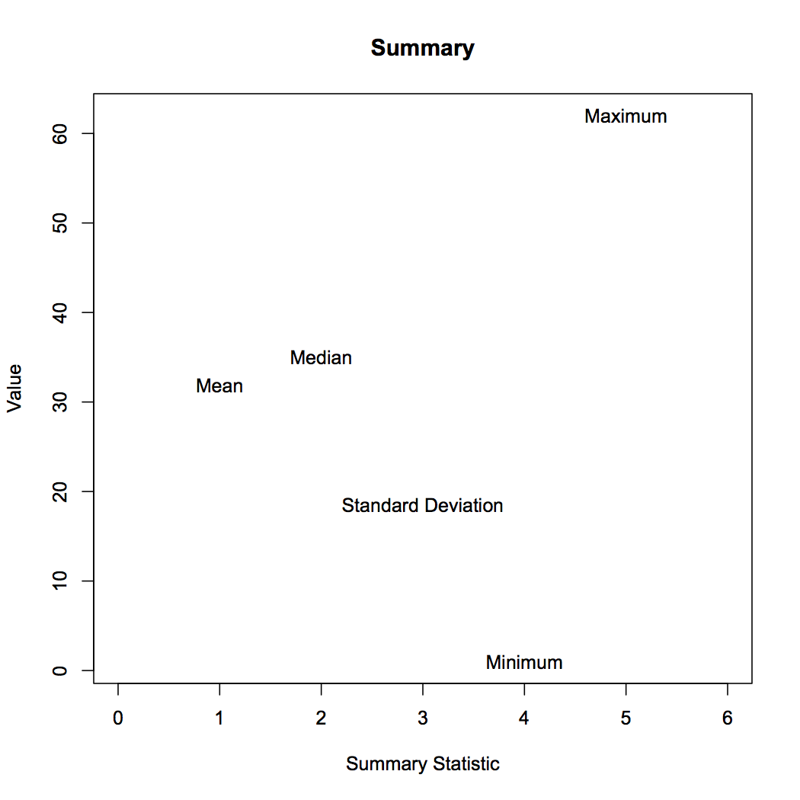

This homework is focused on writing and applying custom functions.

1. Write a function that reports the mean, median, standard deviation,
   minimum, and maximum values for a generic numeric vector, `x`. You can use the base functions. 
   * Make sure the function can handle missing data. Embed a message that 
     reports if any missing data were removed. 
   * If the vector fed to the function is non-numeric, coerce it to be so, and 
     embed a message stating that coercion occurred. 
   * Make the class of the output `smry`.
   * Round the output to 3 decimal places.

2. Load the `ratebeer_beerjobber.txt` dataset, and apply the function to each
   of the final five columns. Bind these results together into a single data frame or matrix, with the row names indicating the variable.

3. Produce a default plot for objects of class `smry`. The x-axis should be
   1:5, and rather than points, place text that states the summary statistic. The figure below shows an example. You will need to use the `text()` function.

4. Write a function to calculate the median of a generic vector, `x`.
   Compare the results of your function to the base call. Again make sure the function can handle missing data, and embed a warning if missing data are removed.

5. Write a function that takes a generic numeric vector, `x`, and produces a
   plot of the histogram with the density overlayed. Make sure the y-axis still refers to frequencies, rather than densities. Make the function generic enough that other arguments can be passed to `plot()`. Use the function to produce a plot of `abv`, with the line color changed, and modified x-axis label and title.
