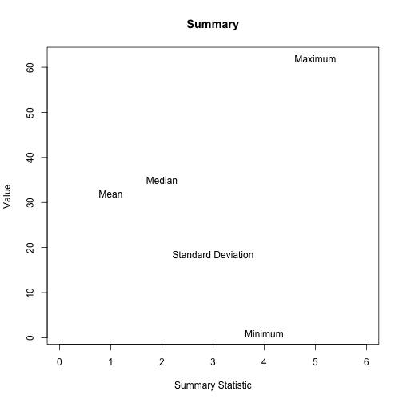
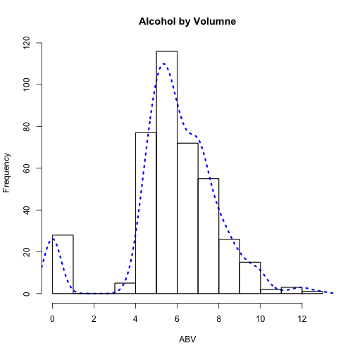

1. Write a function that reports the mean, median, standard deviation,
   minimum, and maximum values for a generic numeric vector, `x`. You can use the base functions. 
   * Make sure the function can handle missing data. Embed a message that 
     reports if any missing data were removed. 
   * If the vector fed to the function is non-numeric, coerce it to be so, and 
     embed a message stating that coercion occurred. 
   * Make the class of the output `smry`.
   * Round the output to 3 decimal places.


```r
smry <- function(x) {
	if(is.numeric(x) == FALSE) {
		warning("Vector coerced to numeric")
	}

	mn <- mean(as.numeric(x), na.rm = TRUE)
	md <- median(as.numeric(x), na.rm = TRUE)
	stDev <- sd(as.numeric(x), na.rm = TRUE)
	minm <- min(as.numeric(x), na.rm = TRUE)
	maxm <- max(as.numeric(x), na.rm = TRUE)
	
	if(length(x) != length(na.omit(x))) {
		warning("Missing data removed")
	}
	
	stats <- c(mn, md, stDev, minm, maxm)
	names(stats) <- c("Mean", "Median", "Standard Deviation", "Minimum", 
		"Maximum")

return(structure(round(stats, 3), class = "smry"))
}
```

2. Load the `ratebeer_beerjobber.txt` dataset, and apply the function to each
   of the final five columns. Bind these results together into a single data frame or matrix, with the row names indicating the variable.


```r
setwd("/Users/Daniel/Dropbox/Teaching/CourseR/")
beer <- read.delim("./data/ratebeer_beerjobber.txt")
head(beer)
```

```
##                                  name                 brewer
## 1                     Abbey Monks Ale Abbey Beverage Company
## 2                  Abbey Monks Tripel Abbey Beverage Company
## 3                     Abbey Monks Wit Abbey Beverage Company
## 4 Alameda Barn Owl Imperial Brown Ale    Alameda Brewing Co.
## 5         Alameda Black Bear XX Stout    Alameda Brewing Co.
## 6       Alameda El Torero Organic IPA    Alameda Brewing Co.
##                     style abv ratings score.overall score.by.style
## 1             Belgian Ale 5.2      96            50             49
## 2            Abbey Tripel 8.0       3            NA             NA
## 3 Belgian White (Witbier) 5.1      46            23             19
## 4               Brown Ale 7.9      13            74             81
## 5           Foreign Stout 6.8     172            94             76
## 6    India Pale Ale (IPA) 7.2      56            74             43
```

```r
Style <- smry(beer$style)
```

```
## Warning in smry(beer$style): Vector coerced to numeric
```

```r
ABV <- smry(beer$abv)
Ratings <- smry(beer$ratings)
Overall_Score <- smry(beer$score.overall)
```

```
## Warning in smry(beer$score.overall): Missing data removed
```

```r
Style_Score <- smry(beer$score.by.style)
```

```
## Warning in smry(beer$score.by.style): Missing data removed
```

```r
rbind(Style, ABV, Ratings, Overall_Score, Style_Score)
```

```
##                  Mean Median Standard Deviation Minimum Maximum
## Style          31.863   35.0             18.532       1    62.0
## ABV             5.900    5.9              2.202       0    12.8
## Ratings       113.605   60.5            148.885       0  1116.0
## Overall_Score  65.850   71.0             24.224       0   100.0
## Style_Score    60.872   62.0             26.877       0   100.0
```

3. Produce a default plot for objects of class `smry`. The x-axis should be
   1:5, and rather than points, place text that states the summary statistic.


```r
plot.smry <- function(ob) {
	plot(1:5, seq(ob["Minimum"], ob["Maximum"], length.out = 5), 
		type = "n", 
		xlab = "Summary Statistic",
		ylab = "Value",
		main = "Summary",
		xlim = c(0, 6))
	text(1:5, ob, names(ob))
}
plot(Style)
```

 

4. Write a function to calculate the median of a generic vector, `x`.
   Compare the results of your function to the base call. Again make sure the function can handle missing data, and embed a warning if missing data are removed.


```r
med <- function(x) {
	if(any(is.na(x))) {
		warning("Missing data removed")
		x <- na.omit(x)
	}
	
	ordered <- x[order(x)]

	if((length(ordered) %% 2) == 1) {
		return(ordered[ceiling(length(ordered)/2)])
	}
	
	if((length(ordered) %% 2) == 0) {
		return(mean(c(
				ordered[length(ordered)/2],
				ordered[(length(ordered)/2) + 1]
				)
			)
		)
	}
}
median(beer$score.overall, na.rm = TRUE); med(beer$score.overall)
```

```
## [1] 71
```

```
## Warning in med(beer$score.overall): Missing data removed
```

```
## [1] 71
```

```r
median(beer$abv, na.rm = TRUE); med(beer$abv)
```

```
## [1] 5.9
```

```
## [1] 5.9
```

```r
median(c(1:12, NA, NA), na.rm = TRUE); med(c(1:12, NA, NA))
```

```
## [1] 6.5
```

```
## Warning in med(c(1:12, NA, NA)): Missing data removed
```

```
## [1] 6.5
```

```r
median(1:13); med(1:13)
```

```
## [1] 7
```

```
## [1] 7
```

5. Write a function that takes a generic numeric vector, `x`, and produces a
   plot of the histogram with the density overlayed. Make sure the y-axis still refers to frequencies, rather than densities. Make the function generic enough that other arguments can be passed to `plot()`. Use the function to produce a plot of `abv`, with the line color changed, and modified x-axis label and title.


```r
histDens <- function(x, lineCol, ...) {
  x <- as.numeric(x)
  hist(x, 
    probability = TRUE, 
    axes = FALSE,
    main = "", 
    xlab = "", 
    ylab = "")

  lines(density(x, na.rm = TRUE), 
    col = as.character(lineCol), 
    lty = 3, 
    lwd = 3)

  par(new = TRUE)
  hist(x, ...)
}
histDens(beer$abv, lineCol = "blue", 
	main = "Alcohol by Volumne",
	xlab = "ABV")
```

 
