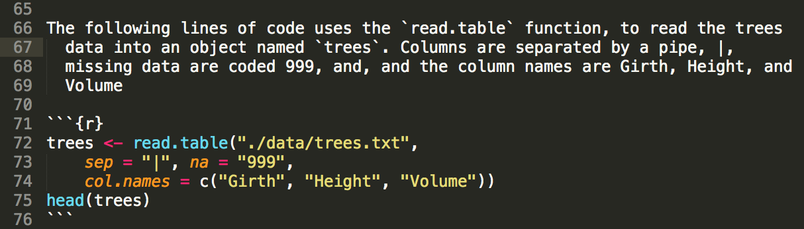

title: Example Markdown document
author: Daniel Anderson
date: "`r Sys.Date()`"
---
```

---- &twocol
## Homework Review (continued)

* An R code chunk displaying how to load data into R and store it into an 
  object, along with text explaining  the code.




----

The following lines of code uses the `read.table` function, to read the trees
  data into an object named `trees`. Columns are separated by a pipe, |, 
  missing data are coded 999, and, and the column names are Girth, Height, and
  Volume

```{r}
trees <- read.table("./data/trees.txt", 
    sep = "|", na = "999",
    col.names = c("Girth", "Height", "Volume"))
head(trees)
```

---- &twocol
## Homework Review (continued)

* A generic ordered or unordered list with at least one level of nesting (could 
  even be a shopping list)

*** =left


*** =right
# Groceries
* Dairy
    + Cheese
    + Milk
    + Yogurt
* Meat
    + Ground beef
    + Pork chops
* Snacks
    + Chips
    + Crackers

---- 
## Homework Review (continued)

* Some R output of some sort


```{r, echo = FALSE, fig.height = 5}
plot(Height ~ Girth, data = trees)
```

---- 
## Homework Review (continued)

* Calculate the mean of a variable, via `mean()` and display it in text. If 
  there are missing data in the vector that you are trying to calculate the mean
  from, you will also need to include the additional argument `na.rm = TRUE`. 
  Make some manipulation to the data (e.g., remove a few random cases) and 
  report the mean in text again, using code.


```{r, echo = FALSE}
options(digits = 2)
```
The mean girth of trees in the sample was `r mean(trees$Girth, na.rm = TRUE)`. 
  For trees below 70 feet the mean girth was 
  `r mean( subset(trees, Height < 70)$Girth, na.rm = TRUE )`.

----
## Homework Review (continued)

# Pairs plot

```{r, fig.height = 6}
pairs(trees)
```

---- &twocol
## Homework Review (continued)

# Matrices and Vectors

Create the following matrix (which we created during the first class, if you
  saved your syntax)
$$\mathbf{m} = 
\left [
  \begin{array}{ccccc}
    18 & 32 & 11 & 41 & 73 \\\
    61 & 47 & 22 & 87 & 63 \\\
    44 & 52 & 23 & 42 & 77 \\\
    23 & 17 & 5 & 72 & 83
  \end{array}
  \right ]
$$

*** =left

```{r, eval = FALSE}
m <- matrix(c(18, 32, 11, 41, 73,
              61, 47, 22, 87, 63,
              44, 52, 23, 42, 77,
              23, 17,  5, 72, 83
              ), 
            byrow = TRUE, ncol = 5
)
m
```
*** =right
<br>

```{r, echo = FALSE}
m <- matrix(c(18, 32, 11, 41, 73,
              61, 47, 22, 87, 63,
              44, 52, 23, 42, 77,
              23, 17,  5, 72, 83
              ), 
            byrow = TRUE, ncol = 5
)
m
```

---- &twocol
## Homework Review (continued)

1) Use three different methods to subset the matrix and obtain the following 
  vector
$$\mathbf{v} = 
\left [
  \begin{array}{ccc}
    52 & 42 & 77
  \end{array}
  \right ]
$$

*** =left

```{r, eval = FALSE}
m[3, c(2,4,5)]

m[ ,c(2,4,5)][3, ]

m[3, m[3, ] == 52 |
     m[3, ] == 42 |
     m[3, ] == 77 ]

m[3, c(FALSE, TRUE, FALSE, TRUE, TRUE)]

m[3, ][ m[3, ] > 40 &
        m[3, ] != 44 ]

subset(m, c(FALSE, FALSE, TRUE, FALSE), 
    select = c(2,4,5), drop = TRUE)
```

*** =right

```{r, echo = FALSE}
m[3, c(2,4,5)]
m[ ,c(2,4,5)][3, ]
m[3, m[3, ] == 52 |
     m[3, ] == 42 |
     m[3, ] == 77 ]
m[3, c(FALSE, TRUE, FALSE, TRUE, TRUE)]

m[3, ][ m[3, ] > 40 &
        m[3, ] != 44 ]

subset(m, c(FALSE, FALSE, TRUE, FALSE), 
    select = c(2,4,5), drop = TRUE)
```

---- &twocol
## Homework Review (continued)

2) Subset $\mathbf{m}$ again to get 
  $\mathbf{v2} = \left [\begin{array}{cc} 87 & 42 \end{array} \right ]$. Then 
  create a new matrix using the following steps:
     
* Drop the final column of matrix $\mathbf{m}$
* Add $\mathbf{v2}$ to the second and fourth rows (this will utilize the property 
    of recycling). 

One possible method

*** =left

```{r}
v <- m[c(2,3), 4]
v
m2 <- m[ ,-5]
m2[2, ] <-  v + m2[2, ]
m2[4, ] <-  v + m2[4, ]
```

*** =right

```{r}
m2
```

---- &twocol
## Homework Review (continued)

# Render the document

*** =left

### Via R Studio


*** =right

### Via code
If you don't have the rmarkdown library installed, first run

```{r, eval = FALSE}
install.packages("rmarkdown")
```
Then, to render to document

```{r, eval = FALSE}
library(rmarkdown)
render("yourFile.Rmd", "html_document")
```

Note that your working directory must be set to the same location as the .Rmd
  file, or you can provide a path to the file in the `render` function.
