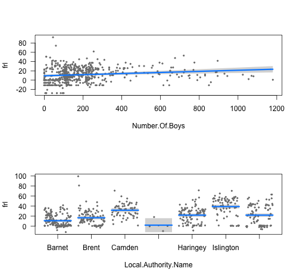

---
title       : Homework 3 Review
subtitle    : 
author      : Daniel Anderson
job         : CourseR
framework   : io2012        # {io2012, html5slides, shower, dzslides, ...}
highlighter : highlight.js  # {highlight.js, prettify, highlight}
hitheme     : zenburn      # 
widgets     : [mathjax]            # {mathjax, quiz, bootstrap}
mode        : selfcontained # {standalone, draft}
knit        : slidify::knit2slides
--- &twocol

## 1. Load the Camden Boroughs dataset


```r
setwd("/Users/Daniel/Dropbox/Teaching/CourseR/")
d <- read.csv("./data/CamdenBoroughs.csv", na.strings = c("Not applicable", 
	   "Unknown", "999", "NA", ""))
head(d)
```

```
##   Unique.Reference.Number Local.Authority.Code Local.Authority.Name
## 1                  100007                  202               Camden
## 2                  100052                  202               Camden
## 3                  100029                  202               Camden
## 4                  100406                  206            Islington
## 5                  100027                  202               Camden
## 6                  100428                  206            Islington
##   Establishment.Number                 Establishment.Name
## 1                 1101 Camden Primary Pupil Referral Unit
## 2                 4275                   Hampstead School
## 3                 3327               Christ Church School
## 4                 2261             Grafton Primary School
## 5                 2841      Eleanor Palmer Primary School
## 6                 2646              Winton Primary School
##    Type.Of.Establishment Establishment.Status Reason.Establishment.Opened
## 1    Pupil Referral Unit                 Open                        <NA>
## 2       Community School                 Open                        <NA>
## 3 Voluntary Aided School                 Open                        <NA>
## 4       Community School                 Open                        <NA>
## 5       Community School                 Open                        <NA>
## 6       Community School                 Open                        <NA>
##   Open.Date Reason.Establishment.Closed Close.Date Phase.Of.Education
## 1      <NA>                          NA         NA               <NA>
## 2      <NA>                          NA         NA          Secondary
## 3      <NA>                          NA         NA            Primary
## 4      <NA>                          NA         NA            Primary
## 5      <NA>                          NA         NA            Primary
## 6      <NA>                          NA         NA            Primary
##   Statutory.Low.Age Statutory.High.Age    Boarders
## 1                 5                 11 No Boarders
## 2                11                 18 No Boarders
## 3                 3                 11 No Boarders
## 4                 3                 11 No Boarders
## 5                 3                 11 No Boarders
## 6                 3                 11 No Boarders
##          Official.Sixth.Form Gender Religious.Character           Diocese
## 1                       <NA>  Mixed      Does not apply              <NA>
## 2           Has a sixth form  Mixed      Does not apply              <NA>
## 3 Does not have a sixth form  Mixed   Church of England Diocese of London
## 4 Does not have a sixth form  Mixed      Does not apply              <NA>
## 5 Does not have a sixth form  Mixed      Does not apply              <NA>
## 6 Does not have a sixth form  Mixed      Does not apply              <NA>
##   Admissions.Policy School.Capacity    Special.Classes Census.Date
## 1              <NA>              20               <NA>  16/01/2014
## 2     Comprehensive            1302 No Special Classes  16/01/2014
## 3              <NA>             210 No Special Classes  16/01/2014
## 4              <NA>             393 No Special Classes  16/01/2014
## 5              <NA>             210 No Special Classes  16/01/2014
## 6              <NA>             315 No Special Classes  16/01/2014
##   Number.Of.Pupils Number.Of.Boys Number.Of.Girls
## 1               12             10              NA
## 2             1259            710             550
## 3              228            120             110
## 4              519            270             250
## 5              237            125             115
## 6              194            110              85
##   Percentage.Claiming.Free.School.Meals Trust.School Trust.Name
## 1                                  <NA>         <NA>       <NA>
## 2                                 29.6%         <NA>       <NA>
## 3                                 27.2%         <NA>       <NA>
## 4                                 43.2%         <NA>       <NA>
## 5                                 12.2%         <NA>       <NA>
## 6                                 54.3%         <NA>       <NA>
##   School.Sponsored School.Sponsor             Federation Federation.Name
## 1             <NA>           <NA>                   <NA>            <NA>
## 2             <NA>           <NA> Not under a federation            <NA>
## 3             <NA>           <NA> Not under a federation            <NA>
## 4             <NA>           <NA> Not under a federation            <NA>
## 5             <NA>           <NA> Not under a federation            <NA>
## 6             <NA>           <NA> Not under a federation            <NA>
##   Unique.Property.Reference.Number Further.Higher.Education.Identifier
## 1                               NA                                  NA
## 2                         10002876                                  NA
## 3                               NA                                  NA
## 4                               NA                                  NA
## 5                               NA                                  NA
## 6                               NA                                  NA
##   Further.Education.Type Ofsted.Last.Inspected Ofsted.Special.Measures
## 1                   <NA>            26/03/2015 Not in special measures
## 2                   <NA>            01/02/2012 Not in special measures
## 3                   <NA>            19/01/2012 Not in special measures
## 4                   <NA>            13/11/2008 Not in special measures
## 5                   <NA>            18/10/2011 Not in special measures
## 6                   <NA>            11/03/2014 Not in special measures
##   Last.Changed.Date                           Street         Locality
## 1        02/06/2015 Robson House, 74 Stanhope Street             <NA>
## 2        18/06/2014                    Westbere Road        Hampstead
## 3        18/06/2014                   Redhill Street           Camden
## 4        18/06/2014                      Eburne Road         Holloway
## 5        18/06/2014                    Lupton Street             <NA>
## 6        18/06/2014                   Killick Street Pentonville Road
##   Address.3   Town County Postcode                                 Website
## 1      <NA> London   <NA>  NW1 3EX     http://www.robsonhouse.org.uk/main/
## 2      <NA> London   <NA>  NW2 3RT      http://www.hampsteadschool.org.uk/
## 3      <NA> London   <NA>  NW1 4BD     http://www.cchurchnw1.camden.sch.uk
## 4      <NA> London   <NA>   N7 6AR                                    <NA>
## 5      <NA> London   <NA>  NW5 2JA http://www.eleanorpalmer.camden.sch.uk/
## 6      <NA> London   <NA>   N1 9AZ      http://www.wintonprimaryschool.com
##   Telephone.Number Head.Title Head.First.Name Head.Last.Name Head.Honours
## 1       2037720370         Mr          Andrew        Herbert         <NA>
## 2       2077948133         Mr         Jacques  Szemalikowski         <NA>
## 3       2073877881         Ms           Paula         Walker         <NA>
## 4       2072723284         Ms               T       Sergides         <NA>
## 5       2074852155        Mrs            Kate          Frood         <NA>
## 6       2078376096         Mr          Andrew          Rigby         <NA>
##   Head.Preferred.Job.Title Teen.Mothers Teen.Mothers.Places
## 1          Head of Service         <NA>                  NA
## 2                     Head         <NA>                  NA
## 3              Headteacher         <NA>                  NA
## 4              Headteacher         <NA>                  NA
## 5              Headteacher         <NA>                  NA
## 6              Headteacher         <NA>                  NA
##   Child.Care.Facilities Special.Education.Needs.Pupil.Referral.Unit
## 1                  <NA>             PRU Does have Provision for SEN
## 2                  <NA>                                        <NA>
## 3                  <NA>                                        <NA>
## 4                  <NA>                                        <NA>
## 5                  <NA>                                        <NA>
## 6                  <NA>                                        <NA>
##   Emotional.Behavioural.Difficulties                Full.Time.Provision
## 1        PRU Does have EBD provision PRU does offer full time provision
## 2                               <NA>                               <NA>
## 3                               <NA>                               <NA>
## 4                               <NA>                               <NA>
## 5                               <NA>                               <NA>
## 6                               <NA>                               <NA>
##   Education.By.Other Section.41.Approved
## 1               <NA>                <NA>
## 2               <NA>                <NA>
## 3               <NA>                <NA>
## 4               <NA>                <NA>
## 5               <NA>                <NA>
## 6               <NA>                <NA>
##                    Special.Education.Needs.1 Special.Education.Needs.2
## 1 SEMH - Social, Emotional and Mental Health                      <NA>
## 2                   PD - Physical Disability                      <NA>
## 3                                       <NA>                      <NA>
## 4                                       <NA>                      <NA>
## 5                                       <NA>                      <NA>
## 6                                       <NA>                      <NA>
##   Region Administrative.Ward   Parliamentary.Constituency
## 1 London       Regent's Park      Holborn and St. Pancras
## 2 London       Fortune Green        Hampstead and Kilburn
## 3 London       Regent's Park      Holborn and St. Pancras
## 4 London       Finsbury Park              Islington North
## 5 London        Kentish Town      Holborn and St. Pancras
## 6 London          Caledonian Islington South and Finsbury
##                 Urban.Rural GSSLA.Code Easting Northing
## 1 Urban > 10k - less sparse  E09000007  529076   182495
## 2 Urban > 10k - less sparse  E09000007  524402   185633
## 3 Urban > 10k - less sparse  E09000007  528821   182991
## 4 Urban > 10k - less sparse  E09000019  530483   186145
## 5 Urban > 10k - less sparse  E09000007  529117   185613
## 6 Urban > 10k - less sparse  E09000019  530634   183172
##   Middle.Super.Output.Area Lower.Super.Output.Area Boarding.Establishment
## 1               Camden 023             Camden 023B                   <NA>
## 2               Camden 005             Camden 005A                   <NA>
## 3               Camden 021             Camden 021B                   <NA>
## 4            Islington 007          Islington 007B                   <NA>
## 5               Camden 003             Camden 003C                   <NA>
## 6            Islington 021          Islington 021B                   <NA>
##   Previous.Local.Authority.Code Previous.Local.Authority.Name
## 1                            NA                          <NA>
## 2                            NA                          <NA>
## 3                            NA                          <NA>
## 4                            NA                          <NA>
## 5                            NA                          <NA>
## 6                            NA                          <NA>
##   Previous.Establishment.Number Longitude Latitude Spatial.Accuracy
## 1                            NA     -0.14       52               NA
## 2                            NA     -0.21       52               NA
## 3                            NA     -0.14       52               NA
## 4                            NA     -0.12       52               NA
## 5                            NA     -0.14       52               NA
## 6                            NA     -0.12       52               NA
##   Last.Uploaded               Location Socrata.ID
## 1    24/09/2015 (51.526635, -0.140758)          7
## 2    24/09/2015  (51.555884, -0.20699)         50
## 3    24/09/2015  (51.53115, -0.144251)         27
## 4    24/09/2015 (51.559113, -0.119136)         97
## 5    24/09/2015 (51.554646, -0.139025)         25
## 6    24/09/2015 (51.532361, -0.118062)        106
```

----
## 2. Create numeric version of `frl`


```r
d$frl <- as.numeric(
			sub("%", "", d$Percentage.Claiming.Free.School.Meals)
		)

head(d$frl)
```

```
## [1] NA 30 27 43 12 54
```

---- &twocol
## 3. Notched boxplot

*** =left


```r
se <- function(x) {
	sqrt(
		var(x, na.rm = TRUE) /
		length(na.omit(x))
	)
}

par(las = 3, cex.axis = 0.75)

plot(d$Town, d$frl, notch = TRUE)

abline(h = mean(d$frl, na.rm = TRUE), 
	col = "blue", lty = 2)
abline(h = mean(d$frl, na.rm = TRUE) + 
	1.96*se(d$frl),
	col = "gray", lty = 2)
abline(h = mean(d$frl, na.rm = TRUE) - 
	1.96*se(d$frl),
	col = "gray", lty = 2)
```

*** =right

 

----
## 4. Briefly interpret the plot.

*London pretty clearly seems to dominate the data, given that the grand mean
  aligns almost perfectly with the median in London, and the median in all other towns is below the grand mean, with the exception of Camden. Indeed, 593 of the 664 observations, or 89% are from London, while 4 of the towns had only one observation. However, of the groups with more than one observation, the proportion of students eligible for free or reduced price lunch was reliably lower than the grand mean, as the upper-bound of the 95% confidence interval around the median for each group was below the grand mean. Outside of London, Edgware had the most variability.*


----
## 5. List of data frames by `Statutory.Low.Age`


```r
l <- split(d, d$Statutory.Low.Age)
```

---- &twocol

* Use the list to produce the same plot for schools in which the 
  `Statutory.Low.Age` is 11.

* Produce a boxplot for `frl` by `Local.Authority.Name` for only schools in 
  which the `Statutory.Low.Age` is 3.

*** =left


```r
plot(frl ~ Local.Authority.Name, 
	data = l[["3"]], 
	notch = TRUE,
	main = "Statutory Low Age = 3")
```

 

*** =right


```r
plot(frl ~ Local.Authority.Name, 
	data = l[["11"]], 
	notch = TRUE,
	main = "Statutory Low Age = 11")
```

 

---- &twocol
## 6. Multiple Regression Model
* Fit a model for schools in which the Statutory Low Age is 3, with 
  `Number.Of.Boys` and `Local.Authority.Name` modeled as predictors of `frl`. 

* Compute predictor-residual plots for the model (*hint: use a package*).

*** =left


```r
mod <- lm(frl ~ Number.Of.Boys + 
				Local.Authority.Name, 
		data = d)
library(visreg)
par(mfrow = c(2,1))
visreg(mod)
```

*** =right

 

---- &twocol
## 7. Plot Density and Overlay Likelihood

*** =left


```r
dens <- density(d$frl, na.rm = TRUE)
plot(dens, main = "Density of FRL")
lines(dens$x, 
	  dnorm(dens$x, 
	  	mean(d$frl, na.rm = TRUE), 
	  	sd(d$frl, na.rm = TRUE)), 
	  col = "blue", 
	  lty = 2)
```

*** =right

 

----
# Do the data appear to have been generated by such a distribution? Why or why not?

<br>

It's difficult to say for sure if the data were generated by the specified
  normal distribution, but it appears somewhat unlikely. The empirical density function has a spike around 0 that is not present in the normal distribution, and the peak of the normal is well above the empirical density function.

