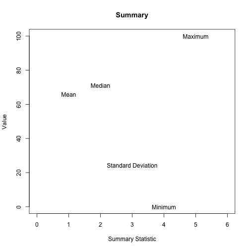
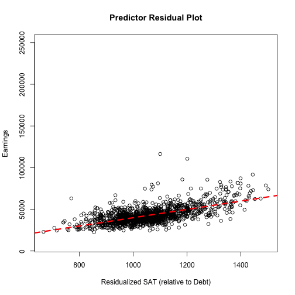

---
title       : Homework 4 Review
subtitle    : 
author      : Daniel Anderson
job         : CourseR
framework   : io2012        # {io2012, html5slides, shower, dzslides, ...}
highlighter : highlight.js  # {highlight.js, prettify, highlight}
hitheme     : zenburn      # 
widgets     : [mathjax]            # {mathjax, quiz, bootstrap}
mode        : selfcontained # {standalone, draft}
knit        : slidify::knit2slides
--- &twocol

# 1. Write a summary function 
Report the mean, median, standard deviation, minimum, and maximum values


```r
smry <- function(x) {
	if(is.numeric(x) == FALSE) {
		warning("Vector coerced to numeric")
	}
	mn <- mean(as.numeric(x), na.rm = TRUE)
	md <- median(as.numeric(x), na.rm = TRUE)
	stDev <- sd(as.numeric(x), na.rm = TRUE)
	minm <- min(as.numeric(x), na.rm = TRUE)
	maxm <- max(as.numeric(x), na.rm = TRUE)
	
	if(length(x) != length(na.omit(x))) {
		warning("Missing data removed")
	}	
	stats <- c(mn, md, stDev, minm, maxm)
	names(stats) <- c("Mean", "Median", "Standard Deviation", "Minimum", 
		"Maximum")
return(structure(round(stats, 3), class = "smry"))
}
```

---- 
# Load data, apply function


```r
setwd("/Users/Daniel/Dropbox/Teaching/CourseR/")
beer <- read.delim("./data/ratebeer_beerjobber.txt")
Style <- smry(beer$style)
```

```
## Warning in smry(beer$style): Vector coerced to numeric
```

```r
ABV <- smry(beer$abv)
Ratings <- smry(beer$ratings)
Overall_Score <- smry(beer$score.overall)
```

```
## Warning in smry(beer$score.overall): Missing data removed
```

```r
Style_Score <- smry(beer$score.by.style)
```

```
## Warning in smry(beer$score.by.style): Missing data removed
```

----
# Bind results together

```r
rbind(Style, ABV, Ratings, Overall_Score, Style_Score)
```

```
##                  Mean Median Standard Deviation Minimum Maximum
## Style          31.863   35.0             18.532       1    62.0
## ABV             5.900    5.9              2.202       0    12.8
## Ratings       113.605   60.5            148.885       0  1116.0
## Overall_Score  65.850   71.0             24.224       0   100.0
## Style_Score    60.872   62.0             26.877       0   100.0
```

----
# Produce a default plot for objects of type `smry`.


```r
plot.smry <- function(ob) {
	plot(1:5, seq(ob["Minimum"], ob["Maximum"], length.out = 5), 
		type = "n", 
		xlab = "Summary Statistic",
		ylab = "Value",
		main = "Summary",
		xlim = c(0, 6))
	text(1:5, ob, names(ob))
}
```

---- &twocol
# Plot examples

*** =left


```r
plot(Style)
```


*** =right


```r
plot(ABV)
```


---- &twocol
# Plot examples

*** =left


```r
plot(Ratings)
```


*** =right


```r
plot(Overall_Score)
```



----
# Function for Median


```r
med <- function(x) {
	if(any(is.na(x))) {
		warning("Missing data removed")
		x <- na.omit(x)
	}
	
	ordered <- x[order(x)]

	if((length(ordered) %% 2) == 1) {
		return(ordered[ceiling(length(ordered)/2)])
	}
	
	if((length(ordered) %% 2) == 0) {
		return(mean(c(
				ordered[length(ordered)/2],
				ordered[(length(ordered)/2) + 1]
				)
			)
		)
	}
}
```

----
# Test function


```r
median(beer$score.overall, na.rm = TRUE); med(beer$score.overall)
```

```
## [1] 71
```

```
## Warning in med(beer$score.overall): Missing data removed
```

```
## [1] 71
```

```r
median(beer$abv, na.rm = TRUE); med(beer$abv)
```

```
## [1] 5.9
```

```
## [1] 5.9
```

----


```r
median(c(1:12, NA, NA), na.rm = TRUE); med(c(1:12, NA, NA))
```

```
## [1] 6.5
```

```
## Warning in med(c(1:12, NA, NA)): Missing data removed
```

```
## [1] 6.5
```

```r
median(1:13); med(1:13)
```

```
## [1] 7
```

```
## [1] 7
```

----
# Histogram/Density Plot function


```r
histDens <- function(x, lineCol, ...) {
  x <- as.numeric(x)
  hist(x, 
    probability = TRUE, 
    axes = FALSE,
    main = "", 
    xlab = "", 
    ylab = "")

  lines(density(x, na.rm = TRUE), 
    col = as.character(lineCol), 
    lty = 3, 
    lwd = 3)

  par(new = TRUE)
  hist(x, ...)
}
```

----


```r
histDens(beer$abv, lineCol = "blue", 
	main = "Alcohol by Volumne",
	xlab = "ABV")
```

 
